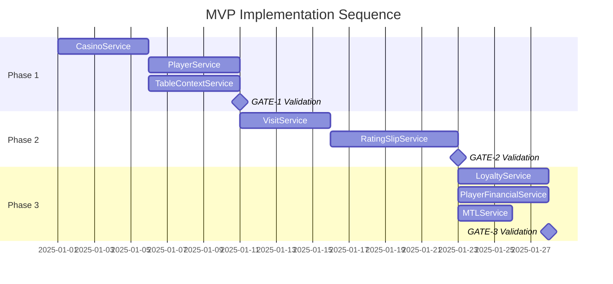

# MVP Implementation Roadmap

## Executive Summary

This specification defines the phased implementation plan for PRD-001: Player Management System MVP. The plan decomposes the PRD into three implementation phases aligned with bounded contexts from SRM v3.1.0.

**Goal**: Pilot-ready vertical slice enabling table-centric player tracking with compliant session logging and basic mid-session loyalty accrual.

**Success Criteria** (from PRD-001):
- A single casino completes a full shift with:
  - Zero "stuck" rating slips
  - Accurate accrued seconds
  - Idempotent mid-session rewards
  - Auditable trails

---

## Implementation Phases Overview

```
Phase 1: Core Infrastructure          Phase 2: Session Management          Phase 3: Rewards & Compliance
┌─────────────────────────────┐      ┌─────────────────────────────┐      ┌─────────────────────────────┐
│ CasinoService               │      │ VisitService                │      │ LoyaltyService              │
│ - Staff authentication      │─────▶│ - Visit lifecycle           │─────▶│ - Mid-session rewards       │
│ - Casino settings           │      │ - Player seating            │      │ - Idempotent issuance       │
│ - Gaming day derivation     │      │                             │      │                             │
├─────────────────────────────┤      ├─────────────────────────────┤      ├─────────────────────────────┤
│ PlayerService               │      │ RatingSlipService           │      │ PlayerFinancialService (FF) │
│ - Player enrollment         │─────▶│ - Slip state machine        │─────▶│ - Manual deposit/withdraw   │
│ - Player-casino association │      │ - Duration calculation      │      │ - Gaming day derivation     │
│                             │      │ - Overlap prevention        │      │                             │
├─────────────────────────────┤      └─────────────────────────────┘      ├─────────────────────────────┤
│ TableContextService         │                                           │ MTLService (Read-Only)      │
│ - Table status transitions  │                                           │ - CTR threshold display     │
│ - Dealer rotation           │                                           │ - Watchlist proximity       │
└─────────────────────────────┘                                           └─────────────────────────────┘
```

---

## Phase 1: Core Infrastructure

**Duration**: Foundation for all subsequent phases
**Dependencies**: Schema baseline, SRM v3.1.0
**Validation Gate**: GATE-1

### 1.1 CasinoService

**Bounded Context**: "What staff can work at this casino and what are its operational settings?"

**Tables Owned**:
- `casino` - Casino entity
- `casino_settings` - Gaming day parameters, timezone
- `staff` - Staff members with role assignment
- `report` - Operational reports

**User Stories Addressed**:
- US-001: Open a Table (staff authentication prerequisite)

**Implementation Requirements**:

```typescript
// services/casino/types.ts
interface CasinoServiceInterface {
  // Staff Operations
  getStaffByCasino(casinoId: string): Promise<StaffDTO[]>;
  getAuthenticatedStaff(userId: string): Promise<StaffDTO | null>;

  // Casino Settings
  getCasinoSettings(casinoId: string): Promise<CasinoSettingsDTO>;
  computeGamingDay(casinoId: string, timestamp?: Date): Promise<string>;
}

// Key Implementation Notes:
// - staff.user_id references auth.users(id) for authentication
// - Dealers remain non-authenticated (user_id = null)
// - compute_gaming_day derives from casino_settings.gaming_day_start
```

**RLS Policies Required**:
- `staff_read_same_casino` - Staff can read same-casino staff
- `casino_settings_read_same_casino` - Staff can read own casino settings

**Tests Required**:
- Staff authentication flow
- Gaming day computation across timezone boundaries
- RLS policy enforcement

---

### 1.2 PlayerService

**Bounded Context**: "Who is this player and what is their profile?"

**Tables Owned**:
- `player` - Player identity and profile
- `player_casino` - Player-casino enrollment relationship

**User Stories Addressed**:
- US-002: Start a Rating Slip (player must exist prerequisite)

**Implementation Requirements**:

```typescript
// services/player/types.ts
interface PlayerServiceInterface {
  // Player CRUD
  enrollPlayer(data: EnrollPlayerDTO): Promise<PlayerDTO>;
  getPlayer(playerId: string): Promise<PlayerDTO | null>;
  getPlayerByCasino(casinoId: string, playerId: string): Promise<PlayerDTO | null>;

  // Enrollment
  isPlayerEnrolled(casinoId: string, playerId: string): Promise<boolean>;
}

// Key Implementation Notes:
// - player_casino creates enrollment relationship
// - Players can be enrolled at multiple casinos
// - RLS enforces casino-scoped access
```

**RLS Policies Required**:
- `player_read_same_casino` - via player_casino join
- `player_casino_read_same_casino` - Direct casino scoping

**Tests Required**:
- Player enrollment
- Multi-casino enrollment
- RLS policy enforcement

---

### 1.3 TableContextService

**Bounded Context**: "What is the current operational state of tables?"

**Tables Owned**:
- `gaming_table` - Table entity with status
- `gaming_table_settings` - Table-specific settings
- `dealer_rotation` - Dealer assignment history
- `game_settings` - Game type configuration

**User Stories Addressed**:
- US-001: Open a Table

**Implementation Requirements**:

```typescript
// services/table-context/types.ts
interface TableContextServiceInterface {
  // Table Operations
  openTable(tableId: string, staffId: string): Promise<GamingTableDTO>;
  closeTable(tableId: string, staffId: string): Promise<GamingTableDTO>;
  getTableStatus(tableId: string): Promise<TableStatusDTO>;

  // Dealer Rotation
  assignDealer(tableId: string, dealerId: string, staffId: string): Promise<DealerRotationDTO>;
  getCurrentDealer(tableId: string): Promise<DealerDTO | null>;
}

// Key Implementation Notes:
// - Table status enum: inactive → active → closed
// - Dealer rotation is audit logged
// - References FloorLayoutService for layout context
```

**State Machine**:
```
inactive ──[openTable]──▶ active ──[closeTable]──▶ closed
                              │
                              └──[closeTable]──▶ closed
```

**RLS Policies Required**:
- `gaming_table_read_same_casino`
- `gaming_table_write_pit_boss_admin`

**Tests Required**:
- Table state transitions
- Dealer rotation logging
- RLS policy enforcement
- Acceptance: US-001

---

### Phase 1 Validation Gate (GATE-1)

**Checklist**:
- [ ] `npm run db:types` regenerates types from schema
- [ ] CasinoService implements CasinoServiceInterface
- [ ] PlayerService implements PlayerServiceInterface
- [ ] TableContextService implements TableContextServiceInterface
- [ ] All services use functional factory pattern
- [ ] No ReturnType inference on public APIs
- [ ] RLS policies deployed and tested
- [ ] Unit test coverage ≥80%
- [ ] E2E test for US-001 (Open Table) passes

---

## Phase 2: Session Management

**Duration**: After Phase 1 completion
**Dependencies**: Phase 1 services, Player enrollment, Table operations
**Validation Gate**: GATE-2

### 2.1 VisitService

**Bounded Context**: "What is the lifecycle of a player's casino visit?"

**Tables Owned**:
- `visit` - Visit lifecycle tracking

**User Stories Addressed**:
- US-002-004: Rating slip operations (visit prerequisite)

**Implementation Requirements**:

```typescript
// services/visit/types.ts
interface VisitServiceInterface {
  // Visit Lifecycle
  checkIn(data: CheckInDTO): Promise<VisitDTO>;
  checkOut(visitId: string, staffId: string): Promise<VisitDTO>;
  getActiveVisit(casinoId: string, playerId: string): Promise<VisitDTO | null>;

  // Seating
  seatPlayer(visitId: string, tableId: string, seatNumber: number): Promise<VisitDTO>;
  unseatPlayer(visitId: string): Promise<VisitDTO>;
}

// Key Implementation Notes:
// - Prevent multiple concurrent visits per player/casino
// - Seating required before rating slip
// - Visit spans multiple rating slips
```

**Invariants**:
- One active visit per player per casino (unless explicitly allowed)
- Player must be seated at table to start rating slip

**RLS Policies Required**:
- `visit_read_same_casino`
- `visit_write_pit_boss_admin`

**Tests Required**:
- Visit check-in/out lifecycle
- Concurrent visit prevention
- Seating operations
- RLS policy enforcement

---

### 2.2 RatingSlipService

**Bounded Context**: "What is the telemetry measurement of a player's gaming session?"

**Tables Owned**:
- `rating_slip` - Session telemetry

**User Stories Addressed**:
- US-002: Start a Rating Slip
- US-003: Pause/Resume Slip
- US-004: Close Slip

**Implementation Requirements**:

```typescript
// services/rating-slip/types.ts
interface RatingSlipServiceInterface {
  // Slip Lifecycle
  startSlip(data: StartSlipDTO): Promise<RatingSlipDTO>;
  pauseSlip(slipId: string, staffId: string): Promise<RatingSlipDTO>;
  resumeSlip(slipId: string, staffId: string): Promise<RatingSlipDTO>;
  closeSlip(slipId: string, staffId: string): Promise<RatingSlipDTO>;

  // Queries
  getActiveSlips(tableId: string): Promise<RatingSlipDTO[]>;
  getSlipDuration(slipId: string): Promise<DurationDTO>;
}

// Key Implementation Notes:
// - Status enum: open ↔ paused → closed
// - Duration is server-derived (not stored)
// - policy_snapshot captured at creation
// - game_settings captured at creation
// - seat_number required
// - No overlapping open slips per player/table
```

**State Machine**:
```
         ┌───[resumeSlip]───┐
         │                  │
         ▼                  │
open ◀──────────────────▶ paused
  │                         │
  └───[closeSlip]───▶ closed ◀───[closeSlip]───┘
```

**Duration Calculation**:
```typescript
// Server-derived, not stored
function calculateDuration(slip: RatingSlip): number {
  // Sum active periods (excluding paused intervals)
  // start_time → first_pause + resume_1 → pause_2 + ... + last_resume → end_time
}
```

**Invariants**:
- No overlapping open slips for {player_id, table_id}
- Duration is server-clock authoritative
- policy_snapshot is immutable after creation

**RLS Policies Required**:
- `rating_slip_read_same_casino`
- `rating_slip_write_telemetry_role`

**Tests Required**:
- Slip state machine transitions
- Duration calculation accuracy
- Overlap prevention
- policy_snapshot capture
- Acceptance: US-002, US-003, US-004

---

### Phase 2 Validation Gate (GATE-2)

**Checklist**:
- [ ] VisitService implements VisitServiceInterface
- [ ] RatingSlipService implements RatingSlipServiceInterface
- [ ] State machines enforce valid transitions only
- [ ] Duration calculation is server-authoritative
- [ ] No overlapping slips enforced (DB constraint + service)
- [ ] policy_snapshot captured correctly
- [ ] Unit test coverage ≥80%
- [ ] E2E tests pass: US-002, US-003, US-004
- [ ] UI reflects state changes within 2s (per PRD KPI)

---

## Phase 3: Rewards & Compliance

**Duration**: After Phase 2 completion
**Dependencies**: Phase 2 services, Active rating slips
**Validation Gate**: GATE-3

### 3.1 LoyaltyService

**Bounded Context**: "What are the loyalty points and rewards for this player?"

**Tables Owned**:
- `player_loyalty` - Current loyalty balance
- `loyalty_ledger` - Append-only transaction log

**User Stories Addressed**:
- US-005: Mid-Session Reward

**Implementation Requirements**:

```typescript
// services/loyalty/types.ts
interface LoyaltyServiceInterface {
  // Balance Queries
  getPlayerLoyalty(casinoId: string, playerId: string): Promise<PlayerLoyaltyDTO>;

  // Reward Issuance (RPC wrapper)
  issueMidSessionReward(data: IssueMidSessionRewardDTO): Promise<LoyaltyLedgerEntryDTO>;

  // Ledger Queries
  getRewardsForSlip(ratingSlipId: string): Promise<LoyaltyLedgerEntryDTO[]>;
}

// RPC: rpc_issue_mid_session_reward
// Parameters:
//   p_casino_id uuid
//   p_player_id uuid
//   p_rating_slip_id uuid
//   p_staff_id uuid
//   p_points integer
//   p_idempotency_key text
//   p_reason loyalty_reason
//
// Behavior:
//   1. Validates casino/player/slip alignment
//   2. Checks idempotency_key for duplicate
//   3. Appends to loyalty_ledger
//   4. Updates player_loyalty balance
//   5. Returns ledger entry
```

**Idempotency Enforcement**:
```sql
-- Unique constraint on loyalty_ledger
ALTER TABLE loyalty_ledger
ADD CONSTRAINT uk_loyalty_ledger_idempotency
UNIQUE (idempotency_key);
```

**Invariants**:
- Idempotent: Same idempotency_key returns existing entry
- Atomic: Ledger append + balance update in single transaction
- Audit: staff_id, reason captured on every entry

**RLS Policies Required**:
- `player_loyalty_read_same_casino`
- `loyalty_ledger_append_only` (Template 3)

**Tests Required**:
- Reward issuance flow
- Idempotency enforcement (duplicate key → no new entry)
- Balance update accuracy
- Audit trail completeness
- Acceptance: US-005

---

### 3.2 PlayerFinancialService (Feature-Flagged)

**Bounded Context**: "What are the financial transactions for this player?"

**Tables Owned**:
- `player_financial_transaction` - Append-only transaction ledger

**User Stories Addressed**:
- US-006: Basic Finance Entry

**Feature Flag**: `finance_minimal_enabled`

**Implementation Requirements**:

```typescript
// services/finance/types.ts
interface PlayerFinancialServiceInterface {
  // Transaction Creation (RPC wrapper)
  createTransaction(data: CreateTransactionDTO): Promise<FinancialTransactionDTO>;

  // Queries
  getTransactionsForPlayer(playerId: string, gamingDay?: string): Promise<FinancialTransactionDTO[]>;
}

// RPC: rpc_create_financial_txn
// Parameters:
//   p_casino_id uuid
//   p_player_id uuid
//   p_amount numeric
//   p_type transaction_type
//   p_staff_id uuid
//   p_idempotency_key text
//
// Behavior:
//   1. Derives gaming_day from casino_settings
//   2. Checks idempotency_key
//   3. Appends to player_financial_transaction
//   4. Returns transaction record
```

**Invariants**:
- Gaming day is server-derived (not client-provided)
- Append-only (no updates/deletes)
- Idempotent via idempotency_key

**RLS Policies Required**:
- `player_financial_transaction_append_only` (Template 3)
- `player_financial_transaction_read_same_casino`

**Tests Required**:
- Transaction creation flow
- Gaming day derivation
- Idempotency enforcement
- Feature flag gating
- Acceptance: US-006

---

### 3.3 MTLService (Read-Only)

**Bounded Context**: "What are the money transmission compliance records?"

**Tables Owned** (Read-Only in MVP):
- `mtl_entry` - Cash transaction log
- `mtl_audit_note` - Compliance notes

**User Stories Addressed**:
- MTL Read-Only display (PRD Section 3.7)

**Implementation Requirements**:

```typescript
// services/mtl/types.ts
interface MTLServiceInterface {
  // Read-Only Queries
  getRecentEntries(casinoId: string, limit?: number): Promise<MTLEntryDTO[]>;
  getThresholdProximity(playerId: string): Promise<ThresholdProximityDTO>;
}

// Key Implementation Notes:
// - NO write operations in MVP
// - Display CTR/watchlist threshold proximity
// - Read from mtl_entry (direction, amount, staff)
```

**MVP Scope Limitation**:
- Read-only surface
- No automated watchlist writes
- Display threshold proximity badge only

**RLS Policies Required**:
- `mtl_entry_read_compliance_roles`

**Tests Required**:
- Entry retrieval
- Threshold proximity calculation
- RLS enforcement (compliance roles only)

---

### Phase 3 Validation Gate (GATE-3)

**Checklist**:
- [ ] LoyaltyService implements LoyaltyServiceInterface
- [ ] PlayerFinancialService implements PlayerFinancialServiceInterface
- [ ] MTLService implements MTLServiceInterface (read-only)
- [ ] rpc_issue_mid_session_reward deployed and tested
- [ ] rpc_create_financial_txn deployed and tested
- [ ] Idempotency enforced on all mutations
- [ ] Feature flag `finance_minimal_enabled` working
- [ ] Unit test coverage ≥80%
- [ ] E2E tests pass: US-005, US-006
- [ ] Zero duplicate rewards under retry scenarios (per PRD KPI)

---

## Cross-Cutting Concerns

### Type System Integrity

```bash
# After EVERY migration
npm run db:types

# Verify types
npm run type-check
```

### Service Layer Pattern

All services MUST follow:
- Functional factory pattern (no classes)
- Explicit interfaces (no ReturnType inference)
- SupabaseClient<Database> typing (no `any`)
- DTO-based cross-context communication

### RLS Enforcement

All tables MUST have:
- Casino-scoped read policies
- Role-gated write policies
- Append-only for ledger tables

### Error Handling

All services MUST:
- Use domain error codes (not Postgres codes)
- Map errors to HTTP status codes
- Include correlation_id in all errors

---

## Traceability Matrix

| User Story | Service(s) | Phase | Validation Gate |
|------------|------------|-------|-----------------|
| US-001 | CasinoService, TableContextService | 1 | GATE-1 |
| US-002 | PlayerService, VisitService, RatingSlipService | 1, 2 | GATE-2 |
| US-003 | RatingSlipService | 2 | GATE-2 |
| US-004 | RatingSlipService | 2 | GATE-2 |
| US-005 | LoyaltyService | 3 | GATE-3 |
| US-006 | PlayerFinancialService | 3 | GATE-3 |
| MTL (read-only) | MTLService | 3 | GATE-3 |

---

## Implementation Sequence



---

## Risk Mitigation

| Risk | Mitigation |
|------|------------|
| Scope creep | Enforce MVP boundaries; defer to Phase-2 |
| RLS complexity | Test-per-role; start from deny-all |
| Schema drift | CI gate on SRM↔schema conformance |
| Perf regressions | Perf budgets per server action |
| Idempotency failures | Unique constraints + duplicate check |

---

## Success Metrics (from PRD-001)

- Pit dashboard LCP ≤ 2.5s
- Start/Pause/Resume/Close actions reflect in UI within 2s
- p95 server action latency for slip ops < 400ms
- Zero duplicate rewards under retry scenarios

---

## References

- PRD-001: `docs/10-prd/PRD-001_Player_Management_System_Requirements.md`
- SRM v3.1.0: `docs/20-architecture/SERVICE_RESPONSIBILITY_MATRIX.md`
- DTO Catalog: `docs/25-api-data/DTO_CATALOG.md`
- Security: `docs/30-security/SEC-001-rls-policy-matrix.md`
- Error Taxonomy: `docs/70-governance/ERROR_TAXONOMY_AND_RESILIENCE.md`

---

**Status**: Approved
**Next Step**: Begin Phase 1 implementation using `backend-service-builder` skill
**Workflow**: `.claude/workflows/mvp-implementation.prompt.md`
