# Loyalty System Posture Precis

**Date:** 2026-03-17
**Scope:** Full-stack inventory of what exists, what's planned, what's blocked
**Method:** 3-agent parallel investigation (database, service layer, documentation)

---

## Executive Summary

The PT-2 loyalty system has **deep plumbing and shallow surfaces**. Database, RPCs, service layer, and hooks are 85-95% complete. Operator-facing workflows and admin configuration UIs are 0-20% complete. Three downstream features (match play print, comp issuance UI, ghost gaming conversion) converge on a single upstream gap: **the reward domain model is scaffolded but not operationalized**.

---

## System Posture Diagram

```mermaid
graph TB
    subgraph "UI Layer (Shallow)"
        direction TB
        LP["LoyaltyPanel<br/><small>tier + points display</small>"]
        MRD["ManualRewardDialog<br/><small>pit boss points award</small>"]
        PEP["PromoExposurePanel<br/><small>shift dashboard metrics</small>"]
        REC["RewardsEligibilityCard<br/><small>Player 360 eligibility</small>"]
        RHL["RewardsHistoryList<br/><small>ledger + coupon history</small>"]
        LLW["LoyaltyLiabilityWidget<br/><small>shift liability snapshot</small>"]

        STUB_ADMIN["<b>STUB</b>: Loyalty Admin Page<br/><small>Phase 3 placeholder</small>"]:::stub
        STUB_PRINT["<b>GAP</b>: Print Match Play Button<br/><small>0% — no print infra</small>"]:::gap
        STUB_CATALOG_UI["<b>GAP</b>: Reward Catalog Manager<br/><small>0% — no CRUD surface</small>"]:::gap
    end

    subgraph "API Routes"
        direction TB
        R_ACCRUE["POST /loyalty/accrue"]:::done
        R_REDEEM["POST /loyalty/redeem"]:::done
        R_CREDIT["POST /loyalty/manual-credit"]:::done
        R_PROMO["POST /loyalty/promotion"]:::done
        R_LEDGER["GET /loyalty/ledger"]:::done
        R_SUGGEST["GET /loyalty/suggestion"]:::done
        R_BAL["GET /loyalty/balances"]:::stub
        R_MSR["POST /loyalty/mid-session-reward"]:::stub
    end

    subgraph "Hooks Layer"
        direction TB
        HQ["Query Hooks<br/><small>usePlayerLoyalty, useLoyaltyLedger,<br/>useLoyaltySuggestion, useLedgerInfinite</small>"]:::done
        HM["Mutation Hooks<br/><small>useAccrueOnClose, useRedeem,<br/>useManualCredit, useApplyPromotion</small>"]:::done
        HP["Promo Hooks<br/><small>useIssueCoupon, useVoidCoupon,<br/>useReplaceCoupon, usePromoPrograms</small>"]:::done
        HR["Reward Hooks<br/><small>useRewardList, useRewardDetail,<br/>useEligibleRewards, useEarnConfig</small>"]:::done
    end

    subgraph "Service Layer"
        direction TB
        LS["LoyaltyService<br/><small>8 methods — 100% impl</small>"]:::done
        RS["RewardService<br/><small>8 methods — 100% impl</small>"]:::done
        PS["PromoService<br/><small>11 methods — 100% impl</small>"]:::done
        MSR["mid-session-reward.ts<br/><small>validator only — DIVERGENT</small>"]:::warn
    end

    subgraph "RPC Layer (19 RPCs)"
        direction TB
        subgraph "Points Ledger (9)"
            RPC_ACC["rpc_accrue_on_close"]:::done
            RPC_RED["rpc_redeem"]:::done
            RPC_MC["rpc_manual_credit"]:::done
            RPC_AP["rpc_apply_promotion"]:::done
            RPC_REC["rpc_reconcile_loyalty_balance"]:::done
            RPC_GPL["rpc_get_player_ledger"]:::done
            RPC_ESR["evaluate_session_reward_suggestion"]:::done
            RPC_MSR["rpc_issue_mid_session_reward"]:::warn
            RPC_VLS["rpc_get_visit_loyalty_summary"]:::done
        end
        subgraph "Promo Coupons (5)"
            RPC_IC["rpc_issue_promo_coupon"]:::done
            RPC_VC["rpc_void_promo_coupon"]:::done
            RPC_RC["rpc_replace_promo_coupon"]:::done
            RPC_INV["rpc_promo_coupon_inventory"]:::done
            RPC_EXP["rpc_promo_exposure_rollup"]:::done
        end
        subgraph "Measurement (1)"
            RPC_SLL["rpc_snapshot_loyalty_liability"]:::done
        end
        subgraph "Missing RPCs"
            RPC_ICMP["<b>GAP</b>: rpc_issue_current_match_play<br/><small>one-click tier-aware issuance</small>"]:::gap
        end
    end

    subgraph "Database Layer (17 objects)"
        direction TB
        subgraph "Core Tables"
            T_LL["loyalty_ledger<br/><small>append-only txn log</small>"]:::done
            T_PL["player_loyalty<br/><small>balance + tier cache</small>"]:::done
            T_LO["loyalty_outbox<br/><small>event side-effects</small>"]:::done
        end
        subgraph "Promo Tables"
            T_PP["promo_program<br/><small>campaign templates</small>"]:::done
            T_PC["promo_coupon<br/><small>issued instances</small>"]:::done
        end
        subgraph "ADR-033 Reward Catalog"
            T_RC["reward_catalog"]:::done
            T_RPP["reward_price_points"]:::done
            T_RET["reward_entitlement_tier"]:::done
            T_RL["reward_limits"]:::done
            T_RE["reward_eligibility"]:::done
            T_LEC["loyalty_earn_config"]:::done
        end
        subgraph "ADR-039 Measurement"
            T_LVP["loyalty_valuation_policy"]:::done
            T_LLS["loyalty_liability_snapshot"]:::done
        end
        subgraph "Views"
            MV["mv_loyalty_balance_reconciliation<br/><small>drift detection — STALE</small>"]:::warn
        end
    end

    %% Connections
    LP --> HQ
    MRD --> HM
    PEP --> HP
    REC --> HR
    RHL --> HQ
    LLW --> HQ

    HQ --> R_LEDGER
    HQ --> R_SUGGEST
    HM --> R_ACCRUE
    HM --> R_REDEEM
    HM --> R_CREDIT
    HM --> R_PROMO

    R_ACCRUE --> LS
    R_REDEEM --> LS
    R_CREDIT --> LS
    R_LEDGER --> LS
    R_SUGGEST --> LS
    R_PROMO --> LS

    LS --> RPC_ACC
    LS --> RPC_RED
    LS --> RPC_MC
    LS --> RPC_AP
    LS --> RPC_GPL
    LS --> RPC_ESR
    LS --> RPC_REC

    RS --> T_RC
    RS --> T_RPP
    RS --> T_RET
    RS --> T_RL
    RS --> T_RE
    RS --> T_LEC

    PS --> RPC_IC
    PS --> RPC_VC
    PS --> RPC_RC
    PS --> RPC_INV

    RPC_ACC --> T_LL
    RPC_ACC --> T_PL
    RPC_RED --> T_LL
    RPC_RED --> T_PL
    RPC_IC --> T_PC
    RPC_IC --> T_LO
    RPC_SLL --> T_LLS
    RPC_SLL --> T_LVP

    classDef done fill:#22c55e20,stroke:#22c55e,color:#166534
    classDef stub fill:#f59e0b20,stroke:#f59e0b,color:#92400e
    classDef gap fill:#ef444420,stroke:#ef4444,color:#991b1b
    classDef warn fill:#f9731620,stroke:#f97316,color:#9a3412
```



---

## Layer-by-Layer Inventory

### Database Layer — 17 objects, 4 enums, 19 RPCs

| Category | Count | Status |
|----------|-------|--------|
| Core tables (ledger, balance, outbox) | 3 | **Deployed** |
| Promo tables (program, coupon) | 2 | **Deployed** |
| ADR-033 reward catalog tables | 6 | **Deployed** (seed: 3 comps, 2 entitlements) |
| ADR-039 measurement tables | 2 | **Deployed** |
| Materialized views | 1 | **Deployed** (never refreshed) |
| Enums | 4 | `loyalty_reason` (6), `reward_family` (2), `promo_type_enum` (1 of 4), `promo_coupon_status` (5) |
| Points ledger RPCs | 9 | **All operational** (ADR-024 hardened) |
| Promo coupon RPCs | 5 | **All operational** (SECURITY DEFINER) |
| Measurement RPCs | 1 | **Operational** (daily idempotent snapshot) |
| Missing RPCs | 1 | `rpc_issue_current_match_play` (one-click tier-aware issuance) |

### Service Layer — 27 methods across 3 services

| Service | Methods | Impl | Notes |
|---------|---------|------|-------|
| **LoyaltyService** | 8 | 8/8 (100%) | accrue, redeem, credit, promo, suggestion, balance, ledger, reconcile |
| **RewardService** | 8 | 8/8 (100%) | list, get, create, update, toggle, earnConfig, upsertConfig, eligible |
| **PromoService** | 11 | 11/11 (100%) | programs CRUD, coupon issue/void/replace, inventory, lookup |
| **mid-session-reward** | 1 validator | partial | Divergent `MidSessionRewardReason` enum conflicts with canonical `LoyaltyReason` |

### API Routes — 6 live, 3 stubbed

| Route | Status |
|-------|--------|
| `POST /loyalty/accrue` | Live |
| `POST /loyalty/redeem` | Live |
| `POST /loyalty/manual-credit` | Live |
| `POST /loyalty/promotion` | Live |
| `GET /loyalty/ledger` | Live |
| `GET /loyalty/suggestion` | Live |
| `GET /loyalty/balances` | **Stubbed** (returns null) |
| `POST /loyalty/mid-session-reward` | **Stubbed** (3 TODOs, no service method) |
| `GET /players/[id]/loyalty` | **Stubbed** |

### UI Components — 6 live, 3 gaps

| Component | Status |
|-----------|--------|
| LoyaltyPanel (tier + points) | Live |
| ManualRewardDialog (pit boss credit) | Live |
| PromoExposurePanel (shift dashboard) | Live |
| RewardsEligibilityCard (Player 360) | Live |
| RewardsHistoryList (ledger display) | Live |
| LoyaltyLiabilityWidget (measurement) | Live |
| Loyalty Admin Page | **Stub** ("Phase 3 pending") |
| Print Match Play Button | **Gap** (0%) |
| Reward Catalog Manager | **Gap** (0%) |

---

## Implementation Gaps (Prioritized)

### P0 — Blocks operator workflows

| Gap | Impact | Evidence |
|-----|--------|----------|
| **No admin UI for loyalty config** | Operators cannot create/manage programs, rewards, earn config, tier mappings | `app/(dashboard)/loyalty/page.tsx` is placeholder |
| **No one-click match play RPC** | Cannot auto-derive tier-aware coupons; blocks print feature | MATCHPLAY-PRINT-READINESS-REPORT: 0% |
| **Tier-to-entitlement design decision pending** | Blocks match play issuance; three options proposed but not chosen | LOYALTY-INSTRUMENTS-SYSTEM-POSTURE-AUDIT |

### P1 — Correctness & consistency

| Gap | Impact | Evidence |
|-----|--------|----------|
| **Divergent mid-session module** | Conflicting `MidSessionRewardReason` vs canonical `LoyaltyReason`; API route stubbed | ADR-033 flagged; `mid-session-reward.ts` |
| **`rpc_accrue_on_close` idempotency not atomic** | Double-insert possible under concurrency | B5894ED8 migration audit |
| **Inconsistent lazy-create** | `rpc_manual_credit` / `rpc_apply_promotion` still lazy-create `player_loyalty` | Should match `rpc_accrue_on_close` hard-fail pattern |
| **3 stubbed API routes** | `balances`, `mid-session-reward`, `players/[id]/loyalty` return null | ~1 day to complete |
| **`promo_type_enum` incomplete** | Only `match_play`; missing `nonnegotiable`, `free_bet`, `other` | Confirmed in bug triage |

### P2 — Technical debt

| Gap | Impact | Evidence |
|-----|--------|----------|
| **Materialized view never refreshed** | `mv_loyalty_balance_reconciliation` stale after first entry | No refresh trigger |
| **`player_loyalty` INSERT RLS relaxed** | More permissive than original design | Migration `20260129193824` |
| **No print infrastructure** | `lib/print/` does not exist | MATCHPLAY-PRINT-v0.1 spec waiting |
| **ADR-024 production hardening** | 7 audit items remain (staff identity bind, rollout gap, etc.) | ADR-024_PROD_READINESS_AUDIT |
| **Reward limits not enforced** | `reward_limits` table populated but no RPC checks frequency constraints | ADR-033 post-MVP |
| **Reward eligibility not enforced** | `reward_eligibility` table exists but no RPC validates tier/balance guards | ADR-033 post-MVP |

---

## Resolved Issues

| Issue | Resolution | Migration |
|-------|------------|-----------|
| `loyalty_outbox` table missing (P0) | Restored with full schema + RLS | `20260206005335` (PRD-028) |
| `player_loyalty` not created at enrollment (P0) | `rpc_create_player` now creates both records atomically | `20251229020455` |
| RLS self-injection antipattern | Replaced with `set_rls_context_from_staff()` (ADR-024) | `20251229154020` |
| Ghost visit loyalty accrual | Guard in `rpc_accrue_on_close` (ADR-014) | `20251216073543` |
| Ledger idempotency contracts | 3 partial unique indexes (base_accrual, promotion, general) | `20251213010000` |

---

## Cross-Domain Integration

```
Rating Slip Close ──→ rpc_accrue_on_close ──→ loyalty_ledger + player_loyalty
                        │
                        ├── reads policy_snapshot.loyalty from rating_slip
                        ├── ADR-014: rejects ghost visits
                        └── ADR-024: derives context from JWT + staff

Player Enrollment ──→ rpc_create_player ──→ player_casino + player_loyalty (atomic)

Visit Close ──→ (app layer triggers accrual) ──→ LoyaltyService.accrueOnClose()

Promo Issuance ──→ rpc_issue_promo_coupon ──→ promo_coupon + loyalty_outbox + audit_log

Liability Snapshot ──→ rpc_snapshot_loyalty_liability ──→ loyalty_liability_snapshot
                        │
                        ├── reads loyalty_valuation_policy (cents_per_point)
                        └── aggregates all player_loyalty.current_balance
```

---

## Recommended Development Sequence

| Phase | Scope | Effort | Unblocks |
|-------|-------|--------|----------|
| **Phase 1** | Admin config UI (program CRUD, tier editor, earn config, reward catalog) | 1-2 weeks | All operator workflows |
| **Phase 2** | `rpc_issue_current_match_play` + tier mapping + service/hooks/API wiring | 3-5 days | Match play print |
| **Phase 3** | `lib/print/` iframe utilities + coupon template + print buttons | 3-5 days | Printable coupons |
| **Phase 4** | Resolve mid-session module, enforce limits/eligibility, refresh MV, complete stubbed routes | 1 week | Debt cleanup |

---

## Key Architectural Invariants

1. **Ledger-Balance**: `player_loyalty.current_balance = SUM(loyalty_ledger.points_delta)` — enforced by RPCs, auditable via MV
2. **Append-Only**: Ledger + outbox protected by privilege revocation + denial RLS policies (two layers)
3. **Casino-Scoped**: All 17 objects use Pattern C hybrid RLS (`app.casino_id` with JWT fallback)
4. **Idempotent**: All mutation RPCs have idempotency contracts (per-slip, per-campaign, per-key)
5. **Definition vs Issuance**: `reward_catalog` = what exists; `loyalty_ledger` + `promo_coupon` = what happened
