# Loyalty System Posture Precis

**Date:** 2026-03-22
**Revision:** 3 (post-Vector C / PRD-053 + P2K issuance fixes + point conversion canonicalization)
**Scope:** Full-stack inventory of what exists, what's planned, what's blocked
**Method:** 4-agent parallel investigation (service layer, API routes, UI components, database/migrations)

---

## Executive Summary

The PT-2 loyalty system has **deep plumbing, operational issuance surfaces, and a pilot print pipeline**. Database, RPCs, service layer, hooks, operator issuance workflows, and print infrastructure are 95-100% complete. Since Rev 2, three major deliveries landed:

1. **Vector C (PRD-053, cb0cabc)** — pilot print standard: `lib/print/` module with iframe utility, comp-slip + coupon HTML templates, `usePrintReward` hook, wired through `IssuanceResultPanel`. 65 tests across 8 suites.
2. **P2K issuance fixes (PR #31, 2fd1db7)** — variable-amount comp with overdraw support (P2K-30), fulfillment CHECK constraint aligned (P2K-29), tier-based entitlement value lookup (P2K-28), visitId audit trail threading (P2K-33), IssueRewardButton added to rating slip modal (P2K-32).
3. **Point conversion canonicalization (PR #32, e85382d)** — DB-sourced `cents_per_point` via `loyalty_valuation_policy`, admin settings UI at `/admin/settings/valuation`, `rpc_update_valuation_policy` RPC, hardcoded constants eliminated.

Admin configuration UI is **~90% complete** — reward catalog CRUD, promo program CRUD, valuation policy, and tier entitlement forms are all operational. The remaining gaps are **coupon policy toggles UI** (API exists, no frontend), **earn config UI** (intentionally deferred per frozen decision D2), and **one-click tier-aware auto-derivation RPC**.

---

## System Posture Diagram

```mermaid
graph TB
    subgraph "UI Layer"
        direction TB
        LP["LoyaltyPanel<br/><small>tier + points display</small>"]
        PEP["PromoExposurePanel<br/><small>shift dashboard metrics</small>"]
        REC["RewardsEligibilityCard<br/><small>Player 360 eligibility</small>"]
        RHL["RewardsHistoryList<br/><small>ledger + coupon history<br/>comp/matchplay/freeplay filters</small>"]
        LLW["LoyaltyLiabilityWidget<br/><small>shift liability snapshot</small>"]

        subgraph "Issuance Workflow (NEW — PRD-052)"
            IRB["IssueRewardButton<br/><small>enabled — opens drawer</small>"]:::done
            IRD["IssueRewardDrawer<br/><small>3-step: select→confirm→result</small>"]:::done
            RS_UI["RewardSelector<br/><small>catalog grouped by family</small>"]:::done
            CCP["CompConfirmPanel<br/><small>balance preview</small>"]:::done
            ECP["EntitlementConfirmPanel<br/><small>catalog-derived values</small>"]:::done
            IRP["IssuanceResultPanel<br/><small>success/failure/duplicate<br/>fulfillment callback</small>"]:::done
        end

        subgraph "Exclusion UI (PRD-052)"
            ESB["ExclusionStatusBadge<br/><small>header severity indicator</small>"]:::done
            ET["ExclusionTile<br/><small>create/lift role-gated</small>"]:::done
        end

        subgraph "Print Pipeline (NEW — PRD-053 Vector C)"
            PP_HOOK["usePrintReward<br/><small>idle/printing/success/error</small>"]:::done
            PP_IFRAME["iframePrint<br/><small>hidden iframe + browser dialog</small>"]:::done
            PP_CS["compSlipTemplate<br/><small>HTML comp slip</small>"]:::done
            PP_CPN["couponTemplate<br/><small>HTML entitlement coupon</small>"]:::done
        end

        subgraph "Loyalty Admin Catalog (PRD-LOYALTY-ADMIN-CATALOG)"
            RLC["RewardListClient<br/><small>/admin/loyalty/rewards<br/>list + create dialog</small>"]:::done
            RDC["RewardDetailClient<br/><small>/admin/loyalty/rewards/[id]<br/>pricing + tier entitlement forms</small>"]:::done
            PLC["ProgramListClient<br/><small>/admin/loyalty/promo-programs<br/>list + create dialog</small>"]:::done
            PDC["ProgramDetailClient<br/><small>/admin/loyalty/promo-programs/[id]<br/>edit + inventory summary</small>"]:::done
        end

        subgraph "Admin Settings"
            VA_FORM["ValuationSettingsForm<br/><small>/admin/settings/valuation<br/>cents_per_point editor</small>"]:::done
            TSF["ThresholdSettingsForm<br/><small>/admin/settings/thresholds</small>"]:::done
            SSF["ShiftSettingsForm<br/><small>/admin/settings/shifts</small>"]:::done
        end

        IRB_RS["IssueRewardButton (Rating Slip Modal)<br/><small>visitId threaded — P2K-32</small>"]:::done

        STUB_POLICY["<b>GAP</b>: Coupon Policy Toggles<br/><small>promo_require_exact_match<br/>promo_allow_anonymous — API exists, no UI</small>"]:::gap
    end

    subgraph "API Routes"
        direction TB
        R_ACCRUE["POST /loyalty/accrue"]:::done
        R_REDEEM["POST /loyalty/redeem"]:::done
        R_CREDIT["POST /loyalty/manual-credit"]:::done
        R_PROMO["POST /loyalty/promotion"]:::done
        R_LEDGER["GET /loyalty/ledger"]:::done
        R_SUGGEST["GET /loyalty/suggestion"]:::done
        R_BAL["GET /loyalty/balances"]:::done
        R_ISSUE["POST /loyalty/issue<br/><small>unified issuance — NEW</small>"]:::done
        R_VAL["GET|PATCH /loyalty/valuation-policy<br/><small>admin rate management — NEW</small>"]:::done
        R_MSR["POST /loyalty/mid-session-reward<br/><small>501 Not Implemented</small>"]:::stub
        R_PLOY["GET /players/:id/loyalty"]:::done
    end

    subgraph "Hooks Layer"
        direction TB
        HQ["Query Hooks<br/><small>usePlayerLoyalty, useLoyaltyLedger,<br/>useLoyaltySuggestion, useLedgerInfinite</small>"]:::done
        HM["Mutation Hooks<br/><small>useAccrueOnClose, useRedeem,<br/>useManualCredit, useApplyPromotion</small>"]:::done
        HP["Promo Hooks<br/><small>useIssueCoupon, useVoidCoupon,<br/>useReplaceCoupon, usePromoPrograms</small>"]:::done
        HR["Reward Hooks<br/><small>useRewards, useRewardDetail,<br/>useEligibleRewards, useEarnConfig</small>"]:::done
        HI["Issuance Hook<br/><small>useIssueReward<br/>useTransition + UUID idempotency</small>"]:::done
        HV["Valuation Hooks<br/><small>useValuationRate, useUpdateValuationPolicy<br/>NEW — PRD-053</small>"]:::done
        HPR["Print Hook<br/><small>usePrintReward<br/>NEW — PRD-053 Vector C</small>"]:::done
    end

    subgraph "Service Layer"
        direction TB
        LS["LoyaltyService<br/><small>12 methods — 100% impl<br/>issueComp + valuation (3 new)</small>"]:::done
        RS_SVC["RewardService<br/><small>8 methods — 100% impl</small>"]:::done
        PS["PromoService<br/><small>12 methods — 100% impl<br/>+issueEntitlement (NEW)</small>"]:::done
        P360["Player360DashboardService<br/><small>read-only aggregation — NEW</small>"]:::done
        MSR["mid-session-reward.ts<br/><small>validator only — DIVERGENT</small>"]:::warn
    end

    subgraph "RPC Layer (19 RPCs)"
        direction TB
        subgraph "Points Ledger (9)"
            RPC_ACC["rpc_accrue_on_close"]:::done
            RPC_RED["rpc_redeem<br/><small>role gate: pb/cashier/admin</small>"]:::done
            RPC_MC["rpc_manual_credit"]:::done
            RPC_AP["rpc_apply_promotion"]:::done
            RPC_REC["rpc_reconcile_loyalty_balance"]:::done
            RPC_GPL["rpc_get_player_ledger"]:::done
            RPC_ESR["evaluate_session_reward_suggestion"]:::done
            RPC_MSR["rpc_issue_mid_session_reward"]:::warn
            RPC_VLS["rpc_get_visit_loyalty_summary"]:::done
        end
        subgraph "Promo Coupons (5)"
            RPC_IC["rpc_issue_promo_coupon<br/><small>role gate: pb/admin ONLY</small>"]:::done
            RPC_VC["rpc_void_promo_coupon"]:::done
            RPC_RC["rpc_replace_promo_coupon"]:::done
            RPC_INV["rpc_promo_coupon_inventory"]:::done
            RPC_EXP["rpc_promo_exposure_rollup"]:::done
        end
        subgraph "Measurement (1)"
            RPC_SLL["rpc_snapshot_loyalty_liability"]:::done
        end
        subgraph "Valuation + Admin (NEW — PRD-053)"
            RPC_UVP["rpc_update_valuation_policy<br/><small>atomic rotate, admin-only<br/>SELECT FOR UPDATE lock</small>"]:::done
            RPC_AAL["append_audit_log<br/><small>SECURITY DEFINER<br/>SEC-007 compat</small>"]:::done
        end
        subgraph "Missing RPCs"
            RPC_ICMP["<b>GAP</b>: rpc_issue_current_match_play<br/><small>one-click tier-aware issuance</small>"]:::gap
        end
    end

    subgraph "Print Module (NEW — PRD-053 Vector C)"
        direction TB
        PRINT_DISPATCH["printReward()<br/><small>family-discriminated dispatch</small>"]:::done
        PRINT_IFRAME["iframePrint()<br/><small>hidden iframe + PrintJob API</small>"]:::done
        PRINT_COMP["compSlipHtml()<br/><small>comp slip template</small>"]:::done
        PRINT_COUPON["couponHtml()<br/><small>entitlement coupon template</small>"]:::done
    end

    subgraph "Database Layer (17 objects)"
        direction TB
        subgraph "Core Tables"
            T_LL["loyalty_ledger<br/><small>append-only txn log</small>"]:::done
            T_PL["player_loyalty<br/><small>balance + tier cache</small>"]:::done
            T_LO["loyalty_outbox<br/><small>event side-effects</small>"]:::done
        end
        subgraph "Promo Tables"
            T_PP["promo_program<br/><small>campaign templates</small>"]:::done
            T_PC["promo_coupon<br/><small>issued instances</small>"]:::done
        end
        subgraph "ADR-033 Reward Catalog"
            T_RC["reward_catalog"]:::done
            T_RPP["reward_price_points"]:::done
            T_RET["reward_entitlement_tier"]:::done
            T_RL["reward_limits"]:::done
            T_RE["reward_eligibility"]:::done
            T_LEC["loyalty_earn_config"]:::done
        end
        subgraph "ADR-039 Measurement"
            T_LVP["loyalty_valuation_policy"]:::done
            T_LLS["loyalty_liability_snapshot"]:::done
        end
        subgraph "Views"
            MV["mv_loyalty_balance_reconciliation<br/><small>drift detection — STALE</small>"]:::warn
        end
    end

    %% UI → Hooks
    LP --> HQ
    PEP --> HP
    REC --> HR
    RHL --> HQ
    LLW --> HQ
    IRD --> HI
    IRD --> HR
    IRP --> HPR
    VA_FORM --> HV

    %% Hooks → Routes
    HQ --> R_LEDGER
    HQ --> R_SUGGEST
    HM --> R_ACCRUE
    HM --> R_REDEEM
    HM --> R_CREDIT
    HM --> R_PROMO
    HI --> R_ISSUE
    HV --> R_VAL

    %% Print Pipeline
    HPR --> PRINT_DISPATCH
    PRINT_DISPATCH --> PRINT_IFRAME
    PRINT_DISPATCH --> PRINT_COMP
    PRINT_DISPATCH --> PRINT_COUPON

    %% Routes → Services
    R_ACCRUE --> LS
    R_REDEEM --> LS
    R_CREDIT --> LS
    R_LEDGER --> LS
    R_SUGGEST --> LS
    R_PROMO --> LS
    R_BAL --> LS
    R_PLOY --> LS
    R_ISSUE --> LS
    R_ISSUE --> PS
    R_VAL --> LS

    %% Services → RPCs
    LS --> RPC_ACC
    LS --> RPC_RED
    LS --> RPC_MC
    LS --> RPC_AP
    LS --> RPC_GPL
    LS --> RPC_ESR
    LS --> RPC_REC

    RS_SVC --> T_RC
    RS_SVC --> T_RPP
    RS_SVC --> T_RET
    RS_SVC --> T_RL
    RS_SVC --> T_RE
    RS_SVC --> T_LEC

    LS --> RPC_UVP
    LS --> T_LVP

    PS --> RPC_IC
    PS --> RPC_VC
    PS --> RPC_RC
    PS --> RPC_INV

    P360 --> T_LL
    P360 --> T_PC

    %% RPCs → Tables
    RPC_ACC --> T_LL
    RPC_ACC --> T_PL
    RPC_RED --> T_LL
    RPC_RED --> T_PL
    RPC_IC --> T_PC
    RPC_IC --> T_LO
    RPC_SLL --> T_LLS
    RPC_SLL --> T_LVP

    classDef done fill:#22c55e20,stroke:#22c55e,color:#166534
    classDef stub fill:#f59e0b20,stroke:#f59e0b,color:#92400e
    classDef gap fill:#ef444420,stroke:#ef4444,color:#991b1b
    classDef warn fill:#f9731620,stroke:#f97316,color:#9a3412
```



---

## Layer-by-Layer Inventory

### Database Layer — 17 objects, 4 enums, 22 RPCs

| Category | Count | Status |
|----------|-------|--------|
| Core tables (ledger, balance, outbox) | 3 | **Deployed** |
| Promo tables (program, coupon) | 2 | **Deployed** |
| ADR-033 reward catalog tables | 6 | **Deployed** (seed: 3 comps, 2 entitlements) |
| ADR-039 measurement tables | 2 | **Deployed** |
| Materialized views | 1 | **Deployed** (never refreshed) |
| Enums | 4 | `loyalty_reason` (6), `reward_family` (2), `promo_type_enum` (2 of 4: match_play, free_play), `promo_coupon_status` (5) |
| Points ledger RPCs | 9 | **All operational** (ADR-024 hardened, ADR-040 role-gated) |
| Promo coupon RPCs | 5 | **All operational** (SECURITY DEFINER, `rpc_issue_promo_coupon` role-gated pit_boss/admin) |
| Measurement RPCs | 1 | **Operational** (daily idempotent snapshot) |
| Valuation RPCs (NEW) | 1 | `rpc_update_valuation_policy` — admin-only, atomic rotate, SELECT FOR UPDATE lock |
| Audit RPCs (NEW) | 1 | `append_audit_log` — SECURITY DEFINER, SEC-007 compat (direct INSERT revoked) |
| Missing RPCs | 1 | `rpc_issue_current_match_play` (one-click tier-aware issuance) |

### Service Layer — 33 methods across 4 services

| Service | Methods | Impl | Notes |
|---------|---------|------|-------|
| **LoyaltyService** | 12 | 12/12 (100%) | accrue, redeem, credit, promo, suggestion, balance, ledger, reconcile, **issueComp** (variable-amount + overdraw), **getActiveValuationCentsPerPoint**, **getActiveValuationPolicy**, **updateValuationPolicy** |
| **RewardService** | 8 | 8/8 (100%) | list, get, create, update, toggle, earnConfig, upsertConfig, eligible |
| **PromoService** | 12 | 12/12 (100%) | programs CRUD, coupon issue/void/replace, inventory, lookup, **issueEntitlement** (tier-based lookup) |
| **Player360DashboardService** | 1+ | read-only | Aggregates loyalty_ledger + promo_coupon for reward history (SRM v4.20.0) |
| **mid-session-reward** | 1 validator | partial | Divergent `MidSessionRewardReason` enum conflicts with canonical `LoyaltyReason` |

### API Routes — 11 live, 1 explicit 501

| Route | Status |
|-------|--------|
| `POST /loyalty/accrue` | Live |
| `POST /loyalty/redeem` | Live |
| `POST /loyalty/manual-credit` | Live |
| `POST /loyalty/promotion` | Live |
| `GET /loyalty/ledger` | Live |
| `GET /loyalty/suggestion` | Live |
| `GET /loyalty/balances` | Live |
| `POST /loyalty/issue` | Live — unified issuance (supports variable-amount comp + overdraw) |
| **`GET /loyalty/valuation-policy`** | **Live — admin rate read (NEW, PRD-053)** |
| **`PATCH /loyalty/valuation-policy`** | **Live — admin rate update (NEW, PRD-053)** |
| `GET /players/[id]/loyalty` | Live |
| `POST /loyalty/mid-session-reward` | **501 Not Implemented** (explicit scope change per PRD §7.4) |

### UI Components — 27 live, 0 stubs

#### Operator Surfaces

| Component | Status |
|-----------|--------|
| LoyaltyPanel (tier + points) | Live |
| PromoExposurePanel (shift dashboard) | Live |
| RewardsEligibilityCard (Player 360) | Live |
| RewardsHistoryList (ledger + coupon, comp/matchplay/freeplay filters) | Live |
| LoyaltyLiabilityWidget (measurement) | Live |
| IssueRewardButton (Player 360 header) | Live |
| IssueRewardButton (Rating Slip Modal) | Live (P2K-32) — visitId threaded |
| IssueRewardDrawer (3-step state machine) | Live |
| RewardSelector (catalog grouped by family) | Live |
| CompConfirmPanel (dollar input, auto-conversion, overdraw toggle) | Live (P2K-30) — variable-amount comp |
| EntitlementConfirmPanel (tier-based values) | Live (P2K-28) — tier lookup |
| IssuanceResultPanel (success/failure/duplicate + print wiring) | Live (PRD-053) — printState + onPrint |
| ExclusionStatusBadge (header severity indicator) | Live |
| ExclusionTile (create/lift role-gated) | Live |

#### Admin Catalog (PRD-LOYALTY-ADMIN-CATALOG)

| Component | Status |
|-----------|--------|
| **RewardListClient** (/admin/loyalty/rewards) | **Live — list + create dialog, status filtering** |
| **CreateRewardDialog** | **Live — family selection (points_comp / entitlement)** |
| **RewardDetailClient** (/admin/loyalty/rewards/[id]) | **Live — metadata editor, active toggle** |
| **PointsPricingForm** | **Live — points_cost, allow_overdraw** |
| **TierEntitlementForm** | **Live — tier → face_value_cents, instrument_type mapping** |
| **ProgramListClient** (/admin/loyalty/promo-programs) | **Live — list + create dialog, status badges** |
| **CreateProgramDialog** | **Live — program creation** |
| **ProgramDetailClient** (/admin/loyalty/promo-programs/[id]) | **Live — inline editing (name, status, dates)** |
| **InventorySummary** | **Live — read-only coupon inventory per program** |

#### Admin Settings

| Component | Status |
|-----------|--------|
| ValuationSettingsForm (/admin/settings/valuation) | Live (PRD-053) — cents_per_point editor, role-gated |

#### Print Pipeline (PRD-053 Vector C)

| Component | Status |
|-----------|--------|
| usePrintReward (idle/printing/success/error) | Live |
| iframePrint (hidden iframe + browser print dialog) | Live |
| compSlipTemplate + couponTemplate (HTML templates) | Live |

---

## Implementation Gaps (Prioritized)

### ~~P0 — Blocks operator self-service~~ — RESOLVED

Admin catalog UI is operational (PRD-LOYALTY-ADMIN-CATALOG):
- `/admin/loyalty/rewards` — reward catalog list + create dialog (RewardListClient, CreateRewardDialog)
- `/admin/loyalty/rewards/[id]` — reward detail + points pricing + tier entitlement forms (RewardDetailClient, PointsPricingForm, TierEntitlementForm)
- `/admin/loyalty/promo-programs` — promo program list + create dialog (ProgramListClient, CreateProgramDialog)
- `/admin/loyalty/promo-programs/[id]` — program detail + inline editing + inventory summary (ProgramDetailClient, InventorySummary)
- `/admin/settings/valuation` — valuation policy editor (ValuationSettingsForm)
- 9 components, ~2,344 LOC, role-gated (admin/pit_boss)

### P2 — Minor admin config gaps

### P1 — Blocks automated workflows

| Gap | Impact | Evidence |
|-----|--------|----------|
| **No one-click match play RPC** | Cannot auto-derive tier-aware coupons from single button press | `rpc_issue_current_match_play` does not exist |
| **Divergent mid-session module** | Conflicting `MidSessionRewardReason` vs canonical `LoyaltyReason`; API returns 501 | ADR-033 flagged; `mid-session-reward.ts` |

| Gap | Impact | Evidence |
|-----|--------|----------|
| **Coupon policy toggles UI** | Admins cannot toggle `promo_require_exact_match` / `promo_allow_anonymous_issuance` from UI; must call API directly | API at `/api/v1/casino/settings` exists, no frontend surface |
| **Earn config UI** | No admin surface for `loyalty_earn_config` table | Intentionally deferred per frozen decision D2; earn rates stay on `game_settings` for pilot |
| **Tier ladder editor** | No tier hierarchy management UI; only inline tier entitlement editing via TierEntitlementForm on reward detail page | Deferred per PRD-LOYALTY-ADMIN-CATALOG §7.2 |

### P2 — Technical debt

| Gap | Impact | Evidence |
|-----|--------|----------|
| **Materialized view never refreshed** | `mv_loyalty_balance_reconciliation` stale after first entry | No refresh trigger |
| **`promo_type_enum` incomplete** | Has `match_play` + `free_play`; missing `nonnegotiable`, `free_bet`, `other` | Confirmed in bug triage |
| **Reward limits not enforced** | `reward_limits` table populated but no RPC checks frequency constraints | ADR-033 post-MVP |
| **Reward eligibility not enforced** | `reward_eligibility` table exists but no RPC validates tier/balance guards | ADR-033 post-MVP |

---

## Resolved Issues (Since Rev 1)

| Issue | Resolution | When |
|-------|------------|------|
| **No admin UI for loyalty config** (P0) | Reward catalog CRUD, promo program CRUD, tier entitlement forms, valuation settings — 9 components, ~2,344 LOC, role-gated | PRD-LOYALTY-ADMIN-CATALOG + PRD-053 EXEC-054 |
| **No print infrastructure** (P2) | `lib/print/` module: iframe utility, comp-slip + coupon templates, `usePrintReward` hook, wired through IssuanceResultPanel | PRD-053 Vector C, `cb0cabc`, 2026-03-20 |
| **Fulfillment enum mismatch** (P1) | DB CHECK constraint aligned to app values (`comp_slip`, `coupon`, `none`) + `23514` error handler | P2K-29, `20260319202632`, 2026-03-20 |
| **Entitlement values from empty metadata** (P1) | Tier-based lookup via `getBalance()` → `entitlementTiers[].benefit` | P2K-28, `dd6fcc6`, 2026-03-20 |
| **No visitId audit trail** (P2) | visitId threaded from `useActiveVisit()` through button → drawer → mutation | P2K-33, `dd6fcc6`, 2026-03-20 |
| **IssueRewardButton not in rating slip** (P2) | Button added to rating slip modal loyalty section | P2K-32, `dd6fcc6`, 2026-03-20 |
| **Hardcoded CENTS_PER_POINT** (P1) | DB-sourced via `loyalty_valuation_policy.cents_per_point`, fail-closed, admin UI | PRD-053 EXEC-054, `5198535`, 2026-03-21 |
| **No valuation admin surface** (P2) | `/admin/settings/valuation` with `ValuationSettingsForm`, `rpc_update_valuation_policy` | PRD-053 EXEC-054, `5198535`, 2026-03-21 |
| **audit_log INSERT broken by SEC-007** (P0) | `append_audit_log()` SECURITY DEFINER RPC; direct INSERT revoked | `2220be1`, 2026-03-19 |
| **No variable-amount comp** (P2) | `faceValueCents` + `allowOverdraw` params, dollar input UI, auto-conversion | P2K-30, `035f845`, 2026-03-20 |
| **No operator issuance workflow** (P0) | IssueRewardDrawer + issueComp/issueEntitlement + unified /issue API | PRD-052, 2026-03-19 |
| **`rpc_issue_promo_coupon` no role gate** (P0) | Migration adds pit_boss/admin gate | PRD-052 WS1, `20260319010843` |
| **`ManualRewardDialog` disconnected** (P3) | Deleted, replaced by unified IssueRewardDrawer | PRD-052 WS4 |
| **3 stubbed API routes** (P1) | `balances` + `players/[id]/loyalty` wired; `mid-session-reward` explicit 501 | PRD-052 WS3 |
| **Inventory API route missing** (P2) | `GET /api/v1/promo-coupons/inventory` now exists | PRD-052 era |
| **Rewards history mapper bug** (P1) | `'redemption'` → `'redeem'` fixed in mappers.ts | PRD-052 WS5 |
| **`promo_type_enum` only `match_play`** (partial) | `free_play` added | Migration `20260318153722` |
| `loyalty_outbox` table missing (P0) | Restored with full schema + RLS | `20260206005335` (PRD-028) |
| `player_loyalty` not created at enrollment (P0) | `rpc_create_player` now creates both records atomically | `20251229020455` |
| RLS self-injection antipattern | Replaced with `set_rls_context_from_staff()` (ADR-024) | `20251229154020` |
| Ghost visit loyalty accrual | Guard in `rpc_accrue_on_close` (ADR-014) | `20251216073543` |
| Ledger idempotency contracts | 3 partial unique indexes (base_accrual, promotion, general) | `20251213010000` |

---

## Cross-Domain Integration

```
Rating Slip Close ──→ rpc_accrue_on_close ──→ loyalty_ledger + player_loyalty
                        │
                        ├── reads policy_snapshot.loyalty from rating_slip
                        ├── ADR-014: rejects ghost visits
                        └── ADR-024: derives context from JWT + staff

Player Enrollment ──→ rpc_create_player ──→ player_casino + player_loyalty (atomic)

Visit Close ──→ (app layer triggers accrual) ──→ LoyaltyService.accrueOnClose()

Comp Issuance ──→ LoyaltyService.issueComp() ──→ rpc_redeem ──→ loyalty_ledger + player_loyalty
(NEW — PRD-052)     │
                    ├── catalog validation (reward active, family match)
                    ├── advisory balance pre-check (UX only)
                    ├── role gate: pit_boss/admin (route + RPC)
                    └── idempotency via p_idempotency_key

Entitlement Issuance ──→ PromoService.issueEntitlement() ──→ rpc_issue_promo_coupon ──→ promo_coupon + loyalty_outbox
(NEW — PRD-052)           │
                          ├── catalog validation (reward active, family match)
                          ├── commercial values from catalog metadata (no tier derivation)
                          ├── role gate: pit_boss/admin (route + RPC)
                          └── idempotency via p_idempotency_key

Promo Issuance (legacy) ──→ rpc_issue_promo_coupon ──→ promo_coupon + loyalty_outbox + audit_log

Print Pipeline ──→ IssuanceResultPanel.onFulfillmentReady(payload)
(NEW — PRD-053)     │
                    ├── usePrintReward() hook (idle/printing/success/error state machine)
                    ├── printReward(payload, 'auto'|'manual') dispatches by family
                    │   ├── 'points_comp' → compSlipHtml() → iframePrint()
                    │   └── 'entitlement' → couponHtml() → iframePrint()
                    └── iframePrint() creates hidden iframe + triggers browser print dialog

Valuation Policy ──→ LoyaltyService.getActiveValuationCentsPerPoint()
(NEW — PRD-053)     │
                    ├── issueComp() calls this in parallel pre-flight (Promise.all)
                    ├── CompConfirmPanel shows auto-conversion: $X → Y points
                    └── fail-closed: VALUATION_POLICY_MISSING if no active policy

Valuation Admin ──→ /admin/settings/valuation ──→ ValuationSettingsForm
(NEW — PRD-053)     │
                    ├── useValuationRate() for read
                    ├── useUpdateValuationPolicy() for write
                    ├── rpc_update_valuation_policy (atomic rotate: deactivate old → insert new)
                    └── role-gated: admin = editable, others = read-only

Variable-Amount Comp ──→ IssueRewardButton → CompConfirmPanel
(NEW — P2K-30)           │
                         ├── dollar input field with auto-conversion (cents / cents_per_point)
                         ├── allowOverdraw toggle (pit_boss/admin only)
                         ├── $100K Zod cap (prevents integer overflow at Postgres layer)
                         └── threads faceValueCents + allowOverdraw to issueComp()

Liability Snapshot ──→ rpc_snapshot_loyalty_liability ──→ loyalty_liability_snapshot
                        │
                        ├── reads loyalty_valuation_policy (cents_per_point)
                        └── aggregates all player_loyalty.current_balance
```

---

## Recommended Development Sequence

| Phase | Scope | Status |
|-------|-------|--------|
| ~~**Phase 1**~~ | ~~Admin config UI (program CRUD, tier editor, earn config)~~ | **~90% DONE** (PRD-LOYALTY-ADMIN-CATALOG: reward + promo CRUD operational, valuation settings delivered) |
| ~~**Phase 3**~~ | ~~`lib/print/` iframe utilities + coupon template + wire `onFulfillmentReady` callback~~ | **DONE** (PRD-053 Vector C, `cb0cabc`) |
| **Phase 1b** | Coupon policy toggles UI (`promo_require_exact_match`, `promo_allow_anonymous_issuance`) | Minor — API exists, frontend only |
| **Phase 2** | `rpc_issue_current_match_play` + auto-derivation RPC + service/hooks/API wiring | Unblocks one-click match play |
| **Phase 4** | Resolve mid-session module, enforce limits/eligibility, refresh MV | Debt cleanup |

---

## Key Architectural Invariants

1. **Ledger-Balance**: `player_loyalty.current_balance = SUM(loyalty_ledger.points_delta)` — enforced by RPCs, auditable via MV
2. **Append-Only**: Ledger + outbox protected by privilege revocation + denial RLS policies (two layers)
3. **Casino-Scoped**: All 17 objects use Pattern C hybrid RLS (`app.casino_id` with JWT fallback)
4. **Idempotent**: All mutation RPCs have idempotency contracts (per-slip, per-campaign, per-key)
5. **Definition vs Issuance**: `reward_catalog` = what exists; `loyalty_ledger` + `promo_coupon` = what happened
6. **Dual Role Gates** (NEW): Operator issuance enforces role checks at both route handler (`ctx.rlsContext.staffRole`) and RPC (`app.staff_role`) layers — defense-in-depth
7. **Catalog-Backed Issuance**: `issueComp()` and `issueEntitlement()` resolve all parameters from catalog; variable-amount comp (`faceValueCents`) is the sole caller-supplied override
8. **Frozen Contract**: `FulfillmentPayload` discriminated union consumed by print pipeline (`printReward()` dispatches by family)
9. **DB-Sourced Valuation** (NEW): `cents_per_point` from `loyalty_valuation_policy` — no hardcoded constants anywhere; fail-closed (`VALUATION_POLICY_MISSING`)
10. **Print-as-Fulfillment** (NEW): Print pipeline is a pure client-side concern — `iframePrint()` creates hidden iframe, no server round-trip for print rendering
11. **Audit Write Path** (NEW): All audit_log writes go through `append_audit_log()` SECURITY DEFINER RPC — direct INSERT revoked (SEC-007)
