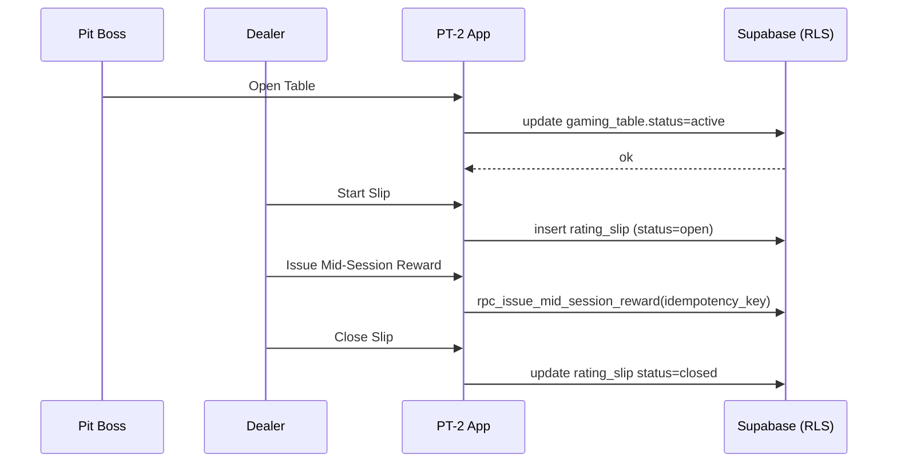

# Product Requirements (PRD)

**ID Prefix**: `PRD-###`  
**Owner**: Product  
**Phase**: Inception, Discovery, Design, Test, Release, Evolve

```yaml
---
id: PRD-001
title: Player Management System Requirements (MVP Pilot)
owner: Product
status: Draft
affects: [ARCH-012, API-005, QA-008, SEC-010, OPS-006, REL-003]
created: 2025-11-04
last_review: 2025-11-04
---
```

> **Scope note:** Although titled “Player Management,” this MVP PRD covers the minimal cross-domain features needed to run a single-casino pilot: Casino, Table Context, Player & Visit, Rating Slip, Loyalty (mid-session reward), minimal Finance, and read-only MTL.

---

## 1) Purpose & Release Goal

Drive a pilot-ready vertical slice that enables **table-centric player tracking** with **compliant session logging** and **basic mid-session loyalty accrual**, operable by pit staff with minimal training.

**Pilot Go/No-Go:** A single casino completes a full shift with zero “stuck” rating slips, accurate accrued seconds, idempotent mid-session rewards, and auditable trails.

---

## 2) Personas & JTBD

- **Pit Boss / Floor Supervisor** — run pit, open/close tables, monitor state, resolve issues.  
- **Dealer** — NOT involved in running the pit, logging or manipulating rating slips 
- **Cage/Accounting (read-only)** — verify in-session rewards, reconcile at day end.  
- **Compliance (read-only)** — review threshold proximity and session context.

**JTBD:** “Keep tables and player sessions clean, timely, and compliant — with minimal taps and zero ambiguity.”

---

## 3) MVP Feature Set (In-Scope)

### 3.1 Casino
- Staff authentication and role assignment.
- Casino settings including **gaming day** parameters.

### 3.2 Table Context
- Transition table status among `inactive` → `active` (open) → `closed` per SRM `table_status` enum; show canonical labels on the pit dashboard.
- Dealer rotation (happy path).

### 3.3 Player & Visit
- Enroll player; start/stop visit; seat player at table.

### 3.4 Rating Slip (Telemetry)
- Start, pause, resume, close slip (`status` set to `open`, `paused`, `closed`).
- Accurate server-derived duration (`duration_seconds` UI metric from `start_time`/`end_time`) and AOV visibility.
- Prevent overlapping open slips for the same player/table.
- Persist `seat_number`, current `game_settings`, and a `policy_snapshot` so rewards can be audited against the SRM contract.

### 3.5 Loyalty
- Issue **mid-session reward** via `rpc_issue_mid_session_reward(p_casino_id, p_player_id, p_rating_slip_id, p_staff_id, p_points, p_idempotency_key, p_reason)`; persist to **loyalty_ledger** and update **player_loyalty** in the same transaction.
- Enforce **idempotency** (no duplicate issuance).
- Slip UI reads reward data from `loyalty_ledger`/`player_loyalty`; `rating_slip` remains telemetry-only per SRM.

### 3.6 Finance (Minimal, Feature-Flagged)
- Manual **deposit/withdrawal** entry to support reconciliation scenarios.

### 3.7 MTL (Read-Only)
- Display CTR/watchlist threshold proximity badge and recent `mtl_entry` ledger activity in context (no loyalty data duplication).

---

## 4) Out of Scope (MVP)

- Full cashier workflows; automated watchlist writes; points→cash conversions.  
- Advanced analytics/forecasting; multi-property roll-ups.  
- Non-table games and kiosk integrations.  
- Complex exception processing beyond happy-path dealer rotation.

---

## 5) User Stories & Acceptance Criteria

> Format uses Gherkin-style acceptance tests (can be automated as E2E).

### US-001 Open a Table
**As** a Pit Boss **I want** to open a table **so that** patrons coudld be assigned seats to further monitor their activities, gaming action tracked and logged into rating slips, rewards issued, loyalty redemption and accrual tracked. I should be able to track patron's movement across the gaming floor and place them into appropriate seats on the table.  
**Acceptance:**
- **Given** the table is closed  
  **When** I Open Table  
  **Then** table status becomes `active` (per `table_status` enum) and is visible on the pit dashboard within 2s.

### US-002 Start a Rating Slip
**As** a Supervisor **I want** to start a rating slip **so that** player time accrues.  
**Acceptance:**
- **Given** player is seated at an open table and has no active slip at that table  
  **When** I Start Slip  
  **Then** a slip is created with `status=open` and a start timestamp, and the pit dashboard shows the active slip within 2s.

### US-003 Pause/Resume Slip
**As** a Supervisor **I want** to pause and resume a slip **so that** time tracking remains accurate when the player steps away.  
**Acceptance:**
- **Given** an active slip  
  **When** I Pause Slip  
  **Then** a pause interval is recorded and the server stops accruing the derived `duration_seconds` metric (no `accumulated_seconds` column).  
- **Given** a paused slip  
  **When** I Resume Slip  
  **Then** a resume time is recorded and derived seconds begin accruing again.

### US-004 Close Slip
**As** a Dealer/Pit Boss **I want** to close a slip **so that** the session is finalized.  
**Acceptance:**
- **Given** an active or paused slip  
  **When** I Close Slip  
  **Then** `end_time` is persisted, derived duration is emitted to the UI, `status=closed`, and the slip disappears from “Active” lists within 2s.

### US-005 Mid-Session Reward
**As** a Pit Boss **I want** to issue a mid-session reward **so that** loyalty can be recognized during play.  
**Acceptance:**
- **Given** an active slip with sufficient criteria  
  **When** I Issue Reward  
  **Then** an entry appears in `loyalty_ledger` linked to the slip/visit, and the slip UI reflects the reward within 2s by reading that ledger entry (no reward fields stored on `rating_slip`).  
- **And** if the same request is retried with the same idempotency key  
  **Then** no duplicate ledger entry is created (idempotent behavior).

### US-006 Basic Finance Entry (Feature-Flag)
**As** Accounting **I want** to record a manual deposit/withdraw **so that** reconciliation can be tested during pilot.  
**Acceptance:**
- **Given** feature flag is ON  
  **When** I create a finance entry via RPC  
  **Then** record persists with server-derived `gaming_day` (trigger from casino settings) and appears in relevant views.

---

## 6) Functional Requirements (by Domain)

### Casino
- Roles adhere to canonical `staff_role` enum (`dealer`, `pit_boss`, `admin`); compliance/accounting personas use policy-scoped read-only views without introducing new enum values.  
- Settings: `gaming_day_start`, timezone; must drive `compute_gaming_day` derivations.

### Table Context
- States: `inactive`, `active`, `closed` (maps to SRM `table_status`).  
- Dealer rotation: happy-path logging for audit; optional read-only view for MVP.
- Handles live operational telemetry for tables and chip custody
- References activated layouts from FloorLayoutService

### Player & Visit
- Prevent multiple concurrent **visits** for same player at the same casino unless explicitly allowed.  
- Seat mapping: a player must be seated at a specific table to start a slip.

### Rating Slip
- State machine: `open` ↔ `paused` → `closed`.  
- UI duration derived from start/pause/resume/close events (server-trusted clock); no dedicated `accumulated_seconds` column.  
- No overlapping open slip for {player, table}.  
- Rating slip remains telemetry-only; loyalty balances live exclusively in `player_loyalty`/`loyalty_ledger`.  
- Persist `seat_number`, `game_settings`, and a `policy_snapshot` snapshot per SRM to capture the policy in effect.  
- Mid-session rewards are eligible only while `status` ∈ (`open`, `paused`), and the RPC must enforce casino/player alignment.

### Loyalty
- RPC: `rpc_issue_mid_session_reward(p_casino_id, p_player_id, p_rating_slip_id, p_staff_id, p_points, p_idempotency_key, p_reason)` is the only write path; it atomically appends to `loyalty_ledger` and updates `player_loyalty`.  
- Ledger entries capture `loyalty_reason` enum values, `staff_id`, derived telemetry (`average_bet`, `duration_seconds`), and enforce idempotency via unique `idempotency_key`.  
- Display rewards inline on slip by reading ledger entries; include who/when/why; audit fields present.

### Finance
- RPC: `rpc_create_financial_txn(...)` must derive `gaming_day` server-side.  
- Minimal UI for pilot; behind feature flag.

### MTL
- Read-only surface showing CTR/watchlist threshold proximity from `mtl_entry` (`direction`, amount, staff) and related audit notes; loyalty data is not duplicated here.

---

## 7) Data Contracts & Schema Touchpoints

- **Tables (public):**  
  - `CasinoService (ARCH)`: `casino`, `casino_settings`, `staff`, `player_casino`.  
  - `TableContextService`: `game_settings`, `gaming_table`, `gaming_table_settings`, `dealer_rotation`.  
  - `Visit / Rating`: `player`, `visit`, `rating_slip`.  
  - `Loyalty`: `player_loyalty`, `loyalty_ledger`.  
  - `Finance / Compliance`: `player_financial_transaction`, `mtl_entry`, `mtl_audit_note`, `audit_log`.  
- **RPC/Functions:** `compute_gaming_day`, `rpc_issue_mid_session_reward`, `rpc_create_financial_txn`.  
- **Events (audit):** Actions on table open/close, slip lifecycle (with policy snapshot), reward issuance, finance entry, CTR thresholds.  
- `rating_slip` excludes reward totals by design; UI queries `loyalty_ledger`/`player_loyalty` for balances.

> Naming conventions are **lower_snake_case** with UUID ids; JSON only for metadata.

---

## 8) Security & Access (RLS/RBAC)

- **Deny-all** baseline; role- and casino-scoped allow paths.  
- Row ownership includes `{casino_id, gaming_day}` where applicable.  
- RLS policies follow SRM template: same-casino read for role-gated staff, admin-only writes, no implicit string joins.  
- No service keys in app runtime; all access through PostgREST/server actions with RLS.  
- Audit every state change (who/when/what).

---

## 9) Performance & UX KPIs

- Pit dashboard LCP ≤ **2.5s**.  
- Start/Pause/Resume/Close actions reflect in UI within **2s**.  
- p95 server action latency for slip ops < **400ms** in pilot environment.  
- Zero duplicate rewards under retry scenarios.

---

## 10) Observability

- Structured logs for all domain events with correlation keys: `{casino_id, staff_id, rating_slip_id, visit_id}`.  
- Dashboards: **Active tables**, **Open slips**, **Rewards/hour**, error rate.  
- Alerts: error budget burn and RPC failures (reward/financial).

---

## 11) Constraints & Dependencies

- Single-casino pilot; stable network with occasional latency spikes.  
- Schema must mirror SRM (matrix-first); migrations are gated by matrix conformance.  
- Client calls must use generated `database.types.ts` and DTOs.  
- Timekeeping is server-authoritative; client clocks are advisory only.

---

## 12) Rollout Plan (Flags & Phases)

- **Flags:** `finance_minimal_enabled`, `dealer_rotation_log_readonly`.  
- **Phases:**  
  1) Internal dogfood → 2) Limited pit shift → 3) Full-shift pilot (Go/No-Go) → 4) Stabilization.  
- **Rollback:** Disable feature flags; revert to read-only paths; database migrations forward-only with backout views.

---

## 13) Acceptance & Test Strategy

- **Contract tests** for RPCs and RLS allow-paths.  
- **E2E happy-path** for Stories US-001…US-006.  
- **Idempotency tests** for reward RPC and finance RPC.  
- **Performance tests** covering KPIs and LCP.  
- **Security tests** for least-privilege roles and casino scoping.

---

## 14) Risks & Mitigations

- **Scope creep** → enforce MVP boundaries; defer to Phase-2.  
- **RLS complexity** → test-per-role; start from deny-all.  
- **Schema drift** → CI gate on SRM↔schema conformance.  
- **Perf regressions** → perf budgets per server action; profiling required before merge.

---

## 15) Open Questions

- Do we allow multiple concurrent visits per player for special cases?  
- What is the minimal AOV calc required for MVP UI?  
- Should dealer rotation writes be part of MVP or read-only only?

---

## 16) Traceability Matrix (Feature ↔ Schema/RPC ↔ Tests)

| Feature | Tables/RPC | Primary Tests |
|---|---|---|
| Open/Close Table | `gaming_table`, `gaming_table_settings` | E2E-US-001, RLS-Table |
| Start/Pause/Resume/Close Slip | `rating_slip` | E2E-US-002/003/004, PERF-Slip |
| Mid-Session Reward | `loyalty_ledger`, `rpc_issue_mid_session_reward` | E2E-US-005, IDEMP-Reward |
| Seat Player / Visit | `player`, `visit` | E2E-Seat, RLS-Visit |
| Finance Entry (FF) | `player_financial_transaction`, `rpc_create_financial_txn` | E2E-US-006, IDEMP-Finance |
| MTL Read-Only | `mtl_entry` | VIEW-MTL |

---

## 17) Appendices

- **User Flows (Mermaid)**



- **MVP Scope Checklist**: All stories US-001..US-006 implemented; KPIs met; runbooks ready; flags set.

---

## Related Categories

- **V&S** (`/docs/00-vision/`): high-level vision that informs PRD.  
- **ARCH** (`/docs/20-architecture/`): technical design implementing PRD.  
- **QA** (`/docs/40-quality/`): test plans validating PRD acceptance criteria.  
- **REL** (`/docs/60-release/`): release notes tracking PRD delivery.
- Mapping follows `docs/patterns/SDLC_DOCS_TAXONOMY.md` so this PRD stays in sync with ARCH (SRM), QA, and REL artifacts.
