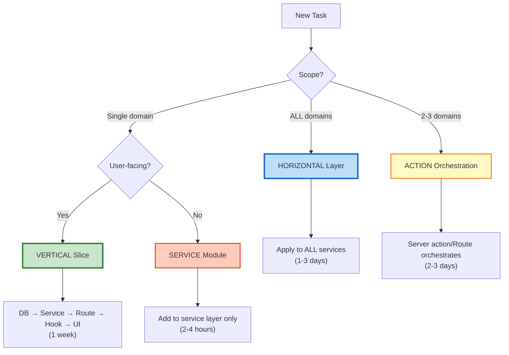

# Balanced Architecture Quick Reference (Redacted & Updated)

> **Carry card for vertical vs horizontal slicing decisions**  
> **Full analysis**: [Consensus Synthesis](../architecture/slicing/CONSENSUS_SYNTHESIS.md)  
> **Context**: Solo dev, 8‑week MVP, Phase 2→3 transition  
> **Synced**: ADR‑003 v5 (Query), Server Actions Architecture v1.1 (Routes vs Actions), SRM v3.0.2‑PATCHED

---

## Decision Tree (Use This First)



> **Transport rule**: For React Query mutations use **Route Handlers** (`app/api/**/route.ts`). Use **Server Actions** only for **form/RSC** flows.

---

## The 4-Second Rule

| Question | Answer | Do This |
|----------|--------|---------|
| **Scope?** | 1 domain | **VERTICAL** |
| **Scope?** | ALL domains (>5) | **HORIZONTAL** |
| **User sees it?** | Yes | **VERTICAL** |
| **Infrastructure?** | Yes | **HORIZONTAL** |

**Default**: When in doubt → **VERTICAL** (ship features, defer abstractions)

---

## Vertical Slicing (Feature Delivery)

### ✅ Use When
- Single bounded context (per SRM)
- User-facing feature, demoable
- 1‑week deliverable
- No platform-wide infra needed

### 📦 Implementation Pattern (v5‑aligned)
```ts
// 1) DATA: Migration (Supabase)
// supabase/migrations/xxx_player_tables.sql

// 2) SERVICE: Business logic
// services/player/index.ts
export interface PlayerService {
  create(data: PlayerCreateDTO): Promise<ServiceResult<PlayerDTO>>;
}

// 3) ROUTE: Transport for React Query
// app/api/player/create/route.ts
export async function POST(req: NextRequest) {
  // Zod validate, Idempotency-Key, withServerAction → service.create
  // return JSON<ServiceHttpResult<Player>>
}

// 4) HOOK: React Query (v5)
export function useCreatePlayer() {
  return useMutation({
    mutationFn: async (input: PlayerCreateDTO) => {
      const res = await fetch('/api/player/create', {
        method: 'POST',
        headers: { 'content-type':'application/json', 'idempotency-key': crypto.randomUUID() },
        body: JSON.stringify(input),
      });
      const json = await res.json();
      if (!res.ok || !json.ok) throw new Error(json.error || 'Unknown');
      return json.data as PlayerDTO;
    },
    onSuccess: () => queryClient.invalidateQueries({ queryKey: playerKeys.root() }),
  });
}

// 5) UI: Component
// components/player/player-form.tsx
```

### 🔑 Notes
- **Query keys** via **factories** (`services/player/keys.ts`) to keep params stable.  
- **Pagination**: `placeholderData` or `useInfiniteQuery` (no `keepPreviousData`).  
- **Invalidation**: UI layer owns it (domain/root, granular, or setQueriesData).

---

## Horizontal Layering (Infrastructure)

### ✅ Use When
- Affects **ALL** services (>5)
- Cross-cutting concerns (logging, error map, types, client upgrades)
- Testing infra

### 🔧 Pattern
```ts
// services/shared/operation-wrapper.ts
export async function executeOperation<T>(name: string, fn: () => Promise<T>): Promise<ServiceResult<T>> {
  try { const data = await fn(); return { ok: true, code: 'OK', data, requestId, durationMs, timestamp }; }
  catch (e) { return mapError(e, requestId, durationMs); }
}

// Apply across services; add Zod schemas, error map, metrics
```

### Additions (Standards)
- **Idempotency-Key** checks for write routes
- **Zod** validation at route/action edge
- **requestId** + **durationMs** + PII‑redacted **audit**
- **No invalidation in server layer** (UI owns it)

---

## Hybrid (Action Orchestration)

### ✅ Use When
- 2–3 bounded contexts (per SRM) participate
- Cross-domain validation + coordinated writes
- Server workflow spans services

### 🔀 Pattern
```ts
// startVisit: Player + Casino + Visit
// app/api/visit/start/route.ts or app/actions/visit/start-visit.ts (form)
```

**Guardrails**
- Name involved contexts explicitly; keep logic in **services**, not utilities.  
- Prefer **Route Handler** for React Query; **Server Action** only for forms.  
- UI still owns cache invalidation per ADR‑003.

---

## Query-Key Factories (Snippet)
```ts
// services/player/keys.ts
export const playerKeys = {
  root:     () => ['player'] as const,
  list:     (filters?: { status?: 'active'|'inactive'; q?: string }) =>
              ['player','list', filters ?? {}] as const,
  detail:   (id: string) => ['player','detail', id] as const,
  byCasino: (casinoId: string) => ['player','by-casino', casinoId] as const,
};
```

---

## Common Scenarios (Updated)

| Scenario | Approach | Rationale | Timeline |
|----------|----------|-----------|----------|
| Add Player search UI | VERTICAL | Single domain, user-facing | 1 week |
| Upgrade Supabase client | HORIZONTAL | ALL services affected | 2 days |
| Visit start flow | HYBRID | 3 services, orchestration | 3 days |
| Add real-time to Player | VERTICAL | Domain-specific | 1 week |
| Create error catalog | HORIZONTAL (defer) | Not urgent | Future |
| Split PlayerService (>500 lines) | HORIZONTAL | Refactor | 2 hours |
| Add pagination to lists | VERTICAL (per domain) | Domain-specific UI | 3 days |
| Add structured logging | HORIZONTAL | ALL services | 1 day |

---

## Strategic Technical Debt (Unchanged)

Accept: consolidated files, inline validation (until 3+ reuse), manual refresh, basic lists, simple errors.  
Never compromise: explicit interfaces, typed deps, ServiceResult, 80% coverage, single `database.types.ts` SoT.

---

## Realtime (Week 7)

- Supabase channel → **batch invalidations** (250–500ms)  
- Use `refetchType:'active'`; prefer `setQueryData` only with full snapshots  
- Infinite queries: update the correct `{ pages, pageParams }` shape

---

## Quick Sanity Checks (Updated)

Before work: check scope, user-facing, affects ALL vs 1 domain, estimate.  
During: tests alongside code, follow SERVICE_TEMPLATE_QUICK, no layer violations.  
Before PR: all tests pass, `tsc --noEmit` clean, **UI owns invalidation**, SRM boundaries intact.

---

**Document Version**: 1.0.1 (Redacted & Updated)  
**Synced With**: ADR‑003 (v5), Server Actions Architecture (1.1), SRM v3.0.2‑PATCHED  
**Reading Time**: 10 minutes
**REFERECE** For full original version: [Balanced Architecture v1.0](docs/archive/BALANCED_ARCHITECTURE_QUICK.md)
