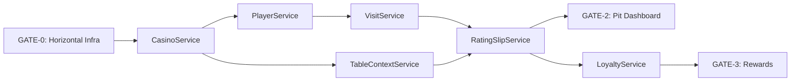

# MVP Implementation Roadmap

**ID**: ARCH-MVP-ROADMAP
**Version**: 1.1.0
**Status**: CANONICAL
**Created**: 2025-11-29
**Updated**: 2025-11-29
**Owner**: Lead Architect

---

## PRD Alignment

| Phase | PRD | Status | Notes |
|-------|-----|--------|-------|
| **0** | **PRD-HZ-001** | **COMPLETE** ✅ | GATE-0 Horizontal Infrastructure |
| 1 | PRD-000 | Draft | CasinoService (next priority) |
| 1 | PRD-003 | Draft | Player/Visit Services |
| 2 | PRD-002 | **Retrofitted** ✅ | TableContext/RatingSlip using new middleware |
| 3 | PRD-004 | Draft | Mid-Session Loyalty |
| 3 | PRD-005 | Draft | Compliance Monitoring |
| 3 | PRD-001 | Draft | Player Financial Service |

> **PRD-HZ-001 Complete (2025-11-29)**: All 4 workstreams delivered:
> - WS1: Middleware architecture (6 modules)
> - WS2: React Query enhancement layer
> - WS3: Testing infrastructure
> - WS5: API route migration (7 P0 routes)
>
> **PRD-002 Retrofit**: TableContextService and RatingSlipService routes have been migrated to use the new `withServerAction` middleware. P1/P2 routes can be migrated incrementally.

---

## Purpose

Establishes a complete implementation baseline for MVP delivery, addressing gaps in the current PRD-based vertical slices by adding:

1. **Horizontal Infrastructure Layers** - Cross-cutting concerns required before vertical slices
2. **UI Implementation Plan** - User-facing components to visualize and test the system
3. **Progress Tracking Integration** - Concrete milestones for MVPProgressContext

---

## Current State Analysis

### What Exists

| Layer | Status | Evidence |
|-------|--------|----------|
| **Database Schema** | Partial | Migrations exist; types generated |
| **Service Layer** | 25% | TableContextService, RatingSlipService implemented |
| **API Routes** | Active | 7 P0 routes using new middleware, 28 remaining |
| **React Query Keys** | Partial | Key factories exist for most domains |
| **UI Components** | Minimal | Landing page, auth forms, shadcn/ui base |
| **Horizontal Infra** | **COMPLETE** ✅ | withServerAction, ServiceResult, error mapping, query client |

### Critical Gaps

```
HORIZONTAL LAYERS ✅ COMPLETE (PRD-HZ-001)
├── withServerAction wrapper (auth → RLS → idempotency → audit) ✅
├── ServiceResult<T> pattern (standardized responses) ✅
├── Error taxonomy (domain errors → HTTP mapping) ✅
├── Rate limiting infrastructure (in-memory, single-instance) ✅
└── Correlation ID propagation ✅

UI LAYER (Required to demo/test implementation)
├── Pit Dashboard (table status, active slips)
├── Rating Slip Management UI
├── Player Check-in Flow
└── Loyalty Rewards Display

PROGRESS TRACKING
├── Gate validation automation
├── Service completion criteria
└── Memori integration for velocity tracking
```

---

## Architecture Decision: Implementation Order

**Decision**: HORIZONTAL-FIRST for infrastructure, then VERTICAL for features

**Rationale**:
1. Vertical slices (DB → Service → Route → Hook → UI) require horizontal infrastructure
2. `withServerAction` wrapper needed before ANY route can be safely deployed
3. Error taxonomy needed before services can properly communicate failures
4. UI cannot be built without routes and hooks

```
PHASE 0: Horizontal Infrastructure (GATE-0)
    ↓
PHASE 1: Core Services + Minimal UI (GATE-1)
    ↓
PHASE 2: Session Management + Dashboard (GATE-2)
    ↓
PHASE 3: Rewards & Compliance (GATE-3)
```

---

## Phase 0: Horizontal Infrastructure (GATE-0) — COMPLETE ✅

**Completed**: 2025-11-29
**PRD**: PRD-HZ-001
**Approach**: HORIZONTAL (affects ALL services)

### 0.1 Transport Layer ✅

| Item | Location | Description | Status |
|------|----------|-------------|--------|
| `withServerAction` | `lib/server-actions/middleware/compositor.ts` | Composable middleware: tracing → auth → RLS → idempotency → audit | ✅ |
| `withAuth` | `lib/server-actions/middleware/auth.ts` | Extract user from session, validate | ✅ |
| `withRLS` | `lib/server-actions/middleware/rls.ts` | SET LOCAL app.* context injection | ✅ |
| `withIdempotency` | `lib/server-actions/middleware/idempotency.ts` | Check/persist idempotency keys | ✅ |
| `withAudit` | `lib/server-actions/middleware/audit.ts` | Write to audit_log with correlation_id | ✅ |
| `withTracing` | `lib/server-actions/middleware/tracing.ts` | Error mapping, duration recording | ✅ |

**Validation Gate 0.1**: ✅ PASSED
- [x] `withServerAction` composes all middleware
- [x] RLS context injection tested with real Supabase
- [x] Idempotency prevents duplicate mutations

### 0.2 Service Result Pattern ✅

| Item | Location | Description | Status |
|------|----------|-------------|--------|
| `ServiceResult<T>` | `lib/http/service-response.ts` | `{ ok: true, data: T } | { ok: false, error: DomainError }` | ✅ |
| `ServiceHttpResult<T>` | `lib/http/service-response.ts` | HTTP-friendly wrapper with status codes | ✅ |
| Type exports | `lib/http/service-response.ts` | Centralized type exports | ✅ |

```typescript
// lib/types/service-result.ts
export type ServiceResult<T> =
  | { ok: true; data: T; requestId: string; durationMs: number }
  | { ok: false; error: DomainError; requestId: string; durationMs: number };

export type ServiceHttpResult<T> = {
  ok: boolean;
  data?: T;
  error?: string;
  code: string;
  requestId: string;
  timestamp: string;
};
```

### 0.3 Error Taxonomy

| Item | Location | Description | Priority |
|------|----------|-------------|----------|
| `DomainError` | `lib/errors/domain-error.ts` | Base error class with code, message, metadata | P0 |
| Domain catalogs | `lib/errors/domains/*.ts` | Per-service error codes | P0 |
| Error mapper | `lib/errors/error-map.ts` | Postgres → DomainError mapping | P0 |
| HTTP mapper | `lib/errors/http-map.ts` | DomainError → HTTP status | P0 |

**Error Catalog (per SRM)**:
```typescript
// lib/errors/domains/loyalty.ts
export const LoyaltyErrors = {
  REWARD_ALREADY_ISSUED: { code: 'REWARD_ALREADY_ISSUED', status: 409 },
  INSUFFICIENT_BALANCE: { code: 'INSUFFICIENT_BALANCE', status: 422 },
  LOYALTY_ACCOUNT_NOT_FOUND: { code: 'LOYALTY_ACCOUNT_NOT_FOUND', status: 404 },
} as const;
```

**Validation Gate 0.2**: ✅ PASSED
- [x] All services use `ServiceResult<T>` pattern
- [x] No Postgres error codes leak to UI
- [x] Error codes match SRM catalog

### 0.4 Shared Utilities

| Item | Location | Description | Priority |
|------|----------|-------------|----------|
| Correlation ID | `lib/utils/correlation.ts` | Generate/propagate x-correlation-id | P0 |
| Gaming day calc | `lib/utils/gaming-day.ts` | Client-side gaming day derivation | P1 |
| Zod schemas | `lib/schemas/*.ts` | Shared validation schemas | P0 |

### 0.5 React Query Infrastructure

| Item | Location | Description | Priority |
|------|----------|-------------|----------|
| Query client config | `lib/query/client.ts` | Stale/cache times per domain tier | P0 |
| Mutation helpers | `lib/query/mutations.ts` | Standard mutation with error handling | P0 |
| Invalidation utils | `lib/query/invalidation.ts` | Domain-scoped invalidation helpers | P1 |

**Gate 0 Definition of Done**:
- [ ] `withServerAction` wrapper deployed and tested
- [ ] `ServiceResult<T>` used in at least one service
- [ ] Error taxonomy prevents Postgres leaks
- [ ] Correlation IDs propagate through stack
- [ ] React Query client configured with tiered caching

---

## Phase 1: Core Services (GATE-1)

**Timeline**: Foundation services required for all downstream
**Approach**: VERTICAL per service

### 1.1 CasinoService (Root Authority)

**PRD Reference**: PRD-000
**Critical**: Blocks ALL downstream services (temporal authority)

| Layer | Item | Location | Priority |
|-------|------|----------|----------|
| **Migration** | Casino settings, staff | `supabase/migrations/` | P0 |
| **Service** | CasinoService factory | `services/casino/index.ts` | P0 |
| **DTOs** | CasinoDTO, StaffDTO | `services/casino/dtos.ts` | P0 |
| **RPC** | `compute_gaming_day` | Database function | P0 |
| **Route** | `POST /api/casino/settings` | `app/api/casino/settings/route.ts` | P1 |
| **Hook** | `useCasinoSettings` | `hooks/use-casino.ts` | P1 |
| **UI** | Casino settings panel | `components/casino/settings-panel.tsx` | P2 |

**Temporal Authority Pattern** (TEMP-001, TEMP-002):
```sql
-- compute_gaming_day function
CREATE OR REPLACE FUNCTION compute_gaming_day(
  p_casino_id uuid,
  p_timestamp timestamptz DEFAULT now()
) RETURNS date AS $$
DECLARE
  v_start_time time;
  v_timezone text;
BEGIN
  SELECT gaming_day_start_time, timezone
  INTO v_start_time, v_timezone
  FROM casino_settings
  WHERE casino_id = p_casino_id;

  -- Gaming day logic: if before start time, use previous calendar day
  RETURN (p_timestamp AT TIME ZONE v_timezone - v_start_time)::date;
END;
$$ LANGUAGE plpgsql STABLE;
```

**Validation Gate 1.1**:
- [ ] CasinoService factory created with typed interface
- [ ] `compute_gaming_day` function deployed and tested
- [ ] Staff authentication working (pit_boss, admin only)
- [ ] RLS policies enforce casino scoping

### 1.2 PlayerService (Identity Context)

**PRD Reference**: PRD-003

| Layer | Item | Location | Priority |
|-------|------|----------|----------|
| **Service** | PlayerService factory | `services/player/index.ts` | P0 |
| **DTOs** | PlayerDTO, PlayerEnrollmentDTO | `services/player/dtos.ts` | P0 |
| **Route** | `POST /api/players` | `app/api/players/route.ts` | P1 |
| **Hook** | `usePlayer`, `usePlayerSearch` | `hooks/use-player.ts` | P1 |
| **UI** | Player search/select | `components/player/player-search.tsx` | P1 |

### 1.3 VisitService (Session Context)

**PRD Reference**: PRD-003

| Layer | Item | Location | Priority |
|-------|------|----------|----------|
| **Service** | VisitService factory | `services/visit/index.ts` | P0 |
| **DTOs** | VisitDTO, CheckInDTO | `services/visit/dtos.ts` | P0 |
| **Route** | `POST /api/visit/start` | `app/api/visit/start/route.ts` | P1 |
| **Hook** | `useVisit`, `useStartVisit` | `hooks/use-visit.ts` | P1 |
| **UI** | Check-in flow | `components/visit/check-in-dialog.tsx` | P1 |

**Gate 1 Definition of Done**:
- [ ] CasinoService with temporal authority operational
- [ ] PlayerService with enrollment working
- [ ] VisitService with check-in/check-out
- [ ] All services use `ServiceResult<T>`
- [ ] Integration tests pass with RLS enabled

---

## Phase 2: Session Management + UI (GATE-2)

**Timeline**: Operational features with dashboard
**Approach**: VERTICAL + UI focus

### 2.1 TableContextService Enhancement

**Status**: Partially implemented (PRD-002)

| Layer | Item | Location | Priority |
|-------|------|----------|----------|
| **Route** | `POST /api/tables/{id}/open` | `app/api/tables/[id]/open/route.ts` | P0 |
| **Hook** | `useOpenTable`, `useCloseTable` | `hooks/use-table.ts` | P0 |
| **UI** | Table status card | `components/table/table-card.tsx` | P0 |

### 2.2 RatingSlipService Enhancement

**Status**: Partially implemented (PRD-002)

| Layer | Item | Location | Priority |
|-------|------|----------|----------|
| **Route** | Full CRUD routes | `app/api/rating-slips/route.ts` | P0 |
| **Hook** | `useRatingSlip`, mutations | `hooks/use-rating-slip.ts` | P0 |
| **UI** | Slip management modal | `components/rating-slip/slip-modal.tsx` | P0 |

### 2.3 Pit Dashboard (New)

**Critical UI Component** - Primary operational interface

| Item | Location | Description | Priority |
|------|----------|-------------|----------|
| Dashboard layout | `app/dashboard/page.tsx` | Main pit operations view | P0 |
| Table grid | `components/dashboard/table-grid.tsx` | Visual table status | P0 |
| Active slips panel | `components/dashboard/active-slips.tsx` | Current sessions | P0 |
| Player activity | `components/dashboard/player-activity.tsx` | Recent check-ins | P1 |
| Realtime updates | `hooks/use-dashboard-realtime.ts` | Supabase channels | P1 |

**Dashboard Wireframe**:
```
┌─────────────────────────────────────────────────────────────┐
│  PT-2 Pit Dashboard                    [Casino Name] [User] │
├─────────────────────────────────────────────────────────────┤
│  ┌─────────────┐ ┌─────────────┐ ┌─────────────┐           │
│  │ Active: 5   │ │ Open Slips: │ │ Players:    │           │
│  │ Tables      │ │ 12          │ │ 8 checked-in│           │
│  └─────────────┘ └─────────────┘ └─────────────┘           │
├─────────────────────────────────────────────────────────────┤
│  TABLE GRID                                                 │
│  ┌─────┐ ┌─────┐ ┌─────┐ ┌─────┐ ┌─────┐                   │
│  │ T1  │ │ T2  │ │ T3  │ │ T4  │ │ T5  │                   │
│  │ BJ  │ │ BJ  │ │ PKR │ │ BAC │ │ RLT │                   │
│  │ ●●● │ │ ●●  │ │ ●   │ │ ●●●●│ │     │                   │
│  └─────┘ └─────┘ └─────┘ └─────┘ └─────┘                   │
│  [OPEN] [OPEN] [OPEN] [OPEN] [CLOSED]                       │
├─────────────────────────────────────────────────────────────┤
│  ACTIVE RATING SLIPS                          [+ New Slip]  │
│  ┌─────────────────────────────────────────────────────────┐│
│  │ Player      │ Table │ Duration │ Avg Bet │ Actions     ││
│  │ John D.     │ T1    │ 0:45:30  │ $25     │ [Pause][End]││
│  │ Jane S.     │ T2    │ 1:12:00  │ $50     │ [Pause][End]││
│  └─────────────────────────────────────────────────────────┘│
└─────────────────────────────────────────────────────────────┘
```

**Gate 2 Definition of Done**:
- [ ] Pit Dashboard operational
- [ ] Table open/close from UI
- [ ] Rating slip start/pause/resume/close from UI
- [ ] Real-time updates working
- [ ] p95 dashboard LCP ≤ 2.5s

---

## Phase 3: Rewards & Compliance (GATE-3)

**Timeline**: Business value features
**Approach**: VERTICAL + HYBRID orchestration

### 3.1 LoyaltyService

**PRD Reference**: PRD-004

| Layer | Item | Location | Priority |
|-------|------|----------|----------|
| **Service** | LoyaltyService factory | `services/loyalty/index.ts` | P0 |
| **RPC** | `rpc_issue_mid_session_reward` | Database function | P0 |
| **Route** | `POST /api/loyalty/rewards` | `app/api/loyalty/rewards/route.ts` | P0 |
| **Hook** | `useIssueMidSessionReward` | `hooks/use-loyalty.ts` | P0 |
| **UI** | Reward dialog | `components/loyalty/reward-dialog.tsx` | P0 |

### 3.2 PlayerFinancialService

**PRD Reference**: PRD-001 (feature-flagged)

| Layer | Item | Location | Priority |
|-------|------|----------|----------|
| **Service** | PlayerFinancialService | `services/finance/index.ts` | P1 |
| **RPC** | `rpc_create_financial_txn` | Database function | P1 |
| **UI** | Finance entry form | `components/finance/entry-form.tsx` | P2 |

### 3.3 MTLService

**PRD Reference**: PRD-005 (read-only MVP)

| Layer | Item | Location | Priority |
|-------|------|----------|----------|
| **Service** | MTLService (read-only) | `services/mtl/index.ts` | P1 |
| **UI** | Threshold proximity badge | `components/mtl/proximity-badge.tsx` | P1 |

**Gate 3 Definition of Done**:
- [ ] Mid-session rewards issuable from UI
- [ ] Rewards idempotent (no duplicates)
- [ ] Finance entry (feature-flagged)
- [ ] MTL threshold badges visible
- [ ] Zero stuck rating slips

---

## UI Component Hierarchy

```
app/
├── layout.tsx                      # Root layout with providers
├── page.tsx                        # Landing/redirect
├── auth/                           # Auth flows (exists)
├── dashboard/
│   ├── layout.tsx                  # Dashboard shell
│   ├── page.tsx                    # Pit dashboard (main)
│   ├── tables/
│   │   └── [id]/page.tsx          # Table detail view
│   └── players/
│       └── [id]/page.tsx          # Player detail view
└── api/
    ├── casino/                     # Casino routes
    ├── players/                    # Player routes
    ├── visit/                      # Visit routes
    ├── tables/                     # Table routes
    ├── rating-slips/               # Rating slip routes
    └── loyalty/                    # Loyalty routes

components/
├── ui/                             # shadcn/ui base (exists)
├── dashboard/
│   ├── table-grid.tsx
│   ├── active-slips.tsx
│   ├── stats-cards.tsx
│   └── player-activity.tsx
├── table/
│   ├── table-card.tsx
│   ├── table-actions.tsx
│   └── table-detail.tsx
├── rating-slip/
│   ├── slip-card.tsx
│   ├── slip-modal.tsx
│   ├── slip-timer.tsx
│   └── slip-actions.tsx
├── player/
│   ├── player-search.tsx
│   ├── player-card.tsx
│   └── player-select.tsx
├── visit/
│   ├── check-in-dialog.tsx
│   └── visit-summary.tsx
├── loyalty/
│   ├── reward-dialog.tsx
│   ├── points-display.tsx
│   └── tier-badge.tsx
└── mtl/
    └── proximity-badge.tsx
```

---

## Progress Tracking Integration

### MVPProgressContext Categories

The roadmap integrates with `lib/memori/mvp_progress_context.py`:

```python
# Phase definitions (update in MVPProgressContext)
PHASE_DEFINITIONS = {
    0: {
        "name": "Horizontal Infrastructure",
        "gate": 0,
        "services": ["TransportLayer", "ErrorTaxonomy", "QueryInfra"],
    },
    1: {
        "name": "Core Services",
        "gate": 1,
        "services": ["CasinoService", "PlayerService", "VisitService"],
    },
    2: {
        "name": "Session Management + UI",
        "gate": 2,
        "services": ["TableContextService", "RatingSlipService", "PitDashboard"],
    },
    3: {
        "name": "Rewards & Compliance",
        "gate": 3,
        "services": ["LoyaltyService", "PlayerFinancialService", "MTLService"],
    },
}
```

### Tracking Commands

```bash
# Record service completion
/mvp-status

# Record horizontal layer completion
python3 -c "
from lib.memori.mvp_progress_context import create_mvp_progress_context
ctx = create_mvp_progress_context()
ctx.record_service_status('TransportLayer', 'implemented',
    files_created=['lib/server-actions/wrapper.ts'])
"
```

---

## Validation Gates Summary

| Gate | Phase | Key Deliverables | Validation |
|------|-------|------------------|------------|
| **GATE-0** | Horizontal Infra | withServerAction, ServiceResult, Error taxonomy | Unit tests, integration tests |
| **GATE-1** | Core Services | CasinoService (temporal), PlayerService, VisitService | RLS tests, service tests |
| **GATE-2** | Session Mgmt | Pit Dashboard, table ops, slip management | E2E tests, LCP ≤ 2.5s |
| **GATE-3** | Rewards/Compliance | Mid-session rewards, MTL badges | Idempotency tests, zero duplicates |

---

## Critical Path



**Blocking Dependencies**:
1. **GATE-0** blocks everything (no routes without wrapper)
2. **CasinoService** blocks all services (temporal authority)
3. **PlayerService** blocks VisitService (player FK)
4. **VisitService** blocks RatingSlipService (visit FK)
5. **RatingSlipService** blocks LoyaltyService (telemetry input)

---

## Next Actions

1. **Immediate (P0)**: Implement GATE-0 horizontal infrastructure
2. **Short-term**: CasinoService with `compute_gaming_day`
3. **Medium-term**: Pit Dashboard skeleton
4. **Ongoing**: Record progress via `/mvp-status`

---

## References

- **PRD-000**: CasinoService (Root Authority)
- **PRD-001**: Player Management System Requirements
- **PRD-002**: Table & Rating Core (partially implemented)
- **PRD-003**: Player Intake & Visit
- **PRD-004**: Mid-Session Loyalty
- **PRD-005**: Compliance Monitoring
- **VIS-001**: Vision & Scope
- **SRM**: Service Responsibility Matrix v3.1.0
- **BALANCED_ARCHITECTURE_QUICK**: Slicing decision guide
