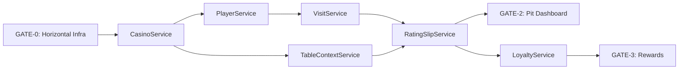

# MVP Implementation Roadmap

**ID**: ARCH-MVP-ROADMAP
**Version**: 1.6.0
**Status**: CANONICAL
**Created**: 2025-11-29
**Updated**: 2025-12-09
**Owner**: Lead Architect

---

## PRD Alignment

| Phase | PRD | Status | Notes |
|-------|-----|--------|-------|
| **0** | **PRD-HZ-001** | **COMPLETE** ✅ | GATE-0 Horizontal Infrastructure |
| **1** | **PRD-000** | **COMPLETE** ✅ | CasinoService (Root Authority) |
| **1** | **PRD-003** | **COMPLETE** ✅ | PlayerService + VisitService (Pattern B refactor) |
| **1** | **PRD-003A** | **COMPLETE** ✅ | PlayerService Pattern B refactor |
| **1** | **PRD-003B** | **COMPLETE** ✅ | VisitService Pattern B refactor |
| **1** | **EXEC-VSE-001** | **COMPLETE** ✅ | VisitService Evolution (ghost visits, 3 archetypes) |
| **2** | **PRD-007** | **COMPLETE** ✅ | TableContextService (Pattern A, 5 workstreams) |
| **2** | **PRD-002** | **COMPLETE** ✅ | RatingSlipService (Pattern B, 12 workstreams) |
| **2** | **UI-SCAFFOLD-001** | **COMPLETE** ✅ | Dashboard shell, route groups, sidebar, mobile nav |
| **2** | **PRD-006** | **In Progress** | Pit Dashboard Content (scaffold ready, components pending) |
| 3 | PRD-004 | **Partial** | Mid-Session Loyalty (routes exist, service factory incomplete) |
| 3 | PRD-005 | **Partial** | Compliance Monitoring (routes exist, view-model exists) |
| 3 | PRD-001 | **Partial** | Player Financial Service (routes exist, keys only) |

> **PRD-HZ-001 Complete (2025-11-29)**: All 4 workstreams delivered:
> - WS1: Middleware architecture (6 modules)
> - WS2: React Query enhancement layer
> - WS3: Testing infrastructure
> - WS5: API route migration (7 P0 routes)
>
> **PRD-000 Complete (2025-11-29)**: CasinoService Root Authority implemented:
> - Migration: `20251129161956_prd000_casino_foundation.sql` (compute_gaming_day RPC, staff constraint, RLS)
> - Service: DTOs, schemas, keys, HTTP fetchers, 5 React Query hooks
> - Routes: GET/POST /casino, GET/PATCH /casino/[id], /settings, /staff, /gaming-day
> - Tests: 125 unit/integration tests passing
>
> **PRD-002 Status**: TableContextService was removed (incomplete implementation, ~10% done). RatingSlipService was also removed in prior cleanup. These will be rebuilt correctly when PRD-002 implementation actually begins.
>
> **PRD-003 Complete (2025-11-30)**: PlayerService + VisitService fully implemented:
> - Migration: `20251129230733_prd003_player_visit_rls.sql` (RLS, indexes, constraints)
> - PlayerService: search, enrollment, CRUD, functional factory, DTOs, schemas
> - VisitService: check-in/check-out, idempotent, active visit constraint
> - Routes: 8 endpoints at `/api/v1/players/*` and `/api/v1/visits/*`
> - Tests: Unit tests for both services
> - Unblocks: GATE-2 (PitDashboard), Phase 3 services
>
> **PRD-003A/B Complete (2025-12-03)**: Pattern B refactor for both services:
> - PlayerService: `selects.ts`, `mappers.ts`, `crud.ts` (6 mapper functions, DomainError handling)
> - VisitService: `selects.ts`, `mappers.ts`, `crud.ts` (6 mapper functions, DomainError handling)
> - API change: `startVisit(playerId, casinoId)` now requires explicit casinoId
> - Tests relocated to `__tests__/` subdirectories per ADR-002
> - Zero `as` type assertions - all transformations via mappers
> - ADR-012 Addendum: cross-context error propagation, `assertOk` helper pattern
>
> **EXEC-VSE-001 Complete (2025-12-05)**: Visit Service Evolution per ADR-014:
> - **3 Visit Archetypes**: `reward_identified`, `gaming_identified_rated`, `gaming_ghost_unrated`
> - **Schema**: 4 migrations (visit_kind enum, player_id nullable, unique index updates, rating_slip hardening)
> - **Service**: 3 creation flows + `convertRewardToGaming` with audit logging
> - **Backward Compatible**: `startVisit` defaults to `gaming_identified_rated`
> - **Documentation**: ADR-014 Accepted, SRM v3.1.0, SLAD v2.3.0 updated
>
> **PRD-007 Complete (2025-12-07)**: TableContextService implemented per Pattern A:
> - **5 Workstreams**: Foundation, Table Operations, Chip Custody, Transport Layer, Testing
> - **Service Layer**: DTOs, schemas, keys, selects, mappers, crud, lifecycle, dealer-rotation, chip-custody
> - **Transport**: 10 Route Handlers + 5 Server Actions (dual-entry pattern)
> - **State Machine**: inactive → active → closed with cross-context validation
> - **Tests**: 62 mapper tests passing
>
> **PRD-002 Complete (2025-12-05)**: RatingSlipService implemented per Pattern B:
> - **12 Workstreams**: State machine, duration calculation, pause tracking, cross-context queries
> - **Service Layer**: DTOs, schemas, keys, selects, mappers, crud, queries
> - **Transport**: 6 Route Handlers (start, pause, resume, close, get, duration)
> - **State Machine**: `open` ↔ `paused` → `closed` (terminal) via RPC
> - **Tests**: 4 test files (mappers, queries, integration, service)
>
> **UI-SCAFFOLD-001 Complete (2025-12-08)**: Dashboard shell and navigation:
> - **Route Groups**: `(public)` for auth, `(dashboard)` for protected routes
> - **Navigation**: shadcn/ui Sidebar with collapsible icon mode, mobile bottom nav
> - **Typography**: JetBrains Mono + DM Sans via next/font/google
> - **Components**: `components/layout/*` (5 files), `components/shared/*` (2 files)
> - **Routes Scaffolded**: /pit, /players, /loyalty, /compliance, /settings/*

---

## Purpose

Establishes a complete implementation baseline for MVP delivery, addressing gaps in the current PRD-based vertical slices by adding:

1. **Horizontal Infrastructure Layers** - Cross-cutting concerns required before vertical slices
2. **UI Implementation Plan** - User-facing components to visualize and test the system
3. **Progress Tracking Integration** - Concrete milestones for MVPProgressContext

---

## Current State Analysis

### What Exists

| Layer | Status | Evidence |
|-------|--------|----------|
| **Database Schema** | **~95%** | 17 migrations deployed; types generated |
| **Service Layer** | **~85%** | 5/6 core services implemented (Casino, Player, Visit, TableContext, RatingSlip) |
| **API Routes** | **~85%** | Core routes deployed; table-context + rating-slip routes restored |
| **React Query Keys** | **Complete** | Key factories for all implemented services |
| **UI Components** | **Scaffold Complete** | Dashboard shell, route groups, sidebar navigation, mobile nav |
| **Horizontal Infra** | **COMPLETE** ✅ | withServerAction, ServiceResult, error mapping, query client |

### Critical Gaps

```
HORIZONTAL LAYERS ✅ COMPLETE (PRD-HZ-001)
├── withServerAction wrapper (auth → RLS → idempotency → audit) ✅
├── ServiceResult<T> pattern (standardized responses) ✅
├── Error taxonomy (domain errors → HTTP mapping) ✅
├── Rate limiting infrastructure (in-memory, single-instance) ✅
└── Correlation ID propagation ✅

CORE SERVICES ✅ COMPLETE (PRD-000, PRD-003, PRD-003A/B)
├── CasinoService (Pattern B: selects, mappers, crud) ✅
├── PlayerService (Pattern B: selects, mappers, crud) ✅
└── VisitService (Pattern B: selects, mappers, crud) ✅

SESSION MANAGEMENT ✅ COMPLETE (PRD-002, PRD-007)
├── TableContextService - IMPLEMENTED (PRD-007, Pattern A, 2025-12-07) ✅
├── RatingSlipService - IMPLEMENTED (PRD-002, Pattern B, 2025-12-05) ✅
└── Both services follow bounded context rules with cross-context queries

UI LAYER ✅ SCAFFOLD COMPLETE (UI-SCAFFOLD-001)
├── Dashboard shell with route groups: (public), (dashboard) ✅
├── Sidebar navigation with collapsible mode ✅
├── Mobile bottom nav for pit floor ✅
├── Typography: JetBrains Mono + DM Sans ✅
├── Pit Dashboard page (content pending) - /pit
├── Rating Slip Management UI (routes ready, UI pending)
├── Player Check-in Flow (routes ready, UI pending)
└── Loyalty Rewards Display (routes ready, UI pending)

PHASE 3 SERVICES (Partial - routes exist, factories incomplete)
├── LoyaltyService - keys only (mid-session-reward.ts DELETED)
├── PlayerFinancialService - keys only
└── MTLService - keys only (view-model.ts DELETED)

PROGRESS TRACKING ✅ INTEGRATED
├── MVPProgressContext with 16 memories recorded
├── Service completion tracking via Memori
└── Velocity metrics available via /mvp-status
```

---

## Architecture Decision: Implementation Order

**Decision**: HORIZONTAL-FIRST for infrastructure, then VERTICAL for features

**Rationale**:
1. Vertical slices (DB → Service → Route → Hook → UI) require horizontal infrastructure
2. `withServerAction` wrapper needed before ANY route can be safely deployed
3. Error taxonomy needed before services can properly communicate failures
4. UI cannot be built without routes and hooks

```
PHASE 0: Horizontal Infrastructure (GATE-0)
    ↓
PHASE 1: Core Services + Minimal UI (GATE-1)
    ↓
PHASE 2: Session Management + Dashboard (GATE-2)
    ↓
PHASE 3: Rewards & Compliance (GATE-3)
```

---

## Phase 0: Horizontal Infrastructure (GATE-0) — COMPLETE ✅

**Completed**: 2025-11-29
**PRD**: PRD-HZ-001
**Approach**: HORIZONTAL (affects ALL services)

### 0.1 Transport Layer ✅

| Item | Location | Description | Status |
|------|----------|-------------|--------|
| `withServerAction` | `lib/server-actions/middleware/compositor.ts` | Composable middleware: tracing → auth → RLS → idempotency → audit | ✅ |
| `withAuth` | `lib/server-actions/middleware/auth.ts` | Extract user from session, validate | ✅ |
| `withRLS` | `lib/server-actions/middleware/rls.ts` | SET LOCAL app.* context injection | ✅ |
| `withIdempotency` | `lib/server-actions/middleware/idempotency.ts` | Check/persist idempotency keys | ✅ |
| `withAudit` | `lib/server-actions/middleware/audit.ts` | Write to audit_log with correlation_id | ✅ |
| `withTracing` | `lib/server-actions/middleware/tracing.ts` | Error mapping, duration recording | ✅ |

**Validation Gate 0.1**: ✅ PASSED
- [x] `withServerAction` composes all middleware
- [x] RLS context injection tested with real Supabase
- [x] Idempotency prevents duplicate mutations

### 0.2 Service Result Pattern ✅

| Item | Location | Description | Status |
|------|----------|-------------|--------|
| `ServiceResult<T>` | `lib/http/service-response.ts` | `{ ok: true, data: T } | { ok: false, error: DomainError }` | ✅ |
| `ServiceHttpResult<T>` | `lib/http/service-response.ts` | HTTP-friendly wrapper with status codes | ✅ |
| Type exports | `lib/http/service-response.ts` | Centralized type exports | ✅ |

```typescript
// lib/types/service-result.ts
export type ServiceResult<T> =
  | { ok: true; data: T; requestId: string; durationMs: number }
  | { ok: false; error: DomainError; requestId: string; durationMs: number };

export type ServiceHttpResult<T> = {
  ok: boolean;
  data?: T;
  error?: string;
  code: string;
  requestId: string;
  timestamp: string;
};
```

### 0.3 Error Taxonomy

| Item | Location | Description | Priority |
|------|----------|-------------|----------|
| `DomainError` | `lib/errors/domain-error.ts` | Base error class with code, message, metadata | P0 |
| Domain catalogs | `lib/errors/domains/*.ts` | Per-service error codes | P0 |
| Error mapper | `lib/errors/error-map.ts` | Postgres → DomainError mapping | P0 |
| HTTP mapper | `lib/errors/http-map.ts` | DomainError → HTTP status | P0 |

**Error Catalog (per SRM)**:
```typescript
// lib/errors/domains/loyalty.ts
export const LoyaltyErrors = {
  REWARD_ALREADY_ISSUED: { code: 'REWARD_ALREADY_ISSUED', status: 409 },
  INSUFFICIENT_BALANCE: { code: 'INSUFFICIENT_BALANCE', status: 422 },
  LOYALTY_ACCOUNT_NOT_FOUND: { code: 'LOYALTY_ACCOUNT_NOT_FOUND', status: 404 },
} as const;
```

**Validation Gate 0.2**: ✅ PASSED
- [x] All services use `ServiceResult<T>` pattern
- [x] No Postgres error codes leak to UI
- [x] Error codes match SRM catalog

### 0.4 Shared Utilities

| Item | Location | Description | Priority |
|------|----------|-------------|----------|
| Correlation ID | `lib/utils/correlation.ts` | Generate/propagate x-correlation-id | P0 |
| Gaming day calc | `lib/utils/gaming-day.ts` | Client-side gaming day derivation | P1 |
| Zod schemas | `lib/schemas/*.ts` | Shared validation schemas | P0 |

### 0.5 React Query Infrastructure

| Item | Location | Description | Priority |
|------|----------|-------------|----------|
| Query client config | `lib/query/client.ts` | Stale/cache times per domain tier | P0 |
| Mutation helpers | `lib/query/mutations.ts` | Standard mutation with error handling | P0 |
| Invalidation utils | `lib/query/invalidation.ts` | Domain-scoped invalidation helpers | P1 |

**Gate 0 Definition of Done**:
- [ ] `withServerAction` wrapper deployed and tested
- [ ] `ServiceResult<T>` used in at least one service
- [ ] Error taxonomy prevents Postgres leaks
- [ ] Correlation IDs propagate through stack
- [ ] React Query client configured with tiered caching

---

## Phase 1: Core Services (GATE-1)

**Timeline**: Foundation services required for all downstream
**Approach**: VERTICAL per service

### 1.1 CasinoService (Root Authority) — COMPLETE ✅

**PRD Reference**: PRD-000
**Completed**: 2025-11-29
**Critical**: Blocks ALL downstream services (temporal authority)

| Layer | Item | Location | Status |
|-------|------|----------|--------|
| **Migration** | Casino settings, staff, RLS | `supabase/migrations/20251129161956_prd000_casino_foundation.sql` | ✅ |
| **Service** | CasinoService factory | `services/casino/index.ts` | ✅ |
| **DTOs** | CasinoDTO, StaffDTO, GamingDayDTO | `services/casino/dtos.ts` | ✅ |
| **Schemas** | Zod validation schemas | `services/casino/schemas.ts` | ✅ |
| **Keys** | Query key factory | `services/casino/keys.ts` | ✅ |
| **HTTP** | Fetcher functions | `services/casino/http.ts` | ✅ |
| **RPC** | `compute_gaming_day` | Database function | ✅ |
| **Routes** | Full CRUD + settings/staff/gaming-day | `app/api/v1/casino/**` | ✅ |
| **Hooks** | 5 React Query hooks | `hooks/casino/` | ✅ |
| **Tests** | 125 unit + integration tests | `services/casino/*.test.ts` | ✅ |

**Temporal Authority Pattern** (TEMP-001, TEMP-002):
```sql
-- compute_gaming_day function (deployed)
CREATE OR REPLACE FUNCTION compute_gaming_day(
  p_casino_id uuid,
  p_timestamp timestamptz DEFAULT now()
) RETURNS date AS $$
DECLARE
  v_start_time time;
  v_timezone text;
BEGIN
  SELECT gaming_day_start_time, timezone
  INTO v_start_time, v_timezone
  FROM casino_settings
  WHERE casino_id = p_casino_id;

  -- Gaming day logic: if before start time, use previous calendar day
  RETURN (p_timestamp AT TIME ZONE v_timezone - v_start_time)::date;
END;
$$ LANGUAGE plpgsql STABLE;
```

**Validation Gate 1.1**: ✅ PASSED
- [x] CasinoService factory created with typed interface
- [x] `compute_gaming_day` function deployed and tested
- [x] Staff authentication working (pit_boss, admin only)
- [x] RLS policies enforce casino scoping
- [x] 125 tests passing (unit + integration)

### 1.2 PlayerService (Identity Context) — COMPLETE ✅

**PRD Reference**: PRD-003, PRD-003A
**Completed**: 2025-11-30 (initial), 2025-12-03 (Pattern B refactor)

| Layer | Item | Location | Status |
|-------|------|----------|--------|
| **Migration** | RLS policies, indexes | `supabase/migrations/20251129230733_prd003_player_visit_rls.sql` | ✅ |
| **Selects** | Named column projections | `services/player/selects.ts` | ✅ |
| **Mappers** | Row→DTO transformers | `services/player/mappers.ts` | ✅ |
| **CRUD** | Database operations | `services/player/crud.ts` | ✅ |
| **Service** | PlayerService factory | `services/player/index.ts` | ✅ |
| **DTOs** | PlayerDTO, PlayerEnrollmentDTO, PlayerSearchResultDTO | `services/player/dtos.ts` | ✅ |
| **Schemas** | Zod validation schemas | `services/player/schemas.ts` | ✅ |
| **Keys** | Query key factory | `services/player/keys.ts` | ✅ |
| **HTTP** | Fetcher functions | `services/player/http.ts` | ✅ |
| **Routes** | CRUD + enrollment | `app/api/v1/players/**` | ✅ |
| **Tests** | Unit tests | `services/player/__tests__/player.service.test.ts` | ✅ |

**Pattern B Architecture** (PRD-003A):
```
services/player/
├── __tests__/player.service.test.ts  # Tests in __tests__/ per ADR-002
├── selects.ts     # PLAYER_SELECT, ENROLLMENT_SELECT, PLAYER_SEARCH_SELECT
├── mappers.ts     # toPlayerDTO, toEnrollmentDTO, toPlayerSearchResultDTO families
├── crud.ts        # Database ops with DomainError handling
├── index.ts       # Factory delegating to crud.ts
├── dtos.ts, schemas.ts, keys.ts, http.ts
```

**Implemented Methods**:
- `search(query, limit)` - Fuzzy name search with enrollment status
- `list(filters)` - Paginated player list
- `getById(playerId)` - Player detail
- `create(data)` - Create player profile
- `update(playerId, data)` - Update player
- `enroll(playerId, casinoId)` - Idempotent enrollment
- `getEnrollment(playerId)` - Check enrollment status

### 1.3 VisitService (Session Context) — COMPLETE ✅

**PRD Reference**: PRD-003, PRD-003B
**Completed**: 2025-11-30 (initial), 2025-12-03 (Pattern B refactor)

| Layer | Item | Location | Status |
|-------|------|----------|--------|
| **Selects** | Named column projections | `services/visit/selects.ts` | ✅ |
| **Mappers** | Row→DTO transformers | `services/visit/mappers.ts` | ✅ |
| **CRUD** | Database operations | `services/visit/crud.ts` | ✅ |
| **Service** | VisitService factory | `services/visit/index.ts` | ✅ |
| **DTOs** | VisitDTO, ActiveVisitDTO, VisitWithPlayerDTO | `services/visit/dtos.ts` | ✅ |
| **Schemas** | Zod validation schemas | `services/visit/schemas.ts` | ✅ |
| **Keys** | Query key factory | `services/visit/keys.ts` | ✅ |
| **HTTP** | Fetcher functions | `services/visit/http.ts` | ✅ |
| **Routes** | CRUD + active check | `app/api/v1/visits/**` | ✅ |
| **Tests** | Unit tests | `services/visit/__tests__/visit.service.test.ts` | ✅ |

**Pattern B Architecture** (PRD-003B):
```
services/visit/
├── __tests__/visit.service.test.ts  # Tests in __tests__/ per ADR-002
├── selects.ts     # VISIT_SELECT, VISIT_WITH_PLAYER_SELECT, ACTIVE_VISIT_SELECT
├── mappers.ts     # toVisitDTO, toVisitWithPlayerDTO, toActiveVisitDTO families
├── crud.ts        # Database ops with DomainError handling
├── index.ts       # Factory delegating to crud.ts
├── dtos.ts, schemas.ts, keys.ts, http.ts
```

**Implemented Methods**:
- `list(filters)` - Paginated visit list with player join (supports `visit_kind` filter)
- `getById(visitId)` - Visit detail
- `getActiveForPlayer(playerId)` - Active visit check
- `startVisit(playerId, casinoId)` - Idempotent check-in (defaults to `gaming_identified_rated`)
- `closeVisit(visitId)` - Check-out with timestamp
- `createRewardVisit(playerId, casinoId)` - Create reward-only visit (EXEC-VSE-001)
- `createGamingVisit(playerId, casinoId)` - Create identified gaming visit (EXEC-VSE-001)
- `createGhostGamingVisit(casinoId, input)` - Create ghost gaming visit (EXEC-VSE-001)
- `convertRewardToGaming(visitId)` - Convert reward→gaming with audit (EXEC-VSE-001)

**Validation Gate 1.2-1.3**: ✅ PASSED
- [x] PlayerService factory with search, enrollment, CRUD
- [x] VisitService with idempotent check-in/check-out
- [x] RLS policies enforce casino scoping
- [x] Single active visit constraint enforced at DB level

**Gate 1 Definition of Done**: ✅ ALL COMPLETE
- [x] CasinoService with temporal authority operational
- [x] PlayerService with enrollment working
- [x] VisitService with check-in/check-out
- [x] All services use `ServiceResult<T>`
- [x] Integration tests pass with RLS enabled

---

## Phase 2: Session Management + UI (GATE-2)

**Timeline**: Operational features with dashboard
**Approach**: VERTICAL + UI focus
**Status**: ✅ SERVICES COMPLETE — UI implementation pending (PRD-006)

### 2.1 TableContextService — COMPLETE ✅

**PRD Reference**: PRD-007-table-context-service.md
**Completed**: 2025-12-07
**Pattern**: Pattern A (Contract-First) with manual DTOs for computed fields

| Layer | Item | Location | Status |
|-------|------|----------|--------|
| **Migration** | Chip custody tables | `supabase/migrations/20251108195341_table_context_chip_custody.sql` | ✅ |
| **DTOs** | GamingTableDTO, DealerRotationDTO, ChipsetPayload, etc. | `services/table-context/dtos.ts` | ✅ |
| **Schemas** | Zod validation schemas | `services/table-context/schemas.ts` | ✅ |
| **Keys** | Query key factory | `services/table-context/keys.ts` | ✅ |
| **Selects** | Named column projections | `services/table-context/selects.ts` | ✅ |
| **Mappers** | Row→DTO transformers (7 mapper families) | `services/table-context/mappers.ts` | ✅ |
| **CRUD** | Table queries | `services/table-context/crud.ts` | ✅ |
| **Lifecycle** | State machine (inactive↔active→closed) | `services/table-context/table-lifecycle.ts` | ✅ |
| **Dealer** | Dealer rotation operations | `services/table-context/dealer-rotation.ts` | ✅ |
| **Chip Custody** | Fill/credit/drop/inventory ops | `services/table-context/chip-custody.ts` | ✅ |
| **Service** | TableContextService factory | `services/table-context/index.ts` | ✅ |
| **HTTP** | API client functions | `services/table-context/http.ts` | ✅ |
| **Routes** | 10 Route Handlers | `app/api/v1/tables/**`, `app/api/v1/table-context/**` | ✅ |
| **Actions** | 5 Server Actions | `app/actions/table-context/` | ✅ |
| **Tests** | 62 mapper tests | `services/table-context/__tests__/mappers.test.ts` | ✅ |

**Implementation Highlights**:
- State machine validates transitions with cross-context `hasOpenSlipsForTable()` check
- Dual-entry transport: Route Handlers for React Query + Server Actions for forms
- Idempotency support for fill/credit operations via request_id
- ChipsetPayload (Record<string, number>) for JSONB chip denomination counts

### 2.2 RatingSlipService — COMPLETE ✅

**PRD Reference**: PRD-002
**Completed**: 2025-12-05
**Pattern**: Pattern B (Canonical CRUD) with RPC-backed state machine

| Layer | Item | Location | Status |
|-------|------|----------|--------|
| **Migration** | Pause tracking | `supabase/migrations/20251128221408_rating_slip_pause_tracking.sql` | ✅ |
| **Migration** | Seat number | `supabase/migrations/20251125214329_add_rating_slip_seat_number.sql` | ✅ |
| **DTOs** | RatingSlipDTO, RatingSlipWithPausesDTO, etc. | `services/rating-slip/dtos.ts` | ✅ |
| **Schemas** | Zod validation schemas | `services/rating-slip/schemas.ts` | ✅ |
| **Keys** | Query key factory | `services/rating-slip/keys.ts` | ✅ |
| **Selects** | Named column projections | `services/rating-slip/selects.ts` | ✅ |
| **Mappers** | Row→DTO transformers | `services/rating-slip/mappers.ts` | ✅ |
| **CRUD** | RPC-backed state operations | `services/rating-slip/crud.ts` | ✅ |
| **Queries** | Cross-context queries (hasOpenSlipsForTable) | `services/rating-slip/queries.ts` | ✅ |
| **Service** | RatingSlipService factory | `services/rating-slip/index.ts` | ✅ |
| **HTTP** | API client functions | `services/rating-slip/http.ts` | ✅ |
| **Routes** | 6 Route Handlers | `app/api/v1/rating-slips/**` | ✅ |
| **Tests** | 4 test files (mappers, queries, integration, service) | `services/rating-slip/__tests__/` | ✅ |

**Implementation Highlights**:
- State machine: `open` ↔ `paused` → `closed` (terminal)
- Duration calculation excludes paused intervals via `rpc_get_rating_slip_duration`
- Cross-context query `hasOpenSlipsForTable()` consumed by TableContextService
- Visit validation: ghost visits (player_id = null) cannot have rating slips

### 2.3 UI Scaffold — COMPLETE ✅

**PRD Reference**: UI-SCAFFOLD-001
**Completed**: 2025-12-08

| Item | Location | Description | Status |
|------|----------|-------------|--------|
| **Root layout** | `app/layout.tsx` | Providers, fonts (JetBrains Mono + DM Sans) | ✅ |
| **Dashboard layout** | `app/(dashboard)/layout.tsx` | Sidebar shell with SidebarInset | ✅ |
| **Public layout** | `app/(public)/layout.tsx` | Auth flow layout | ✅ |
| **Sidebar** | `components/layout/app-sidebar.tsx` | Collapsible nav with icon mode | ✅ |
| **Nav main** | `components/layout/nav-main.tsx` | Dashboard navigation items | ✅ |
| **Nav user** | `components/layout/nav-user.tsx` | User dropdown menu | ✅ |
| **Bottom nav** | `components/layout/bottom-nav.tsx` | Mobile pit floor navigation | ✅ |
| **Header** | `components/layout/header.tsx` | Breadcrumb + sidebar trigger | ✅ |
| **Logo** | `components/shared/logo.tsx` | PT-2 branding component | ✅ |
| **Gaming day** | `components/shared/gaming-day-indicator.tsx` | Shift context display | ✅ |

**Dashboard Routes Scaffolded**:
- `/pit` - Pit Dashboard (content pending)
- `/players` - Player Management (content pending)
- `/loyalty` - Loyalty Center (content pending)
- `/compliance` - Compliance Monitor (content pending)
- `/settings` - Settings hub
- `/settings/casino` - Casino configuration
- `/settings/staff` - Staff management

### 2.4 Pit Dashboard Content — PRD-006

**PRD Reference**: PRD-006-pit-dashboard.md
**Status**: PENDING (scaffold ready, content to implement)
**Critical UI Component** - Primary operational interface (GATE-2 blocker)

| Item | Location | Description | Priority |
|------|----------|-------------|----------|
| Dashboard content | `app/(dashboard)/pit/page.tsx` | Main pit operations view | P0 |
| Table terminal | `components/table/table-layout-terminal.tsx` | Visual table status (exists) | P0 |
| Active slips panel | `components/dashboard/active-slips.tsx` | Current sessions | P0 |
| Table grid | `components/dashboard/table-grid.tsx` | Table selection grid | P0 |
| Player activity | `components/dashboard/player-activity.tsx` | Recent check-ins | P1 |
| Realtime updates | `hooks/use-dashboard-realtime.ts` | Supabase channels | P1 |

**Dashboard Wireframe** (Updated: Uses `TableLayoutTerminal` component):
```
┌───────────────────────────────────────────────────────────────────────┐
│  PT-2 Pit Dashboard                             [Casino Name] [User]  │
├───────────────────────────────────────────────────────────────────────┤
│  ┌────────────────┐ ┌────────────────┐ ┌────────────────┐            │
│  │ Active Tables  │ │ Open Slips     │ │ Players        │            │
│  │      5/8       │ │      12        │ │ 8 checked-in   │            │
│  └────────────────┘ └────────────────┘ └────────────────┘            │
├───────────────────────────────────────────────────────────────────────┤
│  TABLE VIEW - Select table to manage (powered by TableLayoutTerminal)│
│                                                                       │
│  ┌─────────────────────────────────────────────────────────────────┐ │
│  │  T1 · Blackjack · ACTIVE                    [Open Table Actions]│ │
│  │                    ╭───────────────────────────╮                │ │
│  │              ╱    1    2    3    4    5    6    ╲               │ │
│  │            ╱     ●    ●    ○    ●    ○    ○      ╲              │ │
│  │           │                                       │             │ │
│  │           │            ┌─────────┐                │             │ │
│  │           │            │ DEALER  │                │             │ │
│  │           │            │  Mike   │                │             │ │
│  │            ╲           └─────────┘               ╱              │ │
│  │              ╲─────────────────────────────────╱                │ │
│  │                                                                 │ │
│  │  ● = Occupied (3)    ○ = Available (3)    [2 Active Slips]     │ │
│  └─────────────────────────────────────────────────────────────────┘ │
│                                                                       │
│  ┌───────┐ ┌───────┐ ┌───────┐ ┌───────┐ ┌───────┐ ┌───────┐       │
│  │ T1    │ │ T2    │ │ T3    │ │ T4    │ │ T5    │ │ T6    │       │
│  │ BJ ●  │ │ BJ ●  │ │ PKR ● │ │ BAC ● │ │ RLT ○ │ │ BAC ○ │       │
│  │ 3/6   │ │ 2/6   │ │ 1/8   │ │ 4/8   │ │ 0/6   │ │ 0/8   │       │
│  └───────┘ └───────┘ └───────┘ └───────┘ └───────┘ └───────┘       │
│    ACTIVE    ACTIVE    ACTIVE    ACTIVE   CLOSED   INACTIVE        │
├───────────────────────────────────────────────────────────────────────┤
│  ACTIVE RATING SLIPS AT SELECTED TABLE                [+ New Slip]   │
│  ┌─────────────────────────────────────────────────────────────────┐ │
│  │ Seat │ Player      │ Duration  │ Avg Bet │ Status │ Actions    │ │
│  │  1   │ John D.     │ 0:45:30   │ $25     │ OPEN   │ [Pause][⏹] │ │
│  │  2   │ Jane S.     │ 1:12:00   │ $50     │ PAUSED │ [▶][⏹]     │ │
│  └─────────────────────────────────────────────────────────────────┘ │
└───────────────────────────────────────────────────────────────────────┘

Legend:
  ● Active table (has players/slips)    ○ Inactive/Closed table
  BJ = Blackjack, PKR = Poker, BAC = Baccarat, RLT = Roulette
  3/6 = 3 occupied seats out of 6 total
```

**TableLayoutTerminal Component Enhancements Required**:

The existing `components/table/table-layout-terminal.tsx` provides:
- ✅ Semi-circular table layout with seats
- ✅ Seat occupancy (firstName, lastName)
- ✅ Dealer position with optional name
- ✅ Loading state
- ✅ Interactive seat clicking
- ✅ Stats footer (Occupied/Available)

**Additions needed for dashboard integration**:

| Enhancement | Description | Priority |
|-------------|-------------|----------|
| `tableId` prop | Display table identifier (T1, T2, etc.) | P0 |
| `gameType` prop | Show game type badge (BJ, PKR, BAC, RLT) | P0 |
| `tableStatus` prop | Visual status indicator (active/inactive/closed) | P0 |
| `activeSlipsCount` prop | Badge showing active rating slips at table | P0 |
| `onTableAction` callback | Quick actions (open/close table, view slips) | P1 |
| Compact mode variant | Smaller version for grid view (thumbnail) | P1 |
| `selectedTable` state | Highlight when selected in grid | P1 |
| `Table min/max` state | Display table limits on the layout

**Validation Gate 2.1-2.2**: ✅ PASSED (services complete)
- [x] TableContextService state machine — COMPLETE (PRD-007, 2025-12-07)
- [x] RatingSlipService lifecycle with pause tracking — COMPLETE (PRD-002, 2025-12-05)
- [x] All routes use `withServerAction` middleware — 10 Route Handlers
- [x] Mapper tests pass — 62 tests for TableContext

**Gate 2 Definition of Done**: 🟡 SERVICES COMPLETE, UI SCAFFOLD COMPLETE, CONTENT PENDING
- [ ] Pit Dashboard content operational ← **BLOCKER: Scaffold ready, content pending (PRD-006)**
- [x] Table open/close from API ← COMPLETE (activate/deactivate/close routes)
- [x] Rating slip start/pause/resume/close from API ← COMPLETE (PRD-002)
- [x] Dashboard shell with navigation ← COMPLETE (UI-SCAFFOLD-001)
- [ ] Real-time updates working
- [ ] p95 dashboard LCP ≤ 2.5s

**To Complete GATE-2**:
1. ~~Implement PRD-007 TableContextService~~ ✅ DONE
2. ~~Implement PRD-002 RatingSlipService~~ ✅ DONE
3. ~~Implement UI-SCAFFOLD-001~~ ✅ DONE
4. Execute PRD-006 Pit Dashboard Content ← **NEXT**

---

## Phase 3: Rewards & Compliance (GATE-3)

**Timeline**: Business value features
**Approach**: VERTICAL + HYBRID orchestration
**Status**: 🔄 PARTIAL - Routes exist, service factories incomplete

### 3.1 LoyaltyService — PARTIAL

**PRD Reference**: PRD-004

| Layer | Item | Location | Status |
|-------|------|----------|--------|
| **Keys** | Query key factory | `services/loyalty/keys.ts` | ✅ |
| **Routes** | Balances, ledger, mid-session | `app/api/v1/loyalty/**` | ✅ |
| **Logic** | Mid-session reward | `services/loyalty/mid-session-reward.ts` | ❌ DELETED |
| **Tests** | Unit test | `services/loyalty/__tests__/` | ❌ DELETED |
| **Service** | LoyaltyService factory | `services/loyalty/index.ts` | ❌ Pending |
| **Hook** | `useIssueMidSessionReward` | `hooks/use-loyalty.ts` | ❌ Pending |
| **UI** | Reward dialog | `components/loyalty/reward-dialog.tsx` | ❌ Pending |

### 3.2 PlayerFinancialService — PARTIAL

**PRD Reference**: PRD-001 (feature-flagged)

| Layer | Item | Location | Status |
|-------|------|----------|--------|
| **Keys** | Query key factory | `services/finance/keys.ts` | ✅ |
| **Routes** | Transactions | `app/api/v1/finance/transactions/**` | ✅ |
| **Service** | PlayerFinancialService | `services/finance/index.ts` | ❌ Pending |
| **RPC** | `rpc_create_financial_txn` | Database function | ❌ Pending |
| **UI** | Finance entry form | `components/finance/entry-form.tsx` | ❌ Pending |

### 3.3 MTLService — PARTIAL

**PRD Reference**: PRD-005 (read-only MVP)

| Layer | Item | Location | Status |
|-------|------|----------|--------|
| **Keys** | Query key factory | `services/mtl/keys.ts` | ✅ |
| **Routes** | Entries, audit-notes | `app/api/v1/mtl/**` | ✅ |
| **View Model** | MTL calculations | `services/mtl/view-model.ts` | ❌ DELETED |
| **Tests** | Unit test | `services/mtl/__tests__/` | ❌ DELETED |
| **Service** | MTLService factory | `services/mtl/index.ts` | ❌ Pending |
| **UI** | Threshold proximity badge | `components/mtl/proximity-badge.tsx` | ❌ Pending |

**Gate 3 Definition of Done**:
- [ ] Mid-session rewards issuable from UI
- [ ] Rewards idempotent (no duplicates)
- [ ] Finance entry (feature-flagged)
- [ ] MTL threshold badges visible
- [ ] Zero stuck rating slips

---

## UI Component Hierarchy

```
app/
├── layout.tsx                      # Root layout with providers, fonts
├── (public)/                       # Route group: unauthenticated
│   ├── layout.tsx                  # Public layout (no sidebar)
│   ├── page.tsx                    # Landing page
│   └── auth/                       # Auth flows
│       ├── login/page.tsx
│       ├── sign-up/page.tsx
│       ├── forgot-password/page.tsx
│       └── update-password/page.tsx
├── (dashboard)/                    # Route group: authenticated
│   ├── layout.tsx                  # Dashboard shell with sidebar
│   ├── pit/page.tsx                # Pit Dashboard (main) ✅ scaffolded
│   ├── players/page.tsx            # Player management ✅ scaffolded
│   ├── loyalty/page.tsx            # Loyalty center ✅ scaffolded
│   ├── compliance/page.tsx         # Compliance monitor ✅ scaffolded
│   └── settings/
│       ├── page.tsx                # Settings hub ✅ scaffolded
│       ├── casino/page.tsx         # Casino config ✅ scaffolded
│       └── staff/page.tsx          # Staff management ✅ scaffolded
├── api/v1/                         # API routes (versioned)
│   ├── casinos/                    # Casino CRUD + settings/staff
│   ├── players/                    # Player CRUD + enrollment
│   ├── visits/                     # Visit CRUD + active check
│   ├── tables/                     # Table lifecycle + dealer
│   ├── table-context/              # Chip custody operations
│   ├── rating-slips/               # Rating slip lifecycle
│   ├── loyalty/                    # Balances, ledger, mid-session
│   ├── finance/                    # Financial transactions
│   └── mtl/                        # MTL entries + audit
└── actions/
    └── table-context/              # Server Actions (5 actions)

components/
├── layout/                         # ✅ UI-SCAFFOLD-001 complete
│   ├── app-sidebar.tsx             # Collapsible sidebar
│   ├── nav-main.tsx                # Main nav items
│   ├── nav-user.tsx                # User dropdown
│   ├── bottom-nav.tsx              # Mobile pit floor nav
│   └── header.tsx                  # Breadcrumb + triggers
├── shared/                         # ✅ UI-SCAFFOLD-001 complete
│   ├── logo.tsx                    # PT-2 branding
│   └── gaming-day-indicator.tsx    # Shift context
├── ui/                             # shadcn/ui base (exists)
├── table/                          # Table components (exists)
│   ├── table-layout-terminal.tsx   # Semi-circular table visual
│   └── ...
├── dashboard/                      # TO BUILD (PRD-006)
│   ├── table-grid.tsx
│   ├── active-slips.tsx
│   ├── stats-cards.tsx
│   └── player-activity.tsx
├── rating-slip/                    # TO BUILD
│   ├── slip-card.tsx
│   ├── slip-modal.tsx
│   ├── slip-timer.tsx
│   └── slip-actions.tsx
├── player/                         # TO BUILD
│   ├── player-search.tsx
│   ├── player-card.tsx
│   └── player-select.tsx
├── visit/                          # TO BUILD
│   ├── check-in-dialog.tsx
│   └── visit-summary.tsx
├── loyalty/                        # TO BUILD
│   ├── reward-dialog.tsx
│   ├── points-display.tsx
│   └── tier-badge.tsx
└── mtl/                            # TO BUILD
    └── proximity-badge.tsx
```

---

## Progress Tracking Integration

### MVPProgressContext Categories

The roadmap integrates with `lib/memori/mvp_progress_context.py`:

```python
# Phase definitions (update in MVPProgressContext)
PHASE_DEFINITIONS = {
    0: {
        "name": "Horizontal Infrastructure",
        "gate": 0,
        "services": ["TransportLayer", "ErrorTaxonomy", "QueryInfra"],
    },
    1: {
        "name": "Core Services",
        "gate": 1,
        "services": ["CasinoService", "PlayerService", "VisitService"],
    },
    2: {
        "name": "Session Management + UI",
        "gate": 2,
        "services": ["TableContextService", "RatingSlipService", "PitDashboard"],
    },
    3: {
        "name": "Rewards & Compliance",
        "gate": 3,
        "services": ["LoyaltyService", "PlayerFinancialService", "MTLService"],
    },
}
```

### Tracking Commands

```bash
# Record service completion
/mvp-status

# Record horizontal layer completion
python3 -c "
from lib.memori.mvp_progress_context import create_mvp_progress_context
ctx = create_mvp_progress_context()
ctx.record_service_status('TransportLayer', 'implemented',
    files_created=['lib/server-actions/wrapper.ts'])
"
```

---

## Validation Gates Summary

| Gate | Phase | Key Deliverables | Validation |
|------|-------|------------------|------------|
| **GATE-0** | Horizontal Infra | withServerAction, ServiceResult, Error taxonomy | Unit tests, integration tests |
| **GATE-1** | Core Services | CasinoService (temporal), PlayerService, VisitService | RLS tests, service tests |
| **GATE-2** | Session Mgmt | Pit Dashboard, table ops, slip management | E2E tests, LCP ≤ 2.5s |
| **GATE-3** | Rewards/Compliance | Mid-session rewards, MTL badges | Idempotency tests, zero duplicates |

---

## Critical Path



**Blocking Dependencies**:
1. **GATE-0** blocks everything (no routes without wrapper)
2. **CasinoService** blocks all services (temporal authority)
3. **PlayerService** blocks VisitService (player FK)
4. **VisitService** blocks RatingSlipService (visit FK)
5. **RatingSlipService** blocks LoyaltyService (telemetry input)

---

## Next Actions

> **Updated 2025-12-09**: Phase 2 services complete, UI scaffold complete, dashboard content pending

1. **Immediate (P0)**: Execute PRD-006 — Pit Dashboard Content (GATE-2 blocker)
   - UI scaffold ready at `app/(dashboard)/pit/page.tsx`
   - **WS1**: Build dashboard data hooks (useTables, useActiveSlips)
   - **WS2**: Create `components/dashboard/table-grid.tsx` with table selection
   - **WS3**: Create `components/dashboard/active-slips.tsx` panel
   - **WS4**: Create `components/dashboard/stats-cards.tsx` summary
   - **WS5**: Enhance `TableLayoutTerminal` with dashboard integration props
   - See `docs/10-prd/PRD-006-pit-dashboard.md` for full workstream breakdown
2. **Short-term**: Complete Phase 3 service factories (Pattern B)
   - LoyaltyService factory (routes exist, logic deleted — rebuild required)
   - MTLService factory (routes exist, view-model deleted — rebuild required)
   - PlayerFinancialService factory (routes exist, keys only)
3. **Medium-term**: Real-time updates via Supabase channels (PRD-006 WS5)
4. **Ongoing**: Record progress via `/mvp-status` (Memori integrated)

---

## References

- **PRD-000**: CasinoService (Root Authority)
- **PRD-001**: Player Management System Requirements
- **PRD-002**: RatingSlipService (COMPLETE 2025-12-05, Pattern B, 12 workstreams)
- **PRD-007**: TableContextService (COMPLETE 2025-12-07, Pattern A, 5 workstreams)
- **PRD-003**: Player Intake & Visit
- **PRD-003A**: PlayerService Pattern B Refactor (COMPLETE)
- **PRD-003B**: VisitService Pattern B Refactor (COMPLETE)
- **PRD-004**: Mid-Session Loyalty
- **PRD-005**: Compliance Monitoring
- **PRD-006**: Pit Dashboard UI (In Progress - scaffold complete, content pending)
- **UI-SCAFFOLD-001**: Dashboard Shell (COMPLETE 2025-12-08)
- **ADR-002**: Test File Organization (tests in `__tests__/` subdirectories)
- **ADR-012**: Error Handling Layers (with Addendum for cross-context propagation)
- **VIS-001**: Vision & Scope
- **SRM**: Service Responsibility Matrix v3.1.0
- **BALANCED_ARCHITECTURE_QUICK**: Slicing decision guide
