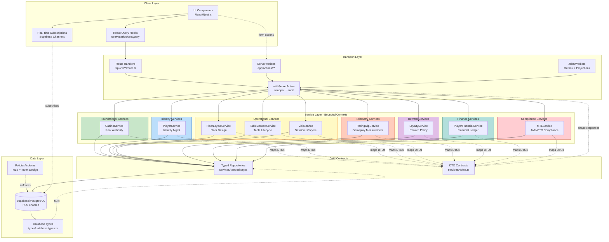
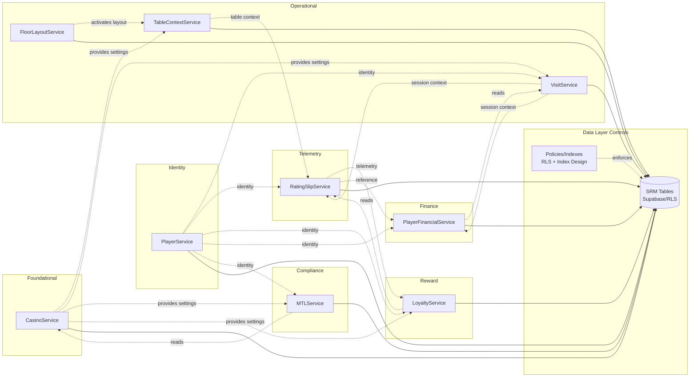
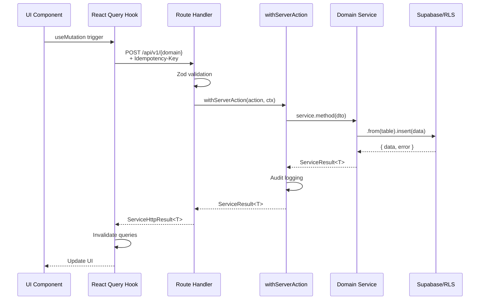
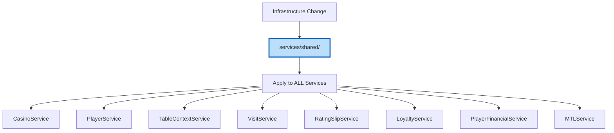
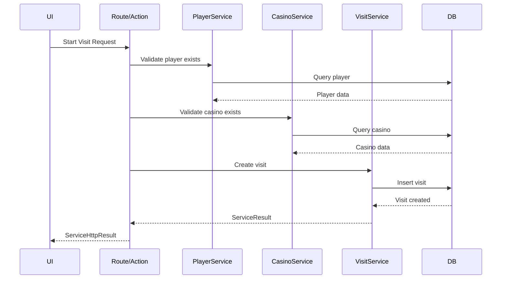
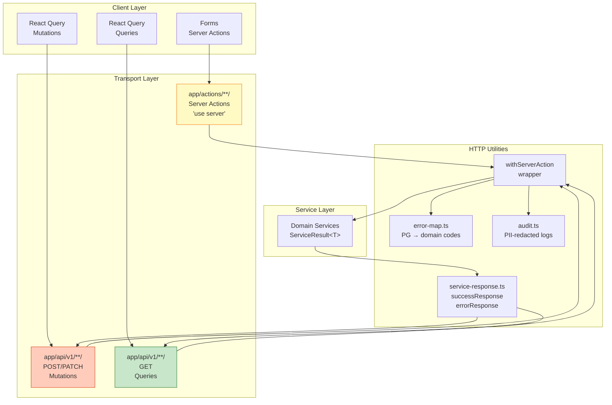
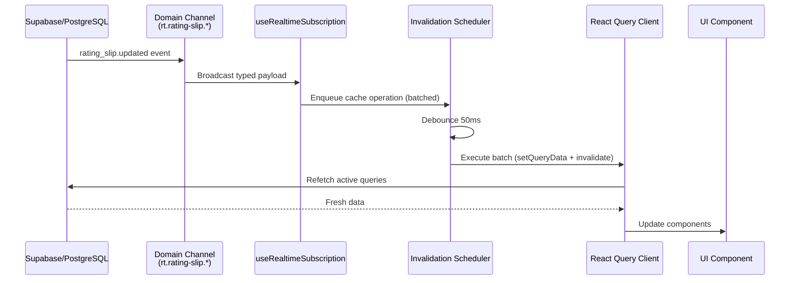

# Service Layer Architecture Diagram

**Version**: 2.1.2
**Date**: 2025-11-19
**Status**: Accepted (Aligned with SRM v3.1.0 + SEC-001)
**Purpose**: Visual reference for PT-2 service layer architecture patterns

> **Alignment Note**: This document cross-references the canonical contracts defined in SDLC taxonomy peers. Do not duplicate content—reference authoritative sources.

**Canonical References** (SDLC Taxonomy Peers):
- **Contract Authority**: `docs/20-architecture/SERVICE_RESPONSIBILITY_MATRIX.md` (SRM v3.1.0, 2025-11-13)
- **Type System**: `docs/25-api-data/DTO_CANONICAL_STANDARD.md` (Mandatory DTO patterns)
- **Security/RLS**: `docs/30-security/SEC-001-rls-policy-matrix.md` (Casino-scoped RLS)
- **Edge Transport**: `docs/20-architecture/EDGE_TRANSPORT_POLICY.md` (withServerAction middleware)
- **State Management**: `docs/80-adrs/ADR-003-state-management-strategy.md` (React Query v5)
- **Real-time**: `docs/80-adrs/ADR-004-real-time-strategy.md` (Domain-scoped channels)
- **Observability**: `docs/50-ops/OBSERVABILITY_SPEC.md` (Correlation/audit patterns)
- **API Contracts**: `docs/25-api-data/API_SURFACE_MVP.md` (ServiceHttpResult envelope)
- **Service ADR**: `docs/80-adrs/ADR-008-service-layer-architecture.md` (Architecture decisions)
- **Service Template**: `docs/70-governance/SERVICE_TEMPLATE.md` (v1.2) (Implementation guide)
- **Event Catalog**: `docs/25-api-data/REAL_TIME_EVENTS_MAP.md` (Event contracts)
- **Temporal Patterns**: `docs/20-architecture/temporal-patterns/TEMP-001-gaming-day-specification.md` (Gaming day authority)

---

## Architecture Overview



> Data contracts: `types/database.types.ts` feed every bounded-context repository, and services export DTOs from `services/*/dtos.ts` before data crosses the transport boundary. RLS policies and indexes are modeled explicitly through the `Policies/Indexes` control in the data layer.

---

## Service Responsibility Matrix (Bounded Contexts)



---

## Data Flow Patterns

### Pattern 1: Vertical Slice (Feature Delivery)



### Pattern 2: Horizontal Layer (Infrastructure)



### Pattern 3: Hybrid Orchestration (Cross-Domain)



---

## Service Structure (Directory Layout)

> **AUTHORITY**: This section (§308-348) is the **SOURCE OF TRUTH** for service directory structure
> **Canonical References**: SRM v3.1.0 §3 (DTO Derivation Patterns), ADR-008 (Service Factory Pattern)

```
services/{domain}/
├── dtos.ts                    # ✅ DTO contracts (3 patterns per SRM v3.1.0:117-199)
│   └── Pattern A (Contract-First): Manual interfaces for complex services
│   └── Pattern B (Canonical): Pick/Omit from Database types for simple CRUD
│   └── Pattern C (Hybrid): Mixed approach (e.g., RatingSlip)
│
├── mappers.ts                 # ✅ CONDITIONAL: Contract-First services ONLY
│   └── Services: Loyalty, Finance, MTL, TableContext
│   └── Internal row → DTO transformations (omit internal fields)
│   └── export function toEntityDTO(row: DbRow): EntityDTO
│   └── Reference: SRM v3.1.0:141-154
│
├── selects.ts                # ✅ Named column sets
│   └── export const X_SELECT_MIN = "id, name, created_at"
│
├── keys.ts                   # ✅ React Query key factories (with .scope)
│   └── export const xKeys = { root: ['x'], list: assign(..., { scope }), ... }
│   └── Reference: ADR-003:87-96
│
├── http.ts                   # ✅ HTTP fetchers (thin wrappers to API routes)
│   └── export async function createX(input: CreateXDTO): Promise<XDTO>
│
├── index.ts                  # ✅ Factory + explicit interface
│   └── export interface XService { ... }
│   └── export function createXService(supabase): XService
│   └── Reference: ADR-008
│
├── crud.ts                   # ✅ CRUD operations
│   └── create, update, getById, delete
│
├── business.ts               # ✅ Business logic (if needed)
│   └── Domain-specific calculations
│
└── queries.ts                # ✅ Complex queries (if needed)
    └── Aggregations, reports
```

**Note**: `mappers.ts` is REQUIRED only for Contract-First services (Loyalty, Finance, MTL, TableContext). Simple CRUD services (Player, Visit, Casino) use Canonical pattern and do NOT need mappers.

---

## Type System Architecture (DTO Canonical Standard)

> **Canonical Reference**: SRM v3.1.0 §3 (Lines 117-199), DTO_CANONICAL_STANDARD.md

### DTO Derivation Patterns (By Service Type)

PT-2 uses **three DTO patterns** based on service complexity. All services MUST use one of these patterns:

**Key Rule**: Manual DTO interfaces are:
- ❌ **BANNED** for Pattern B (Canonical CRUD) services → Use `type` + Pick/Omit
- ✅ **ALLOWED** for Pattern A (Contract-First) services → Requires `mappers.ts`
- ⚠️ **HYBRID** for Pattern C (Mixed) → Use appropriate pattern per DTO

See DTO_CANONICAL_STANDARD.md FAQ for rationale (schema evolution blindness vs. domain contract decoupling).

---

#### Pattern A: Contract-First DTOs (Complex Services)

**Services**: Loyalty, Finance, MTL, TableContext

**When to Use**: Services with complex business logic that need to:
- Decouple domain contracts from schema evolution
- Prevent internal columns from leaking to public APIs
- Enforce explicit control over field exposure

**Pattern**: Manual type definitions + mappers.ts

**Syntax Choice**: `interface` OR `type` (both allowed for Pattern A - see DTO_CANONICAL_STANDARD.md FAQ)

**Example** (SRM v3.1.0:125-154):
```typescript
// services/loyalty/dtos.ts
/**
 * PlayerLoyaltyDTO - Public loyalty balance
 *
 * Exposure: UI, external APIs
 * Excludes: preferences (internal-only)
 * Owner: LoyaltyService (SRM:343-373)
 */
// ✅ Option 1: interface (semantic clarity for public contracts)
export interface PlayerLoyaltyDTO {
  player_id: string;
  casino_id: string;
  balance: number;
  tier: string | null;
  // Omits: preferences (internal field)
}

// ✅ Option 2: type alias (functionally equivalent)
export type PlayerLoyaltyDTO = {
  player_id: string;
  casino_id: string;
  balance: number;
  tier: string | null;
};
```

**Why manual definitions are SAFE for Pattern A** (vs. Pattern B ban):
- Pattern A DTOs are **domain contracts**, not schema mirrors
- Mappers enforce transformation (compile-time checkpoint at mappers.ts:553-560)
- Schema changes handled in `mappers.ts`, DTO contract remains stable
- TypeScript errors if mapper doesn't satisfy DTO contract

// services/loyalty/mappers.ts (INTERNAL USE ONLY)
import type { Database } from '@/types/database.types';

type LoyaltyRow = Database['public']['Tables']['player_loyalty']['Row'];

export function toPlayerLoyaltyDTO(row: LoyaltyRow): PlayerLoyaltyDTO {
  return {
    player_id: row.player_id,
    casino_id: row.casino_id,
    balance: row.balance,
    tier: row.tier,
    // Explicitly omit: preferences
  };
}
```

**Reference**: SRM v3.1.0:119-155

---

#### Pattern B: Canonical DTOs (Simple CRUD Services)

**Services**: Player, Visit, Casino, FloorLayout

**When to Use**: Simple CRUD services with:
- Transparent field exposure (no sensitive internal columns)
- Minimal business logic
- Schema changes should auto-propagate to DTOs

**Pattern**: Pick/Omit from Database types (NO manual interfaces, NO mappers)

**Example** (SRM v3.1.0:170-190):
```typescript
// services/player/dtos.ts
import type { Database } from '@/types/database.types';

/**
 * PlayerDTO - Public player profile
 *
 * Exposure: UI, external APIs
 * Excludes: birth_date (PII), internal_notes (staff-only)
 * Owner: PlayerService (SRM:149)
 */
export type PlayerDTO = Pick<
  Database['public']['Tables']['player']['Row'],
  'id' | 'first_name' | 'last_name' | 'created_at'
>;

export type PlayerCreateDTO = Pick<
  Database['public']['Tables']['player']['Insert'],
  'first_name' | 'last_name' | 'birth_date'
>;
```

**Rationale**:
- Automatic schema sync via `npm run db:types`
- Minimal boilerplate
- ESLint enforces allowlist (prevents PII leakage)

**Reference**: SRM v3.1.0:164-196, DTO_CANONICAL_STANDARD.md:65-127

---

#### Pattern C: Hybrid (Mixed Complexity)

**Services**: RatingSlip

**When to Use**: Services with mixed needs (some fields canonical, some contract-first)

**Reference**: SRM v3.1.0:199+

---

### Type Generation Flow

```mermaid
graph TB
    subgraph "Database Schema"
        MIGRATION[supabase/migrations/<br/>*.sql]
    end

    subgraph "Generated Types"
        DB_TYPES[types/database.types.ts<br/>Database type]
        TABLES[Tables['table']['Row']<br/>Tables['table']['Insert']<br/>Tables['table']['Update']]
        FUNCTIONS[Functions['rpc']['Args']<br/>Functions['rpc']['Returns']]
        ENUMS[Enums['enum_name']]
    end

    subgraph "Service DTOs"
        CREATE_DTO[CreateDTO<br/>Pick&lt;Insert, fields&gt;]
        UPDATE_DTO[UpdateDTO<br/>Partial&lt;Pick&lt;Insert&gt;&gt;]
        RESPONSE_DTO[ResponseDTO<br/>Pick&lt;Row, fields&gt;]
        RPC_DTO[RPC ParamsDTO<br/>Functions['rpc']['Args']]
    end

    MIGRATION -->|npm run db:types| DB_TYPES
    DB_TYPES --> TABLES
    DB_TYPES --> FUNCTIONS
    DB_TYPES --> ENUMS

    TABLES -->|Pick/Omit| CREATE_DTO
    TABLES -->|Partial| UPDATE_DTO
    TABLES -->|Pick| RESPONSE_DTO
    FUNCTIONS --> RPC_DTO

    style DB_TYPES fill:#c8e6c9,stroke:#2e7d32,stroke-width:3px
```

### DTO Anti-Patterns (Pattern-Specific)

#### Pattern B (Canonical CRUD) Services - STRICT ENFORCEMENT

**Services**: Player, Visit, Casino, FloorLayout

**BANNED**:
- ❌ NEVER use `interface` for DTOs
- ❌ NEVER manually define table structures
- ❌ NEVER use `ReturnType` inference for DTOs

**REQUIRED**:
- ✅ ALWAYS use `type` with Pick/Omit from `Database` types
- ✅ Use `Pick`/`Omit`/`Partial` for transformations
- ✅ Regenerate types after EVERY migration (`npm run db:types`)

**Rationale**: Manual definitions create **schema evolution blindness** (silent data loss when schema changes)

---

#### Pattern A (Contract-First) Services - CONTROLLED FLEXIBILITY

**Services**: Loyalty, Finance, MTL, TableContext

**ALLOWED**:
- ✅ Manual `interface` OR `type` definitions for domain contracts
- ✅ Decoupling from database schema evolution
- ✅ Explicit field exposure control

**REQUIRED**:
- ✅ MUST have `mappers.ts` to enforce boundary
- ✅ Mappers MUST use `Database` types as source of truth
- ✅ TypeScript MUST enforce mapper completeness

**Rationale**: Mappers create compile-time checkpoint, preventing silent drift

---

**Reference**: See DTO_CANONICAL_STANDARD.md FAQ for complete rationale and enforcement rules

---

## Bounded Context DTO Access Rules

> **Canonical Reference**: SRM v3.1.0 §2.2 (Lines 75-113)
> **Enforcement**: ESLint rule `no-cross-context-db-imports`

### Core Principle

Services MUST NOT directly access `Database['public']['Tables']['X']` for tables they don't own. Cross-context access is ONLY allowed via published DTOs.

### Allowed Cross-Context DTO Consumption

| Consumer Service | Can Import DTOs From | Use Case | SRM Reference |
|------------------|---------------------|----------|---------------|
| **Loyalty** | RatingSlip (`RatingSlipTelemetryDTO`) | Calculate mid-session rewards | SRM:358-373 |
| **Loyalty** | Visit (`VisitDTO`) | Session context for ledger entries | SRM:358 |
| **Loyalty** | Casino (`CasinoSettingsDTO`) | Policy-driven reward calculations | SRM:358 |
| **Finance** | Visit (`VisitDTO`) | Associate transactions with sessions | SRM:1122 |
| **Finance** | RatingSlip (`RatingSlipDTO`) | Legacy compat FK (`rating_slip_id`) | SRM:1123 |
| **Finance** | Casino (`CasinoSettingsDTO`) | Financial policy enforcement | SRM:1122 |
| **MTL** | RatingSlip (`RatingSlipDTO`) | Optional FK for compliance tracking | SRM:1295 |
| **MTL** | Visit (`VisitDTO`) | Optional FK for compliance tracking | SRM:1297 |
| **MTL** | Casino (`CasinoSettingsDTO`) | Compliance threshold configuration | SRM:1295 |
| **TableContext** | Casino (`CasinoSettingsDTO`) | Gaming day temporal authority | SRM:569 |
| **RatingSlip** | TableContext (`GamingTableDTO`) | Table assignment FK | SRM:1044-1045 |
| **RatingSlip** | Visit (`VisitDTO`) | Session association | SRM:1044 |
| **RatingSlip** | Player (`PlayerDTO`) | Player identity reference | SRM:1044 |
| **Visit** | Casino (`CasinoDTO`) | Gaming day calculation, property scoping | SRM:148 |
| **Visit** | Player (`PlayerDTO`) | Player identity for session | SRM:148 |
| **FloorLayout** | Casino (`CasinoDTO`) | Property scoping for floor plans | SRM:148 |
| **All Services** | Casino (`CasinoDTO`, `StaffDTO`) | `casino_id` FK, staff references, audit actors | SRM:148 |

### Examples

**FORBIDDEN** (Direct table access):
```typescript
// ❌ services/loyalty/telemetry.ts
import type { Database } from '@/types/database.types';
type RatingSlipRow = Database['public']['Tables']['rating_slip']['Row'];
// ESLint error: BOUNDED CONTEXT VIOLATION
// Service "loyalty" cannot directly access table "rating_slip"
```

**CORRECT** (Import published DTO):
```typescript
// ✅ services/loyalty/mid-session-reward.ts
import type { RatingSlipTelemetryDTO } from '@/services/rating-slip/dtos';

function calculateReward(telemetry: RatingSlipTelemetryDTO): number {
  return telemetry.average_bet * telemetry.duration_seconds * 0.01;
}
```

**Reference**: SRM v3.1.0:75-113, DTO_CANONICAL_STANDARD.md:176-243

---

## Transport Layer Architecture

> **Canonical Reference**: EDGE_TRANSPORT_POLICY.md, SRM v3.1.0:28-30



### Entry Point Strategy

**Rule**: First-party = Server Actions, Third-party = Route Handlers (EDGE_TRANSPORT_POLICY.md:16-24)

| Use Case | Entry Point | Notes |
|----------|-------------|-------|
| First-party (staff UI, forms) | **Server Actions** (`app/actions/**`) | Primary - wrapped with `withServerAction()` |
| Third-party (webhooks, integrations) | **Route Handlers** (`app/api/v1/**/route.ts`) | Secondary - reuse same DTOs + services |

### Middleware Chain (`withServerAction`)

> **Canonical Reference**: EDGE_TRANSPORT_POLICY.md:27-45, SRM v3.1.0:130

```
withAuth()
  → withRLS()            # SET LOCAL app.casino_id, validates staff scope
    → withRateLimit()    # Multi-level limits (actor, casino) to protect hot paths
      → withIdempotency()  # Enforces x-idempotency-key for mutations
        → withAudit()      # Records audit_log row w/ correlation_id
          → withTracing()  # Metrics, error mapping, SLO budgets
```

**Responsibilities**:
- **withAuth**: Validates session, staff role, casino membership
- **withRLS**: Executes `SET LOCAL app.casino_id`, ensures tenant isolation
- **withRateLimit**: Enforces multi-level rate limits (per-actor, per-casino, per-endpoint) to protect hot paths from abuse
- **withIdempotency**: Requires `x-idempotency-key` on mutations, scopes by `(casino_id, domain)`
- **withAudit**: Writes `audit_log` rows per SRM contract, sets `application_name = correlation_id`
- **withTracing**: Emits telemetry spans, maps domain errors → HTTP status codes

### Required Headers

> **Canonical Reference**: EDGE_TRANSPORT_POLICY.md:54-63, OBSERVABILITY_SPEC.md:27-31

| Header | Scope | Owner | Reference |
|--------|-------|-------|-----------|
| `x-correlation-id` | All actions & routes | withAudit/withTracing | OBSERVABILITY_SPEC.md:27-31 |
| `x-idempotency-key` | Mutations only | withIdempotency | EDGE_TRANSPORT_POLICY.md:42 |
| `x-pt2-client` (optional) | Diagnostics | withTracing | EDGE_TRANSPORT_POLICY.md:59 |
| `x-slo-budget` (optional) | SLO attribution | withTracing | EDGE_TRANSPORT_POLICY.md:60 |

### Response Envelope Contract

> **Canonical Reference**: API_SURFACE_MVP.md:1-6

```typescript
// ServiceResult<T> (Internal - Service Layer → Route Handler)
interface ServiceResult<T> {
  data: T | null;
  error: ServiceError | null;
  success: boolean;
  timestamp: string;
  requestId: string;
}

// ServiceHttpResult<T> (External - Route Handler → Client)
interface ServiceHttpResult<T> {
  ok: boolean;           // Maps from success
  code: string;          // Domain error code
  status: number;        // HTTP status (added at edge)
  requestId: string;     // Passthrough
  durationMs: number;    // Added by withTracing
  timestamp: string;     // Passthrough
  data?: T;              // Optional
  error?: string;        // Optional
  details?: unknown;     // Optional
}
```

**Transformation Helper**:
```typescript
// lib/http/service-response.ts
export function toServiceHttpResponse<T>(
  result: ServiceResult<T>
): ServiceHttpResult<T> {
  return {
    ok: result.success,
    code: result.error?.code || 'OK',
    status: mapToHttpStatus(result.error?.code),
    requestId: result.requestId,
    durationMs: calculateDuration(result.timestamp),
    timestamp: result.timestamp,
    data: result.data || undefined,
    error: result.error?.message,
    details: result.error?.details,
  };
}
```

**Reference**: API_SURFACE_MVP.md:1-6, EDGE_TRANSPORT_POLICY.md

---

## Real-time Architecture

> **Canonical Reference**: ADR-004-real-time-strategy.md, REAL_TIME_EVENTS_MAP.md

### Domain-Scoped Channels

**Pattern**: `rt.<domain>.<scope>` (e.g., `rt.player.detail`, `rt.table.available`)

**Architecture** (ADR-004:23-26):
- Each bounded context owns dedicated channel namespace
- Channels subscribe to Postgres changes filtered by table + row-level `ids`
- Hooks use scheduler-based batching (default 50ms debounce)



### Hook Pattern

**Reference**: ADR-004:66-71

```typescript
// hooks/rating-slip/use-rating-slip-realtime.ts
import { useRealtimeSubscription } from '@/hooks/shared/use-realtime-channel';
import { ratingSlipKeys } from '@/services/rating-slip/keys';

export function useRatingSlipRealtime(ratingSlipId: string) {
  return useRealtimeSubscription({
    channel: `rt.rating-slip.${ratingSlipId}`,
    event: 'rating_slip.updated',
    queryKey: ratingSlipKeys.detail(ratingSlipId),
    mode: 'batched', // 50ms debounce (default)
  });
}
```

### Event Processing Strategy

> **Reference**: ADR-004:29-34

**Default**: Scheduler-based (batched, 50ms window)
```typescript
// lib/realtime/invalidation-scheduler.ts
scheduler.enqueue({
  operation: 'setQueryData',
  queryKey: ratingSlipKeys.detail(id),
  data: payload,
});
```

**Immediate Mode** (low-frequency events <1/sec):
```typescript
mode: 'immediate' // Bypass scheduler
```

### Event-to-Cache Mapping

> **Reference**: ADR-004:66, REAL_TIME_EVENTS_MAP.md

| Event | Query Keys Affected | Operation | ADR-004 Ref |
|-------|-------------------|-----------|-------------|
| `rating_slip.updated` | `ratingSlipKeys.detail(id)`, `ratingSlipKeys.list.scope` | setQueryData + invalidate | ADR-004:32-34 |
| `loyalty.ledger_appended` | `loyaltyKeys.ledger(playerId)` | invalidate | ADR-004:66 |
| `table.fill_completed` | `tableKeys.detail(tableId)`, `tableKeys.custody` | setQueryData | ADR-004:58 |

### Event Contracts

> **Canonical Reference**: REAL_TIME_EVENTS_MAP.md

```typescript
// rating_slip.updated
interface RatingSlipUpdatedEvent {
  event: 'rating_slip.updated';
  rating_slip_id: string;  // uuid
  player_id: string;       // uuid
  casino_id: string;       // uuid
  average_bet: number;
  minutes_played: number;
  game_type: 'blackjack' | 'poker' | 'roulette' | 'baccarat';
  at: string;              // ISO timestamp
}

// loyalty.ledger_appended
interface LoyaltyLedgerAppendedEvent {
  event: 'loyalty.ledger_appended';
  ledger_id: string;       // uuid
  player_id: string;       // uuid
  points_earned: number;
  reason: 'mid_session' | 'session_end' | 'manual_adjustment';
  rating_slip_id?: string; // uuid | null
  at: string;              // ISO timestamp
}
```

**Reference**: ADR-004:23-71, REAL_TIME_EVENTS_MAP.md

---

## Service Factory Pattern

```typescript
// services/player/index.ts
import type { SupabaseClient } from '@supabase/supabase-js';
import type { Database } from '@/types/database.types';
import type { ServiceResult } from '@/services/shared/types';
import type { CreatePlayerDTO, PlayerDTO } from './dto';
import { createPlayerCrud } from './crud';

// ✅ Explicit interface (REQUIRED)
export interface PlayerService {
  create(data: CreatePlayerDTO): Promise<ServiceResult<PlayerDTO>>;
  update(id: string, data: Partial<CreatePlayerDTO>): Promise<ServiceResult<PlayerDTO>>;
  getById(id: string): Promise<ServiceResult<PlayerDTO>>;
  delete(id: string): Promise<ServiceResult<void>>;
}

// ✅ Functional factory (REQUIRED)
export function createPlayerService(
  supabase: SupabaseClient<Database>  // ✅ Typed, not 'any'
): PlayerService {
  const crud = createPlayerCrud(supabase);

  return {
    ...crud,
    // Add business logic methods here if needed
  };
}

// ❌ ANTI-PATTERNS (BANNED)
// - export class PlayerService { ... }
// - export type PlayerService = ReturnType<typeof createPlayerService>
// - supabase: any
```

---

## Operation Wrapper Pattern

```typescript
// services/shared/operation.ts
export async function executeOperation<T>(
  options: OperationOptions,
  op: () => Promise<T>,
): Promise<ServiceResult<T>> {
  const requestId = `req_${Date.now()}_${Math.random().toString(36).slice(2, 9)}`;
  const timestamp = new Date().toISOString();
  const timeoutMs = options.timeoutMs ?? 10_000;

  const timed = () => Promise.race([
    op(),
    new Promise<never>((_, rej) =>
      setTimeout(() => rej({
        code: 'TIMEOUT',
        message: 'Operation timed out'
      }), timeoutMs)
    ),
  ]);

  const start = performance.now();
  try {
    const data = await timed();
    options.logger?.({
      label: options.label,
      requestId,
      ok: true,
      ms: performance.now() - start
    });
    return {
      data,
      error: null,
      success: true,
      timestamp,
      requestId
    };
  } catch (err: any) {
    const code = err?.code ?? 'OPERATION_FAILED';
    const message = err?.message ?? 'Operation failed';
    options.logger?.({
      label: options.label,
      requestId,
      ok: false,
      ms: performance.now() - start,
      err
    });
    return {
      data: null,
      error: { code, message, details: err },
      success: false,
      timestamp,
      requestId
    };
  }
}
```

---

## Error Mapping Strategy

```typescript
// lib/server-actions/error-map.ts
export function mapDatabaseError(error: unknown): RouteError {
  // PostgreSQL error codes
  if (error?.code === '23505') {
    return {
      code: 'UNIQUE_VIOLATION',
      message: 'A record with this information already exists',
      status: 409,
      details: error,
    };
  }

  if (error?.code === '23503') {
    return {
      code: 'FOREIGN_KEY_VIOLATION',
      message: 'Invalid reference: related record does not exist',
      status: 400,
      details: error,
    };
  }

  // PostgREST error codes
  if (error?.code === 'PGRST116') {
    return {
      code: 'NOT_FOUND',
      message: 'Record not found',
      status: 404,
      details: error,
    };
  }

  // Default
  return {
    code: 'INTERNAL_ERROR',
    message: 'Internal error',
    status: 500,
    details: error,
  };
}
```

### Error Code Catalog

| PostgreSQL | PostgREST | Domain Code | HTTP | Meaning |
|------------|-----------|-------------|------|---------|
| 23505 | - | UNIQUE_VIOLATION | 409 | Duplicate record |
| 23503 | - | FOREIGN_KEY_VIOLATION | 400 | Invalid FK reference |
| 23514 | - | VALIDATION_ERROR | 400 | Check constraint failed |
| 23502 | - | VALIDATION_ERROR | 400 | NOT NULL violation |
| - | PGRST116 | NOT_FOUND | 404 | No rows returned |
| - | - | UNAUTHORIZED | 401 | Auth required |
| - | - | FORBIDDEN | 403 | RLS denied |
| - | - | TIMEOUT | 504 | Operation timeout |
| - | - | INTERNAL_ERROR | 500 | Unknown error |

---

## React Query Integration

> **Reference**: `70-governance/HOOKS_STANDARD.md` - Canonical hooks patterns aligned with React Query v5

### Query Key Factories

```typescript
// services/player/keys.ts
type PlayerListFilters = {
  status?: 'active' | 'inactive';
  q?: string;
  casinoId?: string;
};

// Serialize filters for stable cache keys
const serialize = (filters: PlayerListFilters = {}) =>
  JSON.stringify(
    Object.keys(filters)
      .sort()
      .map((key) => [key, filters[key as keyof PlayerListFilters]])
  );

export const playerKeys = {
  root: ['player'] as const, // ✅ Not a function - used for broad invalidations

  list: Object.assign(
    (filters: PlayerListFilters = {}) =>
      [...playerKeys.root, 'list', serialize(filters)] as const,
    {
      scope: [...playerKeys.root, 'list'] as const, // ✅ For setQueriesData
    }
  ),

  infinite: (filters: PlayerListFilters = {}) =>
    [...playerKeys.root, 'infinite', serialize(filters)] as const,

  detail: (id: string) =>
    [...playerKeys.root, 'detail', id] as const,

  byCasino: (casinoId: string) =>
    [...playerKeys.root, 'by-casino', casinoId] as const,

  create: () => [...playerKeys.root, 'create'] as const,
};
```

**Key Stability Rules**:
- Filters must be **serializable** (no functions, Dates as ISO strings)
- Keys are **normalized/sorted** to ensure cache hits
- Use `.scope` property for `setQueriesData` to match key families

### Hook Pattern (Mutation)

```typescript
// services/player/http.ts
import { fetchJSON } from '@/lib/http/fetch-json';
import type { CreatePlayerDTO, PlayerDTO } from './dto';

export async function createPlayer(input: CreatePlayerDTO): Promise<PlayerDTO> {
  return fetchJSON('/api/v1/players', {
    method: 'POST',
    headers: {
      'content-type': 'application/json',
      'idempotency-key': crypto.randomUUID(),
    },
    body: JSON.stringify(input),
  });
}

// hooks/player/use-create-player.ts
import { useMutation, useQueryClient } from '@tanstack/react-query';
import { playerKeys } from '@/services/player/keys';
import { createPlayer } from '@/services/player/http';
import type { CreatePlayerDTO, PlayerDTO } from '@/services/player/dto';

export function useCreatePlayer() {
  const qc = useQueryClient();

  return useMutation({
    mutationKey: playerKeys.create(), // ✅ Reuse factory for Devtools grouping
    mutationFn: createPlayer, // ✅ Delegate to HTTP layer

    onSuccess: (newPlayer) => {
      // ✅ Surgical cache updates (HOOKS_STANDARD.md pattern)

      // 1. Prime detail cache for instant navigation
      qc.setQueryData(playerKeys.detail(newPlayer.id), newPlayer);

      // 2. Update list caches surgically
      qc.setQueriesData(
        { queryKey: playerKeys.list.scope },
        (old: any) => {
          if (!old?.items) return old;
          return {
            ...old,
            items: [newPlayer, ...old.items],
          };
        }
      );

      // Alternative: minimal invalidation for specific filters
      // qc.invalidateQueries({ queryKey: playerKeys.list({ status: 'active' }) });
    },
  });
}
```

**Shared Fetch Helper** (lib/http/fetch-json.ts):
```typescript
export async function fetchJSON<T = any>(
  input: RequestInfo,
  init?: RequestInit
): Promise<T> {
  const res = await fetch(input, init);
  if (!res.ok) {
    const body = await res.text().catch(() => '');
    // Include status for observability
    throw new Error(`${res.status} ${res.statusText} ${body}`.trim());
  }
  const json = await res.json();
  return json.data ?? json; // Unwrap ServiceHttpResult if present
}
```

### Hook Pattern (Query)

```typescript
// services/player/http.ts
import { fetchJSON } from '@/lib/http/fetch-json';
import type { PlayerDTO, PlayerListFilters } from './dto';

export async function getPlayer(id: string): Promise<PlayerDTO> {
  return fetchJSON(`/api/v1/players/${id}`);
}

export async function getPlayerList(
  filters: PlayerListFilters
): Promise<{ items: PlayerDTO[] }> {
  const params = new URLSearchParams(
    Object.entries(filters).filter(([_, v]) => v != null)
  );
  return fetchJSON(`/api/v1/players?${params}`);
}

// hooks/player/use-player.ts
import { useQuery } from '@tanstack/react-query';
import { playerKeys } from '@/services/player/keys';
import { getPlayer } from '@/services/player/http';
import type { PlayerDTO } from '@/services/player/dto';

export function usePlayer(id: string | undefined) {
  return useQuery({
    queryKey: playerKeys.detail(id!),
    queryFn: () => getPlayer(id!), // ✅ Delegate to HTTP layer
    enabled: Boolean(id), // ✅ Gate execution when ID is undefined
    // select: (data) => data.profile, // ✅ Optional projection for stable shape
  });
}

// hooks/player/use-player-list.ts
import { useQuery } from '@tanstack/react-query';
import { playerKeys } from '@/services/player/keys';
import { getPlayerList } from '@/services/player/http';
import type { PlayerListFilters } from '@/services/player/dto';

export function usePlayerList(filters: PlayerListFilters = {}) {
  return useQuery({
    queryKey: playerKeys.list(filters),
    queryFn: () => getPlayerList(filters),
    select: (data) => data.items, // ✅ Stabilize shape for consumers
    placeholderData: (prev) => prev, // ✅ v5 pattern (replaces keepPreviousData)
  });
}
```

---

## Anti-Pattern Guardrails

### ❌ BANNED Patterns

```typescript
// ❌ ReturnType inference
export type PlayerService = ReturnType<typeof createPlayerService>;

// ❌ Untyped Supabase client
function createPlayerService(supabase: any) { ... }

// ❌ Manual DTO interfaces (Pattern B/Canonical CRUD services ONLY)
// BANNED for: Player, Visit, Casino, FloorLayout (must use Pick/Omit)
export interface PlayerCreateDTO {
  first_name: string;
  last_name: string;
}
// Note: Manual interfaces ARE allowed for Pattern A (Contract-First)
// services: Loyalty, Finance, MTL, TableContext (with mappers.ts)

// ❌ Class-based services
export class PlayerService {
  constructor(private supabase: SupabaseClient) {}
}

// ❌ Global singletons
const playerService = createPlayerService(globalSupabase);
export default playerService;

// ❌ Cross-context imports (bypass service boundary)
import { visitCrud } from '@/services/visit/crud';

// ❌ HTTP status in ServiceResult
interface ServiceResult<T> {
  status: number;  // ❌ HTTP concerns belong in transport layer
}

// ❌ Invalidation in service layer
async function createPlayer(data: PlayerCreateDTO) {
  const result = await service.create(data);
  queryClient.invalidateQueries(...);  // ❌ UI owns this
  return result;
}
```

### ✅ CORRECT Patterns

```typescript
// ✅ Explicit interface
export interface PlayerService {
  create(data: CreatePlayerDTO): Promise<ServiceResult<PlayerDTO>>;
}

// ✅ Typed Supabase client
function createPlayerService(
  supabase: SupabaseClient<Database>
): PlayerService { ... }

// ✅ Derived DTOs
export type PlayerCreateDTO = Pick<
  Database['public']['Tables']['player']['Insert'],
  'first_name' | 'last_name'
>;

// ✅ Functional factory
export function createPlayerService(
  supabase: SupabaseClient<Database>
): PlayerService { ... }

// ✅ Instance per request
const supabase = await createClient();
const service = createPlayerService(supabase);

// ✅ Cross-context via public API
import { createVisitService } from '@/services/visit';

// ✅ Domain-centric ServiceResult
interface ServiceResult<T> {
  data: T | null;
  error: ServiceError | null;
  success: boolean;
  // No HTTP status
}

// ✅ Invalidation in UI/hooks
const mutation = useMutation({
  mutationFn: async (data) => {
    const res = await fetch('/api/v1/players', { ... });
    return res.json();
  },
  onSuccess: () => {
    queryClient.invalidateQueries({ queryKey: playerKeys.root() });
  },
});
```

---

## Bounded Context Integrity (SRM Compliance)

### Context Boundaries (MUST NOT Cross)

```
┌──────────────────────────────────────────────┐
│ CasinoService (Root Authority)              │
│ OWNS: casino, casino_settings, staff        │
│ PROVIDES: gaming_day_start_time, timezone   │
└──────────────────────────────────────────────┘
                    │
                    ▼ (READ-ONLY references)
┌──────────────────────────────────────────────┐
│ PlayerService (Identity)                     │
│ OWNS: player, player_casino                  │
│ REFERENCES: casino_id (FK)                   │
└──────────────────────────────────────────────┘
                    │
                    ▼ (FK references)
┌──────────────────────────────────────────────┐
│ VisitService (Session)                       │
│ OWNS: visit                                  │
│ REFERENCES: player_id, casino_id             │
└──────────────────────────────────────────────┘
                    │
                    ▼ (FK references)
┌──────────────────────────────────────────────┐
│ RatingSlipService (Telemetry)               │
│ OWNS: rating_slip                           │
│ REFERENCES: player_id, visit_id, table_id   │
│ DOES NOT OWN: points (Loyalty's domain)     │
└──────────────────────────────────────────────┘
                    │
                    ▼ (consumes telemetry)
┌──────────────────────────────────────────────┐
│ LoyaltyService (Reward)                     │
│ OWNS: loyalty_ledger, player_loyalty         │
│ REFERENCES: rating_slip_id (telemetry)       │
│ CALCULATES: points_earned (business logic)   │
└──────────────────────────────────────────────┘
```

### Reference Rules

1. **Ownership**: Only one service OWNS (writes to) a table
2. **References**: Services may READ from other contexts via FK
3. **No Cross-Writes**: Never write to another context's tables
4. **Published APIs**: Cross-context access via public service methods only

---

## Observability & Audit

> **Canonical Reference**: OBSERVABILITY_SPEC.md, EDGE_TRANSPORT_POLICY.md:38-45

### Correlation ID Propagation

**Pattern**: `x-correlation-id` → `SET LOCAL application_name` (OBSERVABILITY_SPEC.md:23-65)

```typescript
// Server Action / Route Handler
export async function mutateEntity(input: DTO) {
  const correlationId = headers().get('x-correlation-id') || uuidv4();
  const idempotencyKey = headers().get('x-idempotency-key');

  return withServerAction(correlationId, async (supabase) => {
    // Propagate to database session
    await supabase.rpc('exec_sql', {
      sql: `SET LOCAL application_name = '${correlationId}'`
    });

    // All downstream RPCs/audit inherit correlation context
    return await service.mutate(input, { idempotencyKey });
  });
}
```

**Database Usage**:
```sql
-- RPCs read current_setting('application_name') for audit rows
INSERT INTO audit_log (
  correlation_id,
  actor_id,
  domain,
  action,
  ...
) VALUES (
  current_setting('application_name'),  -- Automatic correlation
  current_setting('app.actor_id')::uuid,
  ...
);
```

### Canonical Audit Shape

> **Reference**: OBSERVABILITY_SPEC.md:76-88, SRM v3.1.0:19

```typescript
interface AuditLogEntry {
  ts: string;                    // timestamptz
  actor_id: string;              // uuid (staff_id)
  casino_id: string;             // uuid (tenant scope)
  domain: string;                // 'loyalty' | 'finance' | 'mtl' | 'table-context' | ...
  action: string;                // 'create' | 'update' | 'issue_reward' | ...
  dto_before: JSONObject | null; // Snapshot before mutation
  dto_after: JSONObject | null;  // Snapshot after mutation
  correlation_id: string;        // From x-correlation-id header
  metadata?: JSONObject;         // Domain-specific context
}
```

**Emission**: Automatic via `withServerAction` wrapper (EDGE_TRANSPORT_POLICY.md:43)

**Per-Domain KPIs**: Each service defines performance budgets and SLO targets

**Reference**: OBSERVABILITY_SPEC.md, EDGE_TRANSPORT_POLICY.md:38-45

---

## Testing Strategy

### Unit Tests (Mandatory)

```typescript
// services/player/__tests__/player.unit.test.ts
import { describe, it, expect } from 'vitest';
import type { SupabaseClient } from '@supabase/supabase-js';
import type { Database } from '@/types/database.types';
import { createPlayerService } from '@/services/player';
import type { PlayerService } from '@/services/player';  // ✅ Explicit interface

function makeClientDouble(): SupabaseClient<Database> {
  return {
    from: (table: string) => ({
      insert: (_: any) => ({
        select: (_: string) => ({
          single: async () => ({
            data: { id: 'p1', first_name: 'A', last_name: 'B' },
            error: null
          })
        }),
      }),
    }),
  } as any;
}

describe('PlayerService (unit)', () => {
  it('creates a player and returns envelope', async () => {
    const service: PlayerService = createPlayerService(makeClientDouble());
    const result = await service.create({
      first_name: 'A',
      last_name: 'B'
    });

    expect(result.success).toBe(true);
    expect(result.data?.id).toBe('p1');
  });
});
```

### Integration Tests (Opt-in)

```typescript
// services/player/__tests__/player.int.test.ts
import { describe, it, expect, beforeAll } from 'vitest';
import { createClient } from '@supabase/supabase-js';
import { createPlayerService } from '@/services/player';

describe('PlayerService (integration)', () => {
  let supabase: SupabaseClient;

  beforeAll(() => {
    supabase = createClient(
      process.env.SUPABASE_URL!,
      process.env.SUPABASE_ANON_KEY!
    );
  });

  it('handles duplicate constraint', async () => {
    const service = createPlayerService(supabase);
    const input = { first_name: 'Test', last_name: 'User' };

    // First insert
    await service.create(input);

    // Duplicate insert
    const result = await service.create(input);

    expect(result.success).toBe(false);
    expect(result.error?.code).toBe('PLAYER_DUPLICATE');
  });
});
```

---

## Database Workflow

### Migration Process

```bash
# 1. Create migration with proper timestamp
TIMESTAMP=$(date +"%Y%m%d%H%M%S")
npx supabase migration new ${TIMESTAMP}_add_player_email

# 2. Write migration SQL
# supabase/migrations/20251025143042_add_player_email.sql
ALTER TABLE player ADD COLUMN email text UNIQUE;

# 3. Apply migration (triggers schema reload)
npx supabase migration up

# 4. Regenerate types (CRITICAL)
npm run db:types

# 5. Update DTOs to use new field
# services/player/dto.ts
export type PlayerCreateDTO = Pick<
  Database['public']['Tables']['player']['Insert'],
  'first_name' | 'last_name' | 'email'  // ✅ Add new field
>;

# 6. Run type check
npm run type-check

# 7. Update tests
npm test
```

**CRITICAL**: NEVER skip `npm run db:types-local` after migrations

---

## Idempotency Strategy

> **Canonical Reference**: EDGE_TRANSPORT_POLICY.md:42, API_SURFACE_MVP.md:26

### Complete 3-Layer Implementation

#### Layer 1: Route-Level Enforcement

**Reference**: EDGE_TRANSPORT_POLICY.md:54-63

```typescript
// app/api/v1/loyalty/ledger/route.ts
export async function POST(request: NextRequest) {
  // Enforce header presence
  const idempotencyKey = request.headers.get('x-idempotency-key');
  if (!idempotencyKey) {
    return errorResponse({
      code: 'IDEMPOTENCY_KEY_REQUIRED',
      status: 400
    });
  }

  const supabase = await createClient();
  const service = createLoyaltyService(supabase);

  // Pass to middleware + service
  const result = await withServerAction(async (context) => {
    return service.appendLedger(input, { idempotencyKey });
  });

  return toServiceHttpResponse(result);
}
```

#### Layer 2: Database Schema

**Pattern**: Partial unique index (only non-null keys)

```sql
-- loyalty_ledger table with idempotency
CREATE TABLE loyalty_ledger (
  id uuid PRIMARY KEY DEFAULT gen_random_uuid(),
  idempotency_key text,  -- Nullable for backward compat
  player_id uuid NOT NULL,
  casino_id uuid NOT NULL,
  points_earned integer NOT NULL,
  -- other columns...
);

-- Partial unique index (WHERE clause critical)
CREATE UNIQUE INDEX ux_loyalty_ledger_idem
  ON loyalty_ledger (idempotency_key)
  WHERE idempotency_key IS NOT NULL;
```

**Services with Idempotency** (EDGE_TRANSPORT_POLICY.md):
- Loyalty (`loyalty_ledger.idempotency_key`)
- Finance (`player_financial_transaction.idempotency_key`)
- MTL (`mtl_entry.idempotency_key`)
- TableContext (custody tables: `table_fill`, `table_credit`, `table_drop`)

#### Layer 3: Service-Level Handling

```typescript
// services/loyalty/crud.ts
async create(data: CreateLedgerDTO, opts?: { idempotencyKey?: string }) {
  return executeOperation({ label: 'loyalty.create' }, async () => {
    // Check for existing record if idempotency key provided
    if (opts?.idempotencyKey) {
      const { data: existing } = await this.supabase
        .from('loyalty_ledger')
        .select('*')
        .eq('idempotency_key', opts.idempotencyKey)
        .single();

      if (existing) {
        // Return existing record (idempotent return)
        return existing;
      }
    }

    // Insert new record with idempotency key
    const { data: row, error } = await this.supabase
      .from('loyalty_ledger')
      .insert({
        ...data,
        idempotency_key: opts?.idempotencyKey
      })
      .select()
      .single();

    if (error) {
      // Handle race condition (duplicate key)
      if (error.code === '23505') {
        // Retry lookup
        const { data: existing } = await this.supabase
          .from('loyalty_ledger')
          .select('*')
          .eq('idempotency_key', opts.idempotencyKey)
          .single();

        if (existing) return existing;
      }
      throw error;
    }

    return row;
  });
}
```

**Reference**: EDGE_TRANSPORT_POLICY.md:42, API_SURFACE_MVP.md:26, existing SLAD:1138-1152

---

## RLS (Row-Level Security) Pattern

> **Canonical Reference**: SEC-001-rls-policy-matrix.md:64-100, SECURITY_TENANCY_UPGRADE.md
> **Schema Foundation**: Migration `20251110224223_staff_authentication_upgrade.sql`

### Canonical Pattern (DEPLOYED Schema)

**Prerequisites** (SEC-001:66-69):
- ✅ `staff.user_id uuid references auth.users(id)` - DEPLOYED
- ✅ `exec_sql(text)` RPC for SET LOCAL injection - DEPLOYED
- ✅ `withServerAction` wrapper - DEPLOYED (see EDGE_TRANSPORT_POLICY.md:27-45)

**Pattern**: `auth.uid()` + `staff.user_id` + `current_setting()`

This pattern ensures:
1. **User is authenticated** via Supabase auth (`auth.uid()`)
2. **User is linked to active staff** via `staff.user_id`
3. **Casino scope injected** via `SET LOCAL app.casino_id`
4. **Actor identity injected** via `SET LOCAL app.actor_id`

---

### RLS Context Interface

> **Implementation**: `lib/supabase/rls-context.ts`
> **Authority**: SEC-001 (lines 229-287) - Complete implementation guide with examples

**Interface Definition**:
```typescript
export interface RLSContext {
  actorId: string;  // staff.id (from current_setting('app.actor_id'))
  casinoId: string; // staff.casino_id (from current_setting('app.casino_id'))
  staffRole: string; // staff.role (for role-gated operations)
}
```

**Core Functions** (`lib/supabase/rls-context.ts`):

| Function | Purpose | Usage |
|----------|---------|-------|
| `getAuthContext(supabase)` | Extract RLS context from authenticated user | Server Actions, Route Handlers |
| `injectRLSContext(supabase, context, correlationId?)` | Inject context via SET LOCAL | `withServerAction` wrapper |
| `assertCasinoScope(context, casinoId)` | Validate casino scoping | Service methods |
| `assertActorScope(context, actorId)` | Validate actor identity | Profile operations |
| `assertRole(context, allowedRoles)` | Validate role permissions | Role-gated operations |

**Flow**:
```typescript
// 1. Extract context (in withServerAction)
const context = await getAuthContext(supabase);
// { actorId: 'staff-uuid', casinoId: 'casino-uuid', staffRole: 'admin' }

// 2. Inject into session
await injectRLSContext(supabase, context, correlationId);
// Sets: app.actor_id, app.casino_id, app.staff_role, application_name

// 3. RLS policies read from current_setting()
// SELECT * FROM visit WHERE casino_id = current_setting('app.casino_id')::uuid
```

**Reference**: See SEC-001 (RLS Policy Matrix) for:
- Complete policy templates
- Anti-patterns to avoid
- Testing strategies
- Migration priority

---

### Casino-Scoped Tables

**Read Policy** (SEC-001:87-100):
```sql
-- Enable RLS
ALTER TABLE player_loyalty ENABLE ROW LEVEL SECURITY;

-- Read policy (canonical pattern)
CREATE POLICY "player_loyalty_read_same_casino"
  ON player_loyalty
  FOR SELECT USING (
    -- Verify authenticated user
    auth.uid() = (
      SELECT user_id
      FROM staff
      WHERE id = current_setting('app.actor_id')::uuid
    )
    -- Verify casino scope
    AND casino_id = current_setting('app.casino_id')::uuid
  );
```

**Write Policy** (Role-based):
```sql
-- Write policy: admins only
CREATE POLICY "player_loyalty_write_admin"
  ON player_loyalty
  FOR INSERT
  WITH CHECK (
    -- User is authenticated staff
    auth.uid() = (
      SELECT user_id
      FROM staff
      WHERE id = current_setting('app.actor_id')::uuid
        AND casino_id = current_setting('app.casino_id')::uuid
        AND role = 'admin'
    )
    -- Matches casino scope
    AND casino_id = current_setting('app.casino_id')::uuid
  );
```

### Application Layer (withServerAction)

> **Reference**: EDGE_TRANSPORT_POLICY.md:33, SEC-001:42-44

```typescript
// withServerAction injects context
await supabase.rpc('exec_sql', {
  sql: `
    SET LOCAL app.actor_id = '${actorId}';
    SET LOCAL app.casino_id = '${casinoId}';
  `
});

// All subsequent queries inherit RLS context
const result = await service.getBalance(playerId);
```

### Key Principles

> **Reference**: SEC-001:38-46

- ❌ **No JWT claims for business logic** - All context via SET LOCAL
- ❌ **No service keys in runtime** - All operations use anon key + user authentication
- ✅ **Casino scoping mandatory** - Every query scoped by `current_setting('app.casino_id')`
- ✅ **Actor tracking** - `current_setting('app.actor_id')` for audit trails

**Reference**: SEC-001:38-100, SECURITY_TENANCY_UPGRADE.md

---

## Quick Reference Checklist

### Starting New Service

> **Reference**: SRM v3.1.0 §3, ADR-008

- [ ] Create `services/{domain}/` directory
- [ ] Define DTOs in `dtos.ts` (plural) using appropriate pattern:
  - **Pattern A (Contract-First)**: Loyalty, Finance, MTL, TableContext
    - Manual `interface` or `type` definitions
    - MUST include `mappers.ts` to enforce boundary
  - **Pattern B (Canonical)**: Player, Visit, Casino, FloorLayout
    - `type` aliases with Pick/Omit from `Database` types ONLY
    - NO manual interfaces allowed
  - **Pattern C (Hybrid)**: RatingSlip - Use appropriate pattern per DTO
- [ ] Add `mappers.ts` if using Contract-First pattern (SRM v3.1.0:141-154)
- [ ] Create query key factories in `keys.ts` (with `.scope` for lists) (ADR-003:87-96)
- [ ] Create HTTP fetchers in `http.ts` (thin wrappers to API routes)
- [ ] Define explicit interface in `index.ts` (NOT ReturnType) (ADR-008)
- [ ] Implement CRUD operations in `crud.ts`
- [ ] Add `selects.ts` for column sets
- [ ] Create Route Handler in `app/api/v1/{domain}/route.ts` with `withServerAction()`
- [ ] Implement React Query hooks in `hooks/{domain}/`
- [ ] Add real-time hooks if needed (ADR-004)
- [ ] Write unit tests
- [ ] Update SRM if new bounded context
- [ ] Verify cross-context DTO consumption matrix compliance (SRM:81-93)

### Adding New Feature

- [ ] Determine scope (vertical/horizontal/hybrid)
- [ ] Write migration if schema changes needed
- [ ] Run `npm run db:types` after migration
- [ ] Update DTOs to use new fields
- [ ] Implement service method
- [ ] Add/update Route Handler
- [ ] Create/update React Query hook
- [ ] Write tests
- [ ] Verify RLS policies

### Before Commit

- [ ] `npm run type-check` passes
- [ ] `npm test` passes
- [ ] ESLint no manual DTO interfaces (Pattern B services only)
- [ ] No `ReturnType<>` in public APIs
- [ ] No `any` types
- [ ] Hooks use `mutationKey` from key factories
- [ ] Hooks use surgical cache updates (not broad invalidation)
- [ ] HTTP fetchers in `services/{domain}/http.ts` (not inline in hooks)
- [ ] RLS scoping verified
- [ ] Idempotency handled for writes
- [ ] Audit logging in place

---

---

## Document History

**Version**: 2.1.2
**Date**: 2025-11-19
**Status**: Accepted (Aligned with SRM v3.1.0 + DTO_CANONICAL_STANDARD.md + SEC-001)
**Maintained By**: Architecture Team

### Change Log

**v2.1.2 (2025-11-19)** - RLS Context Interface Documentation:
- ✅ Added RLSContext interface definition to RLS section (§1685-1728)
- ✅ Documented core RLS functions from `lib/supabase/rls-context.ts`
- ✅ Added usage flow example for `getAuthContext` → `injectRLSContext`
- ✅ Cross-referenced SEC-001 (RLS Policy Matrix) for complete implementation guide
- ✅ Resolves SERVICE_LAYER_DOCUMENTATION_REGRESSION_MATRIX FINDING #6

**v2.1.1 (2025-11-18)** - SDLC Taxonomy Alignment Audit Fixes:
- ✅ Removed erroneous SERVICE_TEMPLATE.md deprecation notice (ADR-008 contradiction)
- ✅ Added missing `withRateLimit()` to middleware chain (per EDGE_TRANSPORT_POLICY.md:34, SRM:130)
- ✅ Updated `withServerAction` status from "In Progress" to "DEPLOYED"
- ✅ Completed cross-context DTO consumption matrix (added 8 missing relationships per SRM:148)
- ✅ Added canonical references: SERVICE_TEMPLATE.md, INT-002, TEMP-001
- ✅ Updated version metadata to v2.1.1 (header alignment)

**v2.1.0 (2025-11-18)** - DTO Pattern Contradiction Resolution:
- ✅ Reconciled manual interface ban (Pattern B only, Pattern A allowed)
- ✅ Added pattern-specific rationale (schema evolution blindness vs. domain decoupling)
- ✅ Clarified Pattern A syntax choice (interface OR type, both allowed)
- ✅ Updated anti-pattern section with pattern-specific enforcement rules
- ✅ Enhanced checklists with Pattern A/B/C distinctions
- ✅ Added cross-reference to DTO_CANONICAL_STANDARD.md FAQ for complete rationale
- ✅ Aligned with DTO_CANONICAL_STANDARD.md v2.1.0 (concurrent update)

**v2.0.0 (2025-11-14)** - SDLC Taxonomy Peer Alignment:
- ✅ Updated metadata with all canonical references (SRM, SEC-001, ADRs, etc.)
- ✅ Added DTO Contract-First pattern (SRM v3.1.0:119-155) for complex services
- ✅ Added DTO Hybrid pattern (SRM v3.1.0:199+) for RatingSlip
- ✅ Added `mappers.ts` to directory structure (conditional for Contract-First services)
- ✅ Added cross-context DTO consumption matrix (SRM v3.1.0:81-93)
- ✅ Enhanced Transport Layer with Edge Transport Policy details
- ✅ Added required headers table (x-correlation-id, x-idempotency-key)
- ✅ Completed ServiceHttpResult envelope transformation pattern
- ✅ Added Observability & Audit section (OBSERVABILITY_SPEC.md)
- ✅ Updated Real-time Architecture with ADR-004 patterns (domain-scoped channels, scheduler)
- ✅ Replaced RLS section with SEC-001 canonical pattern (auth.uid + staff.user_id + SET LOCAL)
- ✅ Completed Idempotency Strategy with 3-layer implementation
- ✅ Updated checklists with references to canonical docs
- ✅ Deprecated SERVICE_TEMPLATE.md (outdated, superseded by SRM v3.1.0)

**v1.0 (2025-10-25)** - Initial CANONICAL version

### Alignment Status

| SDLC Peer | Status | Gaps Addressed |
|-----------|--------|----------------|
| SRM v3.1.0 | ✅ ALIGNED | Added 3 DTO patterns, cross-context matrix, mappers.ts |
| DTO_CANONICAL_STANDARD.md | ✅ ALIGNED | Referenced Pattern A/B/C with SRM line numbers |
| SEC-001 | ✅ ALIGNED | Added canonical RLS pattern (auth.uid + SET LOCAL) |
| EDGE_TRANSPORT_POLICY.md | ✅ ALIGNED | Added middleware chain, headers, withServerAction |
| ADR-003 (State Mgmt) | ✅ ALIGNED | Referenced query key factories, React Query v5 |
| ADR-004 (Real-time) | ✅ ALIGNED | Added domain-scoped channels, scheduler patterns |
| OBSERVABILITY_SPEC.md | ✅ ALIGNED | Added correlation/audit section |
| API_SURFACE_MVP.md | ✅ ALIGNED | Added ServiceHttpResult transformation |
| ADR-008 | ✅ ALIGNED | Referenced service architecture decisions |

**Next Review**: When SRM or security contracts evolve
