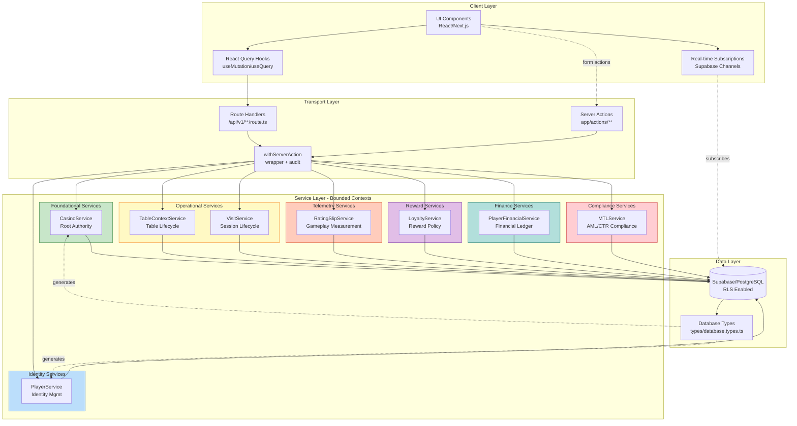
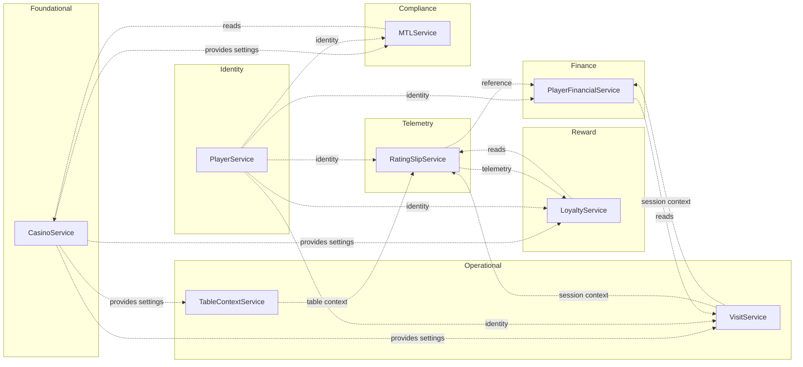
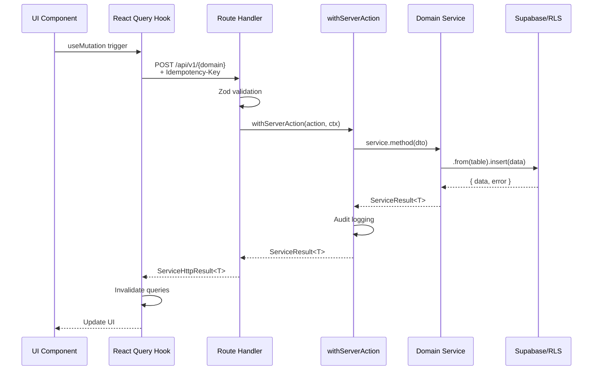
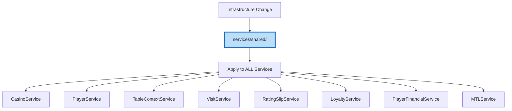
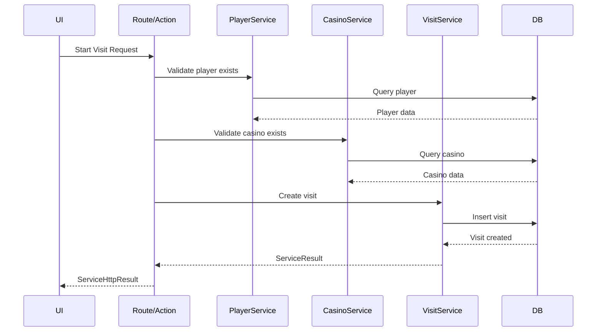
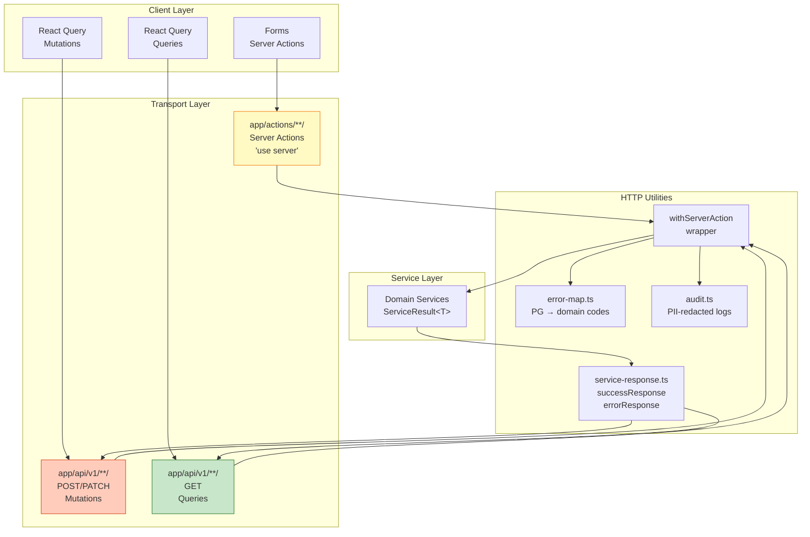
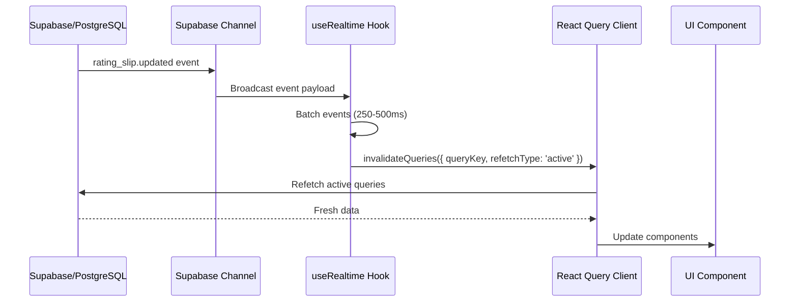

# Service Layer Architecture Diagram

**Version**: 1.0
**Date**: 2025-10-25
**Status**: CANONICAL
**Purpose**: Visual reference for PT-2 service layer architecture patterns

**References**:
- `docs/patterns/SERVICE_RESPONSIBILITY_MATRIX.md` (SRM v3.0.2)
- `70-governance/SERVICE_TEMPLATE.md` (v1.2)
- `20-architecture/BALANCED_ARCHITECTURE_QUICK.md`
- `25-api-data/DTO_CANONICAL_STANDARD.md`
- `70-governance/SERVER_ACTIONS_ARCHITECTURE.md`

---

## Architecture Overview



---

## Service Responsibility Matrix (Bounded Contexts)



---

## Data Flow Patterns

### Pattern 1: Vertical Slice (Feature Delivery)



### Pattern 2: Horizontal Layer (Infrastructure)



### Pattern 3: Hybrid Orchestration (Cross-Domain)



---

## Service Structure (Directory Layout)

```
services/{domain}/
├── dto.ts                    # ✅ Zod schemas + inferred types
│   └── export const CreateXSchema = z.object({...})
│   └── export type CreateXDTO = Pick<Tables['x']['Insert'], ...>
│
├── selects.ts                # ✅ Named column sets
│   └── export const X_SELECT_MIN = "id, name, created_at"
│
├── keys.ts                   # ✅ React Query key factories (with .scope)
│   └── export const xKeys = { root: ['x'], list: assign(..., { scope }), ... }
│
├── http.ts                   # ✅ HTTP fetchers (thin wrappers to API routes)
│   └── export async function createX(input: CreateXDTO): Promise<XDTO>
│
├── index.ts                  # ✅ Factory + explicit interface
│   └── export interface XService { ... }
│   └── export function createXService(supabase): XService
│
├── crud.ts                   # ✅ CRUD operations
│   └── create, update, getById, delete
│
├── business.ts               # ✅ Business logic (if needed)
│   └── Domain-specific calculations
│
└── queries.ts                # ✅ Complex queries (if needed)
    └── Aggregations, reports
```

---

## Type System Architecture (DTO Canonical Standard)

```mermaid
graph TB
    subgraph "Database Schema"
        MIGRATION[supabase/migrations/<br/>*.sql]
    end

    subgraph "Generated Types"
        DB_TYPES[types/database.types.ts<br/>Database type]
        TABLES[Tables['table']['Row']<br/>Tables['table']['Insert']<br/>Tables['table']['Update']]
        FUNCTIONS[Functions['rpc']['Args']<br/>Functions['rpc']['Returns']]
        ENUMS[Enums['enum_name']]
    end

    subgraph "Service DTOs"
        CREATE_DTO[CreateDTO<br/>Pick&lt;Insert, fields&gt;]
        UPDATE_DTO[UpdateDTO<br/>Partial&lt;Pick&lt;Insert&gt;&gt;]
        RESPONSE_DTO[ResponseDTO<br/>Pick&lt;Row, fields&gt;]
        RPC_DTO[RPC ParamsDTO<br/>Functions['rpc']['Args']]
    end

    MIGRATION -->|npm run db:types| DB_TYPES
    DB_TYPES --> TABLES
    DB_TYPES --> FUNCTIONS
    DB_TYPES --> ENUMS

    TABLES -->|Pick/Omit| CREATE_DTO
    TABLES -->|Partial| UPDATE_DTO
    TABLES -->|Pick| RESPONSE_DTO
    FUNCTIONS --> RPC_DTO

    style DB_TYPES fill:#c8e6c9,stroke:#2e7d32,stroke-width:3px
```

### Type Derivation Examples

```typescript
// ✅ CREATE DTO (from Insert)
export type PlayerCreateDTO = Pick<
  Database['public']['Tables']['player']['Insert'],
  'first_name' | 'last_name' | 'birth_date'
>;

// ✅ UPDATE DTO (Partial of Insert, omit immutable)
export type PlayerUpdateDTO = Partial<
  Omit<
    Database['public']['Tables']['player']['Insert'],
    'id' | 'created_at'
  >
>;

// ✅ RESPONSE DTO (from Row)
export type PlayerDTO = Pick<
  Database['public']['Tables']['player']['Row'],
  'id' | 'first_name' | 'last_name' | 'created_at'
>;

// ✅ RPC PARAMS (from Functions)
export type CreateFinancialTxnParams =
  Database['public']['Functions']['rpc_create_financial_txn']['Args'];
```

**Rules**:
- ❌ NEVER use `interface` for DTOs
- ❌ NEVER manually define table structures
- ✅ ALWAYS derive from `Database` types
- ✅ Use `Pick`/`Omit`/`Partial` for transformations

---

## Transport Layer Architecture



### Response Envelope Contract

```typescript
// ServiceResult<T> (Internal - Service Layer)
interface ServiceResult<T> {
  data: T | null;
  error: ServiceError | null;
  success: boolean;
  timestamp: string;
  requestId: string;
}

// ServiceHttpResult<T> (External - HTTP Response)
interface ServiceHttpResult<T> {
  ok: boolean;
  code: string;
  status: number;
  requestId: string;
  durationMs: number;
  timestamp: string;
  data?: T;
  error?: string;
  details?: unknown;
}
```

---

## Real-time Architecture



### Event Contracts

```typescript
// rating_slip.updated
interface RatingSlipUpdatedEvent {
  event: 'rating_slip.updated';
  rating_slip_id: string;  // uuid
  player_id: string;       // uuid
  casino_id: string;       // uuid
  average_bet: number;
  minutes_played: number;
  game_type: 'blackjack' | 'poker' | 'roulette' | 'baccarat';
  at: string;              // ISO timestamp
}

// loyalty.ledger_appended
interface LoyaltyLedgerAppendedEvent {
  event: 'loyalty.ledger_appended';
  ledger_id: string;       // uuid
  player_id: string;       // uuid
  points_earned: number;
  reason: 'mid_session' | 'session_end' | 'manual_adjustment';
  rating_slip_id?: string; // uuid | null
  at: string;              // ISO timestamp
}
```

---

## Service Factory Pattern

```typescript
// services/player/index.ts
import type { SupabaseClient } from '@supabase/supabase-js';
import type { Database } from '@/types/database.types';
import type { ServiceResult } from '@/services/shared/types';
import type { CreatePlayerDTO, PlayerDTO } from './dto';
import { createPlayerCrud } from './crud';

// ✅ Explicit interface (REQUIRED)
export interface PlayerService {
  create(data: CreatePlayerDTO): Promise<ServiceResult<PlayerDTO>>;
  update(id: string, data: Partial<CreatePlayerDTO>): Promise<ServiceResult<PlayerDTO>>;
  getById(id: string): Promise<ServiceResult<PlayerDTO>>;
  delete(id: string): Promise<ServiceResult<void>>;
}

// ✅ Functional factory (REQUIRED)
export function createPlayerService(
  supabase: SupabaseClient<Database>  // ✅ Typed, not 'any'
): PlayerService {
  const crud = createPlayerCrud(supabase);

  return {
    ...crud,
    // Add business logic methods here if needed
  };
}

// ❌ ANTI-PATTERNS (BANNED)
// - export class PlayerService { ... }
// - export type PlayerService = ReturnType<typeof createPlayerService>
// - supabase: any
```

---

## Operation Wrapper Pattern

```typescript
// services/shared/operation.ts
export async function executeOperation<T>(
  options: OperationOptions,
  op: () => Promise<T>,
): Promise<ServiceResult<T>> {
  const requestId = `req_${Date.now()}_${Math.random().toString(36).slice(2, 9)}`;
  const timestamp = new Date().toISOString();
  const timeoutMs = options.timeoutMs ?? 10_000;

  const timed = () => Promise.race([
    op(),
    new Promise<never>((_, rej) =>
      setTimeout(() => rej({
        code: 'TIMEOUT',
        message: 'Operation timed out'
      }), timeoutMs)
    ),
  ]);

  const start = performance.now();
  try {
    const data = await timed();
    options.logger?.({
      label: options.label,
      requestId,
      ok: true,
      ms: performance.now() - start
    });
    return {
      data,
      error: null,
      success: true,
      timestamp,
      requestId
    };
  } catch (err: any) {
    const code = err?.code ?? 'OPERATION_FAILED';
    const message = err?.message ?? 'Operation failed';
    options.logger?.({
      label: options.label,
      requestId,
      ok: false,
      ms: performance.now() - start,
      err
    });
    return {
      data: null,
      error: { code, message, details: err },
      success: false,
      timestamp,
      requestId
    };
  }
}
```

---

## Error Mapping Strategy

```typescript
// lib/server-actions/error-map.ts
export function mapDatabaseError(error: unknown): RouteError {
  // PostgreSQL error codes
  if (error?.code === '23505') {
    return {
      code: 'UNIQUE_VIOLATION',
      message: 'A record with this information already exists',
      status: 409,
      details: error,
    };
  }

  if (error?.code === '23503') {
    return {
      code: 'FOREIGN_KEY_VIOLATION',
      message: 'Invalid reference: related record does not exist',
      status: 400,
      details: error,
    };
  }

  // PostgREST error codes
  if (error?.code === 'PGRST116') {
    return {
      code: 'NOT_FOUND',
      message: 'Record not found',
      status: 404,
      details: error,
    };
  }

  // Default
  return {
    code: 'INTERNAL_ERROR',
    message: 'Internal error',
    status: 500,
    details: error,
  };
}
```

### Error Code Catalog

| PostgreSQL | PostgREST | Domain Code | HTTP | Meaning |
|------------|-----------|-------------|------|---------|
| 23505 | - | UNIQUE_VIOLATION | 409 | Duplicate record |
| 23503 | - | FOREIGN_KEY_VIOLATION | 400 | Invalid FK reference |
| 23514 | - | VALIDATION_ERROR | 400 | Check constraint failed |
| 23502 | - | VALIDATION_ERROR | 400 | NOT NULL violation |
| - | PGRST116 | NOT_FOUND | 404 | No rows returned |
| - | - | UNAUTHORIZED | 401 | Auth required |
| - | - | FORBIDDEN | 403 | RLS denied |
| - | - | TIMEOUT | 504 | Operation timeout |
| - | - | INTERNAL_ERROR | 500 | Unknown error |

---

## React Query Integration

> **Reference**: `70-governance/HOOKS_STANDARD.md` - Canonical hooks patterns aligned with React Query v5

### Query Key Factories

```typescript
// services/player/keys.ts
type PlayerListFilters = {
  status?: 'active' | 'inactive';
  q?: string;
  casinoId?: string;
};

// Serialize filters for stable cache keys
const serialize = (filters: PlayerListFilters = {}) =>
  JSON.stringify(
    Object.keys(filters)
      .sort()
      .map((key) => [key, filters[key as keyof PlayerListFilters]])
  );

export const playerKeys = {
  root: ['player'] as const, // ✅ Not a function - used for broad invalidations

  list: Object.assign(
    (filters: PlayerListFilters = {}) =>
      [...playerKeys.root, 'list', serialize(filters)] as const,
    {
      scope: [...playerKeys.root, 'list'] as const, // ✅ For setQueriesData
    }
  ),

  infinite: (filters: PlayerListFilters = {}) =>
    [...playerKeys.root, 'infinite', serialize(filters)] as const,

  detail: (id: string) =>
    [...playerKeys.root, 'detail', id] as const,

  byCasino: (casinoId: string) =>
    [...playerKeys.root, 'by-casino', casinoId] as const,

  create: () => [...playerKeys.root, 'create'] as const,
};
```

**Key Stability Rules**:
- Filters must be **serializable** (no functions, Dates as ISO strings)
- Keys are **normalized/sorted** to ensure cache hits
- Use `.scope` property for `setQueriesData` to match key families

### Hook Pattern (Mutation)

```typescript
// services/player/http.ts
import { fetchJSON } from '@/lib/http/fetch-json';
import type { CreatePlayerDTO, PlayerDTO } from './dto';

export async function createPlayer(input: CreatePlayerDTO): Promise<PlayerDTO> {
  return fetchJSON('/api/v1/players', {
    method: 'POST',
    headers: {
      'content-type': 'application/json',
      'idempotency-key': crypto.randomUUID(),
    },
    body: JSON.stringify(input),
  });
}

// hooks/player/use-create-player.ts
import { useMutation, useQueryClient } from '@tanstack/react-query';
import { playerKeys } from '@/services/player/keys';
import { createPlayer } from '@/services/player/http';
import type { CreatePlayerDTO, PlayerDTO } from '@/services/player/dto';

export function useCreatePlayer() {
  const qc = useQueryClient();

  return useMutation({
    mutationKey: playerKeys.create(), // ✅ Reuse factory for Devtools grouping
    mutationFn: createPlayer, // ✅ Delegate to HTTP layer

    onSuccess: (newPlayer) => {
      // ✅ Surgical cache updates (HOOKS_STANDARD.md pattern)

      // 1. Prime detail cache for instant navigation
      qc.setQueryData(playerKeys.detail(newPlayer.id), newPlayer);

      // 2. Update list caches surgically
      qc.setQueriesData(
        { queryKey: playerKeys.list.scope },
        (old: any) => {
          if (!old?.items) return old;
          return {
            ...old,
            items: [newPlayer, ...old.items],
          };
        }
      );

      // Alternative: minimal invalidation for specific filters
      // qc.invalidateQueries({ queryKey: playerKeys.list({ status: 'active' }) });
    },
  });
}
```

**Shared Fetch Helper** (lib/http/fetch-json.ts):
```typescript
export async function fetchJSON<T = any>(
  input: RequestInfo,
  init?: RequestInit
): Promise<T> {
  const res = await fetch(input, init);
  if (!res.ok) {
    const body = await res.text().catch(() => '');
    // Include status for observability
    throw new Error(`${res.status} ${res.statusText} ${body}`.trim());
  }
  const json = await res.json();
  return json.data ?? json; // Unwrap ServiceHttpResult if present
}
```

### Hook Pattern (Query)

```typescript
// services/player/http.ts
import { fetchJSON } from '@/lib/http/fetch-json';
import type { PlayerDTO, PlayerListFilters } from './dto';

export async function getPlayer(id: string): Promise<PlayerDTO> {
  return fetchJSON(`/api/v1/players/${id}`);
}

export async function getPlayerList(
  filters: PlayerListFilters
): Promise<{ items: PlayerDTO[] }> {
  const params = new URLSearchParams(
    Object.entries(filters).filter(([_, v]) => v != null)
  );
  return fetchJSON(`/api/v1/players?${params}`);
}

// hooks/player/use-player.ts
import { useQuery } from '@tanstack/react-query';
import { playerKeys } from '@/services/player/keys';
import { getPlayer } from '@/services/player/http';
import type { PlayerDTO } from '@/services/player/dto';

export function usePlayer(id: string | undefined) {
  return useQuery({
    queryKey: playerKeys.detail(id!),
    queryFn: () => getPlayer(id!), // ✅ Delegate to HTTP layer
    enabled: Boolean(id), // ✅ Gate execution when ID is undefined
    // select: (data) => data.profile, // ✅ Optional projection for stable shape
  });
}

// hooks/player/use-player-list.ts
import { useQuery } from '@tanstack/react-query';
import { playerKeys } from '@/services/player/keys';
import { getPlayerList } from '@/services/player/http';
import type { PlayerListFilters } from '@/services/player/dto';

export function usePlayerList(filters: PlayerListFilters = {}) {
  return useQuery({
    queryKey: playerKeys.list(filters),
    queryFn: () => getPlayerList(filters),
    select: (data) => data.items, // ✅ Stabilize shape for consumers
    placeholderData: (prev) => prev, // ✅ v5 pattern (replaces keepPreviousData)
  });
}
```

---

## Anti-Pattern Guardrails

### ❌ BANNED Patterns

```typescript
// ❌ ReturnType inference
export type PlayerService = ReturnType<typeof createPlayerService>;

// ❌ Untyped Supabase client
function createPlayerService(supabase: any) { ... }

// ❌ Manual DTO interfaces
export interface PlayerCreateDTO {
  first_name: string;
  last_name: string;
}

// ❌ Class-based services
export class PlayerService {
  constructor(private supabase: SupabaseClient) {}
}

// ❌ Global singletons
const playerService = createPlayerService(globalSupabase);
export default playerService;

// ❌ Cross-context imports (bypass service boundary)
import { visitCrud } from '@/services/visit/crud';

// ❌ HTTP status in ServiceResult
interface ServiceResult<T> {
  status: number;  // ❌ HTTP concerns belong in transport layer
}

// ❌ Invalidation in service layer
async function createPlayer(data: PlayerCreateDTO) {
  const result = await service.create(data);
  queryClient.invalidateQueries(...);  // ❌ UI owns this
  return result;
}
```

### ✅ CORRECT Patterns

```typescript
// ✅ Explicit interface
export interface PlayerService {
  create(data: CreatePlayerDTO): Promise<ServiceResult<PlayerDTO>>;
}

// ✅ Typed Supabase client
function createPlayerService(
  supabase: SupabaseClient<Database>
): PlayerService { ... }

// ✅ Derived DTOs
export type PlayerCreateDTO = Pick<
  Database['public']['Tables']['player']['Insert'],
  'first_name' | 'last_name'
>;

// ✅ Functional factory
export function createPlayerService(
  supabase: SupabaseClient<Database>
): PlayerService { ... }

// ✅ Instance per request
const supabase = await createClient();
const service = createPlayerService(supabase);

// ✅ Cross-context via public API
import { createVisitService } from '@/services/visit';

// ✅ Domain-centric ServiceResult
interface ServiceResult<T> {
  data: T | null;
  error: ServiceError | null;
  success: boolean;
  // No HTTP status
}

// ✅ Invalidation in UI/hooks
const mutation = useMutation({
  mutationFn: async (data) => {
    const res = await fetch('/api/v1/players', { ... });
    return res.json();
  },
  onSuccess: () => {
    queryClient.invalidateQueries({ queryKey: playerKeys.root() });
  },
});
```

---

## Bounded Context Integrity (SRM Compliance)

### Context Boundaries (MUST NOT Cross)

```
┌──────────────────────────────────────────────┐
│ CasinoService (Root Authority)              │
│ OWNS: casino, casino_settings, staff        │
│ PROVIDES: gaming_day_start_time, timezone   │
└──────────────────────────────────────────────┘
                    │
                    ▼ (READ-ONLY references)
┌──────────────────────────────────────────────┐
│ PlayerService (Identity)                     │
│ OWNS: player, player_casino                  │
│ REFERENCES: casino_id (FK)                   │
└──────────────────────────────────────────────┘
                    │
                    ▼ (FK references)
┌──────────────────────────────────────────────┐
│ VisitService (Session)                       │
│ OWNS: visit                                  │
│ REFERENCES: player_id, casino_id             │
└──────────────────────────────────────────────┘
                    │
                    ▼ (FK references)
┌──────────────────────────────────────────────┐
│ RatingSlipService (Telemetry)               │
│ OWNS: rating_slip                           │
│ REFERENCES: player_id, visit_id, table_id   │
│ DOES NOT OWN: points (Loyalty's domain)     │
└──────────────────────────────────────────────┘
                    │
                    ▼ (consumes telemetry)
┌──────────────────────────────────────────────┐
│ LoyaltyService (Reward)                     │
│ OWNS: loyalty_ledger, player_loyalty         │
│ REFERENCES: rating_slip_id (telemetry)       │
│ CALCULATES: points_earned (business logic)   │
└──────────────────────────────────────────────┘
```

### Reference Rules

1. **Ownership**: Only one service OWNS (writes to) a table
2. **References**: Services may READ from other contexts via FK
3. **No Cross-Writes**: Never write to another context's tables
4. **Published APIs**: Cross-context access via public service methods only

---

## Testing Strategy

### Unit Tests (Mandatory)

```typescript
// services/player/__tests__/player.unit.test.ts
import { describe, it, expect } from 'vitest';
import type { SupabaseClient } from '@supabase/supabase-js';
import type { Database } from '@/types/database.types';
import { createPlayerService } from '@/services/player';
import type { PlayerService } from '@/services/player';  // ✅ Explicit interface

function makeClientDouble(): SupabaseClient<Database> {
  return {
    from: (table: string) => ({
      insert: (_: any) => ({
        select: (_: string) => ({
          single: async () => ({
            data: { id: 'p1', first_name: 'A', last_name: 'B' },
            error: null
          })
        }),
      }),
    }),
  } as any;
}

describe('PlayerService (unit)', () => {
  it('creates a player and returns envelope', async () => {
    const service: PlayerService = createPlayerService(makeClientDouble());
    const result = await service.create({
      first_name: 'A',
      last_name: 'B'
    });

    expect(result.success).toBe(true);
    expect(result.data?.id).toBe('p1');
  });
});
```

### Integration Tests (Opt-in)

```typescript
// services/player/__tests__/player.int.test.ts
import { describe, it, expect, beforeAll } from 'vitest';
import { createClient } from '@supabase/supabase-js';
import { createPlayerService } from '@/services/player';

describe('PlayerService (integration)', () => {
  let supabase: SupabaseClient;

  beforeAll(() => {
    supabase = createClient(
      process.env.SUPABASE_URL!,
      process.env.SUPABASE_ANON_KEY!
    );
  });

  it('handles duplicate constraint', async () => {
    const service = createPlayerService(supabase);
    const input = { first_name: 'Test', last_name: 'User' };

    // First insert
    await service.create(input);

    // Duplicate insert
    const result = await service.create(input);

    expect(result.success).toBe(false);
    expect(result.error?.code).toBe('PLAYER_DUPLICATE');
  });
});
```

---

## Database Workflow

### Migration Process

```bash
# 1. Create migration with proper timestamp
TIMESTAMP=$(date +"%Y%m%d%H%M%S")
npx supabase migration new ${TIMESTAMP}_add_player_email

# 2. Write migration SQL
# supabase/migrations/20251025143042_add_player_email.sql
ALTER TABLE player ADD COLUMN email text UNIQUE;

# 3. Apply migration (triggers schema reload)
npx supabase migration up

# 4. Regenerate types (CRITICAL)
npm run db:types

# 5. Update DTOs to use new field
# services/player/dto.ts
export type PlayerCreateDTO = Pick<
  Database['public']['Tables']['player']['Insert'],
  'first_name' | 'last_name' | 'email'  // ✅ Add new field
>;

# 6. Run type check
npm run type-check

# 7. Update tests
npm test
```

**CRITICAL**: NEVER skip `npm run db:types` after migrations

---

## Idempotency Strategy

### Idempotency Key Enforcement

```typescript
// app/api/v1/loyalty/ledger/route.ts
export async function POST(request: NextRequest) {
  const ctx = createRequestContext(request);

  // ✅ Require Idempotency-Key header
  const idempotencyKey = requireIdempotencyKey(request);

  const supabase = await createClient();
  const service = createLoyaltyService(supabase);

  const result = await withServerAction(
    async () => service.appendLedger(input, { idempotencyKey }),
    { supabase, action: 'loyalty.append', idempotencyKey }
  );

  return successResponse(ctx, result.data, result.code);
}
```

### Database-Level Idempotency

```sql
-- loyalty_ledger table with idempotency
CREATE TABLE loyalty_ledger (
  id uuid PRIMARY KEY DEFAULT gen_random_uuid(),
  idempotency_key text,
  -- other columns...
);

-- Partial unique index (only non-null keys)
CREATE UNIQUE INDEX ux_loyalty_ledger_idem
  ON loyalty_ledger (idempotency_key)
  WHERE idempotency_key IS NOT NULL;
```

### Service-Level Handling

```typescript
// services/loyalty/crud.ts
async create(data: CreateLedgerDTO, opts?: { idempotencyKey?: string }) {
  return executeOperation({ label: 'loyalty.create' }, async () => {
    // Check for existing record if idempotency key provided
    if (opts?.idempotencyKey) {
      const { data: existing } = await this.supabase
        .from('loyalty_ledger')
        .select('*')
        .eq('idempotency_key', opts.idempotencyKey)
        .single();

      if (existing) {
        // Return existing record (idempotent)
        return existing;
      }
    }

    // Insert new record
    const { data: row, error } = await this.supabase
      .from('loyalty_ledger')
      .insert({ ...data, idempotency_key: opts?.idempotencyKey })
      .select()
      .single();

    if (error) throw error;
    return row;
  });
}
```

---

## RLS (Row-Level Security) Pattern

### Casino-Scoped Tables

```sql
-- Enable RLS
ALTER TABLE player_loyalty ENABLE ROW LEVEL SECURITY;

-- Read policy: staff can read their casino's data
CREATE POLICY "Casino staff can read player loyalty"
  ON player_loyalty
  FOR SELECT
  USING (
    casino_id IN (
      SELECT casino_id
      FROM staff
      WHERE id = auth.uid()
    )
  );

-- Write policy: admins only
CREATE POLICY "Casino admins can write player loyalty"
  ON player_loyalty
  FOR INSERT
  WITH CHECK (
    EXISTS (
      SELECT 1
      FROM staff
      WHERE id = auth.uid()
        AND casino_id = player_loyalty.casino_id
        AND role = 'admin'
    )
  );
```

### Service Layer Scoping

```typescript
// services/loyalty/crud.ts
async getBalance(playerId: string, casinoId: string) {
  return executeOperation({ label: 'loyalty.getBalance' }, async () => {
    const { data, error } = await this.supabase
      .from('player_loyalty')
      .select('balance, tier')
      .eq('player_id', playerId)
      .eq('casino_id', casinoId)  // ✅ Always scope by casino
      .single();

    if (error) {
      if (error.code === 'PGRST116') {
        throw { code: 'NOT_FOUND', message: 'Loyalty record not found' };
      }
      throw error;
    }

    return data;
  });
}
```

---

## Quick Reference Checklist

### Starting New Service

- [ ] Create `services/{domain}/` directory
- [ ] Define DTOs in `dto.ts` using `Pick`/`Omit` from `Database` types
- [ ] Create query key factories in `keys.ts` (with `.scope` for lists)
- [ ] Create HTTP fetchers in `http.ts` (thin wrappers to API routes)
- [ ] Define explicit interface in `index.ts`
- [ ] Implement CRUD operations in `crud.ts`
- [ ] Add `selects.ts` for column sets
- [ ] Create Route Handler in `app/api/v1/{domain}/route.ts`
- [ ] Implement React Query hooks in `hooks/{domain}/`
- [ ] Write unit tests
- [ ] Update SRM if new bounded context

### Adding New Feature

- [ ] Determine scope (vertical/horizontal/hybrid)
- [ ] Write migration if schema changes needed
- [ ] Run `npm run db:types` after migration
- [ ] Update DTOs to use new fields
- [ ] Implement service method
- [ ] Add/update Route Handler
- [ ] Create/update React Query hook
- [ ] Write tests
- [ ] Verify RLS policies

### Before Commit

- [ ] `npm run type-check` passes
- [ ] `npm test` passes
- [ ] ESLint no manual DTO interfaces
- [ ] No `ReturnType<>` in public APIs
- [ ] No `any` types
- [ ] Hooks use `mutationKey` from key factories
- [ ] Hooks use surgical cache updates (not broad invalidation)
- [ ] HTTP fetchers in `services/{domain}/http.ts` (not inline in hooks)
- [ ] RLS scoping verified
- [ ] Idempotency handled for writes
- [ ] Audit logging in place

---

**Document Status**: CANONICAL
**Last Updated**: 2025-10-25
**Maintained By**: Architecture Team
**Next Review**: As patterns evolve
