# IMPL-PRD-HZ-001 — Implementation Workstreams

**Version:** 1.0.0
**Date:** 2025-11-29
**Status:** Ready for Implementation
**Spec:** [SPEC-PRD-HZ-001](./SPEC-PRD-HZ-001-gate0-horizontal-infrastructure.md)
**PRD:** [PRD-HZ-001](/docs/10-prd/PRD-HZ-001-gate0-horizontal-infrastructure.md)

---

## Executive Summary

This document provides concrete implementation workstreams for GATE-0 horizontal infrastructure. Based on the assessment in SPEC-PRD-HZ-001, approximately 70% of the infrastructure already exists. The remaining work focuses on:

1. **Refactoring** the existing `withServerAction` into composable middleware
2. **Creating** individual middleware modules
3. **Enhancing** React Query client configuration
4. **Testing** and documentation

---

## Implementation Assessment

### Existing Components (Reuse)

| Component | File | LOC | Notes |
|-----------|------|-----|-------|
| `ServiceResult<T>` | `lib/http/service-response.ts` | 212 | Complete, no changes needed |
| `DomainError` | `lib/errors/domain-errors.ts` | 388 | Complete, 9 domain catalogs |
| `mapDatabaseError` | `lib/server-actions/error-map.ts` | 158 | Complete, handles PG/PGRST codes |
| `getAuthContext` | `lib/supabase/rls-context.ts` | 65 | Complete |
| `injectRLSContext` | `lib/supabase/rls-context.ts` | 41 | Complete |
| `runWithCorrelation` | `lib/correlation.ts` | 91 | Complete, AsyncLocalStorage |
| `writeAuditLog` | `lib/server-actions/audit.ts` | 67 | Complete |
| `makeQueryClient` | `lib/query-client.ts` | 22 | Needs enhancement |

### New Components Required

| Component | Target File | Est. LOC | Priority |
|-----------|-------------|----------|----------|
| Middleware types | `lib/server-actions/middleware/types.ts` | ~60 | P0 |
| withAuth | `lib/server-actions/middleware/auth.ts` | ~40 | P0 |
| withRLS | `lib/server-actions/middleware/rls.ts` | ~35 | P0 |
| withIdempotency | `lib/server-actions/middleware/idempotency.ts` | ~25 | P0 |
| withAudit | `lib/server-actions/middleware/audit.ts` | ~60 | P0 |
| withTracing | `lib/server-actions/middleware/tracing.ts` | ~45 | P0 |
| Compositor | `lib/server-actions/middleware/compositor.ts` | ~80 | P0 |
| Query client (enhanced) | `lib/query/client.ts` | ~70 | P1 |
| fetch-json helper | `lib/http/fetch-json.ts` | ~30 | P1 |
| README docs | `lib/server-actions/README.md` | - | P2 |
| README docs | `lib/errors/README.md` | - | P2 |

**Total New Code:** ~445 LOC (implementation) + ~200 LOC (tests)

---

## Workstream 1: Middleware Architecture

**Priority:** P0 (Blocking)
**Owner:** Backend Lead
**Complexity:** Medium

### Tasks

#### 1.1 Create Middleware Types (Foundation)

**File:** `lib/server-actions/middleware/types.ts`

```bash
# Create directory structure
mkdir -p lib/server-actions/middleware
```

**Deliverables:**
- [ ] `MiddlewareContext` interface
- [ ] `Middleware<T>` type
- [ ] `ServerActionConfig` interface
- [ ] Type exports

**Acceptance Criteria:**
- Types compile without errors
- JSDoc comments for all exports

#### 1.2 Implement withAuth Middleware

**File:** `lib/server-actions/middleware/auth.ts`

**Deliverables:**
- [ ] `withAuth<T>()` middleware function
- [ ] Error handling for UNAUTHORIZED/FORBIDDEN
- [ ] Unit tests (success, no user, no staff, inactive staff)

**Dependencies:**
- `lib/supabase/rls-context.ts` (getAuthContext)
- `lib/errors/domain-errors.ts` (DomainError)

**Acceptance Criteria:**
- Populates `ctx.rlsContext` on success
- Returns 401 for unauthenticated
- Returns 403 for inactive/missing staff

#### 1.3 Implement withRLS Middleware

**File:** `lib/server-actions/middleware/rls.ts`

**Deliverables:**
- [ ] `withRLS<T>()` middleware function
- [ ] SET LOCAL injection via `injectRLSContext`
- [ ] Unit tests (success, missing context, injection failure)

**Dependencies:**
- Requires `withAuth` to run first (ctx.rlsContext)

**Acceptance Criteria:**
- Injects `app.actor_id`, `app.casino_id`, `app.staff_role`
- Sets `application_name` to correlationId
- Fails gracefully if context missing

#### 1.4 Implement withIdempotency Middleware

**File:** `lib/server-actions/middleware/idempotency.ts`

**Deliverables:**
- [ ] `withIdempotency<T>(required)` middleware function
- [ ] Header validation logic
- [ ] Unit tests (key present, key missing required, key missing optional)

**Acceptance Criteria:**
- When `required=true`: returns 400 if header missing
- When `required=false`: passes through regardless
- Key accessible via `ctx.idempotencyKey`

#### 1.5 Implement withAudit Middleware

**File:** `lib/server-actions/middleware/audit.ts`

**Deliverables:**
- [ ] `withAudit<T>()` middleware function
- [ ] Audit log entry creation
- [ ] Unit tests (success audit, failure audit, non-prod skip)

**Dependencies:**
- Existing `audit_log` table schema
- `ctx.rlsContext` for actor/casino IDs

**Acceptance Criteria:**
- Writes audit_log row in production only
- Includes correlationId, actor_id, casino_id, domain, action
- Fires after handler completes (fire-and-forget)

#### 1.6 Implement withTracing Middleware

**File:** `lib/server-actions/middleware/tracing.ts`

**Deliverables:**
- [ ] `withTracing<T>()` middleware function
- [ ] Error mapping via `mapDatabaseError`
- [ ] Duration calculation
- [ ] Unit tests (success passthrough, error mapping, duration)

**Dependencies:**
- `lib/server-actions/error-map.ts`

**Acceptance Criteria:**
- Catches all errors from handler
- Maps errors to `ServiceResult<T>`
- Includes `requestId`, `durationMs`, `timestamp`

#### 1.7 Implement Compositor

**File:** `lib/server-actions/middleware/compositor.ts`

**Deliverables:**
- [ ] `compose<T>()` helper function
- [ ] `withServerAction<T>()` main entry point
- [ ] `createServerActionWrapper()` factory helper
- [ ] Integration tests (full chain)

**Dependencies:**
- All individual middleware
- `lib/correlation.ts`

**Acceptance Criteria:**
- Composes middleware in correct order
- Supports `skipAuth` for health checks
- Supports `requireIdempotency` configuration
- Passes all integration tests

#### 1.8 Create Index File

**File:** `lib/server-actions/middleware/index.ts`

```typescript
export { withAuth } from './auth';
export { withRLS } from './rls';
export { withIdempotency } from './idempotency';
export { withAudit } from './audit';
export { withTracing } from './tracing';
export { withServerAction, createServerActionWrapper } from './compositor';
export type {
  MiddlewareContext,
  Middleware,
  ServerActionConfig,
} from './types';
```

---

## Workstream 2: React Query Enhancement

**Priority:** P1 (Important)
**Owner:** Frontend Lead
**Complexity:** Low

### Tasks

#### 2.1 Create Enhanced Query Client

**File:** `lib/query/client.ts`

**Deliverables:**
- [ ] `STALE_TIMES` constants (REFERENCE, TRANSACTIONAL, REALTIME)
- [ ] `DOMAIN_STALE_TIMES` mapping
- [ ] `makeQueryClient()` factory with defaults
- [ ] `getStaleTimeForDomain()` helper
- [ ] `getQueryClient()` singleton helper

**Acceptance Criteria:**
- Reference data: 5 min stale time
- Transactional data: 30 sec stale time
- Real-time data: 10 sec stale time
- Backward compatible with existing hooks

#### 2.2 Create fetch-json Helper

**File:** `lib/http/fetch-json.ts`

**Deliverables:**
- [ ] `fetchJSON<T>()` typed fetch wrapper
- [ ] Automatic `ServiceHttpResult<T>` unwrapping
- [ ] Error handling for non-ok responses

**Acceptance Criteria:**
- Type-safe responses
- Unwraps `data` from `ServiceHttpResult`
- Throws on non-ok status with error details

#### 2.3 Deprecate Old Query Client

**File:** `lib/query-client.ts`

**Deliverables:**
- [ ] Add deprecation comment
- [ ] Re-export from new location
- [ ] Update imports in existing code (gradual)

---

## Workstream 3: Testing

**Priority:** P0 (Blocking)
**Owner:** QA / Backend Lead
**Complexity:** Medium

### Tasks

#### 3.1 Unit Tests

**Location:** `lib/server-actions/middleware/__tests__/`

| Test File | Middleware | Test Cases |
|-----------|------------|------------|
| `auth.test.ts` | withAuth | 5 cases |
| `rls.test.ts` | withRLS | 3 cases |
| `idempotency.test.ts` | withIdempotency | 3 cases |
| `audit.test.ts` | withAudit | 3 cases |
| `tracing.test.ts` | withTracing | 3 cases |
| `compositor.test.ts` | withServerAction | 4 cases |

**Total Unit Tests:** ~21 test cases

#### 3.2 Integration Tests

**Location:** `lib/server-actions/__tests__/`

| Test File | Description |
|-----------|-------------|
| `middleware-chain.int.test.ts` | Full chain with real Supabase |
| `audit-log.int.test.ts` | Verify audit_log rows created |

**Requirements:**
- Local Supabase instance
- Test user with staff record
- Test casino

#### 3.3 E2E Test

**Location:** `app/api/v1/__tests__/`

| Test File | Description |
|-----------|-------------|
| `wrapped-route.e2e.test.ts` | POST → audit_log → response verification |

**Scenario:**
1. POST to `/api/v1/players` with idempotency-key header
2. Verify 200 response with `ServiceHttpResult<T>` shape
3. Verify `audit_log` row created with correct correlation_id
4. Verify retry with same idempotency-key returns same result

---

## Workstream 4: Documentation

**Priority:** P2 (Nice-to-have for v1.0)
**Owner:** Backend Lead
**Complexity:** Low

### Tasks

#### 4.1 Server Actions README

**File:** `lib/server-actions/README.md`

**Contents:**
- Overview of middleware architecture
- Usage examples (Route Handler, Server Action)
- Configuration options
- Migration guide from old wrapper

#### 4.2 Error Code Catalog

**File:** `lib/errors/README.md`

**Contents:**
- List of all domain error codes
- HTTP status mappings
- Postgres error code mappings
- Usage examples

#### 4.3 Update CLAUDE.md

Add reference to new middleware location and patterns.

---

## Workstream 5: API Route Handler Migration

**Priority:** P1 (Post-implementation)
**Owner:** Backend Lead (via `api-builder` skill)
**Complexity:** Medium
**Detailed Workflow:** [WORKFLOW-WS5-api-routes.md](./WORKFLOW-WS5-api-routes.md)

### Overview

Migrates existing Route Handlers to use the new composable middleware architecture from WS1. Delegates to `api-builder` skill for implementation.

### Tasks Summary

| Task | Description | Parallel |
|------|-------------|----------|
| 5.1 | Audit existing routes | Yes (with 5.2, 5.3) |
| 5.2 | Create import migration guide | Yes (with 5.1, 5.3) |
| 5.3 | Deprecate old wrapper | Yes (with 5.1, 5.2) |
| 5.4 | Migrate first route (reference) | After 5.1-5.3 |
| 5.5 | Migrate remaining routes | After 5.4 |
| 5.6 | API compliance validation | After 5.5 |

### Key Deliverables

- [ ] Route inventory with migration priority
- [ ] Migration guide in `lib/server-actions/README.md`
- [ ] Old wrapper deprecated with backward compatibility
- [ ] All routes using new `withServerAction` from middleware
- [ ] Compliance validation passing

### Skill Delegation

This workstream uses the `api-builder` skill for:
- Route validation via `validate_route.py`
- OpenAPI alignment via `check_openapi_alignment.py`
- DTO pattern validation via `validate_dto_patterns.py`

See [WORKFLOW-WS5-api-routes.md](./WORKFLOW-WS5-api-routes.md) for detailed implementation steps.

---

## Implementation Order

```mermaid
gantt
    title GATE-0 Implementation Order
    dateFormat  X
    axisFormat %d

    section WS1: Middleware
    Types           :t1, 0, 1d
    withAuth        :t2, after t1, 1d
    withRLS         :t3, after t2, 1d
    withIdempotency :t4, after t3, 1d
    withAudit       :t5, after t4, 1d
    withTracing     :t6, after t5, 1d
    Compositor      :t7, after t6, 1d

    section WS3: Testing
    Unit Tests      :test1, after t7, 2d
    Integration     :test2, after test1, 1d
    E2E             :test3, after test2, 1d

    section WS2: Query
    Query Client    :q1, after t7, 1d
    fetch-json      :q2, after q1, 1d

    section WS4: Docs
    README          :doc1, after test3, 1d

    section WS5: Migration
    First Route     :m1, after doc1, 1d
    Deprecation     :m2, after m1, 1d
```



---

## Dependency Graph

```
                    ┌─────────────────┐
                    │   types.ts      │
                    │ (Foundation)    │
                    └────────┬────────┘
                             │
              ┌──────────────┼──────────────┐
              │              │              │
              ▼              ▼              ▼
        ┌──────────┐  ┌──────────┐  ┌─────────────────┐
        │ withAuth │  │ withRLS  │  │ withIdempotency │
        └────┬─────┘  └────┬─────┘  └────────┬────────┘
             │             │                 │
             └──────┬──────┴─────────────────┘
                    │
                    ▼
             ┌────────────┐
             │ withAudit  │
             └─────┬──────┘
                   │
                   ▼
            ┌─────────────┐
            │ withTracing │
            └──────┬──────┘
                   │
                   ▼
            ┌──────────────┐
            │  compositor  │
            │ (withServer  │
            │   Action)    │
            └──────────────┘
```

---

## Success Criteria

### Functional

- [ ] `withServerAction` composes all middleware in correct order
- [ ] At least one Route Handler uses new `withServerAction`
- [ ] Idempotency middleware rejects mutations without header
- [ ] No Postgres error codes visible in API responses
- [ ] Audit log rows written with correlation IDs

### Security

- [ ] `withAuth` rejects unauthenticated requests (401)
- [ ] `withRLS` enforces casino scoping (403)
- [ ] Correlation IDs do not expose PII

### Testing

- [ ] Unit test for each middleware (100% of 6 middleware)
- [ ] Integration test: full middleware chain
- [ ] E2E test: create entity via wrapped route, verify audit

### Operational

- [ ] Correlation IDs propagate from request → audit_log → DB session
- [ ] Error responses include `requestId`
- [ ] Middleware overhead < 10ms (happy path)

### Documentation

- [ ] `lib/server-actions/README.md` with usage examples
- [ ] Error code catalog in `lib/errors/README.md`

---

## Rollback Plan

If issues are discovered post-implementation:

1. **Revert to Old Wrapper**: The old `with-server-action-wrapper.ts` will remain functional
2. **Feature Flag**: Add `ENABLE_NEW_MIDDLEWARE=true` env var to toggle
3. **Gradual Rollback**: Revert individual routes one at a time

---

## Related Documents

- [SPEC-PRD-HZ-001](./SPEC-PRD-HZ-001-gate0-horizontal-infrastructure.md)
- [PRD-HZ-001](/docs/10-prd/PRD-HZ-001-gate0-horizontal-infrastructure.md)
- [MVP-ROADMAP](/docs/20-architecture/MVP-ROADMAP.md)

### Detailed Workflow Documents

- [WORKFLOW-WS1-middleware.md](./WORKFLOW-WS1-middleware.md) — Middleware Architecture
- [WORKFLOW-WS2-query.md](./WORKFLOW-WS2-query.md) — React Query Enhancement
- [WORKFLOW-WS3-testing.md](./WORKFLOW-WS3-testing.md) — Testing Strategy
- [WORKFLOW-WS5-api-routes.md](./WORKFLOW-WS5-api-routes.md) — API Route Migration
