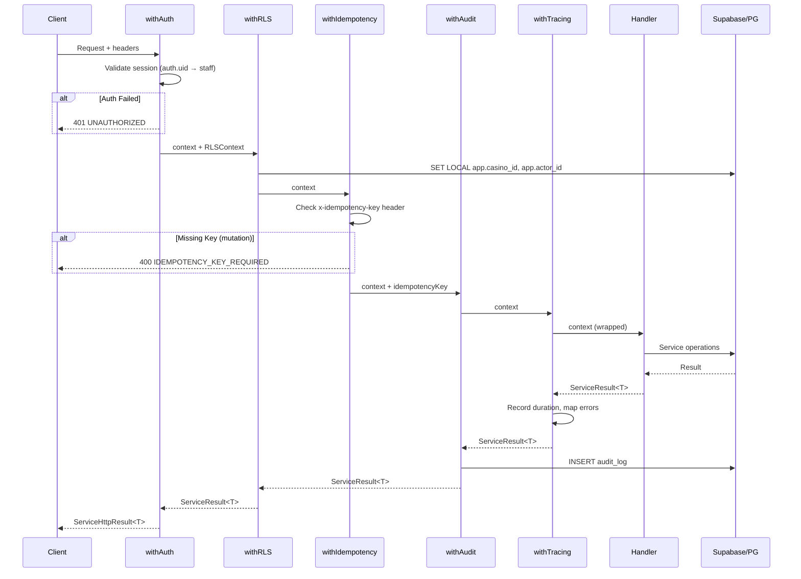
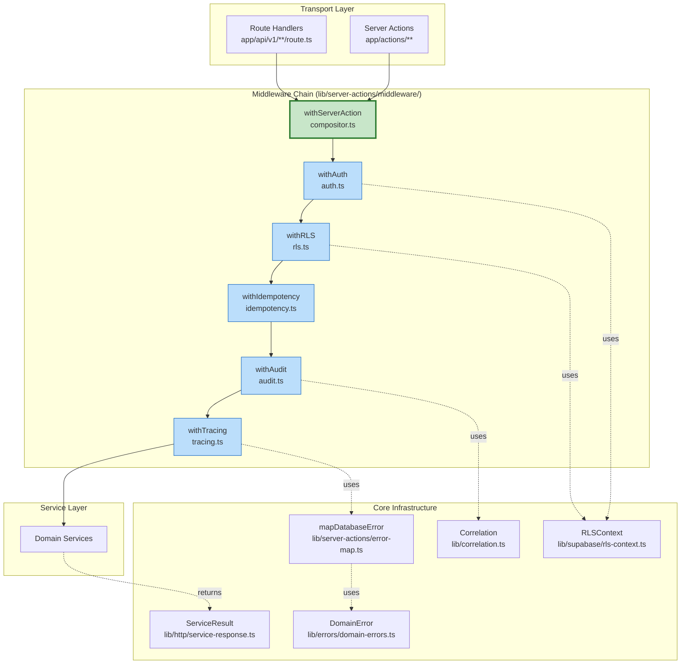

# SPEC-PRD-HZ-001 — GATE-0 Horizontal Infrastructure

**Version:** 1.0.0
**Date:** 2025-11-29
**Status:** Draft
**PRD:** [PRD-HZ-001](/docs/10-prd/PRD-HZ-001-gate0-horizontal-infrastructure.md)
**Owner:** Architecture / Backend Lead

---

## 1. Executive Summary

This specification provides the technical implementation details for PRD-HZ-001, the GATE-0 horizontal infrastructure foundation. The work establishes the `withServerAction` middleware compositor, `ServiceResult<T>` pattern, domain error taxonomy, and React Query configuration required before any vertical service slices can be deployed.

### 1.1 Implementation Assessment

| Component | Status | Location | Gap Analysis |
|-----------|--------|----------|--------------|
| `ServiceResult<T>` types | ✅ IMPLEMENTED | `lib/http/service-response.ts` | Complete - includes `ServiceHttpResult<T>` |
| `DomainError` base class | ✅ IMPLEMENTED | `lib/errors/domain-errors.ts` | Complete - 9 domain catalogs defined |
| Error mapping (PG→Domain) | ✅ IMPLEMENTED | `lib/server-actions/error-map.ts` | Complete - handles 23502-23514, PGRST116 |
| RLS context injection | ✅ IMPLEMENTED | `lib/supabase/rls-context.ts` | Complete - `getAuthContext()`, `injectRLSContext()` |
| Correlation ID | ✅ IMPLEMENTED | `lib/correlation.ts` | Complete - AsyncLocalStorage-based |
| Audit logging | ✅ IMPLEMENTED | `lib/server-actions/audit.ts` | Complete - writes to `audit_log` table |
| Rate limiter | ✅ IMPLEMENTED | `lib/rate-limiter.ts` | Complete - in-memory, single-instance |
| Query client | ✅ IMPLEMENTED | `lib/query-client.ts` | Needs tiered stale times by domain |
| `withServerAction` | ⚠️ PARTIAL | `lib/server-actions/with-server-action-wrapper.ts` | Missing composable middleware architecture |
| Idempotency middleware | ❌ MISSING | - | Header validation exists, no middleware chain |
| Tracing middleware | ❌ MISSING | - | Not implemented |

### 1.2 Scope of This Spec

This spec addresses:
1. **Refactoring** `withServerAction` into composable middleware chain
2. **Creating** individual middleware modules (withAuth, withIdempotency, withTracing)
3. **Enhancing** React Query client with domain-tiered caching
4. **Documentation** and testing requirements

---

## 2. Architecture Design

### 2.1 Middleware Composition Pattern

The `withServerAction` wrapper composes middleware in a specific order. Each middleware is a pure function with signature:

```typescript
type MiddlewareContext = {
  supabase: SupabaseClient<Database>;
  correlationId: string;
  rlsContext?: RLSContext;
  idempotencyKey?: string;
  endpoint?: string;
  startedAt: number;
};

type Middleware<T> = (
  ctx: MiddlewareContext,
  next: () => Promise<ServiceResult<T>>
) => Promise<ServiceResult<T>>;
```

### 2.2 Middleware Chain Order

```
Request → withAuth → withRLS → withIdempotency → withAudit → withTracing → Handler → Response
```



### 2.3 Component Diagram



---

## 3. Component Specifications

### 3.1 Middleware Types (`lib/server-actions/middleware/types.ts`)

```typescript
import type { SupabaseClient } from '@supabase/supabase-js';
import type { Database } from '@/types/database.types';
import type { RLSContext } from '@/lib/supabase/rls-context';
import type { ServiceResult } from '@/lib/http/service-response';

/**
 * Context passed through middleware chain
 */
export interface MiddlewareContext {
  /** Supabase client for database operations */
  supabase: SupabaseClient<Database>;

  /** Unique request identifier */
  correlationId: string;

  /** Request start timestamp (ms) */
  startedAt: number;

  /** RLS context (populated by withAuth) */
  rlsContext?: RLSContext;

  /** Idempotency key (from header) */
  idempotencyKey?: string;

  /** Endpoint identifier for rate limiting/audit */
  endpoint?: string;

  /** Domain for audit logging */
  domain?: string;

  /** Action name for audit logging */
  action?: string;
}

/**
 * Middleware function signature
 *
 * Pure function: (context, next) => Promise<ServiceResult<T>>
 * Each middleware can:
 * - Modify context before calling next()
 * - Short-circuit by returning early
 * - Transform result after calling next()
 */
export type Middleware<T> = (
  ctx: MiddlewareContext,
  next: () => Promise<ServiceResult<T>>
) => Promise<ServiceResult<T>>;

/**
 * Configuration for withServerAction compositor
 */
export interface ServerActionConfig {
  /** Endpoint identifier for rate limiting */
  endpoint?: string;

  /** Domain for audit logging */
  domain?: string;

  /** Action name for audit logging */
  action?: string;

  /** Require idempotency key for this action */
  requireIdempotency?: boolean;

  /** Skip auth (internal use only - e.g., health checks) */
  skipAuth?: boolean;
}
```

### 3.2 withAuth Middleware (`lib/server-actions/middleware/auth.ts`)

```typescript
import { DomainError } from '@/lib/errors/domain-errors';
import { getAuthContext, type RLSContext } from '@/lib/supabase/rls-context';
import type { ServiceResult } from '@/lib/http/service-response';
import type { Middleware, MiddlewareContext } from './types';

/**
 * Authentication Middleware
 *
 * Validates:
 * 1. User is authenticated (auth.uid() exists)
 * 2. User is linked to active staff record
 * 3. Staff has valid casino assignment
 *
 * Populates ctx.rlsContext for downstream middleware
 */
export function withAuth<T>(): Middleware<T> {
  return async (ctx: MiddlewareContext, next) => {
    try {
      const rlsContext = await getAuthContext(ctx.supabase);
      ctx.rlsContext = rlsContext;
      return next();
    } catch (error) {
      const message = error instanceof Error ? error.message : 'Authentication failed';

      if (message.includes('UNAUTHORIZED')) {
        throw new DomainError('UNAUTHORIZED', 'Authentication required');
      }

      if (message.includes('FORBIDDEN')) {
        throw new DomainError('FORBIDDEN', message);
      }

      throw new DomainError('INTERNAL_ERROR', message, { details: error });
    }
  };
}
```

### 3.3 withRLS Middleware (`lib/server-actions/middleware/rls.ts`)

```typescript
import { DomainError } from '@/lib/errors/domain-errors';
import { injectRLSContext } from '@/lib/supabase/rls-context';
import type { Middleware, MiddlewareContext } from './types';

/**
 * RLS Context Injection Middleware
 *
 * Executes:
 * - SET LOCAL app.actor_id = 'uuid'
 * - SET LOCAL app.casino_id = 'uuid'
 * - SET LOCAL app.staff_role = 'role'
 * - SET LOCAL application_name = 'correlation-id'
 *
 * REQUIRES: withAuth must run first (populates ctx.rlsContext)
 */
export function withRLS<T>(): Middleware<T> {
  return async (ctx: MiddlewareContext, next) => {
    if (!ctx.rlsContext) {
      throw new DomainError(
        'INTERNAL_ERROR',
        'RLS context not available - withAuth must run first'
      );
    }

    try {
      await injectRLSContext(ctx.supabase, ctx.rlsContext, ctx.correlationId);
      return next();
    } catch (error) {
      throw new DomainError(
        'INTERNAL_ERROR',
        'Failed to inject RLS context',
        { details: error }
      );
    }
  };
}
```

### 3.4 withIdempotency Middleware (`lib/server-actions/middleware/idempotency.ts`)

```typescript
import { DomainError } from '@/lib/errors/domain-errors';
import type { Middleware, MiddlewareContext } from './types';

/**
 * Idempotency Key Enforcement Middleware
 *
 * Validates presence of x-idempotency-key header for mutations.
 * Key uniqueness is enforced at the database level (partial unique index).
 *
 * Pattern:
 * - Route Handler extracts header and passes to context
 * - Middleware validates presence
 * - Service stores key in domain table (loyalty_ledger, etc.)
 * - Database enforces uniqueness via partial index
 */
export function withIdempotency<T>(required: boolean = true): Middleware<T> {
  return async (ctx: MiddlewareContext, next) => {
    if (required && !ctx.idempotencyKey) {
      throw new DomainError(
        'VALIDATION_ERROR',
        'Missing required x-idempotency-key header for mutation',
        { details: { header: 'x-idempotency-key' } }
      );
    }

    return next();
  };
}
```

### 3.5 withAudit Middleware (`lib/server-actions/middleware/audit.ts`)

```typescript
import type { SupabaseClient } from '@supabase/supabase-js';
import type { Database, Json } from '@/types/database.types';
import type { ServiceResult } from '@/lib/http/service-response';
import type { Middleware, MiddlewareContext } from './types';

function toJson(value: unknown): Json {
  if (
    value === null ||
    typeof value === 'string' ||
    typeof value === 'number' ||
    typeof value === 'boolean'
  ) {
    return value as Json;
  }

  if (Array.isArray(value)) {
    return value.map((item) => toJson(item)) as Json;
  }

  if (typeof value === 'object') {
    const result: Record<string, Json> = {};
    for (const [key, val] of Object.entries(value as Record<string, unknown>)) {
      result[key] = toJson(val);
    }
    return result;
  }

  return String(value);
}

/**
 * Audit Logging Middleware
 *
 * Records audit_log entries for all mutations.
 * Includes:
 * - correlation_id (from context)
 * - actor_id (from RLS context)
 * - casino_id (from RLS context)
 * - domain, action (from config)
 * - result details (ok, code, error)
 *
 * NOTE: Only writes in production environment
 */
export function withAudit<T>(): Middleware<T> {
  return async (ctx: MiddlewareContext, next) => {
    const result = await next();

    // Only audit in production
    if (process.env.NODE_ENV !== 'production') {
      return result;
    }

    try {
      await writeAuditEntry(ctx, result);
    } catch (error) {
      // Log but don't fail the request
      console.error('[audit] Failed to write audit log:', error);
    }

    return result;
  };
}

async function writeAuditEntry<T>(
  ctx: MiddlewareContext,
  result: ServiceResult<T>
): Promise<void> {
  const details: Json = toJson({
    correlationId: ctx.correlationId,
    idempotencyKey: ctx.idempotencyKey ?? null,
    durationMs: Date.now() - ctx.startedAt,
    ok: result.ok,
    code: result.code,
    error: result.error ?? null,
  });

  const payload = {
    casino_id: ctx.rlsContext?.casinoId ?? null,
    domain: ctx.domain ?? ctx.endpoint ?? 'unknown',
    actor_id: ctx.rlsContext?.actorId ?? null,
    action: ctx.action ?? 'unknown',
    details,
  } satisfies Database['public']['Tables']['audit_log']['Insert'];

  await ctx.supabase.from('audit_log').insert(payload);
}
```

### 3.6 withTracing Middleware (`lib/server-actions/middleware/tracing.ts`)

```typescript
import { mapDatabaseError } from '@/lib/server-actions/error-map';
import type { ServiceResult } from '@/lib/http/service-response';
import type { Middleware, MiddlewareContext } from './types';

/**
 * Tracing Middleware
 *
 * Responsibilities:
 * 1. Wrap handler execution to catch unhandled errors
 * 2. Map database/domain errors to ServiceResult
 * 3. Record duration in result
 * 4. Emit telemetry spans (future: OpenTelemetry integration)
 */
export function withTracing<T>(): Middleware<T> {
  return async (ctx: MiddlewareContext, next) => {
    try {
      const result = await next();

      // Ensure duration is accurate
      return {
        ...result,
        requestId: ctx.correlationId,
        durationMs: Date.now() - ctx.startedAt,
        timestamp: new Date().toISOString(),
      };
    } catch (error) {
      const mapped = mapDatabaseError(error);

      return {
        ok: false,
        code: mapped.code,
        error: mapped.message,
        details: mapped.details,
        requestId: ctx.correlationId,
        durationMs: Date.now() - ctx.startedAt,
        timestamp: new Date().toISOString(),
      } as ServiceResult<T>;
    }
  };
}
```

### 3.7 withServerAction Compositor (`lib/server-actions/middleware/compositor.ts`)

```typescript
import { randomUUID } from 'crypto';
import type { SupabaseClient } from '@supabase/supabase-js';
import type { Database } from '@/types/database.types';
import { runWithCorrelation } from '@/lib/correlation';
import type { ServiceResult } from '@/lib/http/service-response';
import { withAuth } from './auth';
import { withRLS } from './rls';
import { withIdempotency } from './idempotency';
import { withAudit } from './audit';
import { withTracing } from './tracing';
import type { Middleware, MiddlewareContext, ServerActionConfig } from './types';

/**
 * Compose middleware functions into a single chain
 */
function compose<T>(middlewares: Middleware<T>[]): Middleware<T> {
  return (ctx, next) => {
    let index = -1;

    function dispatch(i: number): Promise<ServiceResult<T>> {
      if (i <= index) {
        return Promise.reject(new Error('next() called multiple times'));
      }
      index = i;

      const fn = i < middlewares.length ? middlewares[i] : next;

      if (!fn) {
        return Promise.reject(new Error('No handler provided'));
      }

      return fn(ctx, () => dispatch(i + 1));
    }

    return dispatch(0);
  };
}

/**
 * withServerAction - Main entry point for server actions
 *
 * Composes middleware chain:
 * withAuth → withRLS → withIdempotency → withAudit → withTracing → handler
 *
 * @param handler - The actual handler function
 * @param options - Configuration options
 */
export async function withServerAction<T>(
  supabase: SupabaseClient<Database>,
  handler: (ctx: MiddlewareContext) => Promise<ServiceResult<T>>,
  options: ServerActionConfig & {
    correlationId?: string;
    idempotencyKey?: string;
  } = {}
): Promise<ServiceResult<T>> {
  const correlationId = options.correlationId ?? randomUUID();
  const startedAt = Date.now();

  const ctx: MiddlewareContext = {
    supabase,
    correlationId,
    startedAt,
    idempotencyKey: options.idempotencyKey,
    endpoint: options.endpoint,
    domain: options.domain,
    action: options.action,
  };

  // Build middleware chain
  const middlewares: Middleware<T>[] = [];

  if (!options.skipAuth) {
    middlewares.push(withAuth<T>());
    middlewares.push(withRLS<T>());
  }

  if (options.requireIdempotency !== false) {
    middlewares.push(withIdempotency<T>(options.requireIdempotency ?? false));
  }

  middlewares.push(withAudit<T>());
  middlewares.push(withTracing<T>());

  const chain = compose(middlewares);

  return runWithCorrelation(correlationId, () =>
    chain(ctx, () => handler(ctx))
  );
}

/**
 * Helper to create a configured withServerAction for a specific domain/action
 */
export function createServerActionWrapper(
  defaultConfig: ServerActionConfig
) {
  return async function<T>(
    supabase: SupabaseClient<Database>,
    handler: (ctx: MiddlewareContext) => Promise<ServiceResult<T>>,
    overrides?: Partial<ServerActionConfig> & {
      correlationId?: string;
      idempotencyKey?: string;
    }
  ): Promise<ServiceResult<T>> {
    return withServerAction(supabase, handler, {
      ...defaultConfig,
      ...overrides,
    });
  };
}
```

### 3.8 React Query Client Configuration (`lib/query/client.ts`)

```typescript
import { QueryClient } from '@tanstack/react-query';

/**
 * Domain-Tiered Stale Times
 *
 * Reference data (casino settings, floor layout): 5 minutes
 * Transactional data (rating slips, ledgers): 30 seconds
 * Real-time data (table status, visit status): 10 seconds
 */
export const STALE_TIMES = {
  /** Reference data - rarely changes */
  REFERENCE: 5 * 60 * 1000,  // 5 minutes

  /** Transactional data - changes with user actions */
  TRANSACTIONAL: 30 * 1000,  // 30 seconds

  /** Real-time data - changes frequently */
  REALTIME: 10 * 1000,       // 10 seconds
} as const;

/**
 * Domain-specific stale time mappings
 */
export const DOMAIN_STALE_TIMES: Record<string, number> = {
  // Reference data (5 min)
  casino: STALE_TIMES.REFERENCE,
  'casino-settings': STALE_TIMES.REFERENCE,
  'floor-layout': STALE_TIMES.REFERENCE,
  'game-settings': STALE_TIMES.REFERENCE,

  // Transactional data (30 sec)
  player: STALE_TIMES.TRANSACTIONAL,
  visit: STALE_TIMES.TRANSACTIONAL,
  'rating-slip': STALE_TIMES.TRANSACTIONAL,
  loyalty: STALE_TIMES.TRANSACTIONAL,
  finance: STALE_TIMES.TRANSACTIONAL,
  mtl: STALE_TIMES.TRANSACTIONAL,

  // Real-time data (10 sec)
  table: STALE_TIMES.REALTIME,
  'table-context': STALE_TIMES.REALTIME,
};

/**
 * Create QueryClient with PT-2 canonical defaults
 *
 * Aligned with docs/70-governance/HOOKS_STANDARD.md
 */
export function makeQueryClient(): QueryClient {
  return new QueryClient({
    defaultOptions: {
      queries: {
        staleTime: STALE_TIMES.TRANSACTIONAL, // Default to transactional
        gcTime: 30 * 60 * 1000, // 30 minutes garbage collection
        retry: 2,
        refetchOnWindowFocus: false,
      },
      mutations: {
        retry: 0,
      },
    },
  });
}

/**
 * Get stale time for a query key
 *
 * Usage in hooks:
 * ```ts
 * useQuery({
 *   queryKey: playerKeys.detail(id),
 *   queryFn: () => getPlayer(id),
 *   staleTime: getStaleTimeForDomain('player'),
 * });
 * ```
 */
export function getStaleTimeForDomain(domain: string): number {
  return DOMAIN_STALE_TIMES[domain] ?? STALE_TIMES.TRANSACTIONAL;
}

// Singleton for client-side usage
let browserQueryClient: QueryClient | undefined;

export function getQueryClient(): QueryClient {
  if (typeof window === 'undefined') {
    // Server: always create new client
    return makeQueryClient();
  }

  // Browser: create singleton
  if (!browserQueryClient) {
    browserQueryClient = makeQueryClient();
  }
  return browserQueryClient;
}
```

---

## 4. File Structure

```
lib/
├── server-actions/
│   ├── middleware/
│   │   ├── types.ts              # MiddlewareContext, Middleware<T>, ServerActionConfig
│   │   ├── auth.ts               # withAuth - authentication validation
│   │   ├── rls.ts                # withRLS - RLS context injection
│   │   ├── idempotency.ts        # withIdempotency - header enforcement
│   │   ├── audit.ts              # withAudit - audit log writing
│   │   ├── tracing.ts            # withTracing - error mapping, duration
│   │   ├── compositor.ts         # withServerAction - main entry point
│   │   └── index.ts              # Re-exports
│   ├── audit.ts                  # [EXISTING] - to be deprecated
│   ├── error-map.ts              # [EXISTING] - keep, used by tracing
│   ├── types.ts                  # [EXISTING] - to be deprecated
│   ├── with-server-action-wrapper.ts  # [EXISTING] - to be replaced
│   └── README.md                 # Usage documentation
├── http/
│   ├── service-response.ts       # [EXISTING] - ServiceResult, helpers
│   └── fetch-json.ts             # [NEW] - Shared fetch helper
├── errors/
│   ├── domain-errors.ts          # [EXISTING] - DomainError, catalogs
│   └── README.md                 # [NEW] - Error code documentation
├── query/
│   ├── client.ts                 # [NEW] - Enhanced QueryClient config
│   └── stale-times.ts            # [NEW] - Domain stale time mappings
└── utils/
    └── correlation.ts            # [EXISTING → MOVE] - from lib/correlation.ts
```

---

## 5. Migration Plan

### 5.1 Phase 1: Create New Middleware Structure (Non-Breaking)

1. Create `lib/server-actions/middleware/` directory
2. Implement middleware types and individual middleware
3. Implement compositor with backward-compatible API
4. Add comprehensive unit tests

### 5.2 Phase 2: Migrate Existing Routes (Gradual)

1. Update one Route Handler to use new `withServerAction`
2. Validate behavior matches existing implementation
3. Migrate remaining handlers gradually
4. Deprecate old `with-server-action-wrapper.ts`

### 5.3 Phase 3: Enhance React Query Configuration

1. Update `lib/query-client.ts` → `lib/query/client.ts`
2. Add domain stale time mappings
3. Update existing hooks to use `getStaleTimeForDomain()`

---

## 6. Testing Strategy

### 6.1 Unit Tests (Per Middleware)

| Middleware | Test File | Test Cases |
|------------|-----------|------------|
| withAuth | `middleware/__tests__/auth.test.ts` | Success, no user, no staff, inactive staff, no casino |
| withRLS | `middleware/__tests__/rls.test.ts` | Success, missing context, injection failure |
| withIdempotency | `middleware/__tests__/idempotency.test.ts` | Key present, key missing (required), key missing (optional) |
| withAudit | `middleware/__tests__/audit.test.ts` | Success audit, failure audit, non-production skip |
| withTracing | `middleware/__tests__/tracing.test.ts` | Success passthrough, error mapping, duration calculation |
| Compositor | `middleware/__tests__/compositor.test.ts` | Full chain, skip auth, require idempotency |

### 6.2 Integration Tests

| Test | File | Description |
|------|------|-------------|
| Full middleware chain | `__tests__/server-actions.int.test.ts` | Real Supabase, validates audit_log written |
| E2E Route Handler | `app/api/v1/__tests__/route.int.test.ts` | POST with idempotency, verify response envelope |

### 6.3 Test Fixtures

```typescript
// test/fixtures/middleware-context.ts
export function createMockContext(
  overrides?: Partial<MiddlewareContext>
): MiddlewareContext {
  return {
    supabase: createMockSupabase(),
    correlationId: 'test-correlation-id',
    startedAt: Date.now(),
    ...overrides,
  };
}

export function createMockSupabase() {
  return {
    auth: {
      getUser: vi.fn().mockResolvedValue({
        data: { user: { id: 'user-uuid' } },
        error: null,
      }),
    },
    from: vi.fn().mockReturnValue({
      select: vi.fn().mockReturnThis(),
      eq: vi.fn().mockReturnThis(),
      single: vi.fn().mockResolvedValue({
        data: { id: 'staff-uuid', casino_id: 'casino-uuid', role: 'admin' },
        error: null,
      }),
      insert: vi.fn().mockResolvedValue({ error: null }),
    }),
    rpc: vi.fn().mockResolvedValue({ error: null }),
  } as unknown as SupabaseClient<Database>;
}
```

---

## 7. Example Usage

### 7.1 Route Handler Example

```typescript
// app/api/v1/loyalty/ledger/route.ts
import type { NextRequest } from 'next/server';
import {
  createRequestContext,
  errorResponse,
  successResponse
} from '@/lib/http/service-response';
import { withServerAction } from '@/lib/server-actions/middleware';
import { createLoyaltyService } from '@/services/loyalty';
import { LedgerCreateSchema } from '@/services/loyalty/dtos';
import { createClient } from '@/lib/supabase/server';

export async function POST(request: NextRequest) {
  const ctx = createRequestContext(request);

  try {
    const supabase = await createClient();
    const idempotencyKey = request.headers.get('x-idempotency-key');

    if (!idempotencyKey) {
      throw new RouteError(
        'VALIDATION_ERROR',
        'Missing required x-idempotency-key header'
      );
    }

    const body = await request.json();
    const input = LedgerCreateSchema.parse(body);

    const result = await withServerAction(
      supabase,
      async (middlewareCtx) => {
        const service = createLoyaltyService(middlewareCtx.supabase);
        return service.appendLedger(input, {
          idempotencyKey: middlewareCtx.idempotencyKey
        });
      },
      {
        correlationId: ctx.requestId,
        idempotencyKey,
        domain: 'loyalty',
        action: 'ledger.append',
        requireIdempotency: true,
      }
    );

    return successResponse(ctx, result.data, result.code as ResultCode);
  } catch (error) {
    return errorResponse(ctx, error);
  }
}
```

### 7.2 Server Action Example

```typescript
// app/actions/loyalty/issue-reward-action.ts
'use server';

import { createClient } from '@/lib/supabase/server';
import { withServerAction } from '@/lib/server-actions/middleware';
import { createLoyaltyService } from '@/services/loyalty';
import { IssueRewardSchema } from '@/services/loyalty/dtos';

export async function issueRewardAction(formData: FormData) {
  const supabase = await createClient();
  const input = IssueRewardSchema.parse(Object.fromEntries(formData));

  return withServerAction(
    supabase,
    async (ctx) => {
      const service = createLoyaltyService(ctx.supabase);
      return service.issueReward(input);
    },
    {
      domain: 'loyalty',
      action: 'reward.issue',
      requireIdempotency: false, // Form actions don't use idempotency headers
    }
  );
}
```

---

## 8. Definition of Done Mapping

| PRD-HZ-001 DoD Item | Spec Component | Status |
|---------------------|----------------|--------|
| `withServerAction` composes all middleware | §3.7 Compositor | SPEC |
| At least one Route Handler uses `withServerAction` | §7.1 Example | SPEC |
| Idempotency middleware rejects without header | §3.4 withIdempotency | SPEC |
| Error mapper transforms PG codes | §3.6 withTracing + existing error-map.ts | ✅ EXISTING |
| RLS context injected via SET LOCAL | §3.3 withRLS | ✅ EXISTING |
| Audit log rows written with correlation IDs | §3.5 withAudit | SPEC |
| No Postgres error codes in responses | §3.6 withTracing | SPEC |
| withAuth rejects unauthenticated (401) | §3.2 withAuth | SPEC |
| withRLS enforces casino scoping (403) | §3.2, §3.3 | SPEC |
| Correlation IDs don't expose PII | All middleware | SPEC |
| Unit test per middleware | §6.1 | SPEC |
| Integration test: full chain | §6.2 | SPEC |
| E2E test: create via wrapped route | §6.2 | SPEC |
| Correlation IDs propagate | §3.3, §3.5 | SPEC |
| Error responses include requestId | §3.6 withTracing | SPEC |
| Middleware timing logged | §3.6 withTracing | SPEC |
| Usage examples in README | §7 + README.md | SPEC |
| Error code catalog documented | §3 + README.md | SPEC |

---

## 9. Risks & Mitigations

| Risk | Likelihood | Impact | Mitigation |
|------|------------|--------|------------|
| Middleware order mistakes | Medium | High | Type-safe compositor, integration tests |
| Performance overhead | Low | Medium | Target <10ms overhead, benchmark tests |
| Breaking existing routes | Medium | High | Gradual migration, feature flag support |
| Audit log failures | Low | Low | Fire-and-forget with error logging |
| Missing idempotency edge cases | Medium | Medium | Comprehensive test matrix |

---

## 10. Open Questions

1. **Tracing/Observability**: Should we integrate OpenTelemetry spans in v1.0 or defer?
   - **Recommendation**: Defer to v1.1, add span hooks for future integration

2. **Rate Limiting Scope**: Should rate limiting be per-middleware or per-endpoint config?
   - **Recommendation**: Per-endpoint config in `ServerActionConfig`

3. **Audit Log Retention**: What's the retention policy for audit_log?
   - **Decision Required**: Discuss with compliance team

---

## 11. Related Documents

- [PRD-HZ-001](/docs/10-prd/PRD-HZ-001-gate0-horizontal-infrastructure.md)
- [EDGE_TRANSPORT_POLICY](/docs/20-architecture/EDGE_TRANSPORT_POLICY.md)
- [SERVER_ACTIONS_ARCHITECTURE](/docs/70-governance/SERVER_ACTIONS_ARCHITECTURE.md)
- [SERVICE_LAYER_ARCHITECTURE_DIAGRAM](/docs/20-architecture/SERVICE_LAYER_ARCHITECTURE_DIAGRAM.md)
- [SEC-001 RLS Policy Matrix](/docs/30-security/SEC-001-rls-policy-matrix.md)

---

## 12. Changelog

| Version | Date | Changes |
|---------|------|---------|
| 1.0.0 | 2025-11-29 | Initial specification |
