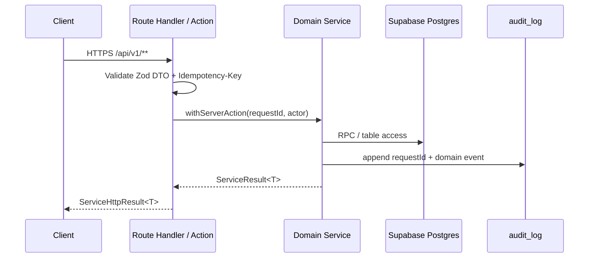

# API Surface — MVP (Canonical)

**Date**: 2025-10-24  
**Source**: docs/patterns/SERVICE_RESPONSIBILITY_MATRIX.md v3.0.2 (patched)  
**Contract**: `ServiceHttpResult<T>` (ok, code, status, requestId, durationMs, timestamp) — see `70-governance/SERVICE_TEMPLATE.md` (v1.2) for the canonical domain-service + Route Handler handshake.  
**Transport**: Next.js Route Handlers (`app/api/**`) for React Query + Server Actions for form submissions



## Versioning & Global Conventions
- **Versioning**: All endpoints live under `/api/v1`; breaking contract changes require a `/api/v2` fork with a documented sunset window and migration notes.
- **Idempotency**: POST/PATCH must include `Idempotency-Key`; dedupe routes write through domain-specific ledgers (`loyalty_ledger.idempotency_key`, `mtl_entry.idempotency_key`, finance idempotency ledger) or hashed request entries in `audit_log` for tables without a dedicated column.
- **Auth & RBAC**: Staff JWTs map to `staff_role` enum (`dealer`, `pit_boss`, `admin`); `service_role` tokens permitted for automation. Row-Level Security scopes access by `casino_id` as defined in the SRM.
- **Rate limiting**: `lib/rate-limiter` enforces 60 req/min/staff for reads and 10 req/min/staff for writes unless a route calls out a stricter policy.
- **Observability & Audit**: `withServerAction` adds `requestId`, `durationMs`, `timestamp`; writes append to `audit_log` with domain + actor to preserve the SRM audit invariants.
- **Pagination & cURL**: Cursor-based pagination uses opaque base64 of `[created_at,id]`; clients pass `cursor` + optional `limit` (≤100). Example curl snippets assume `BASE_URL=https://pt-2.local` and `AUTH_TOKEN` set to a valid staff JWT.

## Error Map
| code | http |
|------|------|
| OK | 200 |
| VALIDATION_ERROR | 400 |
| NOT_FOUND | 404 |
| UNIQUE_VIOLATION | 409 |
| FOREIGN_KEY_VIOLATION | 400 |
| UNAUTHORIZED | 401 |
| FORBIDDEN | 403 |
| INTERNAL_ERROR | 500 |

## Implementation Session Log
- 2025-10-24: Generated canonical route handler skeletons under `app/api/v1/**` with Zod validation, Idempotency-Key header enforcement, and ServiceHttpResult wiring using `lib/http/service-response.ts`. Pending wiring to domain services once schemas are finalized.

## Domain Catalogue

## Casino Domain (CasinoService — Foundational Context)

**Tables**: `casino`, `casino_settings`, `staff`, `audit_log`  
**Key invariants**: Single temporal authority per casino; watchlist/CTR thresholds sourced from `casino_settings`; staff records carry `casino_id` for RLS anchoring.

#### GET /api/v1/casinos/{casino_id}

Request params (Zod):
```ts
export const CasinoDetailParamsSchema = z.object({
  casino_id: z.string().uuid(),
});
```

Response DTO (Zod):
```ts
export const CasinoSchema = z.object({
  id: z.string().uuid(),
  name: z.string(),
  location: z.string().nullable(),
  status: z.string(),
  address: z.record(z.any()).nullable(),
  company_id: z.string().uuid().nullable(),
  created_at: z.string(),
});
```

Operational notes:
- **Errors**: `NOT_FOUND`, `FORBIDDEN`, `UNAUTHORIZED`.
- **Auth/RBAC**: Staff JWT with `pit_boss` or `admin`; `service_role` allowed for automation; RLS enforces matching `casino_id`.
- **Idempotency**: Read-only; `Idempotency-Key` ignored.
- **Pagination**: Not applicable (single resource).
- **Rate limit**: 60 req/min per staff via `lib/rate-limiter`.
- **Observability & Traceability**: ServiceHttpResult envelope returns requestId/duration; SRM CasinoService guarantees registry accuracy and audit logging.

#### PATCH /api/v1/casinos/{casino_id}/settings

Request params (Zod):
```ts
export const CasinoSettingsParamsSchema = z.object({
  casino_id: z.string().uuid(),
});
```

Request body (Zod):
```ts
export const CasinoSettingsPatchSchema = z.object({
  timezone: z.string().optional(),
  gaming_day_start_time: z.string().regex(/^\d{2}:\d{2}$/).optional(),
  watchlist_floor: z.number().min(0).optional(),
  ctr_threshold: z.number().min(0).optional(),
});
```

Response DTO (Zod):
```ts
export const CasinoSettingsSchema = z.object({
  casino_id: z.string().uuid(),
  timezone: z.string(),
  gaming_day_start_time: z.string(),
  watchlist_floor: z.number(),
  ctr_threshold: z.number(),
  updated_at: z.string(),
});
```

Operational notes:
- **Errors**: `VALIDATION_ERROR`, `FORBIDDEN`, `NOT_FOUND`.
- **Auth/RBAC**: Only `admin` staff or `service_role`; mutation confined to owning casino per RLS.
- **Idempotency**: Required; ledgered via `casino_settings` unique `(casino_id)` plus hashed `Idempotency-Key` row in `audit_log` (duplicates replay prior payload).
- **Pagination**: Not applicable.
- **Rate limit**: 5 req/min per staff (tighter than default) to guard policy churn.
- **Observability & Traceability**: ServiceHttpResult metadata + audit_log append tie back to SRM CasinoService temporal authority.

#### GET /api/v1/casinos/{casino_id}/staff

Query (Zod):
```ts
export const CasinoStaffQuerySchema = z.object({
  status: z.enum(['active','inactive']).optional(),
  role: z.enum(['dealer','pit_boss','admin']).optional(),
  cursor: z.string().optional(),
  limit: z.number().int().min(1).max(100).optional(),
});
```

Response DTO (Zod):
```ts
export const StaffSchema = z.object({
  id: z.string().uuid(),
  casino_id: z.string().uuid().nullable(),
  first_name: z.string(),
  last_name: z.string(),
  email: z.string().email().nullable(),
  employee_id: z.string().nullable(),
  role: z.enum(['dealer','pit_boss','admin']),
  status: z.enum(['active','inactive']),
  created_at: z.string(),
});

export const StaffListResponseSchema = z.object({
  items: z.array(StaffSchema),
  next_cursor: z.string().optional(),
});
```

Operational notes:
- **Errors**: `FORBIDDEN`, `UNAUTHORIZED`.
- **Auth/RBAC**: `pit_boss` or `admin`; `dealer` may read peers only via downstream view (not this route).
- **Idempotency**: Read-only; header ignored.
- **Pagination**: Cursor uses `(created_at,id)` ordering; pass `cursor` for next page.
- **Rate limit**: 60 req/min per staff.
- **Observability & Traceability**: Response envelope logs requestId; SRM CasinoService mandates staff roster integrity with audit trail in `audit_log`.

### cURL sanity
```bash
# detail
curl -sS "$BASE_URL/api/v1/casinos/11111111-1111-1111-1111-111111111111" \
  -H "Authorization: Bearer $AUTH_TOKEN"

# update settings
curl -sS -X PATCH "$BASE_URL/api/v1/casinos/11111111-1111-1111-1111-111111111111/settings" \
  -H "Authorization: Bearer $AUTH_TOKEN" \
  -H "Content-Type: application/json" \
  -H "Idempotency-Key: $(uuidgen)" \
  -d '{"timezone":"America/Los_Angeles","gaming_day_start_time":"06:00"}'
```

## Player Domain (PlayerService — Identity Context)

**Tables**: `player`, `player_casino`, `audit_log`  
**Key invariants**: Player profiles are global; casino enrollment lives in `player_casino` with PK `(player_id, casino_id)` and default `status='active'`.

#### POST /api/v1/players

Request body (Zod):
```ts
export const PlayerCreateSchema = z.object({
  first_name: z.string().min(1),
  last_name: z.string().min(1),
  birth_date: z.string().optional(),
  casino_enrollment: z
    .object({
      casino_id: z.string().uuid(),
      status: z.enum(['active','inactive']).default('active'),
    })
    .optional(),
});
```

Response DTO (Zod):
```ts
export const PlayerSchema = z.object({
  id: z.string().uuid(),
  first_name: z.string(),
  last_name: z.string(),
  birth_date: z.string().nullable(),
  created_at: z.string(),
});
```

Operational notes:
- **Errors**: `VALIDATION_ERROR`, `FOREIGN_KEY_VIOLATION`, `UNIQUE_VIOLATION` (duplicate enrollment).
- **Auth/RBAC**: `pit_boss` or `admin`; automation allowed with `service_role`; enrollment writes respect SRM PlayerService scope.
- **Idempotency**: Required; hashed `(Idempotency-Key, casino_id, first_name, last_name)` stored in `audit_log` to dedupe replays.
- **Pagination**: Not applicable (single resource).
- **Rate limit**: 10 req/min per staff.
- **Observability & Traceability**: ServiceHttpResult metadata + audit append; SRM PlayerService guarantees identity authority and casino enrollment invariants.

#### PATCH /api/v1/players/{player_id}

Request params (Zod):
```ts
export const PlayerUpdateParamsSchema = z.object({
  player_id: z.string().uuid(),
});
```

Request body (Zod):
```ts
export const PlayerUpdateSchema = PlayerCreateSchema.partial();
```

Response DTO: `PlayerSchema`.

Operational notes:
- **Errors**: `VALIDATION_ERROR`, `NOT_FOUND`.
- **Auth/RBAC**: `pit_boss` or `admin`; player must belong to caller's casino when updating enrollment.
- **Idempotency**: Required header; updates log hashed requestId in `audit_log` to replay safely (no double mutation if payload unchanged).
- **Pagination**: Not applicable.
- **Rate limit**: 10 req/min per staff.
- **Observability & Traceability**: ServiceHttpResult + audit entry tie to SRM PlayerService update policy.

#### GET /api/v1/players/{player_id}

Request params: `PlayerUpdateParamsSchema`.

Response DTO: `PlayerSchema`.

Operational notes:
- **Errors**: `NOT_FOUND`, `FORBIDDEN`.
- **Auth/RBAC**: Staff with `pit_boss` or `admin`; `dealer` allowed when fetching via assigned visit (handled by RLS views, not this route).
- **Idempotency**: Read-only.
- **Pagination**: Not applicable.
- **Rate limit**: 60 req/min per staff.
- **Observability & Traceability**: Response envelope includes requestId; SRM PlayerService ensures identity retrieval adheres to enrollment RLS.

#### GET /api/v1/players

Query (Zod):
```ts
export const PlayerListQuerySchema = z.object({
  casino_id: z.string().uuid(),
  q: z.string().optional(),
  cursor: z.string().optional(),
  limit: z.number().int().min(1).max(100).optional(),
});
```

Response DTO (Zod):
```ts
export const PlayerListResponseSchema = z.object({
  items: z.array(PlayerSchema),
  next_cursor: z.string().optional(),
});
```

Operational notes:
- **Errors**: `FORBIDDEN`, `UNAUTHORIZED`.
- **Auth/RBAC**: `pit_boss` or `admin`; query constrained to caller's `casino_id` per SRM membership invariant.
- **Idempotency**: Read-only.
- **Pagination**: Cursor = base64 `(created_at,id)`; pass `cursor` + optional `limit`.
- **Rate limit**: 60 req/min per staff.
- **Observability & Traceability**: ServiceHttpResult metadata + audit of list queries (per SRM requirement for PI access logging).

### cURL sanity
```bash
# create player + enrollment
curl -sS -X POST "$BASE_URL/api/v1/players" \
  -H "Authorization: Bearer $AUTH_TOKEN" \
  -H "Content-Type: application/json" \
  -H "Idempotency-Key: $(uuidgen)" \
  -d '{"first_name":"Layla","last_name":"Nguyen","birth_date":"1994-05-21","casino_enrollment":{"casino_id":"22222222-2222-2222-2222-222222222222"}}'

# search players
curl -sS "$BASE_URL/api/v1/players?casino_id=22222222-2222-2222-2222-222222222222&q=ngu" \
  -H "Authorization: Bearer $AUTH_TOKEN"
```

## Visit Domain (VisitService — Session Context)

**Tables**: `visit`, `audit_log`  
**Key invariants**: `visit` rows carry `player_id` + `casino_id`; `ended_at` null means active session; gaming day derived by downstream finance triggers.

#### POST /api/v1/visits

Request body (Zod):
```ts
export const VisitStartSchema = z.object({
  player_id: z.string().uuid(),
  casino_id: z.string().uuid(),
  started_at: z.string().optional(),
});
```

Response DTO (Zod):
```ts
export const VisitSchema = z.object({
  id: z.string().uuid(),
  player_id: z.string().uuid(),
  casino_id: z.string().uuid(),
  started_at: z.string(),
  ended_at: z.string().nullable(),
});
```

Operational notes:
- **Errors**: `VALIDATION_ERROR`, `FOREIGN_KEY_VIOLATION`.
- **Auth/RBAC**: `pit_boss` or `admin`; `dealer` may start only via supervised workflow (future enhancement).
- **Idempotency**: Header required; dedupe by hashing `(Idempotency-Key, player_id, casino_id, date_trunc('minute', started_at))` in `audit_log` to prevent duplicate openings.
- **Pagination**: Not applicable.
- **Rate limit**: 10 req/min per staff.
- **Observability & Traceability**: ServiceHttpResult metadata; SRM VisitService ensures single active visit per player/casino via service-level guard + audit.

#### POST /api/v1/visits/{visit_id}/end

Request params (Zod):
```ts
export const VisitEndParamsSchema = z.object({
  visit_id: z.string().uuid(),
});
```

Request body (Zod):
```ts
export const VisitEndSchema = z.object({
  ended_at: z.string().optional(),
});
```

Response DTO: `VisitSchema` (with `ended_at` populated).

Operational notes:
- **Errors**: `NOT_FOUND`, `VALIDATION_ERROR` (already closed).
- **Auth/RBAC**: `pit_boss` or `admin`; service validates visit ownership vs caller casino.
- **Idempotency**: Required; repeated keys return existing closed visit (service checks `ended_at`).
- **Pagination**: Not applicable.
- **Rate limit**: 10 req/min per staff.
- **Observability & Traceability**: ServiceHttpResult metadata + audit entry citing `VisitService` close invariant from SRM.

#### GET /api/v1/visits/{visit_id}

Params: `VisitEndParamsSchema`.

Response: `VisitSchema`.

Operational notes:
- **Errors**: `NOT_FOUND`, `FORBIDDEN`.
- **Auth/RBAC**: `pit_boss` or `admin`; `dealer` access flows through UI list view where RLS filters apply.
- **Idempotency**: Read-only.
- **Pagination**: Not applicable.
- **Rate limit**: 60 req/min per staff.
- **Observability & Traceability**: ServiceHttpResult metadata; SRM VisitService ensures session lifecycle visibility per casino.

#### GET /api/v1/visits

Query (Zod):
```ts
export const VisitListQuerySchema = z.object({
  casino_id: z.string().uuid(),
  player_id: z.string().uuid().optional(),
  status: z.enum(['open','closed']).optional(),
  cursor: z.string().optional(),
  limit: z.number().int().min(1).max(100).optional(),
});
```

Response DTO:
```ts
export const VisitListResponseSchema = z.object({
  items: z.array(VisitSchema),
  next_cursor: z.string().optional(),
});
```

Operational notes:
- **Errors**: `FORBIDDEN`, `UNAUTHORIZED`.
- **Auth/RBAC**: `pit_boss` or `admin`; `status='open'` filter used by floor staff dashboards.
- **Idempotency**: Read-only.
- **Pagination**: Cursor sorts by `(started_at,id)` descending.
- **Rate limit**: 60 req/min per staff.
- **Observability & Traceability**: ServiceHttpResult metadata; SRM VisitService mandates audit of session lookups for compliance.

### cURL sanity
```bash
# start visit
curl -sS -X POST "$BASE_URL/api/v1/visits" \
  -H "Authorization: Bearer $AUTH_TOKEN" \
  -H "Content-Type: application/json" \
  -H "Idempotency-Key: $(uuidgen)" \
  -d '{"player_id":"33333333-3333-3333-3333-333333333333","casino_id":"22222222-2222-2222-2222-222222222222"}'

# list open visits for a casino
curl -sS "$BASE_URL/api/v1/visits?casino_id=22222222-2222-2222-2222-222222222222&status=open" \
  -H "Authorization: Bearer $AUTH_TOKEN"
```

## Rating Slip Domain (RatingSlipService — Telemetry Context)

**Tables**: `rating_slip`, `audit_log`  
**Key invariants**: Rating slips capture telemetry only; reward calculations live in Loyalty. `status` drives eligibility for mid-session rewards.

#### POST /api/v1/rating-slips

Request body (Zod):
```ts
export const RatingSlipCreateSchema = z.object({
  player_id: z.string().uuid(),
  casino_id: z.string().uuid(),
  visit_id: z.string().uuid().optional(),
  table_id: z.string().uuid().optional(),
  game_settings: z.record(z.any()).nullable().optional(),
  average_bet: z.number().min(0).nullable().optional(),
  policy_snapshot: z.record(z.any()).nullable().optional(),
});
```

Response DTO (Zod):
```ts
export const RatingSlipSchema = z.object({
  id: z.string().uuid(),
  player_id: z.string().uuid(),
  casino_id: z.string().uuid(),
  visit_id: z.string().uuid().nullable(),
  table_id: z.string().uuid().nullable(),
  game_settings: z.record(z.any()).nullable(),
  average_bet: z.number().nullable(),
  start_time: z.string(),
  end_time: z.string().nullable(),
  status: z.string(),
  policy_snapshot: z.record(z.any()).nullable(),
});
```

Operational notes:
- **Errors**: `VALIDATION_ERROR`, `FOREIGN_KEY_VIOLATION`.
- **Auth/RBAC**: `pit_boss` or `admin`; automation allowed for telemetry ingest jobs.
- **Idempotency**: Required; service rejects duplicate open slip for `(player_id, visit_id?)` when `status='open'` and replays return existing slip.
- **Pagination**: Not applicable.
- **Rate limit**: 10 req/min per staff (telemetry writes typically automated).
- **Observability & Traceability**: ServiceHttpResult metadata + audit entry labeled `rating_slip.created`; SRM RatingSlipService enforces telemetry-only boundary.

#### PATCH /api/v1/rating-slips/{rating_slip_id}

Params (Zod):
```ts
export const RatingSlipParamsSchema = z.object({
  rating_slip_id: z.string().uuid(),
});
```

Request body (Zod):
```ts
export const RatingSlipUpdateSchema = z.object({
  average_bet: z.number().min(0).nullable().optional(),
  end_time: z.string().optional(),
  status: z.enum(['open','paused','closed']).optional(),
  policy_snapshot: z.record(z.any()).nullable().optional(),
});
```

Response DTO: `RatingSlipSchema`.

Operational notes:
- **Errors**: `NOT_FOUND`, `VALIDATION_ERROR` (invalid state transition).
- **Auth/RBAC**: `pit_boss` or `admin`.
- **Idempotency**: Header required; repeated updates with same payload treated as no-op (service compares to current snapshot).
- **Pagination**: Not applicable.
- **Rate limit**: 10 req/min per staff.
- **Observability & Traceability**: ServiceHttpResult metadata; SRM RatingSlipService guards telemetry integrity and state machine transitions.

#### POST /api/v1/rating-slips/{rating_slip_id}/close

Params: `RatingSlipParamsSchema`.

Request body (Zod):
```ts
export const RatingSlipCloseSchema = z.object({
  end_time: z.string().optional(),
});
```

Response DTO: `RatingSlipSchema` with `status='closed'`.

Operational notes:
- **Errors**: `NOT_FOUND`, `VALIDATION_ERROR` (already closed).
- **Auth/RBAC**: `pit_boss` or `admin`.
- **Idempotency**: Required; service treats duplicate keys as replay, returning current closed slip.
- **Pagination**: Not applicable.
- **Rate limit**: 10 req/min per staff.
- **Observability & Traceability**: ServiceHttpResult metadata; SRM RatingSlipService ensures closed slips remain immutable aside from telemetry fields.

#### GET /api/v1/visits/{visit_id}/rating-slips

Params (Zod): `VisitEndParamsSchema` (for `visit_id`).

Query (Zod):
```ts
export const RatingSlipListQuerySchema = z.object({
  cursor: z.string().optional(),
  limit: z.number().int().min(1).max(100).optional(),
});
```

Response DTO:
```ts
export const RatingSlipListResponseSchema = z.object({
  items: z.array(RatingSlipSchema),
  next_cursor: z.string().optional(),
});
```

Operational notes:
- **Errors**: `FORBIDDEN`, `NOT_FOUND` (visit missing).
- **Auth/RBAC**: `pit_boss` or `admin`; `dealer` can read when assigned via visit (RLS view ensures scope).
- **Idempotency**: Read-only.
- **Pagination**: Cursor sorts by `(start_time,id)` descending.
- **Rate limit**: 60 req/min per staff.
- **Observability & Traceability**: ServiceHttpResult metadata; SRM RatingSlipService cross-links telemetry with VisitService/Visit context.

### cURL sanity
```bash
# create rating slip
curl -sS -X POST "$BASE_URL/api/v1/rating-slips" \
  -H "Authorization: Bearer $AUTH_TOKEN" \
  -H "Content-Type: application/json" \
  -H "Idempotency-Key: $(uuidgen)" \
  -d '{"player_id":"33333333-3333-3333-3333-333333333333","casino_id":"22222222-2222-2222-2222-222222222222","visit_id":"44444444-4444-4444-4444-444444444444","table_id":"55555555-5555-5555-5555-555555555555"}'

# list rating slips for a visit
curl -sS "$BASE_URL/api/v1/visits/44444444-4444-4444-4444-444444444444/rating-slips" \
  -H "Authorization: Bearer $AUTH_TOKEN"
```

## Table Context Domain (TableContextService — Operational Context)

**Tables**: `gaming_table`, `gaming_table_settings`, `dealer_rotation`, `table_inventory_snapshot`, `table_fill`, `table_credit`, `table_drop_event`, `audit_log`  
**Key invariants**: Tables owned by casino; bet range consistency enforced by triggers; dealer rotations validated against `gaming_table` ownership; chip custody telemetry (snapshots, fills, credits, drop custody) is non-monetary and scoped by `casino_id`.

> **Idempotency mapping**: For custody writes (`/inventory-snapshots`, `/fills`, `/credits`) the `Idempotency-Key` header is mandatory. When the JSON body omits `request_id`, the route copies `Idempotency-Key` into the payload before invoking the RPC so the database uniqueness `(casino_id, request_id)` constraint dedupes retries.

#### GET /api/v1/table-context/tables

Query (Zod):
```ts
export const TableQuerySchema = z.object({
  casino_id: z.string().uuid(),
  status: z.enum(['inactive','active','closed']).optional(),
  cursor: z.string().optional(),
  limit: z.number().int().min(1).max(100).optional(),
});
```

Response DTO (Zod):
```ts
export const TableSchema = z.object({
  id: z.string().uuid(),
  casino_id: z.string().uuid(),
  label: z.string(),
  pit: z.string().nullable(),
  type: z.enum(['blackjack','poker','roulette','baccarat']),
  status: z.enum(['inactive','active','closed']),
  created_at: z.string(),
});

export const TableListResponseSchema = z.object({
  items: z.array(TableSchema),
  next_cursor: z.string().optional(),
});
```

Operational notes:
- **Errors**: `FORBIDDEN`, `UNAUTHORIZED`.
- **Auth/RBAC**: `dealer` (read) when scoped to own casino; `pit_boss`/`admin` full access.
- **Idempotency**: Read-only.
- **Pagination**: Cursor uses `(label,id)` ascending for stable table ordering.
- **Rate limit**: 60 req/min per staff.
- **Observability & Traceability**: ServiceHttpResult metadata; SRM TableContextService ensures table roster reflects casino ownership.

#### GET /api/v1/table-context/tables/{table_id}

Params (Zod):
```ts
export const TableDetailParamsSchema = z.object({
  table_id: z.string().uuid(),
});
```

Response DTO: `TableSchema` plus latest settings.

Operational notes:
- **Errors**: `NOT_FOUND`, `FORBIDDEN`.
- **Auth/RBAC**: `dealer` for read when assigned; `pit_boss`/`admin` general access.
- **Idempotency**: Read-only.
- **Pagination**: Not applicable.
- **Rate limit**: 60 req/min per staff.
- **Observability & Traceability**: ServiceHttpResult metadata; SRM TableContextService enforces `gaming_table_settings` alignment via triggers.

#### POST /api/v1/table-context/dealer-rotations

Request body (Zod):
```ts
export const DealerRotationCreateSchema = z.object({
  casino_id: z.string().uuid(),
  table_id: z.string().uuid(),
  staff_id: z.string().uuid().optional(),
  started_at: z.string().optional(),
});
```

Response DTO (Zod):
```ts
export const DealerRotationSchema = z.object({
  id: z.string().uuid(),
  casino_id: z.string().uuid(),
  table_id: z.string().uuid(),
  staff_id: z.string().uuid().nullable(),
  started_at: z.string(),
  ended_at: z.string().nullable(),
});
```

Operational notes:
- **Errors**: `VALIDATION_ERROR`, `FOREIGN_KEY_VIOLATION`.
- **Auth/RBAC**: `pit_boss` or `admin`; ensures rotation matches owning casino (`assert_table_context_casino`).
- **Idempotency**: Required; dedupe by `(table_id, started_at)` unique guard plus hashed key in `audit_log` to block duplicate open rotations.
- **Pagination**: Not applicable.
- **Rate limit**: 10 req/min per staff.
- **Observability & Traceability**: ServiceHttpResult metadata; SRM TableContextService maintains rotation history + audit.

#### POST /api/v1/table-context/inventory-snapshots

Request body (Zod):
```ts
export const TableInventorySnapshotCreateSchema = z.object({
  casino_id: z.string().uuid(),
  table_id: z.string().uuid(),
  snapshot_type: z.enum(['open','close','rundown']),
  chipset: z.record(z.string(), z.number().int().nonnegative()),
  counted_by: z.string().uuid().optional(),
  verified_by: z.string().uuid().optional(),
  discrepancy_cents: z.number().int().optional(),
  note: z.string().max(500).optional(),
});
```

Response DTO:
```ts
export const TableInventorySnapshotSchema = z.object({
  id: z.string().uuid(),
  casino_id: z.string().uuid(),
  table_id: z.string().uuid(),
  snapshot_type: z.enum(['open','close','rundown']),
  chipset: z.record(z.string(), z.number().int()),
  counted_by: z.string().uuid().nullable(),
  verified_by: z.string().uuid().nullable(),
  discrepancy_cents: z.number().int(),
  note: z.string().nullable(),
  created_at: z.string(),
});
```

Operational notes:
- **Errors**: `VALIDATION_ERROR`, `FORBIDDEN`.
- **Auth/RBAC**: `pit_boss` or `admin`; `count_team` can write when JWT carries `count_team` claim.
- **Idempotency**: Write requires `Idempotency-Key`; when `request_id` absent, route copies header into RPC payload so duplicates collapse on `(casino_id, request_id)`.
- **Rate limit**: 10 req/min per staff; escalate to 2 req/min for automated closeouts during audits.
- **Observability**: Route wraps `rpc_log_table_inventory_snapshot`; audit_log records `snapshot_type` and `chipset` hash to detect tampering.

#### POST /api/v1/table-context/fills

Request body (Zod):
```ts
export const TableFillCreateSchema = z.object({
  casino_id: z.string().uuid(),
  table_id: z.string().uuid(),
  chipset: z.record(z.string(), z.number().int().nonnegative()),
  amount_cents: z.number().int().positive(),
  requested_by: z.string().uuid(),
  delivered_by: z.string().uuid(),
  received_by: z.string().uuid(),
  slip_no: z.string().max(64).optional(),
  request_id: z.string().uuid().optional(),
});
```

Response DTO:
```ts
export const TableFillSchema = z.object({
  id: z.string().uuid(),
  casino_id: z.string().uuid(),
  table_id: z.string().uuid(),
  chipset: z.record(z.string(), z.number().int()),
  amount_cents: z.number().int(),
  requested_by: z.string().uuid().nullable(),
  delivered_by: z.string().uuid().nullable(),
  received_by: z.string().uuid().nullable(),
  slip_no: z.string().nullable(),
  request_id: z.string().uuid().nullable(),
  created_at: z.string(),
});
```

Operational notes:
- **Errors**: `VALIDATION_ERROR`, `FOREIGN_KEY_VIOLATION`, `UNIQUE_VIOLATION` (duplicate request).
- **Auth/RBAC**: `pit_boss` initiates; `cage` or `count_team` can complete delivery; RLS ensures `casino_id` match.
- **Idempotency**: Mandatory header; server injects header value into `request_id` when body omits it before calling `rpc_request_table_fill`.
- **Rate limit**: 5 req/min per staff.
- **Observability**: Emits `table.fill_requested|completed` events with `request_id`, bridging SRM telemetry expectations.

#### POST /api/v1/table-context/credits

Request body (Zod):
```ts
export const TableCreditCreateSchema = z.object({
  casino_id: z.string().uuid(),
  table_id: z.string().uuid(),
  chipset: z.record(z.string(), z.number().int().nonnegative()),
  amount_cents: z.number().int().positive(),
  authorized_by: z.string().uuid(),
  sent_by: z.string().uuid(),
  received_by: z.string().uuid(),
  slip_no: z.string().max(64).optional(),
  request_id: z.string().uuid().optional(),
});
```

Response DTO:
```ts
export const TableCreditSchema = z.object({
  id: z.string().uuid(),
  casino_id: z.string().uuid(),
  table_id: z.string().uuid(),
  chipset: z.record(z.string(), z.number().int()),
  amount_cents: z.number().int(),
  authorized_by: z.string().uuid().nullable(),
  sent_by: z.string().uuid().nullable(),
  received_by: z.string().uuid().nullable(),
  slip_no: z.string().nullable(),
  request_id: z.string().uuid().nullable(),
  created_at: z.string(),
});
```

Operational notes:
- **Errors**: `VALIDATION_ERROR`, `FOREIGN_KEY_VIOLATION`, `UNIQUE_VIOLATION`.
- **Auth/RBAC**: `pit_boss` or `cage` role must authorize; `count_team` records receipt.
- **Idempotency**: Same as fills—`Idempotency-Key` required and mapped to `request_id` for `rpc_request_table_credit`.
- **Rate limit**: 5 req/min per staff.
- **Observability**: Emits `table.credit_requested|completed`; audit trail links to `table_drop_event` when present.

#### POST /api/v1/table-context/drop-events

Request body (Zod):
```ts
export const TableDropEventCreateSchema = z.object({
  casino_id: z.string().uuid(),
  table_id: z.string().uuid(),
  drop_box_id: z.string().min(1),
  seal_no: z.string().min(1),
  removed_by: z.string().uuid(),
  witnessed_by: z.string().uuid(),
  removed_at: z.string().optional(),
  delivered_at: z.string().optional(),
  delivered_scan_at: z.string().optional(),
  gaming_day: z.string().optional(),
  seq_no: z.number().int().optional(),
  note: z.string().max(500).optional(),
});
```

Response DTO:
```ts
export const TableDropEventSchema = z.object({
  id: z.string().uuid(),
  casino_id: z.string().uuid(),
  table_id: z.string().uuid(),
  drop_box_id: z.string(),
  seal_no: z.string(),
  removed_by: z.string().uuid(),
  witnessed_by: z.string().uuid(),
  removed_at: z.string(),
  delivered_at: z.string().nullable(),
  delivered_scan_at: z.string().nullable(),
  gaming_day: z.string().nullable(),
  seq_no: z.number().int().nullable(),
  note: z.string().nullable(),
});
```

Operational notes:
- **Errors**: `VALIDATION_ERROR`, `FOREIGN_KEY_VIOLATION`.
- **Auth/RBAC**: `pit_boss`, `cage`, or `count_team` may write depending on custody stage; RLS enforces same casino.
- **Idempotency**: Optional (drops are timestamped events); callers may still send `Idempotency-Key` for audit correlation.
- **Rate limit**: 10 req/min per staff.
- **Observability**: Wraps `rpc_log_table_drop`; triggers `table.drop_removed|delivered` telemetry used by compliance/finance projections.

### cURL sanity
```bash
# list active tables
curl -sS "$BASE_URL/api/v1/table-context/tables?casino_id=22222222-2222-2222-2222-222222222222&status=active" \
  -H "Authorization: Bearer $AUTH_TOKEN"

# start a dealer rotation
curl -sS -X POST "$BASE_URL/api/v1/table-context/dealer-rotations" \
  -H "Authorization: Bearer $AUTH_TOKEN" \
  -H "Content-Type: application/json" \
  -H "Idempotency-Key: $(uuidgen)" \
  -d '{"casino_id":"22222222-2222-2222-2222-222222222222","table_id":"55555555-5555-5555-5555-555555555555","staff_id":"66666666-6666-6666-6666-666666666666"}'

# record a fill (requestId derived from header)
curl -sS -X POST "$BASE_URL/api/v1/table-context/fills" \
  -H "Authorization: Bearer $AUTH_TOKEN" \
  -H "Content-Type: application/json" \
  -H "Idempotency-Key: $(uuidgen)" \
  -d '{"casino_id":"22222222-2222-2222-2222-222222222222","table_id":"55555555-5555-5555-5555-555555555555","chipset":{"green":40,"black":20},"amount_cents":500000,"requested_by":"77777777-7777-7777-7777-777777777777","delivered_by":"88888888-8888-8888-8888-888888888888","received_by":"99999999-9999-9999-9999-999999999999"}'

# log a drop custody event
curl -sS -X POST "$BASE_URL/api/v1/table-context/drop-events" \
  -H "Authorization: Bearer $AUTH_TOKEN" \
  -H "Content-Type: application/json" \
  -d '{"casino_id":"22222222-2222-2222-2222-222222222222","table_id":"55555555-5555-5555-5555-555555555555","drop_box_id":"BX-123","seal_no":"SEAL-456","removed_by":"77777777-7777-7777-7777-777777777777","witnessed_by":"88888888-8888-8888-8888-888888888888"}'
```

## Loyalty Domain (LoyaltyService — Reward Context)

**Tables**: `player_loyalty`, `loyalty_ledger`, `audit_log`  
**Key invariants**: Loyalty is source of truth for balances; `loyalty_ledger.idempotency_key` prevents duplicate rewards; RPC `rpc_issue_mid_session_reward` enforces telemetry eligibility.

#### POST /api/v1/loyalty/mid-session-reward

Request body (Zod):
```ts
export const MidSessionRewardSchema = z.object({
  casino_id: z.string().uuid(),
  player_id: z.string().uuid(),
  rating_slip_id: z.string().uuid(),
  staff_id: z.string().uuid(),
  points: z.number().int().positive(),
  reason: z.enum(['mid_session','session_end','manual_adjustment','promotion','correction']).optional(),
  idempotency_key: z.string().optional(),
});
```

Response DTO (Zod):
```ts
export const MidSessionRewardResultSchema = z.object({
  ledger_id: z.string().uuid(),
  balance_after: z.number().int(),
});
```

Operational notes:
- **Errors**: `VALIDATION_ERROR`, `FOREIGN_KEY_VIOLATION`, `FORBIDDEN` (slip closed).
- **Auth/RBAC**: `pit_boss` or `admin`; automation allowed for campaign jobs.
- **Idempotency**: Required; default to header when body omits `idempotency_key`; enforced by `ux_loyalty_ledger_idem` unique index.
- **Pagination**: Not applicable.
- **Rate limit**: 10 req/min per staff (configurable per watchlist policy).
- **Observability & Traceability**: ServiceHttpResult metadata; SRM LoyaltyService ensures ledger append + balance update transactionality.

#### GET /api/v1/loyalty/balances

Query (Zod):
```ts
export const LoyaltyBalanceQuerySchema = z.object({
  player_id: z.string().uuid(),
  casino_id: z.string().uuid(),
});
```

Response DTO:
```ts
export const PlayerLoyaltySchema = z.object({
  player_id: z.string().uuid(),
  casino_id: z.string().uuid(),
  balance: z.number().int(),
  tier: z.string().nullable(),
  preferences: z.record(z.any()),
  updated_at: z.string(),
});
```

Operational notes:
- **Errors**: `NOT_FOUND`, `FORBIDDEN`.
- **Auth/RBAC**: `dealer` (read) when same casino; `pit_boss`/`admin` full access.
- **Idempotency**: Read-only.
- **Pagination**: Not applicable.
- **Rate limit**: 60 req/min per staff.
- **Observability & Traceability**: ServiceHttpResult metadata; SRM LoyaltyService guards read consistency vs ledger.

#### GET /api/v1/loyalty/ledger

Query (Zod):
```ts
export const LoyaltyLedgerQuerySchema = z.object({
  casino_id: z.string().uuid(),
  player_id: z.string().uuid().optional(),
  rating_slip_id: z.string().uuid().optional(),
  cursor: z.string().optional(),
  limit: z.number().int().min(1).max(100).optional(),
});
```

Response DTO:
```ts
export const LoyaltyLedgerEntrySchema = z.object({
  id: z.string().uuid(),
  casino_id: z.string().uuid(),
  player_id: z.string().uuid(),
  rating_slip_id: z.string().uuid().nullable(),
  visit_id: z.string().uuid().nullable(),
  staff_id: z.string().uuid().nullable(),
  points_earned: z.number().int(),
  reason: z.enum(['mid_session','session_end','manual_adjustment','promotion','correction']),
  idempotency_key: z.string().nullable(),
  average_bet: z.number().nullable(),
  duration_seconds: z.number().int().nullable(),
  game_type: z.enum(['blackjack','poker','roulette','baccarat']).nullable(),
  created_at: z.string(),
});

export const LoyaltyLedgerListResponseSchema = z.object({
  items: z.array(LoyaltyLedgerEntrySchema),
  next_cursor: z.string().optional(),
});
```

Operational notes:
- **Errors**: `FORBIDDEN`, `UNAUTHORIZED`.
- **Auth/RBAC**: `pit_boss` or `admin`; `dealer` restricted to balances route.
- **Idempotency**: Read-only.
- **Pagination**: Cursor sorts by `(created_at,id)` descending.
- **Rate limit**: 60 req/min per staff.
- **Observability & Traceability**: ServiceHttpResult metadata; SRM LoyaltyService requires ledger visibility for audits.

### cURL sanity
```bash
# issue mid-session reward
curl -sS -X POST "$BASE_URL/api/v1/loyalty/mid-session-reward" \
  -H "Authorization: Bearer $AUTH_TOKEN" \
  -H "Content-Type: application/json" \
  -H "Idempotency-Key: $(uuidgen)" \
  -d '{"casino_id":"22222222-2222-2222-2222-222222222222","player_id":"33333333-3333-3333-3333-333333333333","rating_slip_id":"44444444-4444-4444-4444-444444444444","staff_id":"77777777-7777-7777-7777-777777777777","points":120}'

# list ledger entries for player
curl -sS "$BASE_URL/api/v1/loyalty/ledger?casino_id=22222222-2222-2222-2222-222222222222&player_id=33333333-3333-3333-3333-333333333333" \
  -H "Authorization: Bearer $AUTH_TOKEN"
```

## Finance Domain (PlayerFinancialService — Finance Context)

**Tables**: `player_financial_transaction`, `audit_log`  
**Key invariants**: Finance ledger is append-only; `gaming_day` computed via trigger; idempotency enforced at RPC layer; reads scoped by `casino_id`.

#### POST /api/v1/finance/transactions

Request body (Zod):
```ts
export const FinancialTxnCreateSchema = z.object({
  casino_id: z.string().uuid(),
  player_id: z.string().uuid(),
  amount: z.number(),
  tender_type: z.string().optional(),
  created_at: z.string().optional(),
  visit_id: z.string().uuid().optional(),
  rating_slip_id: z.string().uuid().optional(),
});
```

Response DTO (Zod):
```ts
export const FinancialTxnCreatedSchema = z.object({
  id: z.string().uuid(),
});
```

Operational notes:
- **Errors**: `VALIDATION_ERROR`, `FOREIGN_KEY_VIOLATION`.
- **Auth/RBAC**: `pit_boss` or `admin`; cashier automations use `service_role` with restricted claims.
- **Idempotency**: Required; `rpc_create_financial_txn` records hashed `Idempotency-Key` in finance idempotency ledger table (append-only) before insert.
- **Pagination**: Not applicable.
- **Rate limit**: 10 req/min per staff (cash moves audited).
- **Observability & Traceability**: ServiceHttpResult metadata; SRM PlayerFinancialService ensures ledger immutability + audit append.

#### GET /api/v1/finance/transactions

Query (Zod):
```ts
export const FinancialTxnQuerySchema = z.object({
  casino_id: z.string().uuid(),
  player_id: z.string().uuid().optional(),
  gaming_day: z.string().optional(),
  cursor: z.string().optional(),
  limit: z.number().int().min(1).max(100).optional(),
});
```

Response DTO:
```ts
export const FinancialTxnSchema = z.object({
  id: z.string().uuid(),
  casino_id: z.string().uuid(),
  player_id: z.string().uuid(),
  visit_id: z.string().uuid().nullable(),
  rating_slip_id: z.string().uuid().nullable(),
  amount: z.number(),
  tender_type: z.string().nullable(),
  created_at: z.string(),
  gaming_day: z.string().nullable(),
});

export const FinancialTxnListResponseSchema = z.object({
  items: z.array(FinancialTxnSchema),
  next_cursor: z.string().optional(),
});
```

Operational notes:
- **Errors**: `FORBIDDEN`, `UNAUTHORIZED`.
- **Auth/RBAC**: `admin` and finance analysts; compliance viewers via reporting role (service access only).
- **Idempotency**: Read-only.
- **Pagination**: Cursor sorts by `(created_at,id)` descending; `gaming_day` filter narrows partition.
- **Rate limit**: 60 req/min per staff.
- **Observability & Traceability**: ServiceHttpResult metadata; SRM PlayerFinancialService demands ledger visibility for compliance.

#### GET /api/v1/finance/transactions/{transaction_id}

Params (Zod):
```ts
export const FinancialTxnDetailParamsSchema = z.object({
  transaction_id: z.string().uuid(),
});
```

Response: `FinancialTxnSchema`.

Operational notes:
- **Errors**: `NOT_FOUND`, `FORBIDDEN`.
- **Auth/RBAC**: `admin` or finance analyst.
- **Idempotency**: Read-only.
- **Pagination**: Not applicable.
- **Rate limit**: 60 req/min per staff.
- **Observability & Traceability**: ServiceHttpResult metadata; SRM PlayerFinancialService binds record to casino and gaming day invariants.

### cURL sanity
```bash
# create financial transaction
curl -sS -X POST "$BASE_URL/api/v1/finance/transactions" \
  -H "Authorization: Bearer $AUTH_TOKEN" \
  -H "Content-Type: application/json" \
  -H "Idempotency-Key: $(uuidgen)" \
  -d '{"casino_id":"22222222-2222-2222-2222-222222222222","player_id":"33333333-3333-3333-3333-333333333333","amount":500,"tender_type":"cash_in","visit_id":"44444444-4444-4444-4444-444444444444"}'

# list transactions for gaming day
curl -sS "$BASE_URL/api/v1/finance/transactions?casino_id=22222222-2222-2222-2222-222222222222&gaming_day=2025-10-24" \
  -H "Authorization: Bearer $AUTH_TOKEN"
```

## MTL Domain (MTLService — Compliance Context)

**Tables**: `mtl_entry`, `mtl_audit_note`, `audit_log`  
**Key invariants**: `mtl_entry` immutable write-once with `idempotency_key` unique; `mtl_audit_note` append-only; entries anchored to casino gaming day trigger.

#### POST /api/v1/mtl/entries

Request body (Zod):
```ts
export const MtlEntryCreateSchema = z.object({
  casino_id: z.string().uuid(),
  patron_uuid: z.string().uuid(),
  staff_id: z.string().uuid().optional(),
  rating_slip_id: z.string().uuid().optional(),
  visit_id: z.string().uuid().optional(),
  amount: z.number(),
  direction: z.enum(['in','out']),
  area: z.string().optional(),
  idempotency_key: z.string().optional(),
  created_at: z.string().optional(),
});
```

Response DTO (Zod):
```ts
export const MtlEntrySchema = z.object({
  id: z.string().uuid(),
  casino_id: z.string().uuid(),
  patron_uuid: z.string().uuid(),
  staff_id: z.string().uuid().nullable(),
  rating_slip_id: z.string().uuid().nullable(),
  visit_id: z.string().uuid().nullable(),
  amount: z.number(),
  direction: z.enum(['in','out']),
  area: z.string().nullable(),
  created_at: z.string(),
  idempotency_key: z.string().nullable(),
});
```

Operational notes:
- **Errors**: `VALIDATION_ERROR`, `FOREIGN_KEY_VIOLATION`.
- **Auth/RBAC**: Compliance admins (`admin`) or cashier automations via `service_role`.
- **Idempotency**: Required; enforced by `ux_mtl_entry_idem` unique index (header preferred over body key when both supplied).
- **Pagination**: Not applicable.
- **Rate limit**: 10 req/min per staff.
- **Observability & Traceability**: ServiceHttpResult metadata; SRM MTLService ensures immutable compliance ledger and audit replay.

#### GET /api/v1/mtl/entries

Query (Zod):
```ts
export const MtlEntriesQuerySchema = z.object({
  casino_id: z.string().uuid(),
  patron_uuid: z.string().uuid().optional(),
  cursor: z.string().optional(),
  limit: z.number().int().min(1).max(100).optional(),
  min_amount: z.number().optional(),
});
```

Response DTO:
```ts
export const MtlEntryListResponseSchema = z.object({
  items: z.array(MtlEntrySchema),
  next_cursor: z.string().optional(),
});
```

Operational notes:
- **Errors**: `FORBIDDEN`, `UNAUTHORIZED`.
- **Auth/RBAC**: Compliance staff (`admin`) with casino scope; auditors via service integration.
- **Idempotency**: Read-only.
- **Pagination**: Cursor sorts by `(created_at,id)` descending; `min_amount` filters large transactions.
- **Rate limit**: 60 req/min per staff.
- **Observability & Traceability**: ServiceHttpResult metadata; SRM MTLService supports regulatory audit trails.

#### GET /api/v1/mtl/entries/{entry_id}

Params (Zod):
```ts
export const MtlEntryDetailParamsSchema = z.object({
  entry_id: z.string().uuid(),
});
```

Response: `MtlEntrySchema` plus aggregated audit notes.

Operational notes:
- **Errors**: `NOT_FOUND`, `FORBIDDEN`.
- **Auth/RBAC**: Compliance staff only.
- **Idempotency**: Read-only.
- **Pagination**: Not applicable.
- **Rate limit**: 60 req/min per staff.
- **Observability & Traceability**: ServiceHttpResult metadata; SRM MTLService ties entry to casino gaming day audit.

#### POST /api/v1/mtl/entries/{entry_id}/audit-notes

Params: `MtlEntryDetailParamsSchema`.

Request body (Zod):
```ts
export const MtlAuditNoteCreateSchema = z.object({
  staff_id: z.string().uuid(),
  note: z.string().min(1),
});
```

Response DTO (Zod):
```ts
export const MtlAuditNoteSchema = z.object({
  id: z.string().uuid(),
  mtl_entry_id: z.string().uuid(),
  staff_id: z.string().uuid().nullable(),
  note: z.string(),
  created_at: z.string(),
});
```

Operational notes:
- **Errors**: `NOT_FOUND`, `FORBIDDEN`.
- **Auth/RBAC**: Compliance staff only (`admin`).
- **Idempotency**: Required; duplicates prevented by hashed `(Idempotency-Key, mtl_entry_id, note)` stored in `audit_log` (notes remain append-only).
- **Pagination**: Not applicable.
- **Rate limit**: 10 req/min per staff.
- **Observability & Traceability**: ServiceHttpResult metadata; SRM MTLService enforces append-only audit commentary.

### cURL sanity
```bash
# create MTL entry
curl -sS -X POST "$BASE_URL/api/v1/mtl/entries" \
  -H "Authorization: Bearer $AUTH_TOKEN" \
  -H "Content-Type: application/json" \
  -H "Idempotency-Key: $(uuidgen)" \
  -d '{"casino_id":"22222222-2222-2222-2222-222222222222","patron_uuid":"33333333-3333-3333-3333-333333333333","amount":3500,"direction":"in","area":"main_cage"}'

# append audit note
curl -sS -X POST "$BASE_URL/api/v1/mtl/entries/88888888-8888-8888-8888-888888888888/audit-notes" \
  -H "Authorization: Bearer $AUTH_TOKEN" \
  -H "Content-Type: application/json" \
  -H "Idempotency-Key: $(uuidgen)" \
  -d '{"staff_id":"77777777-7777-7777-7777-777777777777","note":"Verified ID documents on file."}'
```
