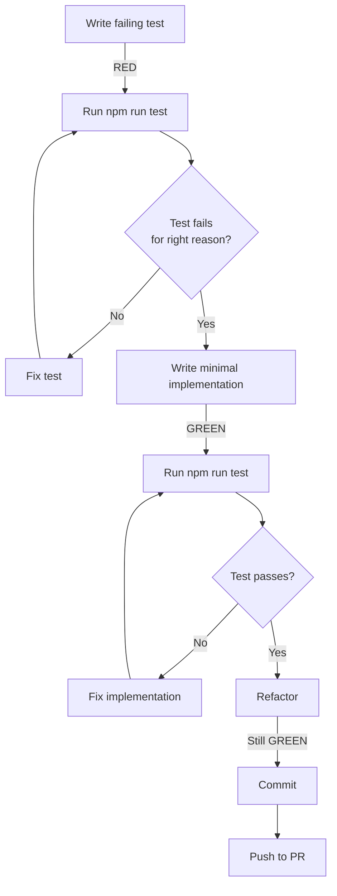

## Purpose

Define the canonical Test-Driven Development (TDD) workflow for PT-2 service development. This standard ensures consistent quality, reduces defects, and maintains the architectural guardrails established in the SERVICE_TEMPLATE and PRD.

## TDD Principles for PT-2

**Core Philosophy**: Write the test first, see it fail, make it pass, then refactor.

### Why TDD for PT-2

1. **Type Safety Enforcement** - Tests fail immediately when schema changes break contracts
2. **RLS Verification** - Integration tests validate row-level security policies before production
3. **Domain Error Mapping** - Tests document PostgreSQL error code → domain error transformations
4. **Regression Prevention** - Changes to services cannot break existing contracts
5. **Documentation** - Tests serve as executable specifications for service behavior

### Anti-Patterns to Avoid

Per `OVER_ENGINEERING_GUARDRAIL.md`:
- ❌ Writing code first, then tests as an afterthought
- ❌ Using `any` types in test doubles (breaks type safety)
- ❌ Testing implementation details instead of interfaces
- ❌ Creating test utilities before 3rd use (premature abstraction)
- ❌ Skipping integration tests for database-backed services

---

## Red-Green-Refactor Cycle

### Phase 1: RED (Write Failing Test)

**Before writing any implementation code:**

1. **Define the interface** in `services/{domain}/index.ts`
2. **Write the test** that uses this interface
3. **Run the test** and verify it fails for the right reason

```ts
// services/player/__tests__/player.service.unit.test.ts
import { describe, it, expect } from "vitest";
import type { SupabaseClient } from "@supabase/supabase-js";
import type { Database } from "@/types/database.types";
import { createPlayerService, type PlayerService } from "@/services/player";

function makeClientDouble(): SupabaseClient<Database> {
  return {
    from: (table: string) => {
      if (table !== "player") throw new Error("unexpected table");
      return {
        insert: () => ({
          select: () => ({
            single: async () => ({
              data: { id: "p1", first_name: "Ada", last_name: "Lovelace", phone: null },
              error: null
            })
          }),
        }),
      } as any;
    },
  } as SupabaseClient<Database>;
}

describe("PlayerService.create", () => {
  it("returns success envelope with player data", async () => {
    const svc: PlayerService = createPlayerService(makeClientDouble());
    const result = await svc.create({
      first_name: "Ada",
      last_name: "Lovelace"
    });

    expect(result.success).toBe(true);
    expect(result.data?.id).toBe("p1");
    expect(result.data?.first_name).toBe("Ada");
  });
});
```

**Expected Failure**: Test fails because `createPlayerService` doesn't exist yet.

### Phase 2: GREEN (Make Test Pass)

**Write the minimal implementation to pass the test:**

```ts
// services/player/index.ts
import type { SupabaseClient } from "@supabase/supabase-js";
import type { Database } from "@/types/database.types";
import type { ServiceResult } from "@/types/service";
import type { PlayerCreateDTO, PlayerDTO } from "./dto";

export interface PlayerService {
  create(data: PlayerCreateDTO): Promise<ServiceResult<PlayerDTO>>;
}

export function createPlayerService(
  supabase: SupabaseClient<Database>
): PlayerService {
  return {
    async create(data: PlayerCreateDTO): Promise<ServiceResult<PlayerDTO>> {
      const { data: player, error } = await supabase
        .from("player")
        .insert(data)
        .select("*")
        .single();

      if (error) {
        return { success: false, error: { code: "OPERATION_FAILED", message: error.message } };
      }

      return { success: true, data: player };
    },
  };
}
```

**Run test**: Should now pass.

### Phase 3: REFACTOR (Improve Design)

**Refactor while keeping tests green:**

1. Extract error mapping logic
2. Add domain-specific error codes
3. Optimize queries with named selects
4. Keep tests passing throughout

```ts
// services/player/index.ts (refactored)
import { mapPostgresError } from "./errors";
import { PLAYER_SELECT } from "./selects";

export function createPlayerService(
  supabase: SupabaseClient<Database>
): PlayerService {
  return {
    async create(data: PlayerCreateDTO): Promise<ServiceResult<PlayerDTO>> {
      const { data: player, error } = await supabase
        .from("player")
        .insert(data)
        .select(PLAYER_SELECT)
        .single();

      if (error) {
        return { success: false, error: mapPostgresError(error) };
      }

      return { success: true, data: player };
    },
  };
}
```

**Add test for error mapping:**

```ts
describe("PlayerService error handling", () => {
  it("maps duplicate constraint to PLAYER_DUPLICATE", async () => {
    const errorDouble = {
      from: () => ({
        insert: () => ({
          select: () => ({
            single: async () => ({
              data: null,
              error: { code: "23505", message: "duplicate key" }
            })
          }),
        }),
      }),
    } as SupabaseClient<Database>;

    const svc = createPlayerService(errorDouble);
    const result = await svc.create({ first_name: "Ada", last_name: "Lovelace" });

    expect(result.success).toBe(false);
    expect(result.error?.code).toBe("PLAYER_DUPLICATE");
  });
});
```

---

## TDD Workflow for Database Changes

PT-2 services are tightly coupled to the database schema. Follow this workflow when adding database-backed features:

### Step 1: Write Migration (Schema Change)

```bash
# Create migration file with proper timestamp
TIMESTAMP=$(date +"%Y%m%d%H%M%S")
touch supabase/migrations/${TIMESTAMP}_add_player_email.sql
```

```sql
-- supabase/migrations/20251118123045_add_player_email.sql
ALTER TABLE player ADD COLUMN email TEXT UNIQUE;
```

### Step 2: Apply Migration Locally

```bash
npx supabase migration up
```

### Step 3: Regenerate Types (CRITICAL)

```bash
npm run db:types
```

This updates `types/database.types.ts` with the new schema.

### Step 4: Write Failing Test (RED)

```ts
describe("PlayerService.updateEmail", () => {
  it("updates player email and returns updated player", async () => {
    const svc = createPlayerService(makeClientDouble());
    const result = await svc.updateEmail("p1", "ada@example.com");

    expect(result.success).toBe(true);
    expect(result.data?.email).toBe("ada@example.com");
  });
});
```

**Run**: `npm run test` → Test fails (method doesn't exist)

### Step 5: Implement (GREEN)

Update DTO to include email field:

```ts
// services/player/dto.ts
export type PlayerDTO = Pick<
  Database["public"]["Tables"]["player"]["Row"],
  "id" | "first_name" | "last_name" | "phone" | "email"
>;

export type PlayerUpdateEmailDTO = {
  email: string;
};
```

Add method to service:

```ts
// services/player/index.ts
export interface PlayerService {
  create(data: PlayerCreateDTO): Promise<ServiceResult<PlayerDTO>>;
  updateEmail(id: string, email: string): Promise<ServiceResult<PlayerDTO>>;
}

export function createPlayerService(
  supabase: SupabaseClient<Database>
): PlayerService {
  return {
    // ... existing methods

    async updateEmail(id: string, email: string): Promise<ServiceResult<PlayerDTO>> {
      const { data: player, error } = await supabase
        .from("player")
        .update({ email })
        .eq("id", id)
        .select(PLAYER_SELECT)
        .single();

      if (error) {
        return { success: false, error: mapPostgresError(error) };
      }

      return { success: true, data: player };
    },
  };
}
```

**Run**: `npm run test` → Test passes

### Step 6: Add Integration Test

```ts
// services/player/__tests__/player.service.int.test.ts
describe("PlayerService.updateEmail (integration)", () => {
  it("enforces unique email constraint", async () => {
    const supabase = createClient(process.env.SUPABASE_TEST_URL!, process.env.SUPABASE_TEST_KEY!);
    const svc = createPlayerService(supabase);

    // Create two players
    await svc.create({ first_name: "Ada", last_name: "Lovelace" });
    const player2 = await svc.create({ first_name: "Grace", last_name: "Hopper" });

    // Try to use duplicate email
    const result = await svc.updateEmail(player2.data!.id, "ada@example.com");

    expect(result.success).toBe(false);
    expect(result.error?.code).toBe("PLAYER_EMAIL_DUPLICATE");
  });
});
```

---

## Testing Layers & TDD

### Unit Tests (Mandatory - 40% of tests)

**When**: Every service method

**Approach**:
1. Write test first using typed Supabase double
2. Implement minimal service logic
3. Refactor with error mapping

**Coverage Target**: 90%+ for service modules

**Example**: See Phase 1-3 above

### Integration Tests (Targeted - 20% of tests)

**When**:
- Database constraints (unique, FK, check)
- RLS policies
- Triggers and computed columns
- Multi-table transactions

**Approach**:
1. Write test against real local Supabase
2. Seed required data
3. Assert constraint behavior
4. Clean up test data

**Coverage Target**: 85%+ for business workflows

**Example**:

```ts
// services/rating-slip/__tests__/rating-slip.service.int.test.ts
describe("RatingSlipService.close (integration)", () => {
  beforeAll(async () => {
    // Seed casino, staff, player, visit
  });

  it("prevents closing slip twice", async () => {
    const svc = createRatingSlipService(supabase);
    const slip = await svc.create({ /* ... */ });

    await svc.close(slip.data!.id);
    const result = await svc.close(slip.data!.id); // Second close

    expect(result.success).toBe(false);
    expect(result.error?.code).toBe("RATING_SLIP_ALREADY_CLOSED");
  });
});
```

### E2E Tests (Critical Flows - 10% of tests)

**When**: User-facing workflows spanning multiple services

**Approach**:
1. Define user story acceptance criteria
2. Write Cypress test
3. Implement services with TDD
4. Verify E2E test passes

**Coverage Target**: 100% of critical user journeys

**Example**:

```ts
// cypress/e2e/player-lifecycle.cy.ts
describe("Player Lifecycle", () => {
  it("creates player, starts visit, issues rating slip, closes slip", () => {
    cy.visit("/players");
    cy.findByRole("button", { name: /add player/i }).click();
    cy.findByLabelText(/first name/i).type("Ada");
    cy.findByLabelText(/last name/i).type("Lovelace");
    cy.findByRole("button", { name: /save/i }).click();

    // Assert player appears in list
    cy.findByText("Ada Lovelace").should("exist");

    // Start visit workflow...
  });
});
```

---

## TDD Workflow Integration

### Daily Development Workflow



### Pre-Commit Checklist

- [ ] All unit tests pass (`npm run test`)
- [ ] Integration tests pass if DB changes (`npm run test:int`)
- [ ] Types regenerated after migrations (`npm run db:types`)
- [ ] Schema verification test passes
- [ ] Coverage targets met (80%+ minimum)
- [ ] No `any` types in service or test code
- [ ] No `ReturnType<>` inference

### PR Review Checklist

- [ ] Tests written before implementation
- [ ] Test coverage meets layer targets (QA-001)
- [ ] Typed doubles used (no `any` escapes)
- [ ] Integration tests verify constraints/RLS
- [ ] Error mapping tests for domain errors
- [ ] Tests use explicit interfaces (not `ReturnType`)

---

## Common TDD Patterns

### Pattern 1: Testing Domain Error Mapping

```ts
describe("error mapping", () => {
  it("maps PGRST116 to NOT_FOUND", async () => {
    const errorDouble = {
      from: () => ({
        select: () => ({
          eq: () => ({
            single: async () => ({
              data: null,
              error: { code: "PGRST116", message: "not found" }
            })
          }),
        }),
      }),
    } as SupabaseClient<Database>;

    const svc = createPlayerService(errorDouble);
    const result = await svc.getById("invalid-id");

    expect(result.success).toBe(false);
    expect(result.error?.code).toBe("NOT_FOUND");
  });
});
```

### Pattern 2: Testing RLS Enforcement

```ts
// Integration test with different user contexts
describe("RLS enforcement", () => {
  it("prevents cross-casino data access", async () => {
    const casino1Client = createClient(/* casino 1 context */);
    const casino2Client = createClient(/* casino 2 context */);

    const svc1 = createPlayerService(casino1Client);
    const svc2 = createPlayerService(casino2Client);

    const player = await svc1.create({ first_name: "Ada", last_name: "Lovelace" });
    const result = await svc2.getById(player.data!.id);

    expect(result.success).toBe(false);
    expect(result.error?.code).toBe("NOT_FOUND"); // RLS blocks access
  });
});
```

### Pattern 3: Testing Idempotency

```ts
describe("idempotency", () => {
  it("returns same player on duplicate create", async () => {
    const svc = createPlayerService(supabase);

    const result1 = await svc.create({
      first_name: "Ada",
      last_name: "Lovelace",
      phone: "555-1234"
    });

    const result2 = await svc.create({
      first_name: "Ada",
      last_name: "Lovelace",
      phone: "555-1234"
    });

    expect(result1.data?.id).toBe(result2.data?.id);
  });
});
```

### Pattern 4: Testing Temporal Logic

```ts
describe("gaming day computation", () => {
  it("assigns correct gaming day for 2 AM transaction", async () => {
    // Mock system time to 2:00 AM on Nov 18
    const mockDate = new Date("2025-11-18T02:00:00Z");
    vi.setSystemTime(mockDate);

    const svc = createRatingSlipService(supabase);
    const slip = await svc.create({ /* ... */ });

    // 2 AM should belong to previous calendar day's gaming day
    expect(slip.data?.gaming_day).toBe("2025-11-17");

    vi.useRealTimers();
  });
});
```

---

## TDD Metrics & Quality Gates

### Code Coverage Targets

Per `QA-001-service-testing-strategy.md`:

| Layer | Minimum Coverage | Enforcement |
|-------|------------------|-------------|
| Service CRUD | 90% | CI fails |
| Service workflows | 85% | CI fails |
| DTO mappers | 100% | CI fails |
| Action layer | 80% | CI fails |
| UI components | 70% | CI warning |

### CI Quality Gates

```yaml
# .github/workflows/test.yml
- name: Run unit tests
  run: npm run test -- --coverage

- name: Check coverage thresholds
  run: |
    npm run test:coverage-check
    # Fails if below thresholds

- name: Run integration tests
  run: npm run test:int
  env:
    SUPABASE_TEST_URL: ${{ secrets.SUPABASE_TEST_URL }}
    SUPABASE_TEST_KEY: ${{ secrets.SUPABASE_TEST_KEY }}
```

### Test Performance Budgets

- **Unit tests**: < 5 seconds total
- **Integration tests**: < 30 seconds total
- **E2E tests**: < 5 minutes total

Tests exceeding budgets should be optimized or split.

---

## Migration from Existing Code

### Retrofitting Tests to Existing Services

1. **Audit existing code**: Identify untested methods
2. **Write characterization tests**: Capture current behavior
3. **Refactor**: Improve design while keeping tests green
4. **Add missing scenarios**: Edge cases, errors, constraints

### Priority Order

1. **Critical paths**: Player CRUD, Visit lifecycle, Rating Slip workflows
2. **High-risk areas**: Loyalty calculations, MTL compliance, temporal logic
3. **Shared utilities**: Error mapping, validation, DTOs
4. **UI components**: Forms, data tables, modals

---

## References

### Internal Documents

- **QA-001**: Service & Layered Testing Strategy
- **QA-003**: Service Testing Patterns & Examples
- **GOV-001**: Service Template (Section 10: Testing Pattern)
- **GOV-PAT-001**: Service Factory Pattern (testing examples)
- **RUN-003**: Schema Migration Runbook (type regeneration)

### External Resources

- [Vitest Documentation](https://vitest.dev/)
- [Testing Library - Guiding Principles](https://testing-library.com/docs/guiding-principles/)
- [Kent C. Dodds - Write Tests. Not Too Many. Mostly Integration.](https://kentcdodds.com/blog/write-tests)

---

## Review Schedule

- **Weekly**: Team retrospective on TDD adoption
- **Sprint End**: Coverage metrics review
- **Monthly**: Quality gate effectiveness analysis
- **Quarterly**: TDD process refinement

---

## Ownership & Approval

| Role | Responsibility |
|------|----------------|
| QA Lead | Standard maintenance, metrics tracking |
| Engineering Lead | Enforcement, PR reviews |
| Developers | Daily adherence, feedback |

**Last Reviewed**: 2025-11-18
**Next Review**: 2025-12-18
