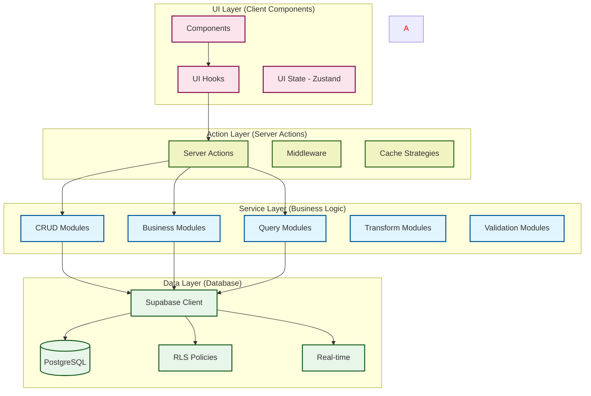
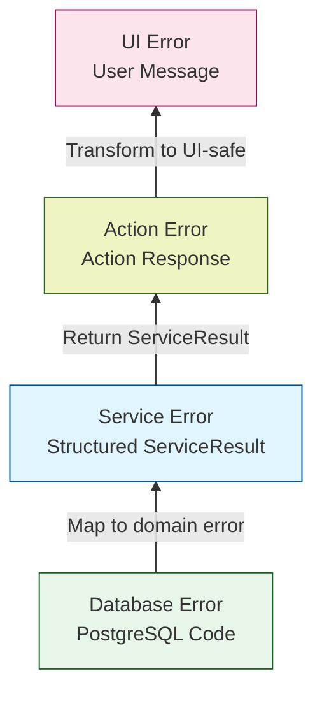
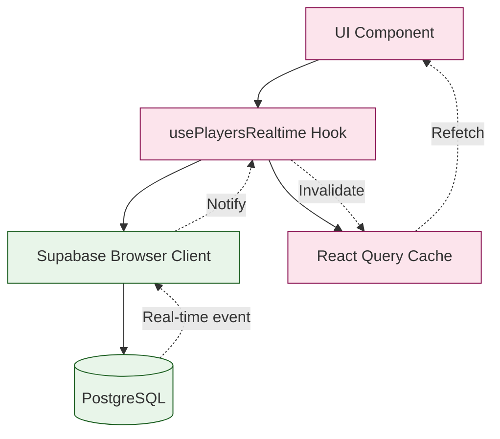

# Feature-Based Horizontal Layering Analysis for PT-2

> **Date**: 2025-10-09
> **Status**: Architecture Recommendation
> **Purpose**: Define horizontal layer structure, responsibilities, and implementation sequencing for PT-2 Casino Tracker

---

## Executive Summary

**Recommendation**: Adopt a **4-layer horizontal architecture** with **bottom-up implementation** and **domain-driven vertical slicing**.

**Key Insight**: PT-2's current functional service pattern already aligns with horizontal layering principles. This document formalizes layer boundaries, sequencing strategy, and cross-layer communication patterns to maximize reusability while maintaining bounded context integrity.

**Critical Decision**: Implement **feature-complete vertical slices** (Database → Service → Action → UI) per domain before expanding horizontally across domains. This balances architectural consistency with rapid delivery.

---

## 1. Layer Definition & Responsibilities

### 1.1 Four-Layer Architecture



---

### 1.2 Layer Responsibility Matrix

| Layer | Primary Responsibility | Owns | Does NOT Own | Example Files |
|-------|------------------------|------|--------------|---------------|
| **Data Layer** | Database access, schema enforcement, RLS, real-time subscriptions | • Schema definitions<br>• RLS policies<br>• Database triggers<br>• Type generation<br>• Connection management | • Business logic<br>• Validation rules<br>• DTO transformation<br>• API contracts | • `database.types.ts`<br>• `supabase/migrations/*.sql`<br>• `lib/supabase/client.ts`<br>• `lib/supabase/server.ts` |
| **Service Layer** | Business logic, domain operations, data transformation, validation | • Domain DTOs<br>• Business rules<br>• CRUD operations<br>• Data transformations<br>• Schema validation<br>• Error handling<br>• ServiceResult contracts | • HTTP routing<br>• Cache invalidation<br>• UI state<br>• Database schema<br>• Client instantiation | • `services/player/crud.ts`<br>• `services/player/business.ts`<br>• `services/player/queries.ts`<br>• `services/shared/operation-wrapper.ts` |
| **Action Layer** | Orchestration, server-side execution, cache management, authorization | • Service orchestration<br>• Cache strategies<br>• revalidatePath/Tag<br>• Authorization checks<br>• Action-level logging<br>• Input sanitization | • Business logic<br>• Database access<br>• UI rendering<br>• Client-side state<br>• Real-time subscriptions | • `app/actions/player/create-player-action.ts`<br>• `app/actions/visit/start-visit-action.ts`<br>• `middleware.ts` |
| **UI Layer** | Rendering, user interaction, optimistic updates, client-side state | • Component composition<br>• UI state (Zustand)<br>• React Query hooks<br>• User input handling<br>• Optimistic updates<br>• Real-time UI sync | • Server actions<br>• Business logic<br>• Database access<br>• Validation (relies on service) | • `app/players/page.tsx`<br>• `components/player-list.tsx`<br>• `hooks/use-players.ts`<br>• `store/ui-store.ts` |

---

### 1.3 Cross-Layer Dependency Rules

**Dependency Flow**: Top-down only (UI → Action → Service → Data)

```
✅ ALLOWED:
UI Layer     → Action Layer    (Server Actions)
Action Layer → Service Layer   (Service factories)
Service Layer → Data Layer     (Supabase client)

❌ FORBIDDEN:
Service Layer → Action Layer   (Services never call actions)
Service Layer → UI Layer       (Services never import React/UI)
Data Layer    → Service Layer  (No circular dependencies)
UI Layer      → Service Layer  (Direct service calls - use actions)
```

**Inter-Layer Communication**:

1. **UI → Action**: React Query hooks calling server actions
   ```typescript
   // hooks/use-create-player.ts
   import { useMutation } from '@tanstack/react-query';
   import { createPlayerAction } from '@/app/actions/player/create-player-action';

   export function useCreatePlayer() {
     return useMutation({
       mutationFn: createPlayerAction,
       onSuccess: () => {
         queryClient.invalidateQueries(['players']);
       }
     });
   }
   ```

2. **Action → Service**: Service factory instantiation with dependency injection
   ```typescript
   // app/actions/player/create-player-action.ts
   export async function createPlayerAction(input: CreatePlayerInput) {
     const supabase = await createServerClient();
     const playerService = createPlayerService(supabase); // DI
     return playerService.create(input);
   }
   ```

3. **Service → Data**: Typed Supabase client access
   ```typescript
   // services/player/crud.ts
   export function createPlayerCrudService(
     supabase: SupabaseClient<Database>
   ) {
     return {
       create: async (data) => {
         const { data: player, error } = await supabase
           .from('player')
           .insert(data)
           .select()
           .single();
         // ...
       }
     };
   }
   ```

---

## 2. Layer-Specific Concerns

### 2.1 Validation Strategy (Multi-Layer)

**Principle**: Defense in depth - validate at every boundary

| Layer | Validation Type | Tool | Example |
|-------|-----------------|------|---------|
| **Data Layer** | Schema constraints | PostgreSQL CHECK, NOT NULL, FK | `CHECK (email ~* '^[A-Za-z0-9._%+-]+@[A-Za-z0-9.-]+\.[A-Z]{2,}$')` |
| **Service Layer** | Business rules | Zod schemas | `playerCreateSchema.parse(data)` |
| **Action Layer** | Input sanitization | Zod + custom validators | `sanitizeInput(actionInput)` |
| **UI Layer** | UX validation | React Hook Form + Zod | `useForm({ resolver: zodResolver(schema) })` |

**Example: Player Email Validation**

```typescript
// Data Layer: supabase/migrations/xxx_create_player.sql
CREATE TABLE player (
  email TEXT NOT NULL UNIQUE CHECK (email ~* '^[A-Za-z0-9._%+-]+@[A-Za-z0-9.-]+\.[A-Z]{2,}$')
);

// Service Layer: services/player/validation.ts
export const playerCreateSchema = z.object({
  email: z.string().email(),
  firstName: z.string().min(1).max(100),
  lastName: z.string().min(1).max(100),
});

// Action Layer: app/actions/player/create-player-action.ts
export async function createPlayerAction(input: CreatePlayerInput) {
  // Additional server-side checks if needed
  const sanitized = sanitizeInput(input);
  // ...
}

// UI Layer: components/player-form.tsx
const form = useForm({
  resolver: zodResolver(playerCreateSchema),
  defaultValues: { email: '', firstName: '', lastName: '' }
});
```

---

### 2.2 Error Handling Strategy (Multi-Layer)

**Principle**: Transform errors as they bubble up layers



**Error Transformation Example**:

```typescript
// Data Layer: PostgreSQL returns 23505 (unique violation)
// Service Layer: services/player/crud.ts
if (error.code === '23505') {
  throw {
    code: 'DUPLICATE_EMAIL',
    message: 'A player with this email already exists',
    details: error
  };
}

// Service wraps in ServiceResult
return {
  data: null,
  error: { code: 'DUPLICATE_EMAIL', message: '...', details: {...} },
  success: false,
  status: 400
};

// Action Layer: app/actions/player/create-player-action.ts
const result = await playerService.create(input);
return {
  data: result.data,
  error: result.error,
  success: result.success
};

// UI Layer: components/player-form.tsx
const { mutate, error } = useCreatePlayer();
if (error?.code === 'DUPLICATE_EMAIL') {
  toast.error('This email is already registered');
}
```

---

### 2.3 Transformation Strategy

**Principle**: Transform data shape at layer boundaries

| Transformation | From | To | Layer | Tool |
|----------------|------|----|----|------|
| **Database Row → DTO** | `Database["public"]["Tables"]["player"]["Row"]` | `PlayerDTO` | Service (Transform module) | `toPlayerDTO()` |
| **DTO → View Model** | `PlayerDTO` | `PlayerViewModel` | Action or UI | `toPlayerViewModel()` |
| **Form Input → Action Input** | `FormData` | `CreatePlayerInput` | UI | `parseFormData()` |
| **Action Input → Service DTO** | `CreatePlayerInput` | `PlayerCreateDTO` | Action | Direct mapping or adapter |

**Example: Player Data Transformation Pipeline**

```typescript
// 1. Data Layer: Raw database row
type PlayerRow = Database["public"]["Tables"]["player"]["Row"];
// { id, email, firstName, lastName, createdAt, updatedAt, ... }

// 2. Service Layer: Domain DTO (services/player/transforms.ts)
export type PlayerDTO = Pick<PlayerRow, "id" | "email" | "firstName" | "lastName">;

export function toPlayerDTO(row: PlayerRow): PlayerDTO {
  return {
    id: row.id,
    email: row.email,
    firstName: row.firstName,
    lastName: row.lastName,
  };
}

// 3. Action Layer: Action response (app/actions/player/create-player-action.ts)
export interface CreatePlayerResult {
  data: PlayerDTO | null;
  error: ServiceError | null;
  success: boolean;
}

// 4. UI Layer: View model for display (hooks/use-player-view-model.ts)
export interface PlayerViewModel {
  id: string;
  fullName: string;      // Computed: firstName + lastName
  emailDisplay: string;  // Formatted for display
}

export function toPlayerViewModel(dto: PlayerDTO): PlayerViewModel {
  return {
    id: dto.id,
    fullName: `${dto.firstName} ${dto.lastName}`,
    emailDisplay: dto.email.toLowerCase(),
  };
}
```

---

## 3. Implementation Sequencing Strategy

### 3.1 Recommended Approach: **Bottom-Up with Vertical Slicing**

**Rationale**:
1. **Foundation First**: Data layer provides schema stability before building on top
2. **Testability**: Each layer can be tested in isolation as it's built
3. **Dependency Clarity**: Higher layers naturally depend on lower layers
4. **Iterative Delivery**: Complete vertical slices deliver working features

**Sequencing Pattern**:

```
For each domain (Player, Visit, RatingSlip, etc.):

Phase 1: Data Layer (1 day)
├─ Write migration (schema, RLS, triggers)
├─ Generate types (database.types.ts)
├─ Test schema (constraints, policies)
└─ Commit + deploy to remote

Phase 2: Service Layer (2 days)
├─ CRUD module (Day 1 morning)
├─ Business module (Day 1 afternoon)
├─ Queries module (Day 2 morning)
├─ Transforms module (Day 2 morning)
├─ Validation module (Day 2 morning)
├─ Integration tests (Day 2 afternoon)
└─ Commit

Phase 3: Action Layer (1 day)
├─ Server actions (morning)
├─ Cache strategies (afternoon)
├─ Authorization middleware (afternoon)
├─ Action tests (afternoon)
└─ Commit

Phase 4: UI Layer (2 days)
├─ React Query hooks (Day 1 morning)
├─ Components (Day 1 afternoon)
├─ Forms + validation (Day 2 morning)
├─ Real-time integration (Day 2 afternoon)
├─ E2E tests (Day 2 afternoon)
└─ Commit + demo

Total: 6 days per domain (vertical slice)
```

---

### 3.2 Alternative Approach: **Top-Down** (NOT Recommended)

**Why Not Top-Down?**
- ❌ UI layer has no data to render without services
- ❌ Requires extensive mocking/stubbing
- ❌ High rework risk when lower layers change
- ❌ Difficult to test in isolation

**Only Use Top-Down When**:
- Prototyping UI/UX with fake data
- Validating user workflows before implementation
- Exploratory design sessions

---

### 3.3 Alternative Approach: **Middle-Out** (Conditional)

**Service-First Approach**:
```
1. Service Layer (2 days) - Define DTOs and operations
2. Data Layer (1 day) - Implement schema to match DTOs
3. Action Layer (1 day) - Wire services to server actions
4. UI Layer (2 days) - Build on stable contracts
```

**When to Use Middle-Out**:
- ✅ Schema is unstable/unknown
- ✅ API contracts need exploration
- ✅ Domain modeling requires iteration

**Risks**:
- ⚠️ Service DTOs may not align with optimal schema
- ⚠️ Potential for over-engineering without database constraints
- ⚠️ Rework if database enforces different structure

---

### 3.4 Current PT-2 Status (Phase 2 Assessment)

**Implemented Domains** (Bottom-Up):
- ✅ Player: Data → Service → Action → (UI pending)
- ✅ Visit: Data → Service → (Action/UI pending)
- ✅ RatingSlip: Data → Service → (Action/UI pending)
- ✅ PlayerFinancial: Data → Service → (Action/UI pending)

**Remaining Domains**:
- 🔄 Casino: Data → Service → (Action/UI pending)
- 🔄 TableContext: Data → Service → (Action/UI pending)
- 🔄 MTL: Data → Service → (Action/UI pending)

**Recommendation**: Continue bottom-up approach for remaining domains, then complete vertical slices for MVP features (Player management, Visit tracking, Rating slip creation).

---

## 4. Shared Infrastructure & Reusability

### 4.1 Horizontal Reusability Matrix

| Component | Layer | Reusable Across Domains | Example Files |
|-----------|-------|-------------------------|---------------|
| **Operation Wrapper** | Service | ✅ All services | `services/shared/operation-wrapper.ts` |
| **ServiceResult Type** | Service | ✅ All services | `services/shared/types.ts` |
| **Error Handling** | Service | ✅ All services | `services/shared/operation-wrapper.ts` |
| **Validation Schemas** | Service | ⚠️ Domain-specific but shared patterns | `services/player/validation.ts` |
| **DTO Transformations** | Service | ❌ Domain-specific | `services/player/transforms.ts` |
| **Supabase Client** | Data | ✅ All layers | `lib/supabase/client.ts`, `lib/supabase/server.ts` |
| **React Query Config** | UI | ✅ All hooks | `lib/query-client.ts` |
| **Server Action Wrapper** | Action | ✅ All actions | `lib/with-server-action-wrapper.ts` (future) |
| **Cache Strategies** | Action | ⚠️ Shared patterns, custom per domain | `app/actions/*/invalidation-helpers.ts` |

---

### 4.2 Shared Infrastructure Architecture

```typescript
// services/shared/operation-wrapper.ts
// ✅ SHARED: Universal error handling and result wrapping
export async function executeOperation<T>(
  label: string,
  operation: () => Promise<T>,
  options?: OperationOptions
): Promise<ServiceResult<T>> {
  // Centralized error mapping, logging, telemetry
}

// services/shared/types.ts
// ✅ SHARED: Standard result contracts
export interface ServiceResult<T> {
  data: T | null;
  error: ServiceError | null;
  success: boolean;
  status: number;
  timestamp: string;
  requestId: string;
}

// services/player/validation.ts
// ⚠️ DOMAIN-SPECIFIC: Reusable pattern but custom schemas
export const playerCreateSchema = z.object({
  email: z.string().email(),
  firstName: z.string().min(1).max(100),
  lastName: z.string().min(1).max(100),
});

// services/player/transforms.ts
// ❌ DOMAIN-SPECIFIC: Not reusable across domains
export function toPlayerDTO(row: PlayerRow): PlayerDTO {
  return {
    id: row.id,
    email: row.email,
    firstName: row.firstName,
    lastName: row.lastName,
  };
}
```

---

### 4.3 DRY Principles & Trade-offs

**Apply DRY When**:
- ✅ Shared infrastructure (operation wrappers, types, utilities)
- ✅ Common patterns (validation schemas, error handling)
- ✅ Cross-cutting concerns (logging, telemetry, caching)

**Avoid Premature Abstraction When**:
- ❌ Domain-specific transformations (force-fitting DTOs)
- ❌ Business rules (coupling unrelated domains)
- ❌ Validation logic (different domains have different constraints)

**Trade-off Example**:

```typescript
// ✅ GOOD: Shared pattern, domain-specific implementation
export function createValidationSchema<T>(fields: FieldDefinitions<T>) {
  // Reusable validation factory pattern
}

const playerSchema = createValidationSchema({
  email: z.string().email(),
  firstName: z.string().min(1),
});

const casinoSchema = createValidationSchema({
  name: z.string().min(3),
  address: z.string(),
});

// ❌ BAD: Over-abstraction forcing domains to share DTOs
interface GenericEntityDTO<T> {
  id: string;
  data: T;
  metadata: unknown;
}
// PlayerDTO, CasinoDTO forced into same shape - domain coupling
```

---

## 5. Testing Strategy by Layer

### 5.1 Layer-Specific Testing Approaches

| Layer | Test Type | What to Test | Mock Boundaries | Tools |
|-------|-----------|--------------|-----------------|-------|
| **Data Layer** | Schema Tests | • Constraints<br>• RLS policies<br>• Triggers<br>• Migrations | N/A (direct DB) | SQL test scripts, Supabase CLI |
| **Service Layer** | Unit Tests | • CRUD operations<br>• Business logic<br>• Transformations<br>• Error handling | Mock Supabase client | Jest + mock clients |
| **Service Layer** | Integration Tests | • Real DB queries<br>• Transaction behavior<br>• RLS enforcement | Use test database | Jest + real Supabase |
| **Action Layer** | Integration Tests | • Service orchestration<br>• Cache invalidation<br>• Authorization | Mock services or use test DB | Jest + Next.js test utils |
| **UI Layer** | Unit Tests | • Component rendering<br>• User interactions<br>• State management | Mock React Query + actions | Jest + RTL |
| **UI Layer** | E2E Tests | • Complete user flows<br>• Real-time updates<br>• Form validation | Real app + test DB | Cypress |

---

### 5.2 Testing Pyramid for PT-2

```
              /\
             /  \  E2E Tests (Cypress)
            /    \  • Complete workflows (10%)
           /------\
          /        \  Integration Tests (Jest)
         /          \  • Service + DB (30%)
        /            \  • Action orchestration (10%)
       /--------------\
      /                \  Unit Tests (Jest + RTL)
     /                  \  • Service logic (40%)
    /                    \  • UI components (10%)
   /______________________\
```

**Test Distribution**:
- **60% Unit Tests**: Service layer (40%), UI components (10%), Transforms/Validation (10%)
- **30% Integration Tests**: Service + Database (20%), Actions (10%)
- **10% E2E Tests**: Critical user flows (Player CRUD, Visit lifecycle, Rating slip creation)

---

### 5.3 Mock Boundaries by Layer

```typescript
// 1. SERVICE LAYER UNIT TESTS: Mock Supabase Client
// __tests__/services/player/player-service.test.ts
const mockSupabase = {
  from: jest.fn().mockReturnValue({
    select: jest.fn().mockReturnValue({
      eq: jest.fn().mockResolvedValue({ data: mockPlayer, error: null })
    })
  })
} as unknown as SupabaseClient<Database>;

const playerService = createPlayerService(mockSupabase);
const result = await playerService.getById('123');

// 2. SERVICE LAYER INTEGRATION TESTS: Real Supabase Test DB
// __tests__/services/player/player-integration.test.ts
const supabase = createClient(process.env.SUPABASE_TEST_URL, process.env.SUPABASE_TEST_KEY);
const playerService = createPlayerService(supabase);
const result = await playerService.create({ email: 'test@example.com', ... });
// Verify data in real database

// 3. ACTION LAYER TESTS: Mock Service Layer
// __tests__/actions/player/create-player-action.test.ts
jest.mock('@/services/player', () => ({
  createPlayerService: jest.fn().mockReturnValue({
    create: jest.fn().mockResolvedValue({ data: mockPlayer, success: true })
  })
}));

const result = await createPlayerAction(input);

// 4. UI LAYER TESTS: Mock Server Actions + React Query
// __tests__/components/player-form.test.tsx
jest.mock('@/app/actions/player/create-player-action', () => ({
  createPlayerAction: jest.fn().mockResolvedValue({ success: true, data: mockPlayer })
}));

render(<PlayerForm />);
// Test UI interactions
```

---

### 5.4 Test Coverage Targets (Minimum)

| Layer | Module | Coverage Target | Critical Paths |
|-------|--------|-----------------|----------------|
| **Data Layer** | Migrations | 100% (automated) | All constraints, policies, triggers |
| **Service Layer** | CRUD | 90% | Happy path + error cases (NOT_FOUND, duplicates, validation) |
| **Service Layer** | Business | 85% | Workflow steps, state transitions, concurrency |
| **Service Layer** | Queries | 80% | Complex joins, aggregations, filters |
| **Service Layer** | Transforms | 100% | DTO mappings (deterministic, snapshot tests) |
| **Service Layer** | Validation | 100% | All schema constraints |
| **Action Layer** | Server Actions | 80% | Orchestration, cache invalidation, auth |
| **UI Layer** | Components | 70% | User interactions, conditional rendering |
| **E2E** | User Flows | 100% of critical paths | CRUD operations, session lifecycle |

---

## 6. Real-Time Subscription Strategy

### 6.1 Layer Placement

**Decision**: Real-time subscriptions live in **UI Layer**, not Service Layer

**Rationale**:
- ✅ Real-time is a UI concern (keeping display in sync)
- ✅ Subscriptions require React lifecycle (mount/unmount cleanup)
- ✅ Service layer stays pure and stateless
- ❌ Services should not manage WebSocket connections

**Anti-Pattern from PT-1** (AVOID):
```typescript
// ❌ BAD: Global real-time manager in service layer
class RealtimeManager {
  private static instance: RealtimeManager;
  private connections: Map<string, RealtimeChannel>;

  subscribe(table: string, callback: (data: unknown) => void) {
    // Global state, singleton pattern - breaks service purity
  }
}
```

**Correct Pattern for PT-2**:
```typescript
// ✅ GOOD: Domain-specific hook in UI layer
// hooks/use-players-realtime.ts
export function usePlayersRealtime() {
  const queryClient = useQueryClient();
  const supabase = createBrowserClient();

  useEffect(() => {
    const channel = supabase
      .channel('players-changes')
      .on('postgres_changes',
        { event: '*', schema: 'public', table: 'player' },
        () => {
          // Batch invalidation using scheduler pattern
          scheduleInvalidation(() => {
            queryClient.invalidateQueries(['players']);
          });
        }
      )
      .subscribe();

    return () => {
      channel.unsubscribe();
    };
  }, []);
}
```

---

### 6.2 Real-Time Integration Points



**Flow**:
1. User in UI A creates a player (via server action)
2. PostgreSQL fires change event
3. Supabase broadcasts to subscribed clients
4. UI B's `usePlayersRealtime` hook receives event
5. Hook batches invalidation (scheduler pattern)
6. React Query refetches stale data
7. UI B re-renders with new player

---

## 7. Practical Implementation Guidance

### 7.1 Feature Development Workflow (Bottom-Up)

**Scenario**: Implement "Player Management" feature

```
Step 1: Data Layer (Day 1 - Morning)
───────────────────────────────────────
File: supabase/migrations/xxx_create_player.sql

CREATE TABLE player (
  id UUID PRIMARY KEY DEFAULT gen_random_uuid(),
  email TEXT NOT NULL UNIQUE CHECK (email ~* '^[A-Za-z0-9._%+-]+@'),
  "firstName" TEXT NOT NULL,
  "lastName" TEXT NOT NULL,
  created_at TIMESTAMPTZ DEFAULT now()
);

-- RLS policies
ALTER TABLE player ENABLE ROW LEVEL SECURITY;
CREATE POLICY "Players viewable by authenticated users"
  ON player FOR SELECT
  TO authenticated
  USING (true);

Commands:
  $ supabase migration new create_player
  $ supabase db push
  $ npm run gen:types


Step 2: Service Layer (Day 1 - Afternoon + Day 2)
──────────────────────────────────────────────────
Files:
  services/player/index.ts        (Factory + interface)
  services/player/crud.ts         (CRUD operations)
  services/player/business.ts     (Business workflows)
  services/player/queries.ts      (Search, filters)
  services/player/transforms.ts   (DTO mapping)
  services/player/validation.ts   (Zod schemas)

Tests:
  __tests__/services/player/player-service.test.ts
  __tests__/services/player/crud.test.ts

Commands:
  $ npm test -- __tests__/services/player


Step 3: Action Layer (Day 3 - Morning)
───────────────────────────────────────
Files:
  app/actions/player/create-player-action.ts
  app/actions/player/update-player-action.ts
  app/actions/player/delete-player-action.ts

Tests:
  __tests__/actions/player/create-player.test.ts

Commands:
  $ npm test -- __tests__/actions/player


Step 4: UI Layer (Day 3 - Afternoon + Day 4)
─────────────────────────────────────────────
Files:
  hooks/use-players.ts           (React Query hook)
  hooks/use-create-player.ts     (Mutation hook)
  hooks/use-players-realtime.ts  (Real-time sync)
  components/player-list.tsx     (List component)
  components/player-form.tsx     (Form component)
  app/players/page.tsx           (Page route)

Tests:
  __tests__/components/player-list.test.tsx
  cypress/e2e/player-management.cy.ts

Commands:
  $ npm test -- __tests__/components/player
  $ npm run cypress:run


Step 5: Integration & Demo (Day 4 - Afternoon)
───────────────────────────────────────────────
  $ npm run dev
  Navigate to /players
  Test: Create, update, delete players
  Test: Real-time sync across tabs
  Verify: RLS policies working
  Review: Test coverage report
```

---

### 7.2 Cross-Layer Communication Examples

**Example 1: Creating a Player (Happy Path)**

```typescript
// 1. UI Layer: User submits form
// components/player-form.tsx
const { mutate } = useCreatePlayer();

const handleSubmit = (formData: PlayerFormData) => {
  mutate({
    email: formData.email,
    firstName: formData.firstName,
    lastName: formData.lastName,
  });
};

// 2. UI Hook: React Query mutation
// hooks/use-create-player.ts
export function useCreatePlayer() {
  return useMutation({
    mutationFn: createPlayerAction,
    onSuccess: () => {
      queryClient.invalidateQueries(['players']);
      toast.success('Player created!');
    }
  });
}

// 3. Action Layer: Server action orchestration
// app/actions/player/create-player-action.ts
export async function createPlayerAction(input: CreatePlayerInput) {
  const supabase = await createServerClient();
  const playerService = createPlayerService(supabase);

  const result = await playerService.create({
    email: input.email,
    firstName: input.firstName,
    lastName: input.lastName,
  });

  if (result.success) {
    revalidatePath('/players');
  }

  return {
    data: result.data,
    error: result.error,
    success: result.success,
  };
}

// 4. Service Layer: Business logic
// services/player/crud.ts
export function createPlayerCrudService(supabase: SupabaseClient<Database>) {
  return {
    create: async (data: PlayerCreateDTO): Promise<ServiceResult<PlayerDTO>> => {
      return executeOperation<PlayerDTO>('create_player', async () => {
        const { data: player, error } = await supabase
          .from('player')
          .insert({
            email: data.email,
            firstName: data.firstName,
            lastName: data.lastName,
          })
          .select('id, email, firstName, lastName')
          .single();

        if (error) {
          if (error.code === '23505') {
            throw { code: 'DUPLICATE_EMAIL', message: 'Email already exists' };
          }
          throw error;
        }

        return player;
      });
    }
  };
}

// 5. Data Layer: PostgreSQL execution
-- RLS policy enforced
-- Constraint check (email unique)
-- Trigger (audit log)
-- Insert successful
```

---

**Example 2: Error Handling Across Layers**

```typescript
// Data Layer: PostgreSQL constraint violation
-- UNIQUE constraint on email (error code 23505)

// Service Layer: Map to domain error
if (error.code === '23505') {
  throw {
    code: 'DUPLICATE_EMAIL',
    message: 'A player with this email already exists',
    details: error
  };
}
// Wrapped in ServiceResult
return {
  data: null,
  error: { code: 'DUPLICATE_EMAIL', message: '...' },
  success: false,
  status: 400
};

// Action Layer: Pass through or enhance
const result = await playerService.create(input);
// Could add action-level logging here
return result;

// UI Layer: User-friendly display
const { mutate, error } = useCreatePlayer();

if (error?.code === 'DUPLICATE_EMAIL') {
  toast.error('This email is already registered. Please use a different email.');
  form.setError('email', { message: 'Email already exists' });
}
```

---

## 8. Trade-offs & Risk Assessment

### 8.1 Architecture Trade-offs

| Approach | Advantages | Disadvantages | Mitigation |
|----------|-----------|---------------|------------|
| **Bottom-Up Sequencing** | • Stable foundation<br>• Testable layers<br>• Clear dependencies | • UI delivery delayed<br>• Risk of over-engineering DB | • Vertical slicing<br>• MVP-first schema |
| **Strict Layer Boundaries** | • Clean architecture<br>• Easy to reason about<br>• Maintainable | • More boilerplate<br>• Slower initial development | • Code generation<br>• Templates |
| **Multi-Layer Validation** | • Defense in depth<br>• Better UX<br>• Security | • Duplicate validation logic<br>• Maintenance burden | • Shared Zod schemas<br>• Single source |
| **ServiceResult Pattern** | • Consistent errors<br>• Type-safe<br>• Trackable | • Verbose return types<br>• Wrapper overhead | • Helper functions<br>• Type inference |

---

### 8.2 Risk Matrix

| Risk | Likelihood | Impact | Mitigation Strategy |
|------|-----------|--------|---------------------|
| **Over-abstraction** (DRY premature) | Medium | Medium | • Wait for 3rd use case before abstracting<br>• Review shared code in ADRs |
| **Layer boundary violations** (UI → Service) | Low | High | • ESLint rules<br>• Code review checklist<br>• Architecture tests |
| **Service coupling** (Service → Service calls) | Medium | High | • Enforce via client/action orchestration<br>• Document anti-pattern |
| **Inconsistent error handling** | Medium | Medium | • Shared executeOperation wrapper<br>• Standard ServiceResult |
| **Test duplication** (same logic tested 4x) | High | Low | • Focus critical paths<br>• Pyramid distribution<br>• Integration tests |
| **Real-time state sync issues** | Medium | Medium | • Scheduler pattern for batching<br>• Centralized invalidation<br>• E2E tests |

---

## 9. Recommendations & Next Steps

### 9.1 Immediate Actions (Week 1)

1. **Formalize Layer Contracts**
   - [ ] Create `docs/architecture/LAYER_CONTRACTS.md` defining interfaces between layers
   - [ ] Document standard DTO transformation patterns
   - [ ] Establish ServiceResult error code catalog

2. **Complete Remaining Service Layers** (Bottom-Up)
   - [ ] Casino Service: Data (1d) → Service (2d) → Tests (1d)
   - [ ] TableContext Service: Data (1d) → Service (2d) → Tests (1d)
   - [ ] MTL Service: Data (1d) → Service (2d) → Tests (1d)

3. **Shared Infrastructure**
   - [ ] Implement `withServerActionWrapper` for action-layer consistency
   - [ ] Create shared cache invalidation helpers
   - [ ] Build validation schema factory patterns

---

### 9.2 Medium-Term Actions (Weeks 2-4)

4. **Complete Vertical Slices** (Action + UI Layers)
   - [ ] Player Management: Actions (1d) → UI (2d) → E2E (1d)
   - [ ] Visit Tracking: Actions (1d) → UI (2d) → E2E (1d)
   - [ ] Rating Slip Creation: Actions (1d) → UI (2d) → E2E (1d)

5. **Testing Infrastructure**
   - [ ] Set up integration test database pipeline
   - [ ] Implement Cypress E2E test suite for critical flows
   - [ ] Create test data factories/fixtures

6. **Real-Time Integration**
   - [ ] Build `useRealtimeSync` hook pattern
   - [ ] Implement invalidation scheduler
   - [ ] Test multi-tab synchronization

---

### 9.3 Long-Term Actions (Month 2+)

7. **Horizontal Optimization**
   - [ ] Extract common query patterns into shared `queries.ts` helpers
   - [ ] Build DTO transformation utilities
   - [ ] Create business workflow templates

8. **Advanced Features**
   - [ ] Implement optimistic updates for low-latency actions
   - [ ] Add offline-first capabilities (if needed)
   - [ ] Build complex cross-domain aggregations

9. **Documentation & Governance**
   - [ ] Document layer-specific coding standards
   - [ ] Create layer violation detection tools (ESLint plugins)
   - [ ] Establish architecture review process (ADR workflow)

---

## 10. Success Metrics

### 10.1 Architecture Quality Indicators

| Metric | Target | Measurement |
|--------|--------|-------------|
| **Layer Boundary Violations** | 0 | ESLint + manual code review |
| **Test Coverage** | >80% overall | Jest coverage reports |
| **Service Layer Test Coverage** | >90% | Critical for business logic |
| **Build Time** | <60s | CI pipeline metrics |
| **Type Safety** | 100% (strict mode) | TypeScript compiler |
| **ServiceResult Consistency** | 100% of service methods | Code review checklist |

---

### 10.2 Development Velocity Indicators

| Metric | Target | Measurement |
|--------|--------|-------------|
| **New Domain Implementation** | 6 days (vertical slice) | Sprint velocity tracking |
| **Service Module Reusability** | >50% shared infrastructure | Code analysis |
| **Test Execution Time** | <5min (unit), <15min (integration) | CI metrics |
| **Developer Onboarding Time** | <4 hours to productive | New developer feedback |

---

## 11. Conclusion

**Recommended Architecture**: **4-Layer Horizontal with Bottom-Up Vertical Slicing**

**Key Takeaways**:

1. **Layer Structure**:
   - Data Layer: Schema, RLS, types
   - Service Layer: Business logic, DTOs, validation
   - Action Layer: Orchestration, cache, auth
   - UI Layer: Components, hooks, state

2. **Implementation Sequencing**:
   - Bottom-up for foundation stability
   - Vertical slicing for feature delivery
   - 6-day cadence per domain (Data → Service → Action → UI)

3. **Shared Infrastructure**:
   - Maximize reusability for cross-cutting concerns (operation wrappers, error handling)
   - Keep domain logic isolated (DTOs, transformations, business rules)
   - Balance DRY with domain autonomy

4. **Testing Strategy**:
   - 60% unit, 30% integration, 10% E2E
   - Mock at layer boundaries
   - Focus critical paths

5. **Real-Time**:
   - UI-layer hooks, not service-layer managers
   - Batch invalidations with scheduler pattern
   - Clean subscription lifecycle

**Next Steps**:
1. Complete remaining service layers (Casino, TableContext, MTL)
2. Implement first vertical slice (Player Management)
3. Establish shared infrastructure (action wrappers, cache helpers)
4. Document layer contracts and coding standards

**Success Criteria**:
- Zero layer boundary violations
- >80% test coverage
- 6-day vertical slice cadence
- Developer onboarding <4 hours

---

**Document Version**: 1.0
**Last Updated**: 2025-10-09
**Author**: Architecture Team
**Status**: Recommended for Adoption

---

## Appendix A: Layer Communication Patterns

### Pattern 1: Simple CRUD Operation

```typescript
// UI → Action → Service → Data
[Component] → [useMutation] → [serverAction] → [service.create] → [supabase.insert]
```

### Pattern 2: Complex Workflow

```typescript
// UI → Action → Multiple Services → Data
[Component]
  → [useMutation]
    → [serverAction]
      → [visitService.start]
      → [ratingSlipService.create]
      → [auditLogService.log]
        → [supabase.rpc('start_visit_transaction')]
```

### Pattern 3: Real-Time Sync

```typescript
// Data → UI (bypass Action/Service)
[PostgreSQL change]
  → [Supabase broadcast]
    → [useRealtimeHook]
      → [React Query invalidate]
        → [Component re-render]
```

---

## Appendix B: File Organization by Layer

```
pt-2/
├── supabase/                         # DATA LAYER
│   └── migrations/
│       └── xxx_create_player.sql
│
├── types/                            # SHARED TYPES
│   ├── database.types.ts             # Generated from schema
│   └── domains/
│       └── player/
│           └── player-dto.ts
│
├── services/                         # SERVICE LAYER
│   ├── shared/
│   │   ├── operation-wrapper.ts
│   │   ├── types.ts
│   │   └── utils.ts
│   └── player/
│       ├── index.ts
│       ├── crud.ts
│       ├── business.ts
│       ├── queries.ts
│       ├── transforms.ts
│       └── validation.ts
│
├── app/                              # ACTION + UI LAYERS
│   ├── actions/                      # ACTION LAYER
│   │   └── player/
│   │       ├── create-player-action.ts
│   │       └── update-player-action.ts
│   │
│   └── players/                      # UI LAYER (Pages)
│       └── page.tsx
│
├── components/                       # UI LAYER (Components)
│   └── player-list.tsx
│
├── hooks/                            # UI LAYER (Hooks)
│   ├── use-players.ts
│   ├── use-create-player.ts
│   └── use-players-realtime.ts
│
└── __tests__/                        # TESTING
    ├── services/
    │   └── player/
    │       ├── player-service.test.ts
    │       └── player-integration.test.ts
    ├── actions/
    │   └── player/
    │       └── create-player.test.ts
    ├── components/
    │   └── player-list.test.tsx
    └── e2e/
        └── player-management.cy.ts
```

---

**End of Analysis Report**
