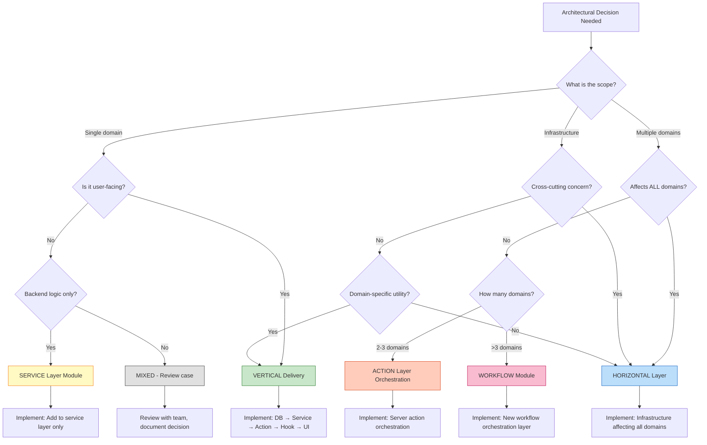

# PT-2 Architectural Slicing: Evaluation Framework

> **Date**: 2025-10-09
> **Purpose**: Decision framework for evaluating and selecting architectural slicing strategies
> **Status**: Approved for Use
> **Context**: Solo developer, 7 services, 98 tests, Phase 2 → Phase 3 transition

---

## Executive Summary

This framework helps evaluate **when** and **how** to apply vertical slicing vs horizontal layering as PT-2 evolves. Use this document to make informed architectural decisions based on current project state, team size, and business priorities.

**Key Principle**: Architecture decisions should be **evidence-based**, **reversible**, and **context-aware**.

---

## 1. Decision Tree



---

## 2. Context Assessment Matrix

Use this matrix to assess current project state before making architectural decisions.

### 2.1 Team Context

| Factor | Current State | Threshold | Impact on Decision |
|--------|--------------|-----------|-------------------|
| **Team Size** | 1 developer | <3 developers | Favor simplicity, defer formalization |
| **Team Growth** | Solo | >3 developers | Trigger: Formalize layer contracts |
| **Onboarding Frequency** | Zero | >1 person/month | Trigger: Documentation + ESLint rules |
| **Developer Experience** | High | Varies | Solo: Informal patterns OK |
| **Context Switching Cost** | HIGH (solo) | Team: LOW | Favor vertical delivery (single domain per week) |

**Current Recommendation**: Solo developer → **Favor vertical delivery for momentum**

---

### 2.2 Codebase Context

| Factor | Current State | Threshold | Impact on Decision |
|--------|--------------|-----------|-------------------|
| **Service Count** | 7 services | - | Existing: Keep horizontal structure |
| **Service Complexity** | <200 lines/file | >500 lines | Trigger: Split into modules |
| **Module Count** | 1-2 per service | >5 modules | Trigger: Vertical slicing |
| **Test Count** | 98 tests | - | High: Protect with refactoring |
| **Test Coverage** | >80% | <80% | Critical: Maintain coverage |
| **PRD Violations** | 0 violations | >0 | Critical: Fix immediately |
| **Technical Debt** | Low (intentional) | High (unmanaged) | Monitor debt paydown triggers |

**Current Recommendation**: Strong foundation → **Build incrementally, avoid rework**

---

### 2.3 Business Context

| Factor | Current State | Threshold | Impact on Decision |
|--------|--------------|-----------|-------------------|
| **Time to MVP** | 8 weeks target | <12 weeks | Favor pragmatic over perfect |
| **User-Visible Features** | 0 features | >0 | Urgent: Vertical delivery prioritized |
| **Stakeholder Demos** | Service layer only | Weekly UI demos | Favor vertical for visibility |
| **Market Validation** | Not started | Launched | Critical: Ship MVP ASAP |
| **Competition** | Unknown | Known | Time-sensitive: Favor speed |
| **Revenue** | $0 | >$0 | Pre-revenue: Optimize for learning |

**Current Recommendation**: 0 UI features → **Urgent vertical delivery needed**

---

## 3. Evaluation Criteria

### 3.1 When to Use Horizontal Layering

**Criteria**:
- ✅ Affects ALL domains (>5 services)
- ✅ Cross-cutting concern (auth, validation, error handling)
- ✅ Infrastructure evolution (type system, database client)
- ✅ Testing infrastructure (test utilities, mocking)
- ✅ Performance optimization (caching, observability)

**Examples**:
- Adding `executeOperation` wrapper to all services → HORIZONTAL
- Implementing batch cache invalidation → HORIZONTAL
- Upgrading Supabase client library → HORIZONTAL
- Adding structured logging → HORIZONTAL
- Creating shared UI primitives (components/ui/) → HORIZONTAL

**Sequencing**: Implement horizontally, roll out to all domains simultaneously

**Timeline**: 1-3 days for infrastructure changes

---

### 3.2 When to Use Vertical Delivery

**Criteria**:
- ✅ User-facing feature (visible in UI)
- ✅ Single domain bounded context
- ✅ Complete user workflow (end-to-end)
- ✅ Stakeholder demo requirement
- ✅ Market validation hypothesis

**Examples**:
- Player Management UI → VERTICAL
- Visit Tracking workflow → VERTICAL
- Rating Slip creation → VERTICAL
- MTL compliance dashboard → VERTICAL
- Search functionality for domain → VERTICAL

**Sequencing**: Implement DB → Service → Action → Hook → UI in one iteration

**Timeline**: 1 week per vertical slice (solo developer)

---

### 3.3 When to Use Hybrid Approach

**Criteria**:
- ✅ Feature spans 2-3 domains (not all)
- ✅ Orchestration needed (Action layer)
- ✅ Partial infrastructure change
- ✅ Domain-specific enhancement

**Examples**:
- Visit start (Player + Casino + Visit) → HYBRID (Action orchestration)
- Real-time for specific domains → HYBRID (infrastructure + domain hooks)
- Search across Player + Visit → HYBRID (Action aggregation)

**Sequencing**: Horizontal infrastructure first, then vertical per domain

**Timeline**: 1-2 weeks depending on complexity

---

## 4. Decision Matrices

### 4.1 Scope-Based Decision Matrix

| Scope | Domains Affected | User-Facing? | Recommended Approach | Example |
|-------|-----------------|--------------|---------------------|---------|
| **Infrastructure** | ALL (>5) | No | HORIZONTAL | Error handling, logging, types |
| **Single Feature** | 1 domain | Yes | VERTICAL | Player CRUD UI |
| **Cross-Domain** | 2-3 domains | Yes | HYBRID (Action) | Visit start (Player + Casino + Visit) |
| **Workflow** | >3 domains | Yes | HYBRID (Workflow) | Complex multi-step process |
| **Service Logic** | 1 domain | No | SERVICE Module | Business rule, query optimization |
| **UI Component** | 1 domain | Yes | VERTICAL | Domain-specific component |
| **Shared UI** | ALL | Yes | HORIZONTAL | Primitive components (Button, Input) |

---

### 4.2 Complexity-Based Decision Matrix

| Complexity Level | Lines of Code | Files Affected | Recommended Approach | Safeguards |
|-----------------|---------------|---------------|---------------------|-----------|
| **Simple** | <100 lines | 1-2 files | VERTICAL (inline) | Code review |
| **Moderate** | 100-500 lines | 3-5 files | VERTICAL (module) | Unit tests + code review |
| **Complex** | 500-1000 lines | 6-10 files | HYBRID (orchestration) | Integration tests + ADR |
| **Very Complex** | >1000 lines | >10 files | HORIZONTAL (phased) | Prototype + team review + ADR |

---

### 4.3 Risk-Based Decision Matrix

| Risk Level | Impact | Reversibility | Recommended Approach | Validation |
|-----------|--------|--------------|---------------------|-----------|
| **Low** | Single domain | Easy (1 day) | VERTICAL | Manual testing |
| **Medium** | 2-3 domains | Moderate (2-3 days) | HYBRID | Integration tests |
| **High** | ALL domains | Hard (1 week) | HORIZONTAL (phased) | Staging + rollback plan |
| **Critical** | System-wide | Very hard (>1 week) | HORIZONTAL (prototype first) | ADR + team approval + staging + canary |

---

## 5. Trade-Off Analysis Framework

### 5.1 Time vs Quality Trade-Off

**Question**: How much time are we willing to invest for quality improvement?

| Investment | Quality Gain | Recommended When | Example |
|-----------|-------------|------------------|---------|
| **0 days** (No change) | Baseline | Status quo acceptable | Current architecture working well |
| **1-3 days** (Quick fix) | +10-20% | Critical bug, quick win | Inline validation, simple optimization |
| **1 week** (Feature) | +30-40% | MVP feature delivery | Vertical slice (Player UI) |
| **2-4 weeks** (Refactor) | +50-70% | Technical debt paydown | Module separation, error catalog |
| **1-2 months** (Redesign) | +80-90% | Fundamental architecture change | Rarely justified (avoid) |

**Current Recommendation**: Focus on 1-week increments (vertical slices)

---

### 5.2 Flexibility vs Consistency Trade-Off

**Question**: Do we optimize for experimentation or standardization?

| Dimension | Flexibility | Consistency | PT-2 Context | Decision |
|-----------|------------|-------------|--------------|----------|
| **Solo Developer** | HIGH value | MEDIUM value | Solo (1 person) | **Favor flexibility** |
| **Small Team** | MEDIUM value | HIGH value | Future (2-3 people) | Shift to consistency |
| **Large Team** | LOW value | CRITICAL value | Not applicable | N/A |

**Current Recommendation**: Solo developer → **Favor flexibility, defer formalization**

---

### 5.3 Speed vs Perfection Trade-Off

**Question**: What level of "good enough" is acceptable?

| Aspect | Perfect (10 weeks) | Good Enough (4-8 weeks) | Current Decision |
|--------|-------------------|------------------------|------------------|
| **Module Separation** | 5 files/service | 1 file until >500 lines | **Good Enough** |
| **Real-Time Sync** | WebSocket infrastructure | Manual refresh | **Good Enough** (Week 7) |
| **Error Handling** | Error catalog (enum) | String messages | **Good Enough** (for now) |
| **UI Performance** | Optimistic updates | Loading spinners | **Good Enough** |
| **Type Safety** | Explicit interfaces | **Same** | **Perfect** (non-negotiable) |
| **Schema Integrity** | database.types.ts | **Same** | **Perfect** (automated) |

**Current Recommendation**: 4/6 aspects "Good Enough" → **8 weeks to MVP**

---

## 6. Quantitative Metrics

### 6.1 Service Complexity Metrics

**Trigger Thresholds**:

| Metric | Current | Warning | Critical | Action Required |
|--------|---------|---------|----------|----------------|
| **File Size** | <200 lines | >300 lines | >500 lines | Split into modules (CRUD, Business, Queries) |
| **Module Count** | 1-2 modules | 4 modules | >5 modules | Consider vertical slicing (feature folders) |
| **Function Count** | <10 functions | >15 functions | >20 functions | Extract to separate modules |
| **Cyclomatic Complexity** | <5 per function | >8 | >10 | Refactor, simplify logic |
| **Import Depth** | <3 levels | >4 levels | >5 levels | Decouple, reduce dependencies |
| **Test File Size** | <300 lines | >500 lines | >800 lines | Split tests by module |

**Current Status**: ALL metrics in green (no action required)

---

### 6.2 Architecture Health Metrics

**Monitor Weekly**:

| Metric | Target | Current | Trend | Action if Below Target |
|--------|--------|---------|-------|----------------------|
| **Test Pass Rate** | 100% | 100% (98/98) | ✅ Stable | Fix failing tests immediately |
| **Test Coverage** | >80% | >80% | ✅ Stable | Add tests for uncovered code |
| **PRD Violations** | 0 | 0 | ✅ Stable | Fix violations immediately |
| **Layer Violations** | 0 | 0 | ✅ Stable | Refactor to respect boundaries |
| **`any` Type Escapes** | 0 | 0 | ✅ Stable | Add explicit types |
| **Build Time** | <60s | <30s | ✅ Excellent | Optimize if exceeds 60s |
| **Action Response Time** | <500ms p95 | TBD | ⏳ Pending | Optimize queries, add caching |

**Current Health**: **EXCELLENT** (all metrics green)

---

### 6.3 Delivery Velocity Metrics

**Track Per Sprint** (Weekly):

| Metric | Baseline | Target | Current | Calculation |
|--------|----------|--------|---------|------------|
| **Features Delivered** | 0 | 1 per week | 0 | Count UI-complete features |
| **Story Points** | TBD | 10-15 per week | TBD | Estimate per vertical slice |
| **Lines of Code** | 1400 (services) | +500/week | TBD | Productive output |
| **Test Coverage Change** | >80% | Maintain | >80% | Coverage should not decrease |
| **Bug Count** | 0 (MVP) | <5 per week | 0 | New bugs discovered |
| **Technical Debt** | LOW | Stable | LOW | Intentional debt only |

**Current Velocity**: Phase 2 complete (7 services in 6 weeks) → **~1 service/week**

**Target Velocity**: Phase 3 (3 UI features in 5 weeks) → **~1 feature/week**

---

## 7. Context-Specific Guidelines

### 7.1 Solo Developer Context (Current)

**Optimize For**:
- ✅ Momentum and motivation (weekly wins)
- ✅ Cognitive locality (single domain per week)
- ✅ Fast feedback loops (test in browser daily)
- ✅ Minimal context switching
- ✅ Visible progress (stakeholder demos)

**Avoid**:
- ❌ Rigid formalization (ESLint layer rules)
- ❌ Premature abstraction (5 files per service)
- ❌ Over-engineering (building for 10-person team)
- ❌ Delayed gratification (service layer without UI)

**Decision Bias**: **Favor vertical delivery over horizontal perfection**

---

### 7.2 Small Team Context (2-3 Developers, Future)

**Optimize For**:
- ✅ Clear ownership boundaries
- ✅ Parallel work (different domains)
- ✅ Integration contracts (explicit interfaces)
- ✅ Code review standards

**Add**:
- ✅ ESLint layer boundary rules
- ✅ Formal ADRs for major decisions
- ✅ LAYER_CONTRACTS.md documentation

**Decision Bias**: **Balance horizontal consistency with vertical autonomy**

---

### 7.3 Large Team Context (>5 Developers, Not Applicable)

**Optimize For**:
- ✅ Formalized processes
- ✅ Strict layer boundaries
- ✅ Comprehensive documentation
- ✅ Architectural governance

**Not Applicable** to PT-2 currently, but framework prepared for future.

---

## 8. Decision Documentation Template

### 8.1 Architectural Decision Record (ADR) Template

```markdown
# ADR-NNN: [Decision Title]

**Date**: YYYY-MM-DD
**Status**: [Proposed | Accepted | Deprecated | Superseded]
**Context**: [Current project state, team size, business needs]

## Decision
[What are we doing?]

## Rationale
[Why are we doing this?]

## Alternatives Considered
1. **Alternative A**: [Description] - Rejected because [reason]
2. **Alternative B**: [Description] - Rejected because [reason]

## Consequences
**Positive**:
- [Benefit 1]
- [Benefit 2]

**Negative**:
- [Trade-off 1]
- [Mitigation: how we address this]

## Metrics
**Success Criteria**:
- [Measurable outcome 1]
- [Measurable outcome 2]

## Rollback Plan
**Trigger**: [Condition that would reverse this decision]
**Steps**: [How to rollback]
**Cost**: [Time/effort to rollback]

## Related Decisions
- [ADR-001: ...]
- [ADR-002: ...]
```

**Example**: See `docs/decisions/ADR-002-test-location-standardization.md`

---

### 8.2 Quick Decision Checklist

Use this for informal decisions (no ADR required):

**Vertical Delivery Checklist**:
- [ ] Affects single domain?
- [ ] User-facing feature?
- [ ] Can be demoed to stakeholders?
- [ ] Can be completed in 1 week?
- [ ] Tests can be written alongside?
- [ ] Doesn't require infrastructure changes?

**If 4+/6 checked → VERTICAL delivery approved**

---

**Horizontal Layer Checklist**:
- [ ] Affects ALL domains (>5)?
- [ ] Cross-cutting concern?
- [ ] Infrastructure/framework change?
- [ ] No user-facing component?
- [ ] Can be rolled out incrementally?
- [ ] Rollback plan exists?

**If 4+/6 checked → HORIZONTAL layer approved**

---

## 9. Adaptation Framework

### 9.1 When to Reconsider Architecture

**Quarterly Review Triggers**:
- [ ] Team size changed (solo → team)
- [ ] MVP shipped (market validation complete)
- [ ] Technical debt exceeding targets
- [ ] Performance issues recurring
- [ ] Developer velocity declining

**Ad-Hoc Review Triggers**:
- [ ] Service file exceeds 500 lines
- [ ] More than 5 modules per service
- [ ] Cross-domain orchestration >3 services
- [ ] Test suite exceeds 10 minutes
- [ ] Layer violations occurring

---

### 9.2 Evolution Pathways

**From Solo to Team** (Path A → Path C):
- Week 1: Formalize layer contracts (LAYER_CONTRACTS.md)
- Week 2: Add ESLint layer boundary rules
- Week 3: Create onboarding documentation
- Week 4: Establish code review standards

**From MVP to Scale** (Path D → Path C):
- Week 1: Performance optimization (caching, queries)
- Week 2: Bundle splitting (code splitting, lazy loading)
- Week 3: Observability (logging, metrics, alerts)
- Week 4: Deployment automation (CI/CD, staging)

**From Hybrid to Pure Vertical** (Path D → Path B):
- **Trigger**: Service files exceed 500 lines AND team size >3
- **Effort**: 2 weeks per service to split into feature folders
- **Risk**: MEDIUM (requires careful migration)

---

## 10. Tools and Automation

### 10.1 Metrics Collection

**Automated**:
```bash
# Service complexity
npm run metrics:services

# Test coverage
npm run test:coverage

# Build time
npm run build -- --profile

# Bundle size
npm run analyze
```

**Manual** (Weekly):
- Team size (track in README)
- Feature delivery count (track in changelog)
- Bug count (track in issue tracker)
- Stakeholder feedback (track in notes)

---

### 10.2 Decision Support Tools

**ESLint Rules** (Future - when team size >3):
```json
{
  "rules": {
    "no-restricted-imports": [
      "error",
      {
        "patterns": [
          "services/*/index.ts can only import from services/shared/"
        ]
      }
    ]
  }
}
```

**Architecture Tests** (Future):
```typescript
describe('Architecture Constraints', () => {
  it('services should not import from actions', () => {
    // Enforce layer boundaries
  });

  it('UI should not import from services directly', () => {
    // Enforce layer boundaries
  });
});
```

---

## 11. Success Criteria

### 11.1 Framework Effectiveness

**This framework is working if**:
- ✅ Architectural decisions are made in <1 hour (not days of debate)
- ✅ Decisions are documented (ADRs or decision log)
- ✅ Rollback plans exist for major changes
- ✅ Team agrees on approach before implementation
- ✅ Decisions can be revisited based on evidence

**This framework needs revision if**:
- ❌ Decisions take >1 day to make
- ❌ Frequent architecture rework (>1 per month)
- ❌ Team disagreement on approach
- ❌ Metrics not tracked or ignored
- ❌ Framework not referenced in practice

---

### 11.2 Architecture Health

**PT-2 architecture is healthy if**:
- ✅ Test pass rate = 100%
- ✅ Test coverage >80%
- ✅ PRD violations = 0
- ✅ Layer violations = 0
- ✅ Build time <60s
- ✅ Action response time <500ms p95
- ✅ Developer velocity stable or increasing

**Architecture needs intervention if**:
- ❌ Test pass rate <95%
- ❌ Test coverage declining
- ❌ PRD violations accumulating
- ❌ Layer violations recurring
- ❌ Build time increasing (>2min)
- ❌ Performance degrading
- ❌ Developer velocity declining

---

## 12. Quick Reference

### 12.1 One-Page Decision Guide

**Question 1: What is the scope?**
- Single domain + user-facing → **VERTICAL**
- ALL domains + infrastructure → **HORIZONTAL**
- 2-3 domains + user-facing → **HYBRID (Action layer)**

**Question 2: How complex?**
- <500 lines → **VERTICAL (inline)**
- >500 lines → **Consider module split or HORIZONTAL**

**Question 3: How risky?**
- Low risk (single domain) → **VERTICAL**
- High risk (system-wide) → **HORIZONTAL (phased rollout)**

**Question 4: How urgent?**
- MVP feature (stakeholder demo) → **VERTICAL**
- Infrastructure (foundational) → **HORIZONTAL**
- Nice-to-have (future) → **Defer**

**Default**: When in doubt, **VERTICAL delivery** (ship features, defer abstractions)

---

### 12.2 Common Scenarios

| Scenario | Recommended Approach | Rationale |
|----------|---------------------|-----------|
| **Add Player search UI** | VERTICAL | Single domain, user-facing |
| **Upgrade Supabase client** | HORIZONTAL | ALL services affected |
| **Visit start (Player + Casino + Visit)** | HYBRID (Action) | 3 services, orchestration needed |
| **Add real-time to Player domain** | VERTICAL | Domain-specific enhancement |
| **Add error catalog** | HORIZONTAL (defer) | Affects all, but not urgent |
| **Split PlayerService (>500 lines)** | HORIZONTAL (refactor) | Technical refactoring |
| **Add pagination to lists** | VERTICAL (per domain) | Domain-specific UI enhancement |
| **Create workflow orchestration** | HYBRID (new layer) | >3 services involved |

---

## Appendix A: Related Documentation

- [Consensus Synthesis](./CONSENSUS_SYNTHESIS.md) - Architect recommendations
- [Horizontal Layering Analysis](./HORIZONTAL_LAYERING_ANALYSIS.md) - Layer structure
- [Domain-Driven Vertical Analysis](./DOMAIN_DRIVEN_VERTICAL_ANALYSIS.md) - Bounded contexts
- [Hybrid Strategy Analysis](./HYBRID_STRATEGY_ANALYSIS.md) - Complementary dimensions
- [Risk & Migration Analysis](./RISK_AND_MIGRATION_ANALYSIS.md) - Risk assessment
- [MVP-Pragmatic Analysis](./MVP_PRAGMATIC_ANALYSIS.md) - Time-to-market optimization

---

**Document Version**: 1.0.0
**Last Updated**: 2025-10-09
**Status**: Active Framework
**Next Review**: Quarterly (or when team size changes)

---

**END OF EVALUATION FRAMEWORK**