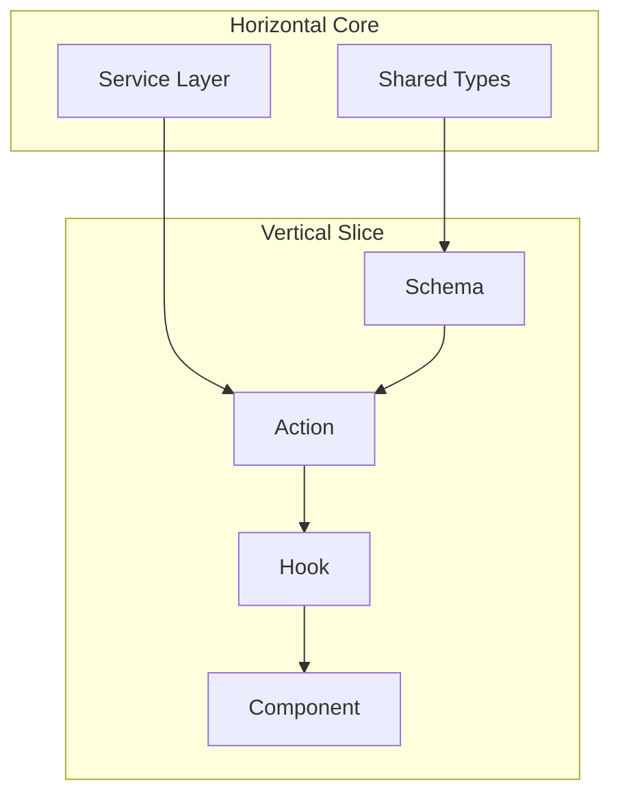

# PT-2 Architecture Guide: Vertical vs Horizontal Sequencing  
> **Version:** 1.0.0  
> **Scope:** Player Tracker (PT-2 architecture, post-Phase 5 refactor)  
> **Author:** Architecture Council  
> **Last Updated:** 2025-10-09  

---

## 1. Purpose

This guide establishes a disciplined method for sequencing **horizontal** and **vertical** development within the Player Tracker system.  
It prevents the “half-vertical mush” problem described by **Tim Kleier** in *[Vertical and Horizontal Slices](https://medium.com/@timkleier/vertical-and-horizontal-slices-45b7d435ac35)*—where incomplete verticalization yields incoherent, brittle features.  

Our objective is to **cultivate attentiveness** to both directions early in development:  
> Horizontal = foundation and consistency  
> Vertical = feature delivery and agility  

---

## 2. Context

The PT service layer already follows a canonical horizontal structure:

services/
├── shared/ # Types, utilities, operation wrapper
└── {domain}/
├── index.ts # Factory + explicit interface
├── crud.ts # CRUD operations
├── business.ts # Business logic (optional)
├── queries.ts # Complex queries (optional)


**Vertical slices are layered on top of this foundation within each domain:**

```yaml

---

## 3. Philosophy: “Bake the Cake, Don’t Eat Mush”

Kleier’s metaphor underscores the risk of pursuing vertical slices without first ensuring that horizontal ingredients—types, logging, error flow—are ready.  
A true vertical slice is **end-to-end**, not *half-baked*.  

| Concern | Horizontal Role | Vertical Role |
|----------|-----------------|----------------|
| **Data Access** | Canonical services handle persistence. | Slices call those services. |
| **Error Handling** | Shared `executeOperation()` normalizes errors. | Slices display feedback. |
| **Validation** | Global rules may exist in services. | Slices extend via `schema.ts`. |
| **Cross-Cutting Concerns** | Auth, logging, metrics live here. | Slices opt in via middleware. |
| **Feature Logic** | Generic transaction orchestration. | Concrete use-case composition. |

---

## 4. Sequencing Strategy

| Phase | Objective | Deliverables | Guardrails |
|-------|------------|--------------|-------------|
| **0 — Foundation** | Build minimal horizontal core. | `services/shared`, canonical DB client, `ServiceResult`, error wrapper. | Do *not* embed feature logic here. |
| **1 — Bootstrap Slices** | Implement 1–2 full vertical slices as reference. | `Player.create`, `RatingSlip.create`, etc. | Keep all layers: schema → action → hook → UI. |
| **2 — Expand Vertically** | Add slices for remaining CRUD flows. | Uniform directory structure per domain. | Follow slice integrity checklist (see §6). |
| **3 — Refactor Horizontally** | Abstract proven patterns shared ≥ 3 slices. | Shared validation utils, toast patterns, etc. | Only extract when stable and reused. |
| **4 — Feedback & Audit** | Monitor coupling & drift. | Lint rules, import guards, architecture reviews. | No cross-slice imports except via service contracts. |

Result: a **dual-tier system**  
→ *Stable horizontal core + agile vertical edge.*

---

## 5. When to Favor Each Direction

| Scenario | Favor | Rationale |
|-----------|-------|-----------|
| New cross-cutting infrastructure (auth, logging, metrics) | **Horizontal** | Must remain consistent system-wide. |
| New user feature or workflow | **Vertical** | Requires UI, action, hook, schema cohesion. |
| Shared pattern emerging in ≥ 3 slices | **Horizontal refactor** | Stabilize abstraction after evidence. |
| Experimental feature | **Vertical-only** | Keep isolated; discard easily if invalid. |
| Core business rule change | **Horizontal + select verticals** | Update service and re-wire affected slices. |

---

## 6. Vertical Slice Integrity Checklist

Before merging a slice, verify:

1. **Schema/DTO** defines input contract (Zod or TS).  
2. **Action** calls only the canonical service.  
3. **Hook** exists for UI integration.  
4. **Component** uses its hook and no global state.  
5. **Tests** cover action → hook → UI flow.  
6. **No cross-slice imports** except via service interface.  
7. **Cohesion**—slice fits in one mental model.  
8. **Abstraction check**—if duplicated elsewhere, consider promotion.  

Failing ≥ 2 checks → slice is “half-vertical mush”; refactor before merge.

---

## 7. Anti-Mush Policies

- **Horizontal core first** → vertical slices second.  
- **Refactor only after evidence** (≥ 3 usages).  
- **No shared slice utils**—use scaffolds instead.  
- **Automate layer rules** (ESLint import restrictions).  
- **Architecture review every 3–5 slices** to realign.  

---

## 8. Cross-Domain Awareness

Horizontal contracts (service interfaces) are the **only legal bridges** between domains.  
Slices communicate via service APIs—not imports.  



9. Cultivating Attentiveness

Embed discipline through:

PR Template Checks (include checklist §6)

Automated lint rules preventing cross-slice imports

Architecture review ritual after every release

Refactor time boxes after 3–5 new slices

Metrics: track slice size, import violations, test coverage

Attentiveness is a habit: seeing when a problem is vertical (scope) vs horizontal (structure).

10. Summary — Balanced Architecture
Principle	Outcome
Horizontal first for stability	Consistent contracts & safety net
Vertical for delivery	Rapid feature iteration & cohesion
Evidence-based horizontal refactors	Prevent premature abstraction
Slice integrity enforced	Regression containment
Attentiveness as discipline	Sustainable architecture without rebuilds

**Result:**
PT evolves as a composite of stable horizontal foundations and agile vertical slices —
a system that can grow without ever requiring another catastrophic rebuild.

