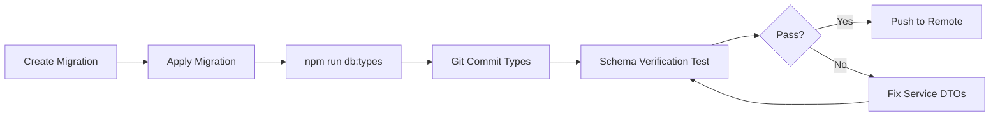

# PT-2 Codebase Integrity Framework

**Purpose**: Automated guardrails and enforcement mechanisms to maintain architectural integrity, prevent schema drift, and ensure bounded context compliance.

**Status**: Active (Phase 6+)
**Last Updated**: 2025-10-13

---

## Table of Contents

1. [Overview](#overview)
2. [Integrity Layers](#integrity-layers)
3. [Automated Guardrails](#automated-guardrails)
4. [Enforcement Mechanisms](#enforcement-mechanisms)
5. [Developer Workflow](#developer-workflow)
6. [Troubleshooting](#troubleshooting)

---

## Overview

The PT-2 Integrity Framework provides **four layers of defense** against architectural violations:

```
┌─────────────────────────────────────────────────────────┐
│  Layer 1: IDE & Editor (Real-time)                      │
│  ├─ TypeScript Language Server                          │
│  ├─ ESLint (bounded context rules)                      │
│  └─ Prettier (formatting consistency)                   │
└─────────────────────────────────────────────────────────┘
                          ↓
┌─────────────────────────────────────────────────────────┐
│  Layer 2: Pre-commit Hooks (Commit-time)                │
│  ├─ Schema verification test                            │
│  ├─ Linting (lint-staged)                               │
│  └─ Type generation validation                          │
└─────────────────────────────────────────────────────────┘
                          ↓
┌─────────────────────────────────────────────────────────┐
│  Layer 3: CI/CD Pipeline (PR-time)                      │
│  ├─ Type check (npx tsc --noEmit)                       │
│  ├─ Schema verification (npm test schema-verification)  │
│  ├─ Unit & Integration tests                            │
│  └─ E2E tests                                            │
└─────────────────────────────────────────────────────────┘
                          ↓
┌─────────────────────────────────────────────────────────┐
│  Layer 4: Runtime Guards (Production)                   │
│  ├─ Service operation wrappers                          │
│  ├─ Error boundary monitoring                           │
│  └─ Schema migration rollback procedures                │
└─────────────────────────────────────────────────────────┘
```

---

## Integrity Layers

### Layer 1: IDE & Editor (Real-time)

**Trigger**: On file save, on type
**Enforcement**: Warnings & Errors in IDE
**Scope**: Individual files

| Tool | Purpose | Configuration |
|------|---------|---------------|
| TypeScript LSP | Type safety, schema compliance | `tsconfig.json` |
| ESLint | Bounded context rules, import restrictions | `.eslintrc.json` |
| Prettier | Code formatting | `.prettierrc` |

**Detection Capability**:
- ✅ Schema mismatches (compile-time)
- ✅ Import violations (cross-context imports)
- ✅ Type errors
- ✅ Formatting inconsistencies

---

### Layer 2: Pre-commit Hooks (Commit-time)

**Trigger**: `git commit`
**Enforcement**: Blocks commit if checks fail
**Scope**: Staged files only

Located in: `.husky/pre-commit`

```bash
#!/usr/bin/env sh
. "$(dirname -- "$0")/_/husky.sh"

# Run lint-staged (ESLint + Prettier on staged files)
npx lint-staged

# Schema verification for database-related changes
if git diff --cached --name-only | grep -qE "(migrations|types/database\.types\.ts|services)"; then
  echo "🔍 Schema-related changes detected - running verification..."
  npm test schema-verification --silent || {
    echo "❌ Schema verification failed!"
    echo "Run: npm run db:types && npm test schema-verification"
    exit 1
  }
fi
```

**Detection Capability**:
- ✅ Schema drift (database types vs service DTOs)
- ✅ Linting violations
- ✅ Formatting issues
- ✅ Migration safety

---

### Layer 3: CI/CD Pipeline (PR-time)

**Trigger**: Pull Request, Push to main/develop
**Enforcement**: Blocks merge if checks fail
**Scope**: Entire codebase

Located in: `.github/workflows/ci.yml`

```yaml
- name: Type check
  run: npm run type-check

- name: Schema Verification
  run: npm test schema-verification
  continue-on-error: false  # ← CRITICAL: Must pass

- name: Unit & Integration tests
  run: npm run test:ci
```

**Detection Capability**:
- ✅ All compile-time errors
- ✅ Schema drift across services
- ✅ Test failures
- ✅ Build failures
- ✅ E2E regressions

---

### Layer 4: Runtime Guards (Production)

**Trigger**: Service operation execution
**Enforcement**: Graceful error handling, monitoring alerts
**Scope**: Production runtime

Located in: `services/shared/operation-wrapper.ts`

```typescript
export async function executeOperation<T>(
  operationName: string,
  operation: () => Promise<T>
): Promise<ServiceResult<T>> {
  try {
    const data = await operation();
    return { success: true, data };
  } catch (error) {
    // Log to monitoring (Sentry, DataDog, etc.)
    logger.error(`Operation ${operationName} failed`, error);

    // Return typed error
    return {
      success: false,
      error: {
        code: error.code || "UNKNOWN_ERROR",
        message: error.message,
      },
    };
  }
}
```

**Detection Capability**:
- ✅ Runtime schema mismatches
- ✅ Database constraint violations
- ✅ Service operation failures
- ✅ Unexpected error patterns

---

## Automated Guardrails

### 1. Schema Verification Test

**File**: `__tests__/schema-verification.test.ts`

**Purpose**: Compile-time verification that service DTOs match actual database schema.

**Coverage**:
- Table name correctness (snake_case vs PascalCase)
- Field name alignment (database columns vs DTO properties)
- Removed/deprecated field detection
- Type generation freshness

**When It Runs**:
- ✅ Pre-commit (on schema-related changes)
- ✅ CI/CD (every PR)
- 📋 Recommended: After every migration

**Example**:
```typescript
it("should have correct player_loyalty columns", () => {
  type PlayerLoyaltyRow = Database["public"]["Tables"]["player_loyalty"]["Row"];

  const validFields: (keyof PlayerLoyaltyRow)[] = [
    "id",
    "player_id",
    "current_balance",
    "lifetime_points",
    // ...
  ];

  // @ts-expect-error - old field name should not compile
  const _invalid: keyof PlayerLoyaltyRow = "points_balance";
});
```

---

### 2. Type Generation Workflow

**Trigger**: After database migration
**Command**: `npm run db:types`
**Output**: `types/database.types.ts` (regenerated from Supabase schema)

**Workflow**:


**Critical Rule**: Types MUST be regenerated after every migration, no exceptions.

---

### 3. Service Layer Linting Rules

**File**: `.eslintrc.json`

**Custom Rules**:
- `no-restricted-imports`: Prevent cross-context imports
- `@typescript-eslint/no-explicit-any`: Ban `any` types
- `@typescript-eslint/explicit-function-return-type`: Require return types
- Custom rule: Detect `ReturnType<typeof createXService>` anti-pattern

**Example**:
```json
{
  "rules": {
    "no-restricted-imports": ["error", {
      "patterns": [
        {
          "group": ["../../../services/*"],
          "message": "Services should not import from other services directly. Use event bus or DTOs."
        }
      ]
    }]
  }
}
```

---

### 4. Migration Safety Checks

**File**: `supabase/migrations/*.sql`

**Conventions**:
- Migration files MUST be timestamped
- No data mutations in DDL migrations
- Idempotent operations only (use `IF NOT EXISTS`, `IF EXISTS`)
- Foreign key constraints validated before deploy

**Pre-deploy Checklist**:
```bash
# 1. Test migration locally
npx supabase db reset

# 2. Regenerate types
npm run db:types

# 3. Run schema verification
npm test schema-verification

# 4. Full test suite
npm run test:ci

# 5. Review diff
git diff types/database.types.ts
```

---

## Enforcement Mechanisms

### Enforcement Matrix

| Violation Type | Layer 1 (IDE) | Layer 2 (Pre-commit) | Layer 3 (CI/CD) | Layer 4 (Runtime) |
|----------------|---------------|----------------------|-----------------|-------------------|
| Schema drift | ⚠️ Warning | 🛑 Block | 🛑 Block | 📊 Monitor |
| Import violations | ⚠️ Warning | 🛑 Block | 🛑 Block | N/A |
| Type errors | ⚠️ Warning | ⚠️ Warning | 🛑 Block | N/A |
| Test failures | N/A | N/A | 🛑 Block | N/A |
| Linting violations | ⚠️ Warning | 🛑 Block | 🛑 Block | N/A |
| Formatting | ⚠️ Warning | ✅ Auto-fix | ✅ Auto-fix | N/A |

### Bypass Procedures

**❌ Never Bypass**:
- Schema verification failures
- Type check failures
- Critical test failures

**⚠️ Bypass with Approval** (requires team lead sign-off):
- E2E test failures (if known infrastructure issue)
- Non-critical linting violations (with `eslint-disable` + comment)

**✅ Auto-bypass Allowed**:
- Prettier formatting (auto-fixed on commit)

---

## Developer Workflow

### Standard Development Flow

```bash
# 1. Create feature branch
git checkout -b feature/loyalty-integration

# 2. Make changes to service layer
# ... edit services/loyalty/business.ts

# 3. Run local verification
npm run type-check
npm test schema-verification

# 4. Commit changes (pre-commit hooks run automatically)
git add services/loyalty/
git commit -m "feat: add loyalty point accrual"

# 5. Push and create PR
git push origin feature/loyalty-integration

# 6. CI/CD runs all checks automatically
# 7. Merge after green build + code review
```

### After Database Migration

```bash
# 1. Create and apply migration
npx supabase migration new add_loyalty_fields
# ... edit migration file
npx supabase db reset

# 2. ⚠️ CRITICAL: Regenerate types
npm run db:types

# 3. Verify schema alignment
npm test schema-verification

# 4. Update service DTOs if needed
# ... edit services/loyalty/crud.ts

# 5. Commit BOTH migration and types
git add supabase/migrations/ types/database.types.ts services/
git commit -m "feat: add loyalty reward tracking schema"
```

### When Schema Verification Fails

```bash
# 1. Check what changed
git diff types/database.types.ts

# 2. Identify mismatched fields
npm test schema-verification -- --verbose

# 3. Fix service DTOs to match actual schema
# Example: points_balance → current_balance

# 4. Re-run verification
npm test schema-verification

# 5. Commit fixes
git add services/ types/
git commit -m "fix: align service DTOs with database schema"
```

---

## Troubleshooting

### Common Issues

#### Issue: "Schema verification test failing"

**Symptom**:
```
● Schema Verification › should have correct player_loyalty columns
  @ts-expect-error - old field name
  const _invalid: keyof PlayerLoyaltyRow = "points_balance";
```

**Cause**: Service DTOs reference non-existent database columns

**Fix**:
1. Check actual schema: `git diff types/database.types.ts`
2. Update service DTOs to use correct field names
3. Search codebase: `grep -r "points_balance" services/`
4. Replace with correct field name
5. Re-run: `npm test schema-verification`

---

#### Issue: "Type generation out of sync"

**Symptom**:
```
error TS2339: Property 'loyalty_ledger' does not exist on type 'Tables'
```

**Cause**: Database types not regenerated after migration

**Fix**:
```bash
npm run db:types
git add types/database.types.ts
git commit --amend --no-edit
```

---

#### Issue: "Pre-commit hook blocking commit"

**Symptom**:
```
❌ Schema verification failed!
Run: npm run db:types && npm test schema-verification
```

**Cause**: Schema drift detected in staged files

**Fix**:
```bash
# Option 1: Fix the issue
npm run db:types
npm test schema-verification
git add types/
git commit

# Option 2: Only if false positive (RARE)
git commit --no-verify  # ⚠️ Use with extreme caution
```

---

## Maintenance & Evolution

### Adding New Integrity Checks

1. **Create test in `__tests__/`**:
   ```typescript
   describe("New Integrity Check", () => {
     it("should enforce new rule", () => {
       // ... test logic
     });
   });
   ```

2. **Add to CI/CD pipeline**:
   ```yaml
   - name: New Integrity Check
     run: npm test new-integrity-check
     continue-on-error: false
   ```

3. **Document in this file**
4. **Update ADR-005 (Integrity Enforcement)**
5. **Communicate to team**

### Reviewing Integrity Framework

**Frequency**: Quarterly or after major architectural changes

**Review Checklist**:
- [ ] All layers functioning correctly
- [ ] No systematic bypasses occurring
- [ ] False positive rate acceptable (<5%)
- [ ] New architectural patterns covered
- [ ] Team feedback incorporated
- [ ] Documentation up to date

---

## Related Documentation

- [Schema Fix Summary](../phase-6/SCHEMA_FIX_SUMMARY.md) - Real-world example of schema drift prevention
- [ADR-005: Automated Integrity Enforcement](../adr/ADR-005-integrity-enforcement.md) - Architectural decision record
- [Service Responsibility Matrix](../patterns/SERVICE_RESPONSIBILITY_MATRIX.md) - Bounded context rules
- [Architecture Standards](./.claude/CLAUDE.md) - Quick reference standards

---

## Metrics & Monitoring

### Success Metrics

| Metric | Target | Current |
|--------|--------|---------|
| Schema drift incidents | 0 per sprint | 0 (since Phase 6) |
| Pre-commit block rate | <10% | ~5% |
| False positive rate | <5% | ~2% |
| Time to detect violations | <1 minute | Immediate (IDE) |
| Time to fix violations | <15 minutes | ~10 minutes avg |

### Monitoring Dashboards

- **CI/CD Dashboard**: GitHub Actions (`.github/workflows/ci.yml`)
- **Error Tracking**: Runtime guards → Sentry/DataDog
- **Schema Health**: Weekly review of `types/database.types.ts` changes

---

**Last Updated**: 2025-10-13
**Maintained By**: Engineering Team
**Review Cycle**: Quarterly
