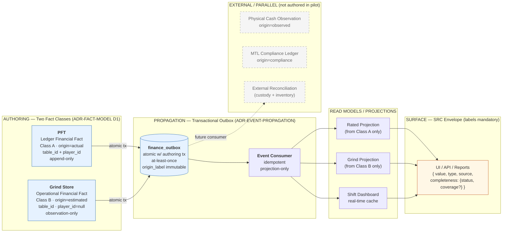
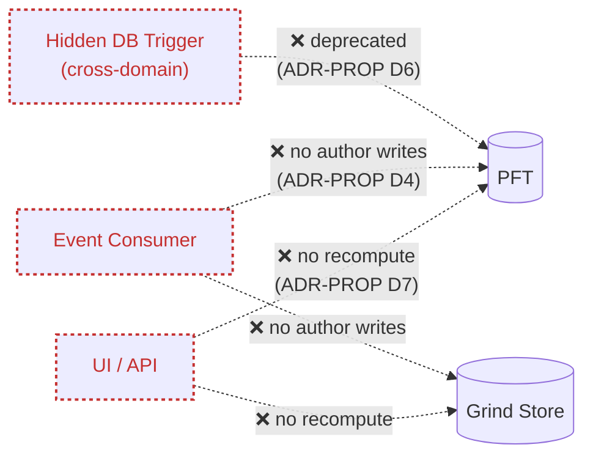
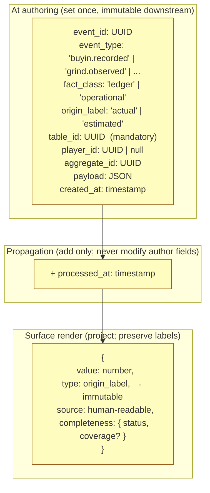
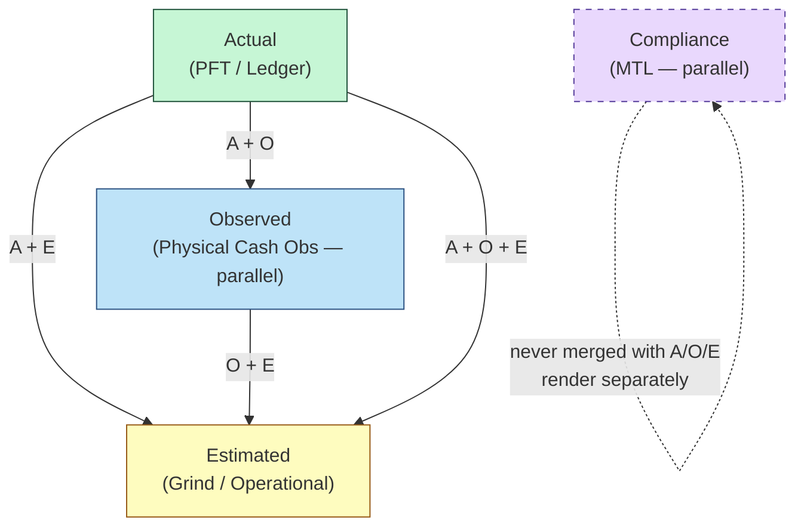

# Financial Telemetry — Projected System Architecture

---

status: Companion overview (non-decision; illustrative of the frozen set)
date: 2026-04-23
scope: Pilot (PT-2)
derived_from:
- decisions/ADR-FINANCIAL-FACT-MODEL.md (frozen 2026-04-23)
- decisions/ADR-FINANCIAL-SYSTEM-SCOPE.md (frozen 2026-04-23)
- decisions/ADR-FINANCIAL-EVENT-PROPAGATION.md (frozen 2026-04-23)
- decisions/ADR-FINANCIAL-AUTHORING-PARITY.md (frozen 2026-04-23)
- actions/SURFACE-RENDERING-CONTRACT.md (frozen 2026-04-23)
purpose: Projected visual overview inferred from the frozen decision set — direction confirmation, not a new decision.

---

# 1. Purpose

This document is **not** a decision. It is a projection of what the system looks like once the frozen set is implemented. It exists to:

* make the architecture inspectable at a glance
* confirm direction soundness
* cross-check alignment with established industry patterns
* expose contradictions before implementation begins

If this diagram conflicts with the frozen docs, **the frozen docs win**. Update this doc; do not patch the ADRs.

---

# 2. Layer Topology

Four layers, left to right: **Authoring → Propagation → Projection → Surface**. External parallel domains (compliance, physical observation, external reconciliation) sit alongside, not inside.



## Forbidden paths (rendered separately for clarity)



---

# 3. Event Envelope End-to-End

What travels from authoring to surface, and what each layer may modify.



**Immutability contract:** `fact_class`, `origin_label`, `table_id`, `player_id`, `aggregate_id` are set at authoring and **never change** in transit. Consumers may add fields (e.g., `processed_at`); they may not modify authored fields. Surfaces must carry `origin_label` through to `type`, unchanged.

**Cross-class envelope parity (ADR-AUTHORING-PARITY):** the envelope above is **identical for both authoring paths**. A Class B (grind) event carries the same field set as a Class A (PFT) event — fields that don't apply to the class (e.g., `player_id` for grind) are present with explicit `NULL`, never omitted. Both paths use the same transactional primitive, the same idempotency-key generation, and the same validation rigor. Consumers read **one** stream with **one** schema.

---

# 4. Authority Degradation Lattice

How mixed-authority aggregates resolve at the surface.



**Rules (from ADR-EVENT-PROPAGATION D5 / C4):**

* Degradation only. Upgrades are forbidden (Estimated → Actual is never allowed).
* `Compliance` is parallel, not a rung. A surface with Compliance data MUST render it in a separate field — never merged into an Actual/Observed/Estimated aggregate.
* If authority cannot be determined, the surface MUST NOT render the value (no "unknown authority").

---

# 5. Scope Boundary (what the system does NOT do)

```mermaid
flowchart LR
    subgraph in_scope["IN SCOPE (PT-2 pilot)"]
        direction TB
        S1["Structured operational financial activity<br/>(Ledger + Operational)"]
        S2["Attribution where possible<br/>(Class A only)"]
        S3["Completeness visibility<br/>(per-surface envelope)"]
    end

    subgraph out_scope["OUT OF SCOPE (external)"]
        direction TB
        O1["❌ Authoritative totals<br/>(no 'Total Drop')"]
        O2["❌ Reconciliation<br/>(ledger vs reality)"]
        O3["❌ Variance resolution"]
        O4["❌ Settlement values"]
        O5["Count room / Inventory<br/>(custody domain)"]
    end

    in_scope -- "outbox feeds data to" --> out_scope

    classDef inc fill:#c6f6d5,stroke:#22543d;
    classDef exc fill:#fed7d7,stroke:#9b2c2c;
    class S1,S2,S3 inc;
    class O1,O2,O3,O4,O5 exc;
```



The system produces **inputs for reconciliation**; it does not reconcile. This is the hard boundary from ADR-FINANCIAL-SYSTEM-SCOPE D3.

---

# 6. Alignment With Industry Patterns

Each element of the architecture maps to a well-established pattern. This is a cross-check, not a justification.

| Architectural element | Pattern | Why it applies | Reference |
|-----------------------|---------|----------------|-----------|
| Two fact classes in separate authoring stores, not derived from each other | **Separation of ledger and non-ledger stores** (common in fintech: general ledger vs sub-ledger vs operational telemetry) | Prevents ledger contamination by non-authoritative data; keeps audit trail clean | Martin Fluke, *"Sub-ledger pattern"*; Square, Stripe, PayPal engineering blogs on ledger architecture |
| Atomic write of authoring row + outbox row in same transaction | **Transactional Outbox Pattern** | Solves the dual-write problem (no lost events, no phantom events); standard solution for reliable event propagation | Chris Richardson, *Microservices Patterns*; AWS Prescriptive Guidance; Confluent |
| Write model (authoring stores) separate from read model (projections) | **CQRS** (Command Query Responsibility Segregation) | Read models can evolve independently; write path stays narrow and auditable | Greg Young; Akka docs; Microsoft Cloud Design Patterns |
| Events are immutable facts; state is projection of event stream | **Event Sourcing** (partial — we event-source the outbox, not the authoring tables themselves) | Gives a reliable audit trail and replay capability without forcing the whole system into event-sourcing discipline | Martin Fowler, *"Event Sourcing"* (2005); NEventStore patterns |
| At-least-once delivery + idempotent consumers | **Idempotent Consumer Pattern** | Standard guarantee for outbox-based propagation; duplicates are normal operating conditions | Enterprise Integration Patterns (Hohpe/Woolf) |
| Origin label travels with value and cannot be upgraded | **Provenance / Data Lineage at the value level** | Common in regulated domains (finance, healthcare); ensures every value can be traced to its source | W3C PROV; data-mesh literature (Dehghani) |
| Two authoring paths emit identical envelope with identical discipline | **Schema-on-Write + Uniform Contract across Producers** | Prevents heterogeneous-stream drift that re-introduces semantic ambiguity; standard in multi-producer event platforms (Kafka schema registry, Avro compatibility rules) | Confluent Schema Registry docs; "Building Event-Driven Microservices" (Bellemare) |
| Mandatory `{ source, authority, completeness }` envelope on every surface | **Semantic Labeling at the Presentation Boundary** | Prevents "correct math, wrong interpretation" class of bugs; standard in dashboards reporting partial data (e.g., Bloomberg Terminal field qualifiers, Tableau certification badges) | No single canonical source; widely applied in financial reporting UIs |
| System provides inputs for reconciliation but does not reconcile | **Bounded Context** (DDD) | Reconciliation requires custody/inventory inputs the system does not own; respecting the boundary prevents false authority | Eric Evans, *Domain-Driven Design*; Vaughn Vernon, *Implementing DDD* |
| Table-first anchoring, player-attribution optional | **Aggregate Root discipline** — anchor to the invariant boundary, not the reporting dimension | The table is the financial locus (money is on the felt); the player is a projection attribute. Inverting this produces the TBT shadow-system failure | DDD Aggregate patterns |

## Pattern tensions & deliberate deviations

| Where the system departs from a pattern | Why (intentional) |
|-----------------------------------------|-------------------|
| Not full Event Sourcing — PFT is authored as a row, not rebuilt from events | Pilot scope; full ES would require rewriting the authoring path. Outbox gives propagation reliability without committing to event-sourced state reconstruction. |
| No message broker (Kafka/NATS) — DB-centric outbox with polling consumer | Pilot scope; single-region, single-database. Broker added later if cross-system distribution is needed (ADR-EVENT-PROPAGATION §9 out-of-scope). |
| Two authoring stores (not one unified events table) | DECISION-CONSOLIDATION D1 explicitly rejected the unified-ledger approach. Two classes, two stores. Could later be normalized under a shared parent with a discriminator column (ADR-FACT-MODEL §5 open question). |

---

# 7. Soundness Self-Check

Against the four frozen docs:

| Invariant | Enforced by | Visible in diagram |
|-----------|-------------|--------------------|
| Two fact classes, never merged, never derived from each other | ADR-FACT-MODEL D1, R3 | §2 (separate authoring boxes), §4 (separate lattice nodes) |
| Table-first anchoring (`table_id` mandatory) | ADR-FACT-MODEL D2 | §3 event envelope (mandatory field) |
| Outbox write is atomic with authoring tx | ADR-EVENT-PROPAGATION D1, D2 | §2 ("atomic tx" edge label) |
| At-least-once + idempotent | ADR-EVENT-PROPAGATION D3 | §2 (consumer annotation) |
| Origin label immutable in transit | ADR-EVENT-PROPAGATION D5 | §3 envelope + §4 lattice (no upward arrows) |
| Cross-class envelope parity (same schema both paths) | ADR-AUTHORING-PARITY P1 | §3 parity note |
| Cross-class outbox-discipline parity (same tx primitive, idempotency, ordering) | ADR-AUTHORING-PARITY P2 | §3 parity note |
| Cross-class ingestion-strictness parity (validation symmetry) | ADR-AUTHORING-PARITY P3 | §3 parity note |
| No "Class A first, Class B later" feature rollout | ADR-AUTHORING-PARITY P4 | §3 parity note |
| Degradation hierarchy | ADR-EVENT-PROPAGATION D5, C4 | §4 lattice |
| Compliance is parallel, never merged | ADR-EVENT-PROPAGATION D5 | §4 (dashed, separate node) |
| No authoritative totals | ADR-SYSTEM-SCOPE D2 | §5 (explicit exclusion) |
| No reconciliation inside system | ADR-SYSTEM-SCOPE D3 | §5 (explicit exclusion) + §2 (external domain dashed) |
| Every surface value has `{type, source, completeness}` | SRC §10 | §2 surface box, §3 surface render |
| No UI recompute against authoring stores | ADR-EVENT-PROPAGATION D7 | §2 forbidden-paths diagram |
| No consumer writes to authoring stores | ADR-EVENT-PROPAGATION D4 | §2 forbidden-paths diagram |
| No hidden triggers | ADR-EVENT-PROPAGATION D6 | §2 forbidden-paths diagram |

No invariant in the frozen set lacks a diagram representation. No diagram element lacks an invariant source.

---

# 8. Open Questions (carried from frozen docs; do not block implementation)

These are flagged in the frozen ADRs and deferred:

1. **PFT schema expansion for table-only rows** — or keep Class B in a separate authoring store? (ADR-FACT-MODEL §5)
2. **Grind normalization** — fully separate store vs shared parent with discriminator? (ADR-FACT-MODEL §5)
3. **Event consumer implementation** — Supabase Function vs DB-level NOTIFY vs external worker? (ADR-EVENT-PROPAGATION §9)
4. **Future reconciliation integration point** — what contract does the external reconciliation consumer expect? (ADR-SYSTEM-SCOPE D4)

None of these change the topology in §2. They are implementation-shape questions below the architectural seam.

---

# 9. Closing

```
Two classes. One propagation path. Labels that survive the trip to the user.
Nothing the system doesn't own; nothing the system claims falsely.
```

If the implementation diverges from this diagram, update the frozen docs (via supersession) before updating this overview. This document follows the decisions; it does not drive them.
