# REALTIME-AUDIT-RATING-SLIP: Realtime Implementation Audit

**Date:** 2026-01-01
**Scope:** Rating slip realtime subscriptions and data synchronization
**Status:** Complete
**Related Issues:** ISSUE-DD2C45CA, QA-FINDINGS-RATING-SLIP

---

## Executive Summary

The realtime implementation for rating slips in PT-2 follows **good architectural patterns** established by ADR-004 (Real-Time Strategy). The core realtime subscription hook (`use-dashboard-realtime.tsx`) is well-designed with proper casino-scoped channels, targeted cache invalidation, and correct cleanup. However, the investigation reveals that **the sluggish slip operations are NOT caused by realtime issues** but rather by related mutation hook patterns that interact with the cache.

### Key Findings

| Area | Status | Notes |
|------|--------|-------|
| Subscription Scoping | PASS | Casino-filtered channel with `casino_id=eq.${casinoId}` |
| Cache Invalidation | PARTIAL | Realtime hook uses targeted invalidation; mutation hooks have gaps |
| Connection Management | PASS | Proper useRef tracking and cleanup on unmount |
| Event Handling | PASS | Correct payload extraction and targeted invalidation |
| Re-render Prevention | PASS | Does NOT invalidate `tables.scope` (PRD-020 compliant) |

### Severity Assessment

- **P0 Critical:** None in realtime implementation itself
- **P1 High:** `useSaveWithBuyIn` uses broad `.scope` invalidation (line 144)
- **P1 High:** `useCloseWithFinancial` uses `loyaltyKeys.ledger.scope` (line 199)
- **P2 Medium:** Unused `selectedTableId` in dependency array (line 194)
- **P3 Low:** ADR-004 infrastructure not fully implemented (scheduler, registry)

---

## Architecture Diagram

```mermaid
flowchart TB
    subgraph Client["Browser Client"]
        PPC["PitPanelsClient"]
        RT["useDashboardRealtime"]
        QC["QueryClient (TanStack)"]
    end

    subgraph Supabase["Supabase Realtime"]
        CH["Channel: dashboard:${casinoId}"]
        PG["postgres_changes"]
    end

    subgraph Database["PostgreSQL"]
        GT["gaming_table"]
        RS["rating_slip"]
    end

    PPC --> RT
    RT -->|"subscribe()"| CH
    CH -->|"filter: casino_id=eq.${casinoId}"| PG
    PG -->|"INSERT/UPDATE/DELETE"| GT
    PG -->|"INSERT/UPDATE/DELETE"| RS

    GT -.->|"payload"| RT
    RS -.->|"payload"| RT
    RT -->|"invalidateQueries()"| QC
    QC -->|"refetch targeted keys"| PPC

    subgraph InvalidationFlow["Cache Invalidation Flow"]
        direction LR
        TI["Table Change"] --> TIS["tables.scope + stats(casinoId)"]
        SI["Slip Change"] --> SIS["activeSlips(tableId) + slips(tableId)"]
        SI --> SIS2["stats(casinoId)"]
    end

    style RT fill:#2d4f2d,stroke:#4a7c4a
    style QC fill:#2d4f4f,stroke:#4a7c7c
    style CH fill:#4f2d2d,stroke:#7c4a4a
```



---

## Detailed Analysis

### 1. Subscription Scoping (PASS)

**File:** `/home/diepulp/projects/pt-2/hooks/dashboard/use-dashboard-realtime.tsx`
**Lines:** 82-109

The realtime hook correctly implements casino-scoped subscriptions:

```typescript
// Line 79: Single channel per casino (good pattern)
const channelName = `dashboard:${casinoId}`;

// Lines 87-96: Gaming table subscription with casino filter
.on<GamingTableRow>(
  "postgres_changes",
  {
    event: "*",
    schema: "public",
    table: "gaming_table",
    filter: `casino_id=eq.${casinoId}`,  // <-- Proper RLS-aligned filter
  },
  // ...
)

// Lines 98-108: Rating slip subscription with casino filter
.on<RatingSlipRow>(
  "postgres_changes",
  {
    event: "*",
    schema: "public",
    table: "rating_slip",
    filter: `casino_id=eq.${casinoId}`,  // <-- Proper RLS-aligned filter
  },
  // ...
)
```

**Assessment:** The subscription is correctly scoped to the casino context. This prevents cross-casino data leakage and ensures users only receive events for their authorized casino.

### 2. Cache Invalidation Pattern (PARTIAL)

**File:** `/home/diepulp/projects/pt-2/hooks/dashboard/use-dashboard-realtime.tsx`
**Lines:** 143-184

The realtime hook uses **targeted invalidation** per PRD-020:

```typescript
// Lines 156-165: TARGETED - Only affected table(s)
if (newTableId) {
  queryClient.invalidateQueries({
    queryKey: dashboardKeys.activeSlips(newTableId),  // <-- Specific table
  });
  queryClient.invalidateQueries({
    queryKey: dashboardKeys.slips(newTableId),
  });
}

// Lines 167-175: Handle move operations (old table cleanup)
if (oldTableId && oldTableId !== newTableId) {
  queryClient.invalidateQueries({
    queryKey: dashboardKeys.activeSlips(oldTableId),
  });
  // ...
}

// Line 182-183: Explicit comment about NOT invalidating tables.scope
// PRD-020: Do NOT invalidate tables.scope - this triggers re-renders
```

**Assessment:** The realtime hook follows the correct targeted invalidation pattern. The problem is in mutation hooks that are NOT realtime-related but interact with the same cache.

### 3. Connection Management (PASS)

**File:** `/home/diepulp/projects/pt-2/hooks/dashboard/use-dashboard-realtime.tsx`
**Lines:** 71-72, 187-193

Proper channel tracking and cleanup:

```typescript
// Line 71: Track active channel via ref
const channelRef = React.useRef<RealtimeChannel | null>(null);

// Line 123: Store channel reference
channelRef.current = channel;

// Lines 187-193: Proper cleanup on unmount
return () => {
  if (channelRef.current) {
    supabase.removeChannel(channelRef.current);  // <-- Correct cleanup
    channelRef.current = null;
  }
  setIsConnected(false);
};
```

**Assessment:** Channel cleanup is correct. The ref pattern prevents stale closures and ensures proper unsubscription.

### 4. Event Handling (PASS)

**File:** `/home/diepulp/projects/pt-2/hooks/dashboard/use-dashboard-realtime.tsx`
**Lines:** 144-184

Event handling correctly extracts table IDs from payloads:

```typescript
// Lines 149-150: Extract record from payload
const record = payload.new as RatingSlipRow | undefined;
const oldRecord = payload.old as Partial<RatingSlipRow> | undefined;

// Lines 152-154: Determine affected tables
const newTableId = record?.table_id;
const oldTableId = oldRecord?.table_id;
```

**Assessment:** Payload processing is type-safe and correctly handles INSERT, UPDATE, and DELETE events.

### 5. Re-render Impact (PASS)

The realtime hook explicitly avoids broad invalidations that would trigger cascade re-renders:

```typescript
// Line 182-183: Documented intentional omission
// PRD-020: Do NOT invalidate tables.scope - this triggers re-renders
// The table card's activeSlipsCount will be updated by the targeted slip invalidation
```

**Assessment:** The hook correctly prevents the N+1 render cascade by NOT invalidating `tables.scope` on every slip change.

---

## Issues Identified

### Issue 1: Broad Invalidation in `useSaveWithBuyIn` (P1)

**File:** `/home/diepulp/projects/pt-2/hooks/rating-slip-modal/use-save-with-buyin.ts`
**Line:** 144

```typescript
// Line 144: BROAD invalidation - affects ALL tables
queryClient.invalidateQueries({
  queryKey: dashboardKeys.slips.scope,  // <-- This is the problem
});
```

**Impact:** Every save operation triggers refetches for ALL tables' slips, not just the affected table.

**Recommended Fix:**
```typescript
// Add tableId to input interface
export interface SaveWithBuyInInput {
  // ... existing fields
  tableId: string;  // <-- Add this
}

// Use targeted invalidation
queryClient.invalidateQueries({
  queryKey: dashboardKeys.activeSlips(tableId),  // <-- Targeted
});
```

### Issue 2: Broad Invalidation in `useCloseWithFinancial` (P1)

**File:** `/home/diepulp/projects/pt-2/hooks/rating-slip-modal/use-close-with-financial.ts`
**Lines:** 168-169, 199-200

```typescript
// Line 168-169: BROAD modal scope invalidation
queryClient.invalidateQueries({
  queryKey: ratingSlipModalKeys.scope,  // <-- Affects all modals
});

// Line 199-200: BROAD loyalty ledger invalidation
queryClient.invalidateQueries({
  queryKey: loyaltyKeys.ledger.scope,  // <-- Affects all ledger queries
});
```

**Impact:** Close operations invalidate more data than necessary, causing extra network requests.

**Note:** The `tableId` parameter was added (line 39) and `activeSlips(tableId)` is now correctly targeted (line 179-181), but the modal and loyalty scopes remain broad.

### Issue 3: Unused Dependency in Effect (P2)

**File:** `/home/diepulp/projects/pt-2/hooks/dashboard/use-dashboard-realtime.tsx`
**Line:** 194

```typescript
// selectedTableId is in dependency array but not used in effect
}, [casinoId, selectedTableId, enabled, queryClient]);
//            ^^^^^^^^^^^^^^^^^  <-- Unused
```

**Impact:** Unnecessary effect re-runs when table selection changes, though the subscription itself doesn't depend on table ID.

**Recommended Fix:** Remove `selectedTableId` from the dependency array if not needed, or add an ESLint disable comment with explanation.

### Issue 4: ADR-004 Infrastructure Not Implemented (P3)

ADR-004 specified several advanced patterns that are not implemented:

| ADR-004 Component | Status |
|-------------------|--------|
| Channel Registry (`lib/realtime/channel-registry.ts`) | NOT IMPLEMENTED |
| Invalidation Scheduler (`lib/realtime/invalidation-scheduler.ts`) | NOT IMPLEMENTED |
| Shared Hook Template (`hooks/shared/use-realtime-channel.ts`) | NOT IMPLEMENTED |
| Batch/Debounce for high-frequency events | NOT IMPLEMENTED |
| Reconnection handling with selective refetch | NOT IMPLEMENTED |

**Impact:** Without the scheduler, high-frequency realtime events could hammer the cache. The current implementation relies on React Query's built-in deduplication.

---

## Performance Impact Assessment

### Current Realtime Flow

| Metric | Value | Target | Status |
|--------|-------|--------|--------|
| Channels per user | 1 | 1-2 | PASS |
| Subscription filter | casino_id | Required | PASS |
| Invalidation strategy | Targeted (slip changes) | Targeted | PASS |
| Invalidation strategy | Broad (table changes) | Targeted | WARN |

### Observed Latency Contributors

Based on analysis of mutation hooks:

1. **Save Operation Latency:**
   - Sequential API calls: 2 requests (buy-in + average_bet update)
   - Cache invalidations: 3 queries
   - Realtime update: ~50ms additional (event propagation)

2. **Close Operation Latency:**
   - Sequential API calls: 3 requests (chips-taken + close + loyalty accrual)
   - Cache invalidations: 6+ queries
   - Realtime update: ~50ms additional

3. **Realtime Event Propagation:**
   - Supabase realtime latency: ~20-50ms (typical)
   - Cache invalidation + refetch: ~100-300ms (depends on query count)

### Root Cause Summary

The **sluggish slip operations** are primarily caused by:

1. **Sequential HTTP calls in mutation hooks** (not realtime)
2. **Excessive cache invalidations** (6+ per close operation)
3. **Broad `.scope` invalidations** in save/close hooks

The realtime implementation itself is performant and correctly scoped.

---

## Recommendations

### Priority 1: Fix Broad Invalidations in Mutation Hooks

| File | Change Required |
|------|-----------------|
| `use-save-with-buyin.ts:144` | Replace `slips.scope` with `activeSlips(tableId)` |
| `use-close-with-financial.ts:168` | Replace `ratingSlipModalKeys.scope` with targeted key |
| `use-close-with-financial.ts:199` | Replace `loyaltyKeys.ledger.scope` with targeted key |

**Effort:** Low (2-4 hours)
**Impact:** High (reduces invalidations from 6+ to 3-4)

### Priority 2: Remove Unused Dependency

| File | Change Required |
|------|-----------------|
| `use-dashboard-realtime.tsx:194` | Remove `selectedTableId` from dependency array |

**Effort:** Trivial (5 minutes)
**Impact:** Low (prevents unnecessary effect re-runs)

### Priority 3: Parallelize Mutation Operations

Consider parallelizing where safe:

```typescript
// Close with financial (current: 3 sequential)
await Promise.all([
  chipsTaken > 0 && playerId ? createFinancialTransaction({...}) : null,
  closeRatingSlip(slipId, { average_bet }),
]);
// Loyalty accrual remains fire-and-forget
```

**Effort:** Medium (4-8 hours with testing)
**Impact:** High (reduces latency by 200-400ms)

### Priority 4: Implement ADR-004 Scheduler (Deferred)

The invalidation scheduler from ADR-004 would help with high-frequency scenarios:

```typescript
// From ADR-004 design
scheduler.enqueue({
  key: dashboardKeys.activeSlips(tableId),
  mode: 'immediate', // or 'batched' for high-frequency
});
```

**Effort:** High (1-2 days)
**Impact:** Medium (benefits high-traffic casinos)

---

## Test Coverage Gaps

| Test Type | Current | Recommended |
|-----------|---------|-------------|
| Realtime subscription tests | Not found | Add Jest tests for channel lifecycle |
| Cache invalidation tests | Partial | Add tests for targeted vs scope invalidation |
| Reconnection tests | Not found | Add tests for connection recovery |
| E2E realtime tests | Not found | Add Playwright tests with mocked Supabase |

---

## Appendix: Query Key Reference

```typescript
// From hooks/dashboard/keys.ts
dashboardKeys = {
  root: ["dashboard"],
  tables: (casinoId, filters?) => [..., "tables", casinoId, ...],
  tables.scope: [..., "tables"],  // <-- BROAD (avoid in realtime)
  slips: (tableId, filters?) => [..., "slips", tableId, ...],
  slips.scope: [..., "slips"],    // <-- BROAD (avoid in realtime)
  activeSlips: (tableId) => [..., "active-slips", tableId],  // <-- TARGETED (preferred)
  stats: (casinoId) => [..., "stats", casinoId],
}
```

---

## Document History

| Date | Version | Changes | Author |
|------|---------|---------|--------|
| 2026-01-01 | 1.0 | Initial realtime audit report | Investigation Agent |

---

## Related Documents

- [ADR-004 Real-Time Strategy](/docs/80-adrs/ADR-004-real-time-strategy.md)
- [ISSUE-DD2C45CA Dashboard HTTP Cascade](/docs/issues/ISSUE-DD2C45CA-DASHBOARD-HTTP-CASCADE.md)
- [QA Findings Rating Slip](/docs/issues/rating-slip/QA-FINDINGS-RATING-SLIP.md)
- [PRD-020 Move Player Defects](/docs/10-prd/PRD-020-move-player-modal-defects.md)
