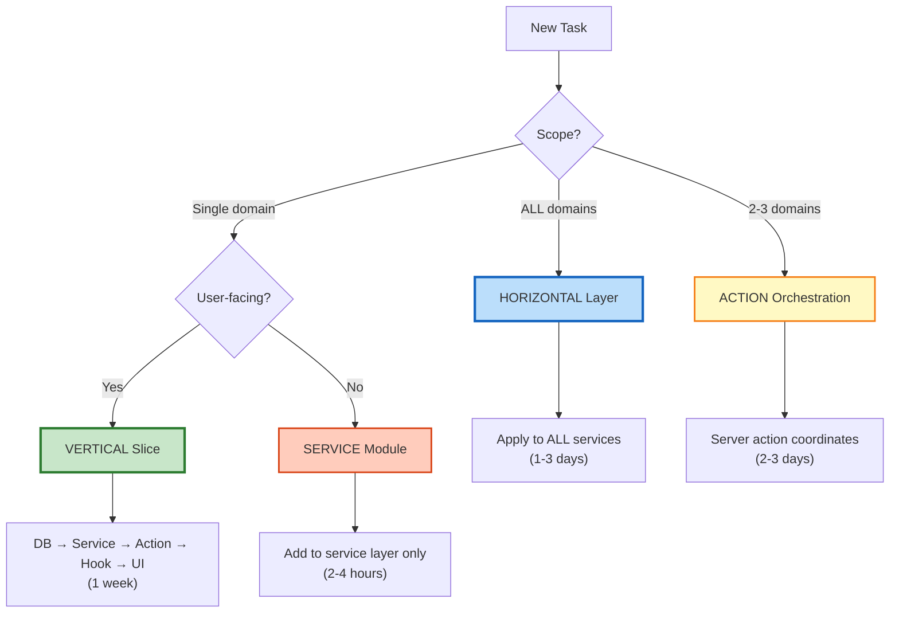
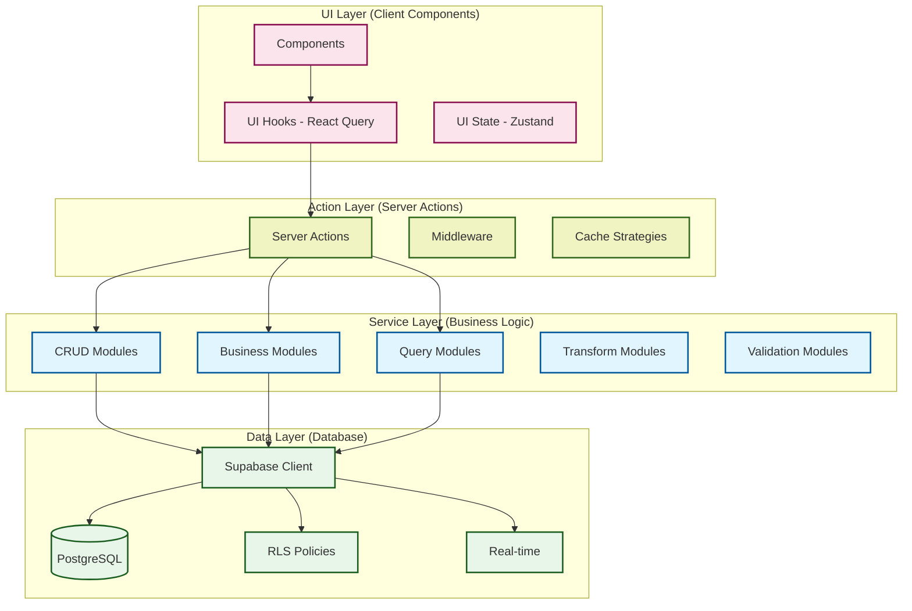

# Balanced Architecture Quick Reference

> **Carry card for vertical vs horizontal slicing decisions**
> **Full analysis**: [Consensus Synthesis](../architecture/slicing/CONSENSUS_SYNTHESIS.md)
> **Context**: Solo developer, 8-week MVP timeline, Phase 2→3 transition

---

## Decision Tree (Use This First)



---

## The 4-Second Rule

Ask yourself:

| Question | Answer | Do This |
|----------|--------|---------|
| **Scope?** | 1 domain | **VERTICAL** |
| **Scope?** | ALL domains (>5) | **HORIZONTAL** |
| **User sees it?** | Yes | **VERTICAL** |
| **Infrastructure?** | Yes | **HORIZONTAL** |

**Default**: When in doubt → **VERTICAL** (ship features, defer abstractions)

---

## Vertical Slicing (Feature Delivery)

### ✅ Use When
- Single domain (Player, Visit, RatingSlip)
- User-facing feature
- Can demo to stakeholders
- Complete in 1 week
- No infrastructure changes needed

### 📦 Implementation Pattern
```typescript
// Week N: Player Management Feature
// ────────────────────────────────────────────────

// 1. DATA: Migration
// supabase/migrations/xxx_player_tables.sql
CREATE TABLE player (...);

// 2. SERVICE: Business logic
// services/player/index.ts
export interface PlayerService {
  create(data: PlayerCreateDTO): Promise<ServiceResult<PlayerDTO>>;
}

// 3. ACTION: Server action
// app/actions/player/create-player.ts
'use server';
export async function createPlayerAction(data: PlayerCreateDTO) {
  const supabase = createServerClient();
  const playerService = createPlayerService(supabase);
  return playerService.create(data);
}

// 4. HOOK: React Query
// hooks/player/use-create-player.ts
export function useCreatePlayer() {
  return useMutation({
    mutationFn: createPlayerAction,
    onSuccess: () => queryClient.invalidateQueries(['players'])
  });
}

// 5. UI: Component
// components/player/player-form.tsx
export function PlayerForm() {
  const { mutate } = useCreatePlayer();
  // ... form UI
}
```

### 🎯 Examples
- Player Management UI (Week 2-3)
- Visit Tracking workflow (Week 4-5)
- RatingSlip creation (Week 6)
- Search for specific domain

### ⏱️ Timeline
- **1 week** per vertical slice (solo developer)
- Day 1-2: Service + tests
- Day 3-4: Action + hooks
- Day 5: UI components
- Day 6-7: E2E tests + polish

---

## Horizontal Layering (Infrastructure)

### ✅ Use When
- Affects ALL domains (>5 services)
- Cross-cutting concern
- Type system evolution
- Testing infrastructure
- No immediate user value

### 🔧 Implementation Pattern
```typescript
// Week N: Add executeOperation wrapper to ALL services
// ─────────────────────────────────────────────────────

// 1. Create shared infrastructure
// services/shared/operation-wrapper.ts
export async function executeOperation<T>(
  operation: string,
  fn: () => Promise<T>
): Promise<ServiceResult<T>> {
  try {
    const data = await fn();
    return { success: true, data };
  } catch (error) {
    return { success: false, error: mapError(error) };
  }
}

// 2. Apply to ALL services (horizontal rollout)
// services/player/crud.ts
export function createPlayerCrudService(...) {
  return {
    create: (data) => executeOperation('player_create', async () => {
      // ... business logic
    })
  };
}

// services/casino/crud.ts (same pattern)
// services/visit/crud.ts (same pattern)
// ... repeat for ALL 8 services
```

### 🎯 Examples
- `executeOperation` wrapper (affects all services)
- Batch cache invalidation
- Supabase client upgrade
- Structured logging
- Shared UI primitives (`components/ui/`)

### ⏱️ Timeline
- **1-3 days** for infrastructure changes
- Design pattern (2-4 hours)
- Apply to all services (1-2 days)
- Integration testing (2-4 hours)

---

## Hybrid (Action Orchestration)

### ✅ Use When
- Feature spans 2-3 domains
- Orchestration needed
- Domain-specific enhancement
- Cross-domain workflow

### 🔀 Implementation Pattern
```typescript
// Visit Start: Player + Casino + Visit domains
// ────────────────────────────────────────────

// app/actions/visit/start-visit.ts
'use server';
export async function startVisitAction(
  playerId: string,
  casinoId: string,
  data: VisitCreateDTO
) {
  const supabase = createServerClient();

  // 1. Orchestrate multiple services (ACTION layer)
  const playerService = createPlayerService(supabase);
  const casinoService = createCasinoService(supabase);
  const visitService = createVisitService(supabase);

  // 2. Validate dependencies
  const player = await playerService.getById(playerId);
  if (!player.success) return player;

  const casino = await casinoService.getById(casinoId);
  if (!casino.success) return casino;

  // 3. Execute domain operation
  return visitService.startVisit({
    ...data,
    player_id: playerId,
    casino_id: casinoId
  });
}
```

### 🎯 Examples
- Visit start (Player + Casino + Visit)
- Real-time for specific domains
- Search across Player + Visit

### ⏱️ Timeline
- **2-3 days** for hybrid features
- Action orchestration (1 day)
- Domain hooks (1 day)
- Integration tests (1 day)

---

## Common Scenarios (Copy-Paste Decisions)

| Scenario | Approach | Rationale | Timeline |
|----------|----------|-----------|----------|
| **Add Player search UI** | VERTICAL | Single domain, user-facing | 1 week |
| **Upgrade Supabase client** | HORIZONTAL | ALL services affected | 2 days |
| **Visit start flow** | HYBRID | 3 services, orchestration | 3 days |
| **Add real-time to Player** | VERTICAL | Domain-specific | 1 week |
| **Create error catalog** | HORIZONTAL (defer) | Not urgent | Future |
| **Split PlayerService (>500 lines)** | HORIZONTAL | Refactoring | 2 hours |
| **Add pagination to lists** | VERTICAL (per domain) | Domain-specific UI | 3 days |
| **Add structured logging** | HORIZONTAL | ALL services | 1 day |

---

## Strategic Technical Debt

### Accept These (For Speed)
✅ **Consolidated files** - 1 file/service until >500 lines (defer split)
✅ **Inline validation** - No separate `validation.ts` until 3+ reuses
✅ **Manual refresh** - No real-time for MVP (Week 7 enhancement)
✅ **Basic lists** - No pagination until >100 records
✅ **Simple errors** - String messages, not catalogs

**Time Saved**: ~22 days → **8-week MVP achievable**

### Never Compromise (Non-Negotiable)
❌ **Explicit interfaces** - `interface XService`, NOT `ReturnType`
❌ **Typed dependencies** - `supabase: SupabaseClient<Database>`, NOT `any`
❌ **ServiceResult pattern** - Consistent error handling
❌ **80% test coverage** - Service layer minimum
❌ **database.types.ts** - Single source of truth

**Rationale**: Zero cost (already implemented), high protection value

---

## Complexity Triggers

### When to Split Service (Vertical → Modules)
- [ ] File exceeds **500 lines**
- [ ] More than **5 modules** per service
- [ ] Function reused across **3+ operations**
- [ ] Team size **>3 developers**

**Action**: Split into `crud.ts`, `business.ts`, `queries.ts`
**Timeline**: 2 hours per service

### When to Formalize Layers (Horizontal)
- [ ] Team size **>3 developers**
- [ ] Onboarding **>1 person/month**
- [ ] Layer violations occurring
- [ ] Technical debt accumulating

**Action**: Add ESLint rules, LAYER_CONTRACTS.md
**Timeline**: 2 days

### When to Add Workflow Layer (Hybrid)
- [ ] Actions need **>3 services** per operation
- [ ] Complex multi-step processes
- [ ] Cross-domain state coordination

**Action**: Introduce workflow orchestration layer
**Timeline**: 1 week

---

## Week-by-Week Application (Phase 3)

### Week 1: Service Layer Finalization (HORIZONTAL)
- Complete MTL Service queries
- Add modules WHERE NEEDED (not all services)
- Integration testing

**Rationale**: Foundation before features

---

### Weeks 2-3: Player Management (VERTICAL)
```
✅ DB schema (player table)
✅ Service (PlayerService CRUD)
✅ Actions (createPlayerAction, updatePlayerAction)
✅ Hooks (useCreatePlayer, useUpdatePlayer)
✅ UI (PlayerForm, PlayerList, PlayerCard)
✅ Tests (E2E player CRUD)
```

**Deliverable**: Working Player Management UI

---

### Weeks 4-5: Visit Tracking (VERTICAL)
```
✅ DB schema (visit table + lifecycle)
✅ Service (VisitService.startVisit, endVisit)
✅ Actions (startVisitAction, endVisitAction)
✅ Hooks (useStartVisit, useEndVisit)
✅ UI (VisitForm, VisitList, VisitTimeline)
✅ Tests (E2E visit lifecycle)
```

**Deliverable**: Working Visit Tracking UI

---

### Week 6: RatingSlip Creation (VERTICAL)
```
✅ DB schema (rating slip table)
✅ Service (RatingSlipService CRUD)
✅ Actions (createRatingSlipAction)
✅ Hooks (useCreateRatingSlip)
✅ UI (RatingSlipForm, RatingSlipList)
✅ Tests (E2E rating slip workflows)
```

**Deliverable**: Working RatingSlip UI

---

### Week 7: Real-Time Infrastructure (HORIZONTAL)
```
✅ useSupabaseChannel wrapper (infrastructure)
✅ Batch invalidation scheduler
✅ Domain real-time hooks (Player, Visit, RatingSlip)
✅ Memory leak prevention
```

**Deliverable**: Real-time synchronization across domains

---

### Week 8: Production Hardening (HORIZONTAL)
```
✅ Integration tests (cross-domain)
✅ Performance optimization (Lighthouse)
✅ Bundle optimization (code splitting)
✅ Deployment automation
```

**Deliverable**: Production MVP

---

## Quick Sanity Checks

### Before Starting Work
- [ ] Consulted decision tree (4-second rule)
- [ ] Checked if affects 1 domain or ALL
- [ ] Verified user-facing vs infrastructure
- [ ] Estimated timeline (hours vs days vs weeks)

### During Implementation
- [ ] Tests written alongside code (TDD)
- [ ] Following SERVICE_TEMPLATE_QUICK patterns
- [ ] No PRD violations (explicit interfaces, typed params)
- [ ] Coverage >80% maintained

### Before PR
- [ ] All tests passing (`npm test`)
- [ ] Type check clean (`npx tsc --noEmit`)
- [ ] No layer violations (services don't call actions)
- [ ] Documented in session handoff

---

## Emergency Decision Matrix

**Confused about approach?** Ask these 3 questions:

1. **"How many services does this touch?"**
   - 1 service → VERTICAL
   - ALL services → HORIZONTAL
   - 2-3 services → HYBRID (Action orchestration)

2. **"Will users see this in the UI?"**
   - Yes → VERTICAL
   - No → HORIZONTAL or SERVICE module

3. **"How urgent is this?"**
   - MVP blocker → VERTICAL (ship feature)
   - Nice-to-have → Defer
   - Infrastructure → HORIZONTAL (when needed)

**Still stuck?** Default to **VERTICAL** → ship working feature, refactor later if needed

---

## Core Principle (Memorize This)

> **"Horizontal layers for technical architecture, vertical slices for feature delivery"**

**Translation**:
- **Architecture** uses 4 horizontal layers (Data → Service → Action → UI)
- **Delivery** uses vertical cadence (Player week 1, Visit week 2, etc.)
- **NOT** either/or - it's **BOTH** working together

---

## Visual Reference (The Diagram You Selected)



**Horizontal Dimension**: Technical layers (separation of concerns)
**Vertical Dimension**: Feature delivery (Player, Visit, RatingSlip)

---

## Related Docs

**Quick References**:
- [SERVICE_TEMPLATE_QUICK.md](./SERVICE_TEMPLATE_QUICK.md) - Service implementation
- [DATABASE_TYPE_WORKFLOW.md](../workflows/DATABASE_TYPE_WORKFLOW.md) - Type management
- [SESSION_HANDOFF.md](../phase-2/SESSION_HANDOFF.md) - Current status

**Deep Dives**:
- [CONSENSUS_SYNTHESIS.md](../architecture/slicing/CONSENSUS_SYNTHESIS.md) - Full analysis (723 lines)
- [EVALUATION_FRAMEWORK.md](../architecture/slicing/EVALUATION_FRAMEWORK.md) - Decision framework (651 lines)
- [CANONICAL_BLUEPRINT_MVP_PRD.md](../system-prd/CANONICAL_BLUEPRINT_MVP_PRD.md) - Complete PRD

**Anti-Patterns**:
- [PRD §4](../system-prd/CANONICAL_BLUEPRINT_MVP_PRD.md#4-anti-pattern-guardrails) - What NOT to do

---

**Document Version**: 1.0.0
**Synced With**: CONSENSUS_SYNTHESIS.md (2025-10-09)
**Context**: Solo developer, 8-week MVP, Phase 2→3 transition
**Reading Time**: 10 minutes (vs 3 hours for full analysis)

---

_This is the 90% use case. For edge cases or team scaling, consult full framework._
