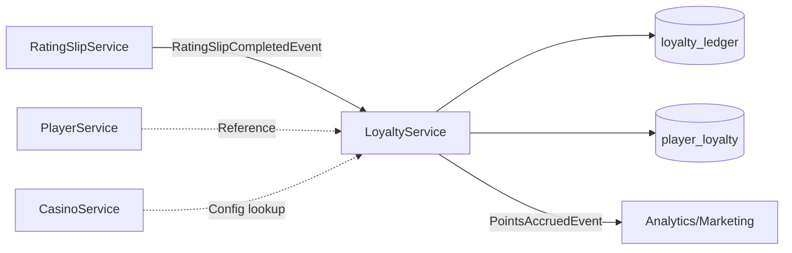
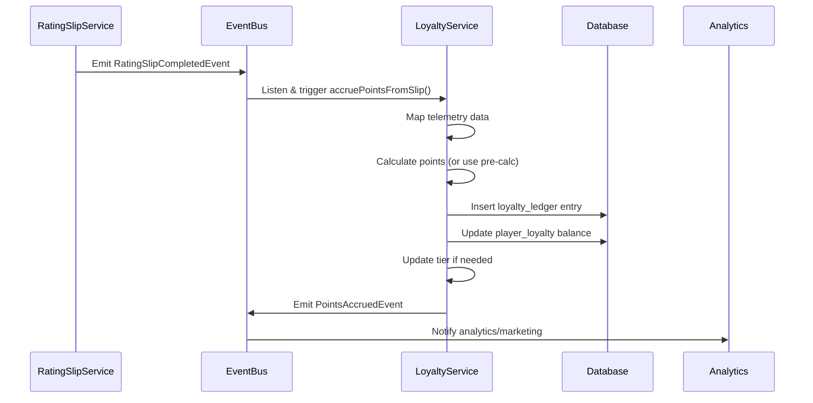

# Loyalty Service - Comprehensive Design Document

> **Status**: Design Phase
> **Domain**: Loyalty & Rewards
> **Bounded Context**: "How do we convert player performance into loyalty rewards?"
> **Phase**: 3 (Service Layer Development)
> **Date**: 2025-10-10

---

## Table of Contents

1. [Executive Summary](#executive-summary)
2. [Domain Responsibility](#domain-responsibility)
3. [Architecture Overview](#architecture-overview)
4. [Service Interface Design](#service-interface-design)
5. [Data Layer Design](#data-layer-design)
6. [Business Logic Design](#business-logic-design)
7. [CRUD Operations Design](#crud-operations-design)
8. [Query Operations Design](#query-operations-design)
9. [Translation Layer Design](#translation-layer-design)
10. [Event Integration Design](#event-integration-design)
11. [Testing Strategy](#testing-strategy)
12. [Implementation Roadmap](#implementation-roadmap)

---

## 1. Executive Summary

### Purpose
The **Loyalty Service** converts gameplay telemetry into player rewards, managing:
- Points accrual from RatingSlip performance data
- Tier progression and management
- Loyalty transaction ledgering (audit trail)
- Player reward preferences

### Key Design Decisions

| Decision | Rationale |
|----------|-----------|
| **Functional factory pattern** | Align with PT-2 architecture standards |
| **Explicit `LoyaltyService` interface** | No `ReturnType` inference per PRD |
| **Typed `supabase: SupabaseClient<Database>`** | Type safety, no `any` |
| **Points = theoretical win × conversion** | Based on PT-1 proven algorithm |
| **Ledger-first architecture** | Audit trail for all transactions |
| **Event-driven accrual** | Listen to `RatingSlipCompletedEvent` |

### Bounded Context
- **OWNS**: Points logic, tier thresholds, loyalty transactions, preferences
- **REFERENCES**: Player (FK), RatingSlip (FK for transaction source)
- **DOES NOT OWN**: Player identity, gameplay metrics, casino config

---

## 2. Domain Responsibility

### Core Responsibilities

| Function | Description | Owner |
|----------|-------------|-------|
| **Accrual Logic** | Calculate points from RatingSlip telemetry | LoyaltyService |
| **Ledgering** | Record all points transactions (credits/debits) | LoyaltyService |
| **Tier Management** | Maintain tier, thresholds, progress tracking | LoyaltyService |
| **Preferences** | Store reward/communication preferences | LoyaltyService |
| **Balance Queries** | Get current points balance | LoyaltyService |
| **History Queries** | Retrieve transaction history | LoyaltyService |

### What We Do NOT Own

❌ **Player Identity** → `PlayerService`
❌ **Gameplay Metrics** → `RatingSlipService`
❌ **Casino Configuration** → `CasinoService`
❌ **Visit Sessions** → `VisitService`

### Integration Points



---

## 3. Architecture Overview

### Directory Structure

```
services/loyalty/
├── index.ts                    # Factory + explicit LoyaltyService interface
├── crud.ts                     # CRUD for loyalty_ledger, player_loyalty
├── business.ts                 # Points calculation, tier progression logic
├── queries.ts                  # Balance, history, tier queries
└── translation/
    └── telemetry-mapper.ts     # Map RatingSlip DTO → Loyalty accrual input
```

### Architectural Pattern: **VERTICAL Slice**

**Decision**: Loyalty is a **single domain** service (not horizontal infrastructure)

**Rationale** (per [BALANCED_ARCHITECTURE_QUICK.md](../patterns/BALANCED_ARCHITECTURE_QUICK.md)):
- Scope: 1 domain (Loyalty)
- User-facing: Yes (points balance, tier status in UI)
- Timeline: 1 week (service + actions + hooks + UI)
- Approach: **VERTICAL** → full stack slice

**Modules** (per Rule of Three):
- ✅ `business.ts` - Points calculation logic (domain-specific)
- ✅ `queries.ts` - Complex queries (balance, history, tier progress)
- ✅ `translation/` - RatingSlip telemetry mapping (domain boundary translation)

---

## 4. Service Interface Design

### Explicit Interface (No `ReturnType` Inference)

```typescript
/**
 * Loyalty Service Interface
 * Following PT-2 canonical service architecture
 *
 * Bounded Context: Convert gameplay into loyalty rewards
 */
export interface LoyaltyService {
  // ─────────────────────────────────────────────────────────
  // ACCRUAL OPERATIONS
  // ─────────────────────────────────────────────────────────

  /**
   * Accrue points from RatingSlip telemetry
   *
   * @param input - RatingSlip performance data
   * @returns ServiceResult with ledger entry
   *
   * @example
   * const result = await loyaltyService.accruePointsFromSlip({
   *   playerId: 'uuid',
   *   ratingSlipId: 'uuid',
   *   averageBet: 50,
   *   totalRounds: 120,
   *   durationMinutes: 90,
   *   gameSettings: { house_edge: 2.5, ... }
   * });
   */
  accruePointsFromSlip(
    input: AccruePointsFromSlipInput
  ): Promise<ServiceResult<LoyaltyLedgerDTO>>;

  /**
   * Manual points adjustment (admin action)
   *
   * @param input - Manual adjustment data
   * @returns ServiceResult with ledger entry
   */
  adjustPoints(
    input: ManualPointsAdjustmentInput
  ): Promise<ServiceResult<LoyaltyLedgerDTO>>;

  /**
   * Redeem points for rewards
   *
   * @param input - Redemption data
   * @returns ServiceResult with redemption ledger entry
   */
  redeemPoints(
    input: RedeemPointsInput
  ): Promise<ServiceResult<LoyaltyLedgerDTO>>;

  // ─────────────────────────────────────────────────────────
  // QUERY OPERATIONS
  // ─────────────────────────────────────────────────────────

  /**
   * Get current points balance for player
   *
   * @param playerId - Player UUID
   * @returns ServiceResult with balance data
   */
  getBalance(playerId: string): Promise<ServiceResult<PlayerLoyaltyDTO>>;

  /**
   * Get current tier information for player
   *
   * @param playerId - Player UUID
   * @returns ServiceResult with tier data
   */
  getTier(playerId: string): Promise<ServiceResult<PlayerLoyaltyDTO>>;

  /**
   * Get transaction history for player
   *
   * @param playerId - Player UUID
   * @param options - Pagination/filtering options
   * @returns ServiceResult with ledger entries
   */
  getTransactionHistory(
    playerId: string,
    options?: TransactionHistoryOptions
  ): Promise<ServiceResult<LoyaltyLedgerDTO[]>>;

  /**
   * Get tier progress information
   *
   * @param playerId - Player UUID
   * @returns ServiceResult with progress data
   */
  getTierProgress(
    playerId: string
  ): Promise<ServiceResult<TierProgressDTO>>;

  // ─────────────────────────────────────────────────────────
  // TIER MANAGEMENT
  // ─────────────────────────────────────────────────────────

  /**
   * Recalculate and update player tier
   * (Typically triggered by points accrual)
   *
   * @param playerId - Player UUID
   * @returns ServiceResult with updated tier
   */
  updateTier(playerId: string): Promise<ServiceResult<PlayerLoyaltyDTO>>;

  /**
   * Initialize loyalty record for new player
   *
   * @param playerId - Player UUID
   * @returns ServiceResult with initial loyalty record
   */
  initializePlayerLoyalty(
    playerId: string
  ): Promise<ServiceResult<PlayerLoyaltyDTO>>;
}
```

### Factory Pattern

```typescript
/**
 * Loyalty Service Factory
 * Following PT-2 canonical service architecture
 */
export function createLoyaltyService(
  supabase: SupabaseClient<Database>
): LoyaltyService {
  const crudService = createLoyaltyCrudService(supabase);
  const businessService = createLoyaltyBusinessService(supabase);
  const queriesService = createLoyaltyQueriesService(supabase);

  return {
    // Accrual operations
    accruePointsFromSlip: businessService.accruePointsFromSlip,
    adjustPoints: crudService.createLedgerEntry,
    redeemPoints: businessService.redeemPoints,

    // Query operations
    getBalance: queriesService.getBalance,
    getTier: queriesService.getTier,
    getTransactionHistory: queriesService.getTransactionHistory,
    getTierProgress: queriesService.getTierProgress,

    // Tier management
    updateTier: businessService.updateTier,
    initializePlayerLoyalty: crudService.initializePlayerLoyalty,
  };
}

// ✅ Export explicit type (NOT ReturnType)
export type LoyaltyServiceType = LoyaltyService;
```

---

## 5. Data Layer Design

### Database Tables (Existing Schema)

#### Table: `player_loyalty`

```typescript
// Source: types/database.types.ts:1038-1093
export type PlayerLoyaltyDTO = Pick<
  Database["public"]["Tables"]["player_loyalty"]["Row"],
  | "id"
  | "player_id"
  | "points_balance"
  | "points_earned_total"
  | "points_redeemed_total"
  | "tier"
  | "tier_expires_at"
  | "tier_progress"
  | "achievements"
  | "benefits"
  | "milestones"
  | "created_at"
  | "updated_at"
>;

export interface PlayerLoyaltyCreateDTO {
  player_id: string;
  tier?: string;                    // Default: 'BRONZE'
  points_balance?: number;          // Default: 0
  points_earned_total?: number;     // Default: 0
  points_redeemed_total?: number;   // Default: 0
  tier_progress?: number;           // Default: 0
}

export interface PlayerLoyaltyUpdateDTO {
  points_balance?: number;
  points_earned_total?: number;
  points_redeemed_total?: number;
  tier?: string;
  tier_expires_at?: string | null;
  tier_progress?: number;
  achievements?: Json;
  benefits?: Json;
  milestones?: Json;
}
```

**Relationships**:
- `player_id` → `player.id` (1:1, FK)

**Constraints**:
- Unique constraint on `player_id`
- Non-negative points balances

---

#### Table: `loyalty_ledger` (To Be Created)

```sql
-- Migration: supabase/migrations/xxx_create_loyalty_ledger.sql

CREATE TABLE loyalty_ledger (
  id UUID PRIMARY KEY DEFAULT gen_random_uuid(),
  player_id UUID NOT NULL REFERENCES player(id) ON DELETE CASCADE,

  -- Transaction details
  transaction_type TEXT NOT NULL CHECK (transaction_type IN (
    'ACCRUAL',        -- Points earned from gameplay
    'REDEMPTION',     -- Points spent on rewards
    'ADJUSTMENT',     -- Manual admin adjustment
    'EXPIRATION',     -- Points expired
    'BONUS'           -- Promotional bonus
  )),

  points_change INTEGER NOT NULL,  -- Positive = credit, Negative = debit
  balance_after INTEGER NOT NULL,  -- Snapshot balance after transaction

  -- Source tracking
  source_type TEXT CHECK (source_type IN (
    'RATING_SLIP',
    'MANUAL',
    'PROMOTION',
    'SYSTEM'
  )),
  source_id UUID,  -- FK to ratingslip.id or other source

  -- Metadata
  description TEXT,
  metadata JSONB,  -- Flexible storage for transaction context

  -- Audit
  created_at TIMESTAMPTZ NOT NULL DEFAULT now(),
  created_by UUID,  -- Admin user who created (if manual)

  -- Indexes
  CONSTRAINT ledger_points_balance_positive CHECK (balance_after >= 0)
);

CREATE INDEX idx_loyalty_ledger_player_id ON loyalty_ledger(player_id);
CREATE INDEX idx_loyalty_ledger_created_at ON loyalty_ledger(created_at DESC);
CREATE INDEX idx_loyalty_ledger_source ON loyalty_ledger(source_type, source_id);
CREATE INDEX idx_loyalty_ledger_transaction_type ON loyalty_ledger(transaction_type);
```

**DTOs**:

```typescript
export type LoyaltyLedgerDTO = Pick<
  Database["public"]["Tables"]["loyalty_ledger"]["Row"],
  | "id"
  | "player_id"
  | "transaction_type"
  | "points_change"
  | "balance_after"
  | "source_type"
  | "source_id"
  | "description"
  | "metadata"
  | "created_at"
  | "created_by"
>;

export interface LoyaltyLedgerCreateDTO {
  player_id: string;
  transaction_type: "ACCRUAL" | "REDEMPTION" | "ADJUSTMENT" | "EXPIRATION" | "BONUS";
  points_change: number;
  balance_after: number;
  source_type?: "RATING_SLIP" | "MANUAL" | "PROMOTION" | "SYSTEM";
  source_id?: string;
  description?: string;
  metadata?: Record<string, unknown>;
  created_by?: string;
}
```

---

## 6. Business Logic Design

### Points Calculation Algorithm

**Source**: `reference-pt-1/utils/point-calculator.ts`

#### Core Formula

```typescript
/**
 * Calculate loyalty points from RatingSlip performance
 *
 * Formula:
 * 1. theoreticalWin = (averageBet × houseEdge%) × totalRounds
 * 2. basePoints = theoreticalWin × conversionRate × multiplier
 * 3. Apply bonuses:
 *    - Empty seats: +5% per empty seat (7-seat baseline)
 *    - High volume: +10% if rounds > expectedRoundsPerHour
 * 4. Round to integer
 *
 * @param input - RatingSlip performance + game settings
 * @returns Calculated points (integer)
 */
export function calculatePoints(input: PointsCalculationInput): number {
  const {
    averageBet,
    totalRounds,
    gameSettings,
  } = input;

  const {
    house_edge,
    average_rounds_per_hour,
    point_multiplier = 1.0,
    points_conversion_rate = 10.0,
    seats_available = 7,
  } = gameSettings;

  // Step 1: Calculate theoretical win (casino's expected profit)
  const theoreticalWin = ((averageBet * house_edge) / 100) * totalRounds;

  // Step 2: Base points from theoretical win
  let pointsEarned =
    theoreticalWin * points_conversion_rate * point_multiplier;

  // Step 3: Empty seat bonus (encourage play at off-peak tables)
  const currentSeats = seats_available ?? 7;
  if (currentSeats < 7) {
    const emptySeats = 7 - currentSeats;
    const bonusFactor = 1 + emptySeats * 0.05; // 5% per empty seat
    pointsEarned *= bonusFactor;
  }

  // Step 4: High volume bonus (reward extended play)
  if (totalRounds > average_rounds_per_hour) {
    pointsEarned *= 1.1; // 10% bonus
  }

  // Step 5: Round to integer
  return Math.round(pointsEarned);
}
```

#### Input DTO

```typescript
export interface PointsCalculationInput {
  averageBet: number;
  totalRounds: number;
  gameSettings: {
    house_edge: number;
    average_rounds_per_hour: number;
    point_multiplier: number | null;
    points_conversion_rate: number | null;
    seats_available: number | null;
  };
}
```

#### Business Validation

```typescript
/**
 * Validate points calculation input
 * Throws structured error if invalid
 */
function validatePointsInput(input: PointsCalculationInput): void {
  if (input.averageBet <= 0) {
    throw {
      code: "INVALID_AVERAGE_BET",
      message: "Average bet must be positive",
    };
  }

  if (input.totalRounds <= 0) {
    throw {
      code: "INVALID_TOTAL_ROUNDS",
      message: "Total rounds must be positive",
    };
  }

  if (input.gameSettings.house_edge <= 0 || input.gameSettings.house_edge > 100) {
    throw {
      code: "INVALID_HOUSE_EDGE",
      message: "House edge must be between 0 and 100",
    };
  }
}
```

---

### Tier Management Logic

#### Tier Definitions

```typescript
export const LOYALTY_TIERS = {
  BRONZE: {
    name: "BRONZE",
    minPoints: 0,
    maxPoints: 999,
    benefits: ["Basic rewards", "Birthday bonus"],
  },
  SILVER: {
    name: "SILVER",
    minPoints: 1000,
    maxPoints: 4999,
    benefits: ["Priority service", "10% bonus points", "Quarterly rewards"],
  },
  GOLD: {
    name: "GOLD",
    minPoints: 5000,
    maxPoints: 19999,
    benefits: ["VIP lounge access", "20% bonus points", "Monthly rewards"],
  },
  PLATINUM: {
    name: "PLATINUM",
    minPoints: 20000,
    maxPoints: Infinity,
    benefits: ["Personal host", "30% bonus points", "Exclusive events"],
  },
} as const;

export type LoyaltyTier = keyof typeof LOYALTY_TIERS;
```

#### Tier Calculation

```typescript
/**
 * Determine tier based on points earned (lifetime total)
 *
 * @param pointsEarnedTotal - Lifetime points earned
 * @returns Current tier name
 */
export function calculateTier(pointsEarnedTotal: number): LoyaltyTier {
  if (pointsEarnedTotal >= LOYALTY_TIERS.PLATINUM.minPoints) {
    return "PLATINUM";
  } else if (pointsEarnedTotal >= LOYALTY_TIERS.GOLD.minPoints) {
    return "GOLD";
  } else if (pointsEarnedTotal >= LOYALTY_TIERS.SILVER.minPoints) {
    return "SILVER";
  } else {
    return "BRONZE";
  }
}

/**
 * Calculate tier progress (0-100%)
 *
 * @param pointsEarnedTotal - Lifetime points earned
 * @returns Progress percentage to next tier
 */
export function calculateTierProgress(pointsEarnedTotal: number): number {
  const currentTier = calculateTier(pointsEarnedTotal);

  if (currentTier === "PLATINUM") {
    return 100; // Max tier reached
  }

  const tierConfig = LOYALTY_TIERS[currentTier];
  const nextTierConfig =
    currentTier === "BRONZE" ? LOYALTY_TIERS.SILVER :
    currentTier === "SILVER" ? LOYALTY_TIERS.GOLD :
    LOYALTY_TIERS.PLATINUM;

  const pointsInCurrentTier = pointsEarnedTotal - tierConfig.minPoints;
  const pointsNeededForNextTier = nextTierConfig.minPoints - tierConfig.minPoints;

  return Math.round((pointsInCurrentTier / pointsNeededForNextTier) * 100);
}
```

---

## 7. CRUD Operations Design

### Module: `services/loyalty/crud.ts`

```typescript
/**
 * Loyalty CRUD Module
 * Following PT-2 canonical service architecture
 */

import type { SupabaseClient } from "@supabase/supabase-js";
import type { Database } from "@/types/database.types";
import { executeOperation } from "../shared/operation-wrapper";
import type { ServiceResult } from "../shared/types";

export function createLoyaltyCrudService(supabase: SupabaseClient<Database>) {
  return {
    /**
     * Initialize loyalty record for new player
     * Called when player is created
     *
     * @param playerId - Player UUID
     * @returns ServiceResult with initial loyalty record
     */
    initializePlayerLoyalty: async (
      playerId: string
    ): Promise<ServiceResult<PlayerLoyaltyDTO>> => {
      return executeOperation<PlayerLoyaltyDTO>(
        "loyalty_initialize",
        async () => {
          const { data, error } = await supabase
            .from("player_loyalty")
            .insert({
              player_id: playerId,
              tier: "BRONZE",
              points_balance: 0,
              points_earned_total: 0,
              points_redeemed_total: 0,
              tier_progress: 0,
            })
            .select(
              `
              id,
              player_id,
              points_balance,
              points_earned_total,
              points_redeemed_total,
              tier,
              tier_expires_at,
              tier_progress,
              achievements,
              benefits,
              milestones,
              created_at,
              updated_at
            `
            )
            .single();

          if (error) {
            if (error.code === "23505") {
              throw {
                code: "LOYALTY_ALREADY_EXISTS",
                message: `Loyalty record already exists for player ${playerId}`,
              };
            }
            throw error;
          }

          return data;
        }
      );
    },

    /**
     * Create ledger entry (transaction record)
     *
     * @param entry - Ledger entry data
     * @returns ServiceResult with created entry
     */
    createLedgerEntry: async (
      entry: LoyaltyLedgerCreateDTO
    ): Promise<ServiceResult<LoyaltyLedgerDTO>> => {
      return executeOperation<LoyaltyLedgerDTO>(
        "loyalty_create_ledger_entry",
        async () => {
          const { data, error } = await supabase
            .from("loyalty_ledger")
            .insert(entry)
            .select(
              `
              id,
              player_id,
              transaction_type,
              points_change,
              balance_after,
              source_type,
              source_id,
              description,
              metadata,
              created_at,
              created_by
            `
            )
            .single();

          if (error) {
            throw error;
          }

          return data;
        }
      );
    },

    /**
     * Update player loyalty record
     *
     * @param playerId - Player UUID
     * @param updates - Fields to update
     * @returns ServiceResult with updated record
     */
    updatePlayerLoyalty: async (
      playerId: string,
      updates: PlayerLoyaltyUpdateDTO
    ): Promise<ServiceResult<PlayerLoyaltyDTO>> => {
      return executeOperation<PlayerLoyaltyDTO>(
        "loyalty_update_player",
        async () => {
          const { data, error } = await supabase
            .from("player_loyalty")
            .update(updates)
            .eq("player_id", playerId)
            .select(
              `
              id,
              player_id,
              points_balance,
              points_earned_total,
              points_redeemed_total,
              tier,
              tier_expires_at,
              tier_progress,
              achievements,
              benefits,
              milestones,
              created_at,
              updated_at
            `
            )
            .single();

          if (error) {
            if (error.code === "PGRST116") {
              throw {
                code: "LOYALTY_NOT_FOUND",
                message: `Loyalty record not found for player ${playerId}`,
              };
            }
            throw error;
          }

          return data;
        }
      );
    },

    /**
     * Get player loyalty record by ID
     *
     * @param playerId - Player UUID
     * @returns ServiceResult with loyalty record
     */
    getPlayerLoyalty: async (
      playerId: string
    ): Promise<ServiceResult<PlayerLoyaltyDTO>> => {
      return executeOperation<PlayerLoyaltyDTO>(
        "loyalty_get_player",
        async () => {
          const { data, error } = await supabase
            .from("player_loyalty")
            .select(
              `
              id,
              player_id,
              points_balance,
              points_earned_total,
              points_redeemed_total,
              tier,
              tier_expires_at,
              tier_progress,
              achievements,
              benefits,
              milestones,
              created_at,
              updated_at
            `
            )
            .eq("player_id", playerId)
            .single();

          if (error) {
            if (error.code === "PGRST116") {
              throw {
                code: "LOYALTY_NOT_FOUND",
                message: `Loyalty record not found for player ${playerId}`,
              };
            }
            throw error;
          }

          return data;
        }
      );
    },
  };
}
```

---

## 8. Query Operations Design

### Module: `services/loyalty/queries.ts`

```typescript
/**
 * Loyalty Queries Module
 * Following PT-2 canonical service architecture
 *
 * Bounded Context: "What are the player's loyalty metrics?"
 */

import type { SupabaseClient } from "@supabase/supabase-js";
import type { Database } from "@/types/database.types";
import { executeOperation } from "../shared/operation-wrapper";
import type { ServiceResult } from "../shared/types";

export interface TransactionHistoryOptions {
  limit?: number;
  offset?: number;
  transactionType?: "ACCRUAL" | "REDEMPTION" | "ADJUSTMENT" | "EXPIRATION" | "BONUS";
  startDate?: string;
  endDate?: string;
}

export interface TierProgressDTO {
  currentTier: string;
  pointsEarnedTotal: number;
  pointsToNextTier: number;
  progressPercentage: number;
  nextTier: string | null;
}

export function createLoyaltyQueriesService(supabase: SupabaseClient<Database>) {
  return {
    /**
     * Get current points balance
     *
     * @param playerId - Player UUID
     * @returns ServiceResult with balance
     */
    getBalance: async (
      playerId: string
    ): Promise<ServiceResult<PlayerLoyaltyDTO>> => {
      return executeOperation<PlayerLoyaltyDTO>(
        "loyalty_get_balance",
        async () => {
          const { data, error } = await supabase
            .from("player_loyalty")
            .select("id, player_id, points_balance, created_at, updated_at")
            .eq("player_id", playerId)
            .single();

          if (error) {
            if (error.code === "PGRST116") {
              throw {
                code: "LOYALTY_NOT_FOUND",
                message: `Loyalty record not found for player ${playerId}`,
              };
            }
            throw error;
          }

          return data;
        }
      );
    },

    /**
     * Get current tier
     *
     * @param playerId - Player UUID
     * @returns ServiceResult with tier info
     */
    getTier: async (
      playerId: string
    ): Promise<ServiceResult<PlayerLoyaltyDTO>> => {
      return executeOperation<PlayerLoyaltyDTO>(
        "loyalty_get_tier",
        async () => {
          const { data, error } = await supabase
            .from("player_loyalty")
            .select(
              "id, player_id, tier, tier_expires_at, tier_progress, benefits"
            )
            .eq("player_id", playerId)
            .single();

          if (error) {
            if (error.code === "PGRST116") {
              throw {
                code: "LOYALTY_NOT_FOUND",
                message: `Loyalty record not found for player ${playerId}`,
              };
            }
            throw error;
          }

          return data;
        }
      );
    },

    /**
     * Get transaction history
     *
     * @param playerId - Player UUID
     * @param options - Filtering/pagination options
     * @returns ServiceResult with ledger entries
     */
    getTransactionHistory: async (
      playerId: string,
      options?: TransactionHistoryOptions
    ): Promise<ServiceResult<LoyaltyLedgerDTO[]>> => {
      return executeOperation<LoyaltyLedgerDTO[]>(
        "loyalty_get_transaction_history",
        async () => {
          let query = supabase
            .from("loyalty_ledger")
            .select(
              `
              id,
              player_id,
              transaction_type,
              points_change,
              balance_after,
              source_type,
              source_id,
              description,
              metadata,
              created_at,
              created_by
            `
            )
            .eq("player_id", playerId)
            .order("created_at", { ascending: false });

          // Apply filters
          if (options?.transactionType) {
            query = query.eq("transaction_type", options.transactionType);
          }

          if (options?.startDate) {
            query = query.gte("created_at", options.startDate);
          }

          if (options?.endDate) {
            query = query.lte("created_at", options.endDate);
          }

          // Apply pagination
          if (options?.limit) {
            query = query.limit(options.limit);
          }

          if (options?.offset) {
            query = query.range(
              options.offset,
              options.offset + (options.limit || 10) - 1
            );
          }

          const { data, error } = await query;

          if (error) {
            throw error;
          }

          return data || [];
        }
      );
    },

    /**
     * Get tier progress information
     *
     * @param playerId - Player UUID
     * @returns ServiceResult with progress data
     */
    getTierProgress: async (
      playerId: string
    ): Promise<ServiceResult<TierProgressDTO>> => {
      return executeOperation<TierProgressDTO>(
        "loyalty_get_tier_progress",
        async () => {
          const { data, error } = await supabase
            .from("player_loyalty")
            .select("tier, points_earned_total, tier_progress")
            .eq("player_id", playerId)
            .single();

          if (error) {
            if (error.code === "PGRST116") {
              throw {
                code: "LOYALTY_NOT_FOUND",
                message: `Loyalty record not found for player ${playerId}`,
              };
            }
            throw error;
          }

          const currentTier = data.tier;
          const pointsEarnedTotal = data.points_earned_total || 0;

          // Calculate next tier and points needed
          const tierConfig = LOYALTY_TIERS[currentTier as LoyaltyTier];
          let nextTier: string | null = null;
          let pointsToNextTier = 0;

          if (currentTier === "BRONZE") {
            nextTier = "SILVER";
            pointsToNextTier = LOYALTY_TIERS.SILVER.minPoints - pointsEarnedTotal;
          } else if (currentTier === "SILVER") {
            nextTier = "GOLD";
            pointsToNextTier = LOYALTY_TIERS.GOLD.minPoints - pointsEarnedTotal;
          } else if (currentTier === "GOLD") {
            nextTier = "PLATINUM";
            pointsToNextTier = LOYALTY_TIERS.PLATINUM.minPoints - pointsEarnedTotal;
          }

          return {
            currentTier,
            pointsEarnedTotal,
            pointsToNextTier: Math.max(0, pointsToNextTier),
            progressPercentage: data.tier_progress || 0,
            nextTier,
          };
        }
      );
    },
  };
}
```

---

## 9. Translation Layer Design

### Module: `services/loyalty/translation/telemetry-mapper.ts`

**Purpose**: Map RatingSlip domain data → Loyalty domain input

```typescript
/**
 * Telemetry Mapper: RatingSlip → Loyalty
 *
 * Bounded Context Translation Layer
 * Maps RatingSlip performance data to Loyalty accrual input
 */

import type { Database } from "@/types/database.types";

/**
 * RatingSlip telemetry (from RatingSlipService)
 */
export interface RatingSlipTelemetry {
  id: string;
  player_id: string;
  average_bet: number;
  accumulated_seconds: number;
  points: number;  // Pre-calculated points from RatingSlip
  game_settings: Database["public"]["Tables"]["game_settings"]["Row"];
}

/**
 * Loyalty accrual input (for LoyaltyService)
 */
export interface LoyaltyAccrualInput {
  playerId: string;
  ratingSlipId: string;
  pointsEarned: number;
  metadata: {
    averageBet: number;
    durationMinutes: number;
    gameType: string;
    seatsAvailable: number;
  };
}

/**
 * Map RatingSlip telemetry to Loyalty accrual input
 *
 * @param telemetry - RatingSlip performance data
 * @returns Loyalty accrual input DTO
 *
 * @example
 * const ratingSlip = await ratingSlipService.getById(slipId);
 * const loyaltyInput = mapRatingSlipToLoyaltyAccrual(ratingSlip.data);
 * const result = await loyaltyService.accruePointsFromSlip(loyaltyInput);
 */
export function mapRatingSlipToLoyaltyAccrual(
  telemetry: RatingSlipTelemetry
): LoyaltyAccrualInput {
  return {
    playerId: telemetry.player_id,
    ratingSlipId: telemetry.id,
    pointsEarned: telemetry.points, // Use pre-calculated points from RatingSlip
    metadata: {
      averageBet: telemetry.average_bet,
      durationMinutes: Math.round(telemetry.accumulated_seconds / 60),
      gameType: telemetry.game_settings.game_name || "Unknown",
      seatsAvailable: telemetry.game_settings.seats_available || 7,
    },
  };
}
```

**Design Decision**: Use **pre-calculated points from RatingSlip**

**Rationale**:
- RatingSlip already has `points` field (stores calculated points)
- Avoid re-calculating points in Loyalty (DRY principle)
- RatingSlip owns the calculation logic (single source of truth)
- Loyalty only needs to ledger the transaction

**Alternative Approach** (if points NOT pre-calculated in RatingSlip):
```typescript
export function mapRatingSlipToPointsCalculation(
  telemetry: RatingSlipTelemetry
): PointsCalculationInput {
  return {
    averageBet: telemetry.average_bet,
    totalRounds: calculateRoundsFromDuration(
      telemetry.accumulated_seconds,
      telemetry.game_settings.average_rounds_per_hour
    ),
    gameSettings: {
      house_edge: telemetry.game_settings.house_edge,
      average_rounds_per_hour: telemetry.game_settings.average_rounds_per_hour,
      point_multiplier: telemetry.game_settings.point_multiplier,
      points_conversion_rate: telemetry.game_settings.points_conversion_rate,
      seats_available: telemetry.game_settings.seats_available,
    },
  };
}
```

---

## 10. Event Integration Design

### Event Flow



### Event Definitions

```typescript
/**
 * Event emitted when RatingSlip is completed
 * Published by: RatingSlipService
 * Consumed by: LoyaltyService
 */
export interface RatingSlipCompletedEvent {
  type: "RATING_SLIP_COMPLETED";
  payload: {
    ratingSlipId: string;
    playerId: string;
    averageBet: number;
    accumulatedSeconds: number;
    points: number;
    gameSettings: GameSettings;
    timestamp: string;
  };
}

/**
 * Event emitted when points are accrued
 * Published by: LoyaltyService
 * Consumed by: Analytics, Marketing
 */
export interface PointsAccruedEvent {
  type: "POINTS_ACCRUED";
  payload: {
    playerId: string;
    pointsEarned: number;
    newBalance: number;
    newTier: string;
    source: "RATING_SLIP" | "MANUAL" | "BONUS";
    sourceId: string;
    timestamp: string;
  };
}
```

### Event Listener (Server Action or Background Job)

```typescript
/**
 * Event listener for RatingSlip completion
 * Triggers loyalty points accrual
 *
 * Implementation: Supabase DB trigger or background job
 */
async function handleRatingSlipCompleted(
  event: RatingSlipCompletedEvent
): Promise<void> {
  const supabase = createServerClient();
  const loyaltyService = createLoyaltyService(supabase);

  const result = await loyaltyService.accruePointsFromSlip({
    playerId: event.payload.playerId,
    ratingSlipId: event.payload.ratingSlipId,
    pointsEarned: event.payload.points,
    metadata: {
      averageBet: event.payload.averageBet,
      durationMinutes: Math.round(event.payload.accumulatedSeconds / 60),
      gameType: event.payload.gameSettings.game_name || "Unknown",
      seatsAvailable: event.payload.gameSettings.seats_available || 7,
    },
  });

  if (!result.success) {
    // Log error, retry, or alert
    console.error("Failed to accrue loyalty points:", result.error);
  }
}
```

**Implementation Options**:
1. **Database Trigger** (PostgreSQL function on `ratingslip` insert/update)
2. **Supabase Edge Function** (Real-time listener)
3. **Background Job** (Process queue of completed slips)
4. **Server Action** (Immediate, synchronous call after RatingSlip creation)

**Recommendation**: Start with **Server Action** (simplest), migrate to **Database Trigger** later for scale.

---

## 11. Testing Strategy

### Test Structure

```
__tests__/services/loyalty/
├── loyalty-service.test.ts           # Integration tests (CRUD + queries)
├── loyalty-business.test.ts          # Business logic unit tests
├── loyalty-points-calculation.test.ts # Points algorithm tests
└── loyalty-tier-management.test.ts   # Tier calculation tests
```

### Test Coverage Requirements

| Module | Coverage Target | Priority |
|--------|----------------|----------|
| Points calculation | 95%+ | Critical |
| Tier management | 90%+ | High |
| CRUD operations | 85%+ | High |
| Query operations | 80%+ | Medium |
| Translation layer | 75%+ | Medium |

### Key Test Cases

#### 1. Points Calculation Tests

```typescript
describe("calculatePoints()", () => {
  it("should calculate base points from theoretical win", () => {
    const result = calculatePoints({
      averageBet: 50,
      totalRounds: 100,
      gameSettings: {
        house_edge: 2.5,
        average_rounds_per_hour: 60,
        point_multiplier: 1.0,
        points_conversion_rate: 10.0,
        seats_available: 7,
      },
    });

    // theoreticalWin = (50 * 2.5%) * 100 = 125
    // basePoints = 125 * 10 * 1.0 = 1250
    expect(result).toBe(1250);
  });

  it("should apply empty seat bonus", () => {
    const result = calculatePoints({
      averageBet: 50,
      totalRounds: 100,
      gameSettings: {
        house_edge: 2.5,
        average_rounds_per_hour: 60,
        point_multiplier: 1.0,
        points_conversion_rate: 10.0,
        seats_available: 5, // 2 empty seats = 10% bonus
      },
    });

    // basePoints = 1250
    // bonus = 1250 * 1.10 = 1375
    expect(result).toBe(1375);
  });

  it("should apply high volume bonus", () => {
    const result = calculatePoints({
      averageBet: 50,
      totalRounds: 120, // > average_rounds_per_hour (60)
      gameSettings: {
        house_edge: 2.5,
        average_rounds_per_hour: 60,
        point_multiplier: 1.0,
        points_conversion_rate: 10.0,
        seats_available: 7,
      },
    });

    // basePoints = (50 * 2.5% * 120) * 10 * 1.0 = 1500
    // highVolumeBonus = 1500 * 1.10 = 1650
    expect(result).toBe(1650);
  });
});
```

#### 2. Tier Management Tests

```typescript
describe("Tier Management", () => {
  it("should calculate correct tier for points", () => {
    expect(calculateTier(500)).toBe("BRONZE");
    expect(calculateTier(2500)).toBe("SILVER");
    expect(calculateTier(10000)).toBe("GOLD");
    expect(calculateTier(50000)).toBe("PLATINUM");
  });

  it("should calculate tier progress percentage", () => {
    // 500 points in BRONZE (0-999)
    // Progress to SILVER (1000): 500/1000 = 50%
    expect(calculateTierProgress(500)).toBe(50);

    // 3000 points in SILVER (1000-4999)
    // Progress to GOLD (5000): 2000/4000 = 50%
    expect(calculateTierProgress(3000)).toBe(50);
  });

  it("should update tier when threshold crossed", async () => {
    const supabase = createTestClient();
    const loyaltyService = createLoyaltyService(supabase);

    // Create player at BRONZE
    const player = await createTestPlayer();
    await loyaltyService.initializePlayerLoyalty(player.id);

    // Accrue enough points to reach SILVER
    await loyaltyService.accruePointsFromSlip({
      playerId: player.id,
      ratingSlipId: "test-slip-1",
      pointsEarned: 1500,
      metadata: { /* ... */ },
    });

    const result = await loyaltyService.getTier(player.id);
    expect(result.data?.tier).toBe("SILVER");
  });
});
```

#### 3. Ledger Audit Tests

```typescript
describe("Loyalty Ledger", () => {
  it("should create ledger entry for accrual", async () => {
    const supabase = createTestClient();
    const loyaltyService = createLoyaltyService(supabase);

    const player = await createTestPlayer();
    await loyaltyService.initializePlayerLoyalty(player.id);

    const result = await loyaltyService.accruePointsFromSlip({
      playerId: player.id,
      ratingSlipId: "test-slip-1",
      pointsEarned: 100,
      metadata: { /* ... */ },
    });

    expect(result.success).toBe(true);
    expect(result.data?.transaction_type).toBe("ACCRUAL");
    expect(result.data?.points_change).toBe(100);
    expect(result.data?.source_type).toBe("RATING_SLIP");
  });

  it("should maintain correct balance snapshots", async () => {
    const supabase = createTestClient();
    const loyaltyService = createLoyaltyService(supabase);

    const player = await createTestPlayer();
    await loyaltyService.initializePlayerLoyalty(player.id);

    // Accrue 100 points
    await loyaltyService.accruePointsFromSlip({
      playerId: player.id,
      ratingSlipId: "slip-1",
      pointsEarned: 100,
      metadata: { /* ... */ },
    });

    // Accrue 50 more points
    const result2 = await loyaltyService.accruePointsFromSlip({
      playerId: player.id,
      ratingSlipId: "slip-2",
      pointsEarned: 50,
      metadata: { /* ... */ },
    });

    expect(result2.data?.balance_after).toBe(150);

    // Verify history
    const history = await loyaltyService.getTransactionHistory(player.id);
    expect(history.data).toHaveLength(2);
    expect(history.data?.[0].balance_after).toBe(150);
    expect(history.data?.[1].balance_after).toBe(100);
  });
});
```

---

## 12. Implementation Roadmap

### Phase 1: Foundation (Week 1, Days 1-2)

**Deliverables**:
- [ ] Database migration (`loyalty_ledger` table)
- [ ] Type definitions (DTOs, interfaces)
- [ ] CRUD module (`crud.ts`)
- [ ] Unit tests for CRUD operations

**Estimated Time**: 8-12 hours

---

### Phase 2: Business Logic (Week 1, Days 3-4)

**Deliverables**:
- [ ] Points calculation algorithm (`business.ts`)
- [ ] Tier management logic (`business.ts`)
- [ ] `accruePointsFromSlip()` implementation
- [ ] `updateTier()` implementation
- [ ] Unit tests for business logic

**Estimated Time**: 10-14 hours

---

### Phase 3: Queries & Translation (Week 1, Days 5-6)

**Deliverables**:
- [ ] Query module (`queries.ts`)
- [ ] Translation layer (`translation/telemetry-mapper.ts`)
- [ ] Integration tests
- [ ] Service factory (`index.ts`)

**Estimated Time**: 8-10 hours

---

### Phase 4: Actions & Hooks (Week 2, Days 1-3)

**Deliverables**:
- [ ] Server actions (`app/actions/loyalty/`)
  - `accrue-points-action.ts`
  - `get-balance-action.ts`
  - `get-tier-action.ts`
  - `get-transaction-history-action.ts`
- [ ] React Query hooks (`hooks/loyalty/`)
  - `use-loyalty-balance.ts`
  - `use-loyalty-tier.ts`
  - `use-transaction-history.ts`

**Estimated Time**: 12-16 hours

---

### Phase 5: UI Components (Week 2, Days 4-5)

**Deliverables**:
- [ ] Loyalty dashboard component
- [ ] Points balance widget
- [ ] Tier progress card
- [ ] Transaction history table
- [ ] E2E tests

**Estimated Time**: 10-14 hours

---

### Phase 6: Event Integration (Week 2, Days 6-7)

**Deliverables**:
- [ ] RatingSlip completion listener
- [ ] Points accrual event emitter
- [ ] Integration testing
- [ ] Documentation

**Estimated Time**: 8-10 hours

---

### Total Estimated Time

**Service Layer**: 26-36 hours (3-4.5 days)
**Actions & Hooks**: 12-16 hours (1.5-2 days)
**UI Components**: 10-14 hours (1.5-2 days)
**Event Integration**: 8-10 hours (1-1.5 days)

**Total**: **56-76 hours** (7-10 days with solo developer)

**Target**: Complete in **2 weeks** (10 working days)

---

## Appendices

### A. Error Codes Catalogue

| Code | HTTP Status | Meaning | When to Use |
|------|-------------|---------|-------------|
| `LOYALTY_ALREADY_EXISTS` | 400 | Player already has loyalty record | Duplicate initialization |
| `LOYALTY_NOT_FOUND` | 404 | No loyalty record for player | Query non-existent player |
| `INVALID_AVERAGE_BET` | 400 | Average bet is invalid | Validation failure |
| `INVALID_TOTAL_ROUNDS` | 400 | Total rounds is invalid | Validation failure |
| `INVALID_HOUSE_EDGE` | 400 | House edge out of range | Validation failure |
| `INSUFFICIENT_BALANCE` | 400 | Not enough points to redeem | Redemption attempt |
| `NEGATIVE_POINTS` | 400 | Points change is negative | Invalid accrual |

---

### B. Database Schema Reference

See migration file: `supabase/migrations/xxx_create_loyalty_ledger.sql` (Section 5)

---

### C. Related Documents

- [Loyalty Service Handoff](../phase-2/loyalty_service_handoff.md) - Initial requirements
- [Service Template](../patterns/SERVICE_TEMPLATE.md) - Implementation pattern
- [Service Responsibility Matrix](../patterns/SERVICE_RESPONSIBILITY_MATRIX.md) - Bounded contexts
- [Balanced Architecture](../patterns/BALANCED_ARCHITECTURE_QUICK.md) - Vertical vs horizontal

---

**Document Version**: 1.0.0
**Author**: Claude (AI Assistant)
**Review Date**: 2025-10-10
**Status**: Draft - Ready for Implementation

---

**Next Steps**:
1. Review and approve design document
2. Create database migration
3. Begin Phase 1 implementation (CRUD layer)
4. Follow TDD approach (tests first)