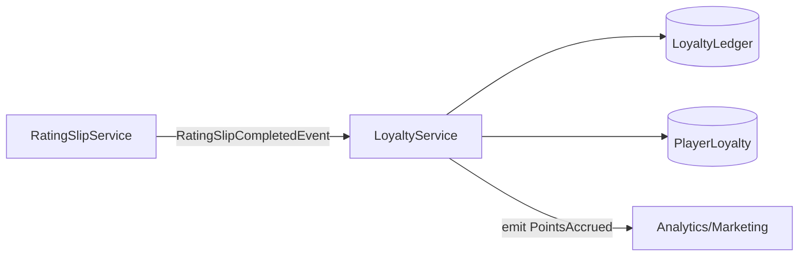

Loyalty Service – Development Handoff

Purpose:
Convert gameplay telemetry into player rewards.
Owns points logic, tier progression, and preference management.

Domain Responsibility
Function	Description
Accrual Logic	Compute points from RatingSlip/Visit telemetry.
Ledgering	Record all points transactions (auditable).
Tier Management	Maintain player tier, thresholds, and progress.
Preferences	Store reward and communication preferences.

services/loyalty/
 ├── index.ts              # Factory + interface
 ├── crud.ts               # Insert/update ledger, player_loyalty
 ├── business.ts           # Points + tier calculation logic
 ├── queries.ts            # getBalance(), getTier(), getHistory()
 └── translation/
      telemetry-mapper.ts  # Map RatingSlip data → Loyalty input DTO

Core API
accruePointsFromSlip(input: {
  playerId: UUID
  averageBet: number
  durationMinutes: number
  gameType: string
}): Promise<ServiceResult>

getBalance(playerId: UUID)
getTier(playerId: UUID)
getTransactionHistory(playerId: UUID, limit?: number)

Logic Stub
```ts
export function calculatePoints({ averageBet, durationMinutes, gameType }: Input) {
  const multiplier = GAME_MULTIPLIERS[gameType] ?? 1;
  return Math.round(averageBet * durationMinutes * multiplier);
}
```

Event flow



✅ Ownership Summary
Concern	Owner
Gameplay metrics	RatingSlip
Reward policy (points/tier logic)	Loyalty
Player identity	Player
Casino config	Casino
Preference data

Next step: scaffold services/loyalty/ per above, implement CRUD and calculation pipeline, integrate event listener from ratingSlipService.