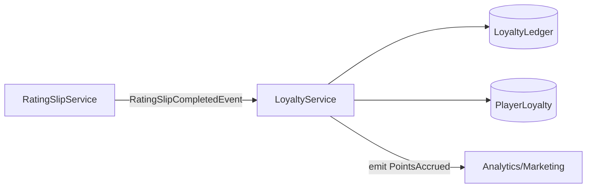

🪙 Loyalty Service – Development Handoff

Purpose:
Convert gameplay telemetry into player rewards.
Owns points logic, tier progression, and preference management.

Domain Responsibility
Function	Description
Accrual Logic	Compute points from RatingSlip/Visit telemetry.
Ledgering	Record all points transactions (auditable).
Tier Management	Maintain player tier, thresholds, and progress.
Preferences	Store reward and communication preferences.

Service Layout:

services/loyalty/
 ├── index.ts              # Factory + interface
 ├── crud.ts               # Insert/update ledger, player_loyalty
 ├── business.ts           # Points + tier calculation logic
 ├── queries.ts            # getBalance(), getTier(), getHistory()
 └── translation/
      telemetry-mapper.ts  # Map RatingSlip data → Loyalty input DTO

Event Flow:

✅ Ownership Summary
Concern	Owner
Gameplay metrics	RatingSlip
Reward policy (points/tier logic)	Loyalty
Player identity	Player
Casino config	Casino
Preference data	Loyalty

🧩 Canonical Ownership
| Concern                                                            | Responsible Service     | Rationale                                                                                       |
| ------------------------------------------------------------------ | ----------------------- | ----------------------------------------------------------------------------------------------- |
| **Telemetry production** (average bet, duration, table type, etc.) | 🎯 `RatingSlipService`  | Owns *raw gameplay data* — “what happened.”                                                     |
| **Telemetry interpretation → reward logic**                        | 🪙 `LoyaltyService`     | Owns *business meaning* — “what it’s worth.”                                                    |
| **Points calculation & tier progression**                          | 🪙 **`LoyaltyService`** | This is a *policy* decision, not a measurement. Loyalty defines how raw play converts to value. |
| **Ledger persistence (points transactions)**                       | 🪙 `LoyaltyService`     | Responsible for audit and point history.                                                        |
| **Event emission for new points / tier changes**                   | 🪙 `LoyaltyService`     | Publishes “PlayerPointsAccrued” or “TierUpgraded.”                                              |

✅ The Loyalty Service is responsible for point calculation.

Why:

Business meaning lives in the reward domain, not the telemetry domain.

RatingSlip measures activity (objective).

Loyalty evaluates worth (subjective, policy-driven).

Policy can change independently.
You might double point values for a promotion or add multipliers by tier —
none of which should require altering the RatingSlip domain.

Auditability demands a clear owner of value assignment.
The LoyaltyLedger must represent why and how many points were granted — that’s not a gameplay concern.

Domain Interaction Model
```mermaid
flowchart LR
  subgraph Rating Context
    RS[RatingSlip Service]
  end
  subgraph Loyalty Context
    L[Loyalty Service]
    LL[(LoyaltyLedger)]
  end
  RS -- emits --> "RatingSlipCompletedEvent {playerId, avgBet, duration}"| L
  L --> LL
```       

🧠 Conceptual Divide
Layer	“Truth About…”	Example
RatingSlip	What happened on the table	Player bet average $200 for 40 minutes
Loyalty	What that means for rewards	Earned 800 points toward Gold tier     

🧩 Implementation Guideline (PT-2 Canonical)
services/
  loyalty/
    ├── index.ts               # Factory + interface
    ├── crud.ts                # CRUD for ledger, balance, tiers
    ├── business.ts            # <-- point calculation lives here
    ├── queries.ts             # getBalance(), getTierProgress(), etc.
    ├── models.ts              # LoyaltyLedger, PlayerLoyalty types
    └── translation/
        └── telemetry-mapper.ts # ACL for mapping RatingSlip data → Loyalty input DTO
business.ts:        
```ts
export function calculatePoints(input: PointsInput): number {
  const multiplier = GAME_MULTIPLIERS[input.gameType] ?? 1;
  return Math.round(input.averageBet * input.durationMinutes * multiplier);
}
```

⚙️ Integration Responsibility Split

RatingSlipService
```ts
emit("RATINGS_SLIP_COMPLETED", {
  playerId,
  averageBet,
  durationMinutes,
  gameType,
});
```

LoyaltyService

```ts
on("RATINGS_SLIP_COMPLETED", async (data) => {
  const points = calculatePoints(data);
  await ledger.insert(...);
  await playerLoyalty.updateBalance(data.playerId, points);
});
```
🚫 What Not to Do

❌ Compute points inside RatingSlipService — that’s a policy leak.

❌ Store points in RatingSlip table — violates single-source-of-truth.

❌ Let multiple domains mutate loyalty balance — concurrency nightmare.

✅ Final Rule of Thumb

If the logic describes how player activity becomes a reward,
it belongs to LoyaltyService.

If it describes how the activity occurred (bets, time, wins),
it belongs to RatingSlipService.