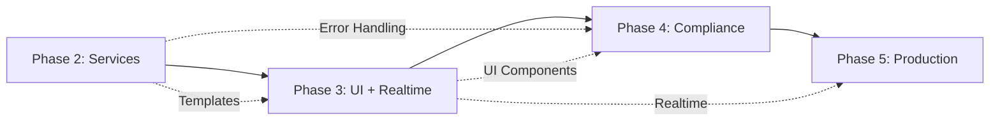

# PT-2 MVP Production Roadmap

> **Version**: 1.2.0
> **Date**: 2025-10-10
> **Status**: Phase 2 - 87.5% Complete (7/8 services)
> **Context**: MTL Service Complete, Hybrid Architecture Strategy Formalized
> **Strategy**: HORIZONTAL layers + VERTICAL delivery

---

## Architecture Strategy

**Decision Framework**: [BALANCED_ARCHITECTURE_QUICK.md](../patterns/BALANCED_ARCHITECTURE_QUICK.md)

**Core Principle**: *"Horizontal layers for technical architecture, vertical slices for feature delivery"*

### Strategic Rhythm
- **HORIZONTAL Weeks**: Infrastructure affecting ALL services (React Query setup, real-time foundation, performance hardening)
- **VERTICAL Weeks**: Feature delivery per domain (Player Management, Visit Tracking, RatingSlip UI)
- **HYBRID Operations**: Orchestration across 2-3 domains (Visit start flow coordinating Player + Casino + Visit)

**Phase 3 Pattern Example**:
- Week 1 (HORIZONTAL): React Query + Zustand infrastructure for ALL domains
- Weeks 2-4 (VERTICAL): Player UI → Visit UI → RatingSlip UI (one domain at a time)
- Week 5 (HORIZONTAL): Real-time infrastructure across ALL domains

---

## Executive Summary

**Current State**: 7/8 core services complete (Player, Visit, RatingSlip, PlayerFinancial, Casino, TableContext, MTL) with proven template velocity (4x improvement). Test location standardization via ADR-002. Hybrid architecture strategy formalized.

**Recent Achievements**:
- MTL Service complete with CTR aggregation (98/98 tests passing)
- Parallel service deployment validated (Casino + TableContext in 2 hours)
- Schema consistency: UUID standardization complete
- Test infrastructure: 100% consistency across all services
- Bounded context integrity: Service Responsibility Matrix enforced
- Hybrid strategy documented: BALANCED_ARCHITECTURE_QUICK.md

**Gap Analysis**: Service layer 87.5% complete (Loyalty deferred to post-MVP). Missing UI layer, state management, real-time infrastructure, and production hardening.

**Target**: Production-ready Casino Tracker MVP with core domains operational.

**Timeline**: 7-8 weeks from current state to MVP launch (Phase 2 → Phase 5 complete).

---

## Phase Status Overview

| Phase | Status | Completion | Key Deliverables |
|-------|--------|------------|------------------|
| **Phase 0** | ✅ Complete | 100% | CI/CD, Testing, Security Skeleton, RLS |
| **Phase 1** | ✅ Complete | 100% | JWT helpers, Audit logging, Compliance tables |
| **Phase 2** | 🔄 In Progress | 75% | Service Layer (6/8 services), Template locked, Test standards (ADR-002) |
| **Phase 3** | ⏳ Pending | 0% | UI Layer, Real-time, State Management |
| **Phase 4** | ⏳ Pending | 0% | Compliance Workflows, MTL, Reporting |
| **Phase 5** | ⏳ Pending | 0% | Performance, Bundle Optimization, Production Hardening |

---

## Phase 2: Service Layer Foundation (Current)

**Target**: Complete all core domain services with PRD compliance

### Completed (Week 1) ✅
- ✅ Player Service CRUD (create, update, getById) - 8 tests
- ✅ Visit Service CRUD (create, update, getById) - 10 tests
- ✅ RatingSlip Service CRUD (create, update, getById) - 10 tests
- ✅ SERVICE_TEMPLATE.md canonical documentation
- ✅ Shared infrastructure (operation-wrapper, types, utils)
- ✅ Test coverage >80% for all services
- ✅ **Velocity Validated**: 4x improvement with template (Player: 3h → Template avg: 89min)

### Completed (Week 2) ✅
- ✅ PlayerFinancial Service - 16 tests
  - Transaction CRUD with constraint validation
  - Queries: listByPlayer(), listByVisit(), listByReconciliationStatus()
  - Schema migration + UUID consistency achieved
- ✅ Casino Service - 13 tests
  - Casino CRUD + FK violation handling
  - Queries: list(), listByCompany()
  - Location domain bounded context
- ✅ TableContext Service - 22 tests
  - 3-table relationships (gamingtable, gamesettings, gamingtablesettings)
  - Temporal configuration with active_from/active_until
  - Settings operations with cascading deactivation
  - Configuration domain bounded context
- ✅ Test Location Standardization (ADR-002)
  - All services migrated to root-level `__tests__/services/`
  - 100% consistency achieved
  - Documentation updated

### In Progress (Week 2) 🔄
**Immediate: Remaining Core Services**
- MTL Service (1 day) - Compliance domain
  - Transaction logging CRUD
  - CTR threshold tracking
  - Gaming day calculations

**PT-1 Pattern Mining (3 days)**
- **Agent Analysis Complete** ✅:
  - `search.ts`: Full rewrite required (~8h) - multi-word search + relevance scoring
  - `queries.ts`: Adapt with confidence (~8.75h) - JOIN patterns, active queries
- Apply to all services:
  - Player: search by name/email, active player queries
  - Visit: search by date range, active visit queries
  - RatingSlip: search by table/player, point aggregation queries
  - Casino: search tables, floor queries
  - MTL: transaction search, compliance queries

### Remaining (Week 3)
- MTL Service completion (0.5 day)
- Loyalty Service (1 day) - Deferred to post-MVP per gap analysis
- PT-1 Pattern Mining - Search/Query capabilities (2 days)
  - Apply proven patterns to all 6 services
  - Multi-word search with relevance scoring
  - JOIN patterns for complex queries
- Integration smoke tests (0.5 day)
- End-of-week audit + documentation (1 day)

**Phase 2 Completion**: End of Week 3 (Est: 2025-10-27)

**Deliverables**:
- ✅ 7/8 core services with explicit interfaces (Loyalty deferred)
- ✅ Search + query capabilities across all domains
- ✅ ServiceResult pattern enforced
- ✅ Zero PRD violations
- ✅ Test coverage >80%
- ✅ Test location standardization (ADR-002)

---

## Phase 3: UI Layer & Real-Time (Weeks 4-6)

**Target**: Complete vertical UI slices with real-time updates

> **Hybrid Strategy**: Week 1 HORIZONTAL infrastructure → Weeks 2-4 VERTICAL features → Week 5 HORIZONTAL real-time

---

### Week 4: State Management Foundation (HORIZONTAL)

**Goal**: Infrastructure setup affecting ALL domains

**HORIZONTAL React Query Setup** (2 days):
- Query client configuration (`lib/query-client.ts`) - **ALL domains**
- Query wrapper template (`hooks/shared/use-service-query.ts`) - **Reusable pattern**
- Server action wrapper (`lib/actions/with-server-action-wrapper.ts`) - **ALL actions**
- Zustand UI store pattern - **ALL UI state**

**VERTICAL Domain Application** (3 days):
- Player: query hooks, mutation hooks, server actions
- Visit: query hooks, mutation hooks, server actions
- RatingSlip: query hooks, mutation hooks, server actions

**Rationale**: HORIZONTAL infrastructure enables ALL vertical UI slices in Weeks 5-6

**Deliverables**:
- React Query managing 100% of remote state
- Server actions with structured telemetry
- Zustand restricted to ephemeral UI state only

---

### Week 5: Player Management UI (VERTICAL)

**Goal**: Complete Player domain feature (full-stack delivery)

**Player Domain UI** (3 days):
- `components/player/player-list.tsx` (search + display)
- `components/player/player-form.tsx` (enhance existing)
- `components/player/player-detail.tsx` (view + edit)
- `components/player/player-search.tsx` (multi-word search)

**Player Real-Time** (1 day):
- `hooks/player/use-player-realtime.ts`
- Batch invalidation integration
- Memory leak prevention

**E2E Testing** (1 day):
- Player CRUD workflows
- Real-time update verification
- Search functionality validation

**Rationale**: VERTICAL slice delivers complete, user-facing Player Management feature

**Deliverables**:
- Working Player Management UI (search, CRUD, real-time)
- Independently testable and deployable feature

---

### Week 6: Visit & RatingSlip UI (VERTICAL)

**Goal**: Complete Visit and RatingSlip domain features

**Visit Domain UI** (2 days):
- `components/visit/visit-form.tsx` (start visit)
- `components/visit/visit-list.tsx` (active/historical)
- `components/visit/visit-detail.tsx` (lifecycle actions)
- `components/visit/visit-status-badge.tsx`
- `hooks/visit/use-visit-realtime.ts`

**RatingSlip Domain UI** (2 days):
- `components/ratingslip/rating-form.tsx` (create/update)
- `components/ratingslip/rating-list.tsx` (by table/player)
- `components/ratingslip/rating-detail.tsx`
- `components/ratingslip/point-display.tsx` (calculations)
- `hooks/ratingslip/use-ratingslip-realtime.ts`

**Integration Testing** (1 day):
- Visit lifecycle workflows
- Rating slip creation/update flows
- Cross-domain interactions (Visit → RatingSlip)

**Rationale**: VERTICAL slices deliver complete, user-facing features one domain at a time

**Deliverables**:
- Working Visit Tracking UI (lifecycle, real-time)
- Working RatingSlip UI (rating, points, real-time)
- Independently testable and deployable features

---

**Phase 3 Completion**: End of Week 6 (Est: 2025-11-24)

**Deliverables**:
- ✅ Complete UI vertical slices for core domains (Player, Visit, RatingSlip)
- ✅ React Query managing all remote state
- ✅ Real-time updates with proper cleanup
- ✅ Server actions with structured telemetry
- ✅ Zero Zustand state pollution

**Hybrid Pattern Applied**:
- Week 1: HORIZONTAL infrastructure (React Query, actions) → enables weeks 2-3
- Weeks 2-3: VERTICAL features (Player, Visit, RatingSlip) → user-visible progress
- Real-time: Integrated per domain (not separate HORIZONTAL phase)

---

## Phase 4: Compliance & Workflows (Weeks 7-8)

**Target**: Production-ready MTL compliance and business workflows

> **Hybrid Strategy**: VERTICAL MTL domain + HYBRID cross-domain workflows

### Week 7: MTL Compliance Domain

**Money Transaction Logging** (2 days)
- Transaction entry UI (`components/mtl/transaction-form.tsx`)
- CTR threshold monitoring ($10k detection)
- Gaming day calculation logic
- Transaction history views

**Compliance Reporting** (2 days)
- CTR report generation
- Compliance dashboard UI
- Audit trail display
- Witness validation flows

**Integration** (1 day)
- MTL ↔ Visit integration (transaction attribution)
- MTL ↔ RatingSlip integration (chip tracking)
- Compliance policy testing

### Week 8: Business Workflows

**Visit Lifecycle Workflows** (2 days)
- Visit start → rating slip creation flow
- Visit end → point calculation → MTL logging
- Cancel visit → rollback logic
- State transition validation

**Table Context Management** (2 days)
- Table open/close workflows
- Shift handover UI
- Inventory tracking (chips in/out)
- Fill slip integration

**Testing & Validation** (1 day)
- End-to-end workflow tests
- Compliance rule validation
- Edge case handling
- Error recovery scenarios

**Phase 4 Completion**: End of Week 8 (Est: 2025-12-01)

**Deliverables**:
- ✅ MTL compliance operational
- ✅ Full visit lifecycle automation
- ✅ Table context management
- ✅ Regulatory reporting ready
- ✅ Business workflow validation

---

## Phase 5: Production Hardening (Weeks 9-10)

**Target**: Performance budgets met, production-ready deployment

> **Hybrid Strategy**: HORIZONTAL hardening across ALL domains (performance, security, deployment)

### Week 9: Performance Optimization

**Bundle Optimization** (2 days)
- Dynamic imports for heavy components (modals, icons)
- HeroUI/Radix individual imports
- Code splitting per route
- Tree-shaking validation
- Target: Initial JS ≤ 250KB

**Query Optimization** (2 days)
- Database index analysis
- Complex query optimization
- N+1 query elimination
- React Query `staleTime`/`gcTime` tuning

**Lighthouse Budgets** (1 day)
- LCP ≤ 2.5s validation
- TBT ≤ 200ms optimization
- Performance CI gates
- Smoke test automation

### Week 10: Production Deployment

**Security Hardening** (2 days)
- RLS policy audit (run advisor tool)
- JWT claim validation
- API rate limiting
- CORS configuration
- Environment variable validation

**Deployment Pipeline** (2 days)
- Staging environment setup
- Migration deployment automation
- Rollback procedures
- Health check endpoints
- Monitoring setup (logs, metrics)

**Launch Preparation** (1 day)
- Production smoke tests
- Load testing validation
- Backup/restore procedures
- Incident response playbook
- Documentation finalization

**Phase 5 Completion**: End of Week 10 (Est: 2025-12-15)

**Deliverables**:
- ✅ Performance budgets met
- ✅ Security hardening complete
- ✅ Deployment automation ready
- ✅ Monitoring operational
- ✅ MVP launch-ready

---

## Critical Path & Dependencies

### Blocking Dependencies

**Non-Blocking Parallelization Opportunities**:
- Week 4: Server actions + React Query setup (parallel)
- Week 5: Player UI + Visit UI (parallel teams)
- Week 9: Bundle optimization + Query optimization (parallel)

### Risk Mitigation

| Risk | Impact | Mitigation | Owner |
|------|--------|------------|-------|
| PT-1 mining time overrun | Phase 2 delay | Time-box at 4h per module; rewrite if exceeded | Dev Team |
| Real-time complexity | Phase 3 delay | Defer advanced features; use proven scheduler pattern | Tech Lead |
| Compliance edge cases | Phase 4 delay | Comprehensive test scenarios upfront | QA + Compliance |
| Performance budget miss | Phase 5 blocker | Weekly Lighthouse checks starting Week 4 | Performance Lead |
| Migration failures | Production blocker | Rollback scripts + staging validation | DevOps |

---

## Success Metrics

### Phase 2 (Services)
- ✅ 8/8 services with explicit interfaces
- ✅ Zero PRD violations (audit passing)
- ✅ Test coverage >80%
- ✅ 5x velocity improvement (template proven)

### Phase 3 (UI + Realtime)
- ✅ All domain UIs functional
- ✅ React Query managing 100% remote state
- ✅ Real-time updates <1s latency
- ✅ Zero memory leaks (cleanup verified)

### Phase 4 (Compliance)
- ✅ MTL CTR detection 100% accurate
- ✅ Compliance reports generated correctly
- ✅ Workflow state machines validated
- ✅ Audit trail complete

### Phase 5 (Production)
- ✅ LCP ≤ 2.5s (Lighthouse)
- ✅ Initial JS ≤ 250KB
- ✅ Zero security advisor warnings
- ✅ Uptime >99.9% in staging

---

## Milestone Schedule

| Milestone | Target Date | Deliverables |
|-----------|-------------|--------------|
| **Phase 2 Complete** | 2025-10-27 | All services + search/query capabilities |
| **Phase 3 Complete** | 2025-11-17 | Full UI layer + real-time operational |
| **Phase 4 Complete** | 2025-12-01 | Compliance workflows ready |
| **Phase 5 Complete** | 2025-12-15 | Production hardening done |
| **MVP Launch** | 2025-12-20 | Production deployment |

**Total Duration**: 10 weeks from current state (2025-10-06 → 2025-12-20)

---

## Team Structure & Responsibilities

### Core Team (Minimum)
- **Tech Lead**: Architecture decisions, code review, PRD compliance
- **2x Full-Stack Devs**: Service layer + UI implementation
- **QA Engineer**: Test automation, compliance validation
- **DevOps**: CI/CD, deployment, monitoring

### Optional Acceleration
- **Frontend Specialist**: UI components (parallel with backend)
- **Performance Engineer**: Bundle optimization (Week 9)

---

## Deferred Post-MVP

**Explicitly Out of Scope for MVP**:
- Multi-casino support (single casino only)
- Advanced reporting/analytics
- Mobile responsive (desktop-first)
- Staff management UI (basic roles only)
- Offline mode
- Advanced real-time features (typing indicators, presence)
- Internationalization (English only)
- Advanced audit trail UI

**Post-MVP Roadmap** (Q1 2026):
- Phase 6: Multi-casino expansion
- Phase 7: Advanced analytics
- Phase 8: Mobile optimization

---

## Implementation Strategy

### Hybrid Architecture Model
**Decision Framework**: [BALANCED_ARCHITECTURE_QUICK.md](../patterns/BALANCED_ARCHITECTURE_QUICK.md)

**Core Patterns**:
- **HORIZONTAL**: Infrastructure affecting ALL services (React Query, executeOperation, real-time foundation)
- **VERTICAL**: Single-domain features (Player Management, Visit Tracking)
- **HYBRID**: Multi-domain orchestration (Visit start → Player + Casino + Visit)

**Applied Strategy**:
- ✅ Phase 2: HORIZONTAL service layer (all 7 core services)
- ⏳ Phase 3 Week 1: HORIZONTAL state management foundation
- ⏳ Phase 3 Weeks 2-3: VERTICAL UI features (Player, Visit, RatingSlip)
- ⏳ Phase 5: HORIZONTAL hardening (performance, security, deployment)

### Quality Gates (Every Week)
- ✅ ESLint anti-pattern checks passing
- ✅ TypeScript strict mode (npx tsc --noEmit)
- ✅ Test coverage >80%
- ✅ End-of-week audit (PRD compliance)
- ✅ HORIZONTAL vs VERTICAL categorization clear in commits

### Documentation Requirements
- ✅ ADRs for architectural decisions (including HORIZONTAL vs VERTICAL rationale)
- ✅ API documentation (JSDoc)
- ✅ Deployment runbook
- ✅ Incident response playbook

---

## Open Questions for Stakeholder Review

1. **Casino Scope**: Single vs multi-casino for MVP?
2. **Staff Roles**: Which roles are critical for MVP (DEALER, SUPERVISOR, PIT_BOSS, AUDITOR)?
3. **Reporting Requirements**: CTR only, or additional compliance reports?
4. **Mobile Priority**: Defer to post-MVP confirmed?
5. **Performance SLA**: 99.9% uptime acceptable for MVP?
6. **Budget**: Bundle size 250KB hard limit or aspirational?

---

## Next Immediate Actions (Week 2)

### This Week (2025-10-06 → 2025-10-13)
1. **Complete Casino Service** (Mon-Tue)
2. **Complete Table Context Service** (Wed-Thu)
3. **Complete MTL Service CRUD** (Fri)

### Next Week (2025-10-13 → 2025-10-20)
1. **PT-1 Mining: search.ts + queries.ts** (Mon-Wed)
2. **Apply patterns to all services** (Thu-Fri)
3. **Integration tests + audit** (Fri PM)

### Week After (2025-10-20 → 2025-10-27)
1. **Notes + Compliance + Staff Auth Services** (Mon-Wed)
2. **End-of-Phase-2 audit** (Thu)
3. **Phase 3 kickoff: React Query setup** (Fri)

---

## Appendix: Technology Stack

### Current (Locked)
- **Frontend**: Next.js 15, React 19, TypeScript 5
- **Backend**: Supabase (PostgreSQL + Auth + Realtime)
- **State**: React Query 5 + Zustand 5
- **UI**: HeroUI + Radix + Tailwind
- **Testing**: Jest + RTL + Cypress
- **CI/CD**: GitHub Actions
- **Deployment**: Vercel (frontend) + Supabase (backend)

### Infrastructure
- **Database**: Supabase PostgreSQL (RLS enabled)
- **Auth**: Supabase Auth (JWT)
- **Real-time**: Supabase Realtime (WebSocket)
- **Storage**: Supabase Storage (for future file uploads)

---

**Document Version**: 1.2.0
**Last Updated**: 2025-10-10
**Next Review**: End of Phase 2 (2025-10-27)
**Progress**: Phase 2 - 87.5% Complete (7/8 services, MTL done)
**Strategy Reference**: [BALANCED_ARCHITECTURE_QUICK.md](../patterns/BALANCED_ARCHITECTURE_QUICK.md)
